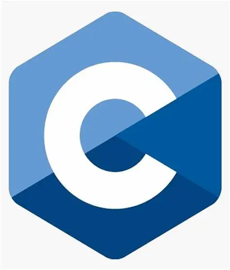
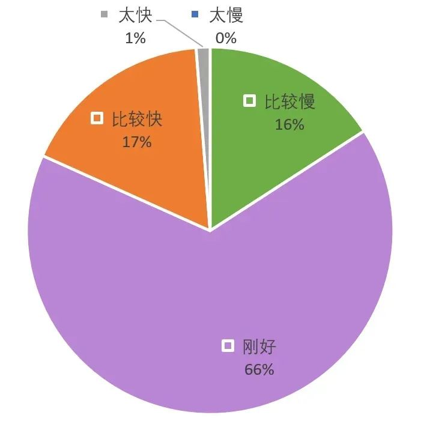
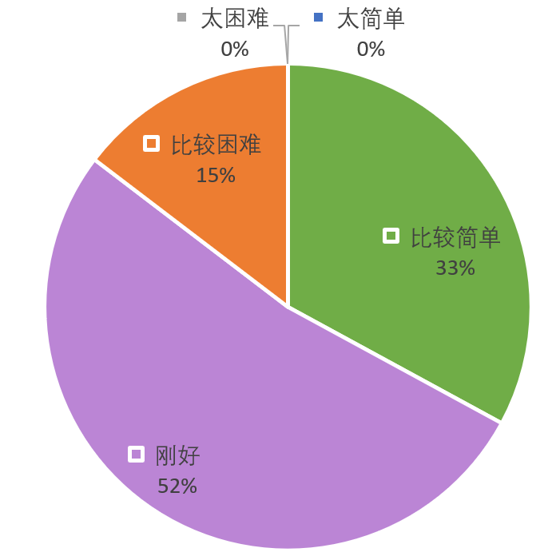
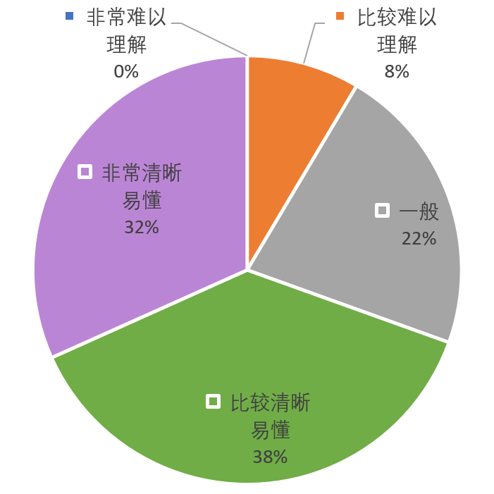

在 7 月 29 日至 8 月 16 日期间，自动化系学生科协首次举办了面向 2023 届新生的公益暑期编程培训活动。本次培训共包含七个授课单元，每个授课单元包含由科协骨干精心准备的、约九十分钟的精彩课程和课后习题，以及一次线上集中答疑。目前本次培训已经顺利完成，让我们一起来回顾本次培训的整体情况吧~

<!--truncate-->

## 内容回顾

**
回放**：  
**紫冬科协哔哩哔哩官方号[【THUASTA】](https://space.bilibili.com/676450636)**

**C Language Training**

**讲师**  
（按课程节次排序）  
张子健  张琰然  李炯烨  赵若帆  
付尉立  赵子远  汪  润  周鸣赫  

**学习方式**  
哔哩哔哩直播 + 腾讯会议

**课前准备**  
请提前安装 Dev C++ 集成开发环境。  
Dev C++ [安装包获取](https://cloud.tsinghua.edu.cn/d/9e971295afdd4ccaba1a/)  
Dev C++ [安装教程](https://www.bilibili.com/video/BV1Zj411X7cM)

**
课程介绍**

C 语言是一种通用的、被广泛使用的、面向过程的计算机程序设计语言。对大多数**自动化系新同学**来说，也是第一学期**计算机语言与程序设计**课上将要面对的语言，更是**人生第一门编程语言**。课程旨在帮助三字班新同学更好地入门编程，在入学后第一学期的编程课上**更加从容**。  
课程主要讲解了 C 语言的基础知识与使用方法，主要包括数据类型、运算符、顺序结构、条件分支、循环结构、数组、函数等内容。

**
课程回放**  
[【THUASTA】](https://space.bilibili.com/676450636/channel/collectiondetail?sid=1576166)

## 课程反馈数据分析

**
参与人数**

大约 300 名同学参加了此次新生编程暑培，其中大部分是清华自动化系的准大一新同学，说明大部分同学对于入门 C 语言是十分感兴趣的。

**
课程评价**

讲课速度反馈

内容难度反馈

讲解清晰程度反馈

从同学的反馈中可以看出，同学们对于课程整体上是较为满意的。大部分同学感觉课程速度和难度都很合适，讲解效果也比较清晰。有部分同学感觉难度较大，不容易听懂，可以观看回放，也可以与讲师交流，以解答疑惑。

## 课程总结

在收集到的课程反馈意见中，大家对课程的整体框架和讲课速度普遍是认可的。

培训的每节课后都布置有小作业，课程群和集中答疑环节中，都常有同学积极提问，展示自己遇到的 bug。除了科协讲师之外，还有一些热心同学帮助有疑问的同学 debug、答疑解惑，课程群中的学习氛围十分活跃。

这是紫冬科协第一次主办新生编程暑培，欢迎同学们关注科协后续的活动，也欢迎同学们加入紫冬科协大家庭。今年在课程中懵懵懂懂汲取知识的你，也许明年会成为为新一届学弟学妹传承知识的领路人~

---

欢迎关注紫冬科协哔哩哔哩官方号[【THUASTA】](https://space.bilibili.com/676450636)  
欢迎关注紫冬科协官方网站 [https://thuasta.org](https:/thuasta.org)  
获取更多紫冬科创信息~

编辑 | 自动化系学生科协  
审核 | 汪润 桂沄
