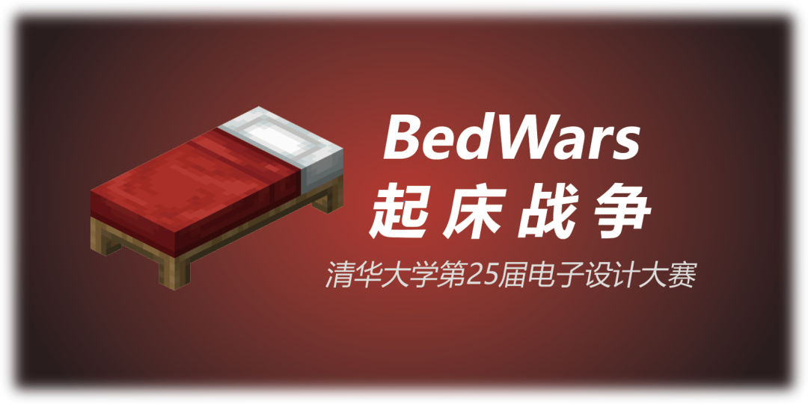
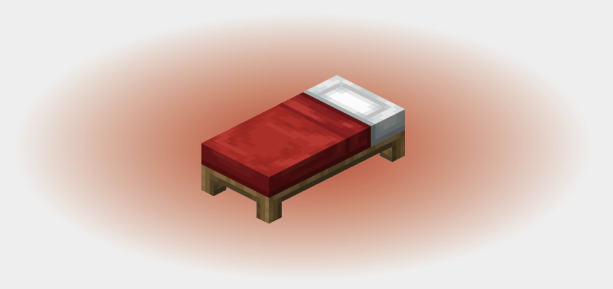
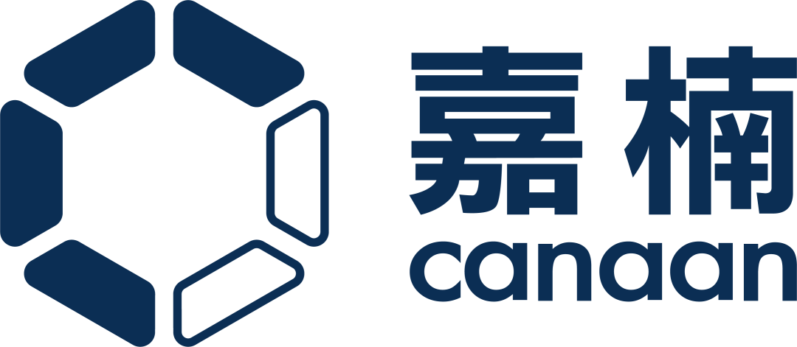
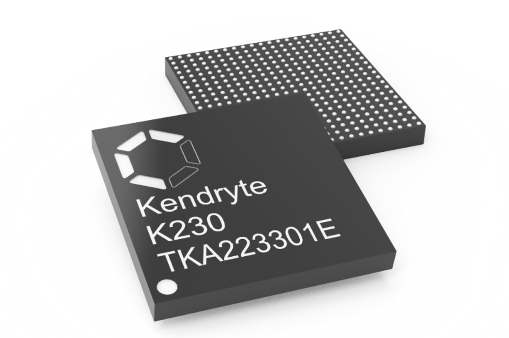
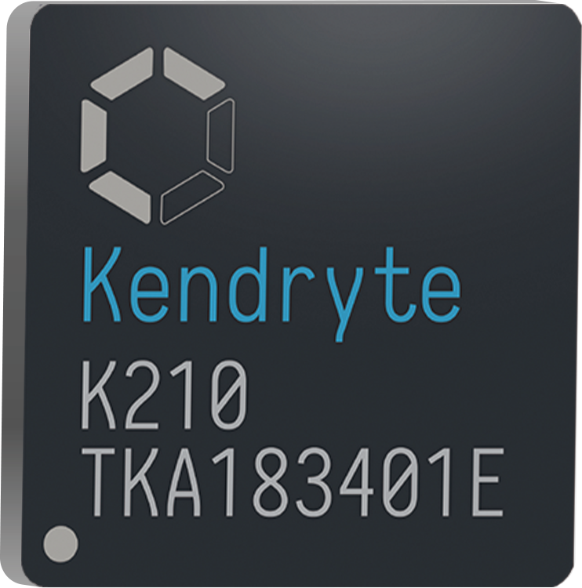

<h3>清华大学第二十五届电子设计大赛</h3>
<h1>起床战争</h1>
<h3>即将到来！</h3>

<!--truncate-->

## 大赛简介

清华大学电子设计大赛（EDC）是由电工电子实验教学中心和电子工艺实习基地主办、由电子系和自动化系两系学生科协联合承办的高水平科技赛事，是学校历史最悠久、含金量最高的比赛之一。

本次电子设计大赛为第 25 届，以 Minecraft 多人在线对战游戏 **“起床战争”** 为赛题背景，参赛队伍需要**利用自行搭建的智能小车扮演起床战争中的玩家**，在地图上收集矿物、升级属性、摧毁对方的床、击杀对方玩家。首先摧毁对手的床并击杀对方玩家的小车获得该回合的胜利。（以上提到的“矿物”“床”“玩家”均为虚拟物，仅在裁判程序中体现，在现实中不存在。）

## 赛题背景

起床战争是 Minecraft 中一种非常受欢迎的多人在线对战游戏模式，游戏的主要目标是保护自己的床，同时试图摧毁其他玩家的床。床在这里是你的生命线，只要你的床还在，你就可以无限次地重生。

游戏在由多个岛屿组成的地图上进行，每个岛屿内都有一张床。

游戏开始时，所有玩家都会出生在自己的岛屿中，然后开始收集矿物，购买物品，升级属性，加固岛屿，以及建造桥梁到矿脉或其他玩家的岛屿。

当你的床被摧毁后，你就不能再重生了。如果你死亡，你就会被淘汰出游戏。游戏的最后一位存活玩家就是胜利者。

起床战争是一种策略和技巧的游戏，需要玩家在攻防之间找到平衡。你需要合理使用矿物，制定策略，与队友合作，同时还要灵活应对敌人的攻击。

## 比赛规则

1. 场地介绍

    场地呈正方形（约 2.5 米 × 2.5 米）。两队小车分别在两个场地上同时运行，而在裁判程序中被视为同一地图上的两个玩家。

2. 流程介绍

   - 比赛开始时，玩家应当停留在己方岛屿内。
   - 在比赛阶段，玩家需要摧毁对方的床和消灭对方。为了增强自己的战斗力，玩家可以收集矿物，升级属性。
   - 若双方长时间僵持后，则双方的床将同时被破坏，且所有矿脉停止生成矿物，双方生命值都随时间而流失。
   - 如果某方小车出现问题无法自行恢复，比赛不会暂停，选手应将小车取出至场地外，待上位机将小车判定为死亡后，方可将小车放回到己方基地处继续进行比赛。
   - 一旦对手玩家的床被摧毁，且对手玩家死亡，则该玩家获胜，比赛结束。

3. 关于小车

    小车尺寸需控制在 25×25×20cm 的长方体内，整体电源电压不高于 12V。**主控模块和视觉处理模块必须使用官方提供的 STM32、勘智 K210（或 K230）芯片。** 选手若自行使用其他控制器，需得到官方许可。推荐采用组委会提供的套件搭建小车。

    此外，官方鼓励选手自行设计电机驱动模块以及电源管理模块。选手可以将驱动芯片、电源稳压芯片和传感器接口等设计在一块 PCB 电路板上。比赛亦有 **PCB 奖**作为相应激励。

## 课程介绍

**
《电子系统设计综合实践》**  
课程号：01550013  
学分：3  
主讲教师：任勇、韦思健

赛事配套课程包含八次课，内容包含了硬件入门、STM32、通信协议、控制算法等。课程安排如下：

| 节次  |    讲师    |            内容            |
| :---: | :--------: | :------------------------: |
|   1   |    任勇    |            绪论            |
|   2   |   韦思健   |     电路板的设计和制作     |
|   3   |   沈琪杰   |        人工智能算法        |
|   4   | 电子系科协 | 赛题规则详解与 STM32 基础  |
|   5   | 电子系科协 |       串口和蓝牙模块       |
|   6   | 电子系科协 | 电机控制与 L298N、PWM、PID |
|   7   | 电子系科协 |   JY62 模块与 编码器测距   |
|   8   | 电子系科协 |          通信协议          |

我们还安排了对应的答疑环节，由电子系科协硬件部同学帮助大家一起 debug。欢迎大家在参加比赛的同时选修课程~

我们会为大家**免费提供个人套件（不选课也可以参赛并领取套件）**，其中包含比赛需要的全部套件以及一些可供大家自由探索的模块。

除了根据获奖情况确定课程得分之外，本学期该课程也将增设另外的评分途径，只需完成相应任务并通过验收，无需获奖也能取得满意的成绩。是否选课可由选手自行决定。

## 比赛日程

|   时间    |   事项   |
| :-------: | :------: |
|  第 1 周  |   选课   |
| 第 1~5 周 | 比赛报名 |
| 第 2~8 周 | 课程培训 |
| 第 10 周  |   初赛   |
| 第 12 周  |   决赛   |

更多详细信息、具体规则请参见赛事官方网站、赛事微信群以及后续推送。

## 奖励办法

|  奖项  |    奖金     | 数量  |
| :----: | :---------: | :---: |
| 特等奖 | 10000 元/队 |   1   |
| 一等奖 | 8000 元/队  |   1   |
| 二等奖 | 5000 元/队  |   2   |
| 三等奖 | 3000 元/队  |   4   |
| 优胜奖 | 1000 元/队  |   8   |

比赛还设置有**新生奖、女生奖、PCB 奖**等单项奖。

## 报名须知

请想要参赛的同学**加入比赛微信群**，后续比赛信息将在微信群通知。

参赛选手可自由组队，每队不超过 4 人，确定队名和 1 名队长，每名队员均需报名。组队报名后要在指定时间内到指定地点领取比赛套件。

报名期限：

第五周周末及之前

**[点击链接](https://cloud.tsinghua.edu.cn/f/9ac117ab1b234df9a6ed/)获得比赛微信群二维码**

## 赛事独家赞助

嘉楠科技（Canaan）是一家领先的 ASIC 芯片设计公司，以“区块链+AI”为多元化经营战略，业务范围涵盖高性能 ASIC 计算芯片及设备研发、AI 芯片及产品开发。

作为一家纳斯达克上市公司，嘉楠科技是全球“区块链第一股”，也是第一家在美上市的中国自主知识产权 AI 芯片公司。

嘉楠科技希望通过 ASIC 技术“提升社会运行效率，改善人类生活方式”，并成为区块链和 AI 高性能计算的领导者。

[了解详情](https://www.canaan-creative.com/about)

[嘉楠校园招聘](https://canaan-creative.zhiye.com/springCampus)

## 独家芯片介绍

勘智 K210 采用 RISC-V 处理器架构，具备视听一体、自主 IP 核与可编程能力强三大特点，支持机器视觉与机器听觉多模态识别，可广泛应用于智能家居、智能园区、智能能耗和智能农业等场景。

K230 芯片是全球首款支持 RISC-V Vector1.0 标准的商用 SoC，内置双核玄铁 C908 CPU，主频高达 1.6GHz，内置多个高清视频图像输入处理和智能硬件处理单元，兼顾高性能、低功耗和高安全性特点，可广泛应用于各类智能产品，如边缘侧大模型多模态接入终端、3D 结构光深度感知模组、交互型机器人、开源硬件、智能制造、智能家居和智能教育硬件等众多领域。

本届比赛要求选手在使用 STM32 作为主控芯片的同时，**必须使用 K210 作为视觉处理芯片完成比赛**。如果选手对芯片算力有更高的需求，还可以使用更为强大的 K230 替代 K210 完赛。

**
<mark>比赛一触即发，敬请期待！</mark>**

---

文案｜自动化系学生科协  
排版｜自动化系学生科协  
审核｜汪润 桂沄
