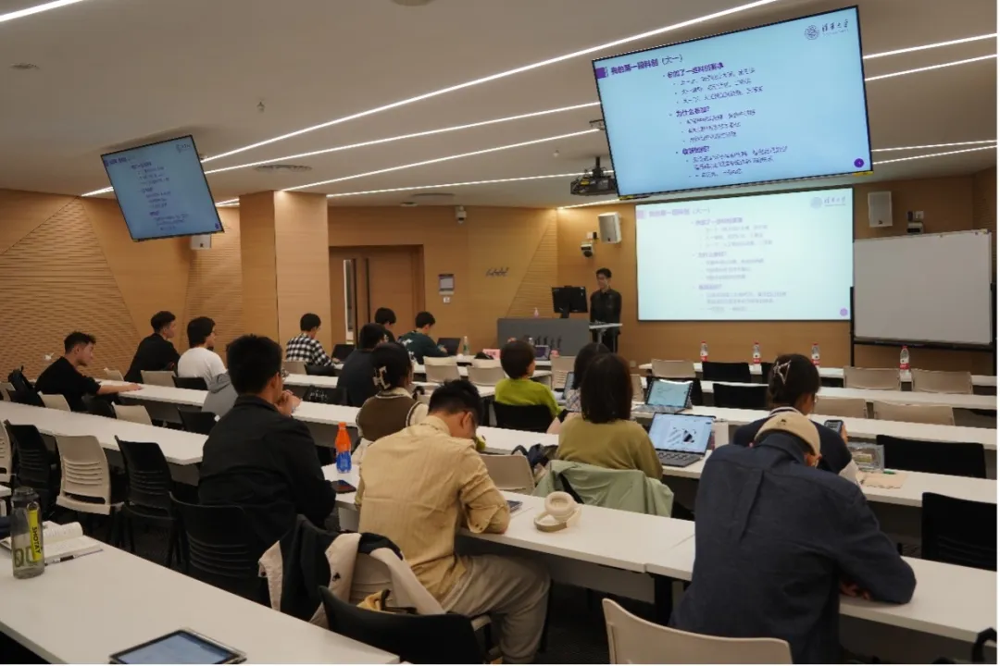
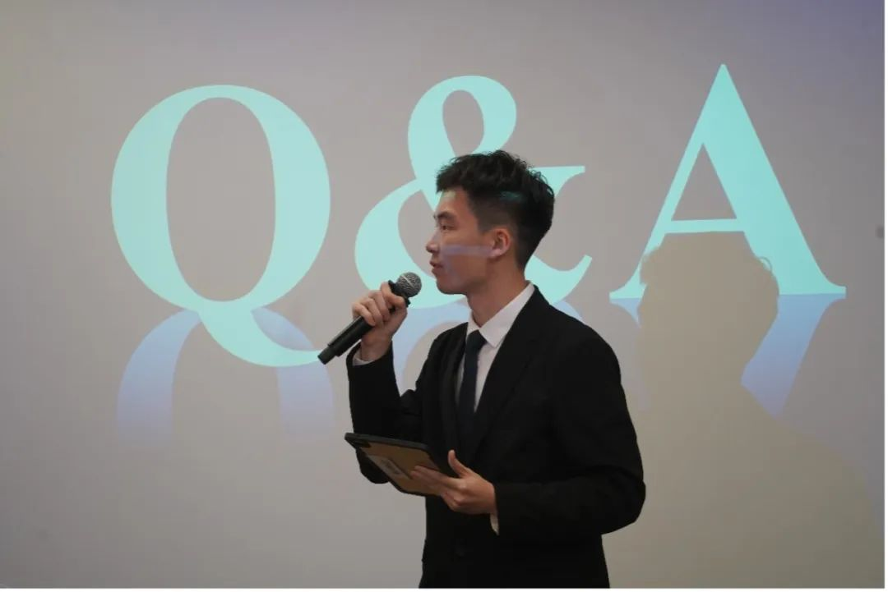
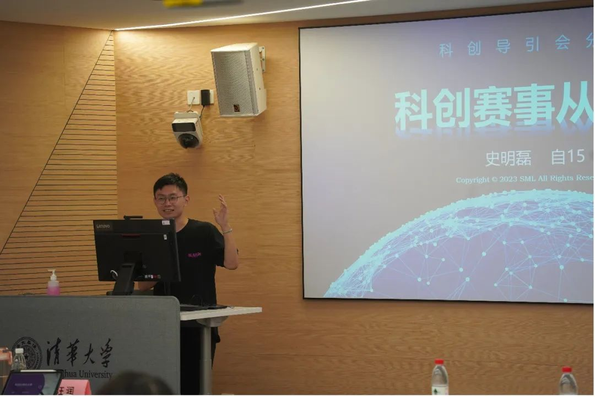
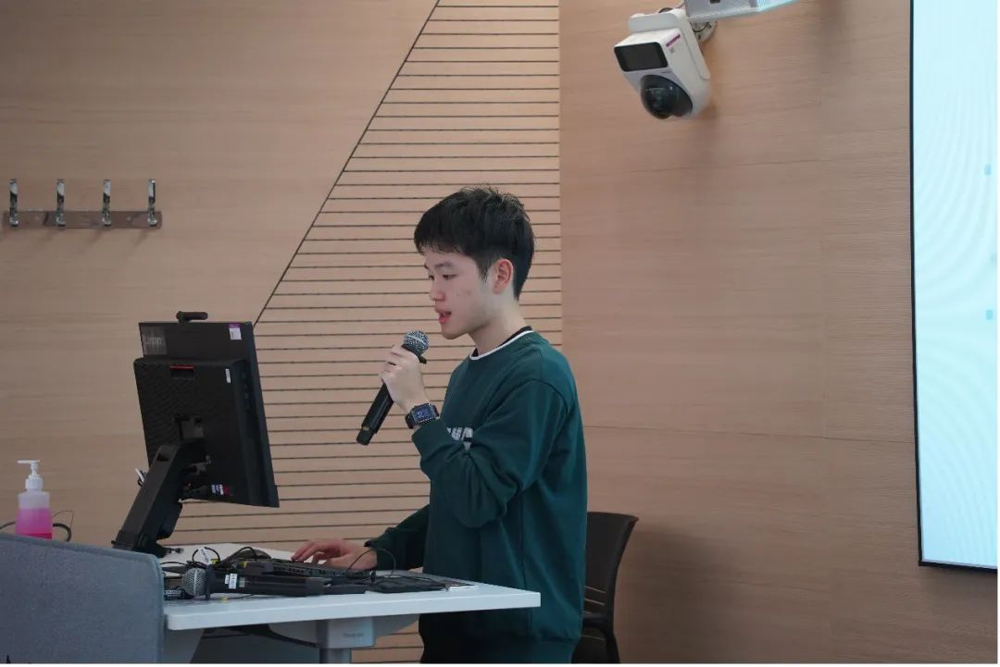
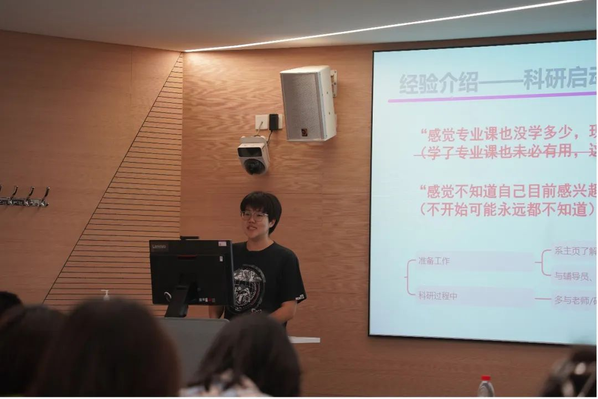
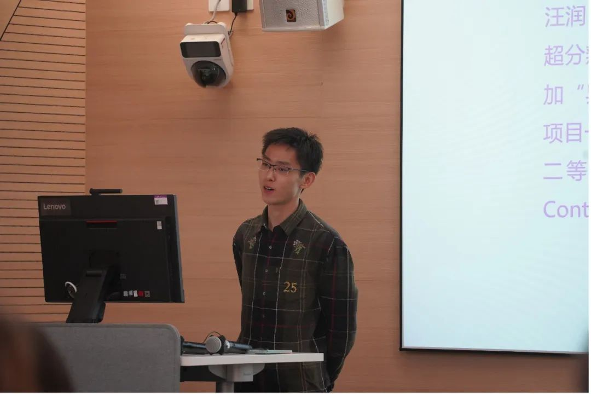
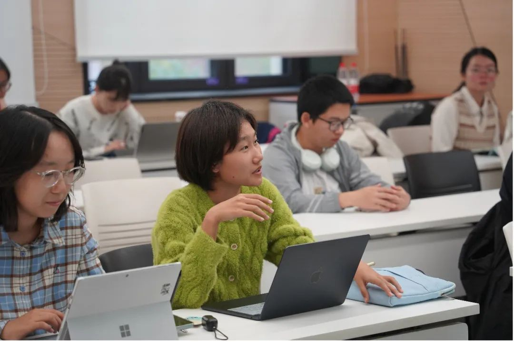
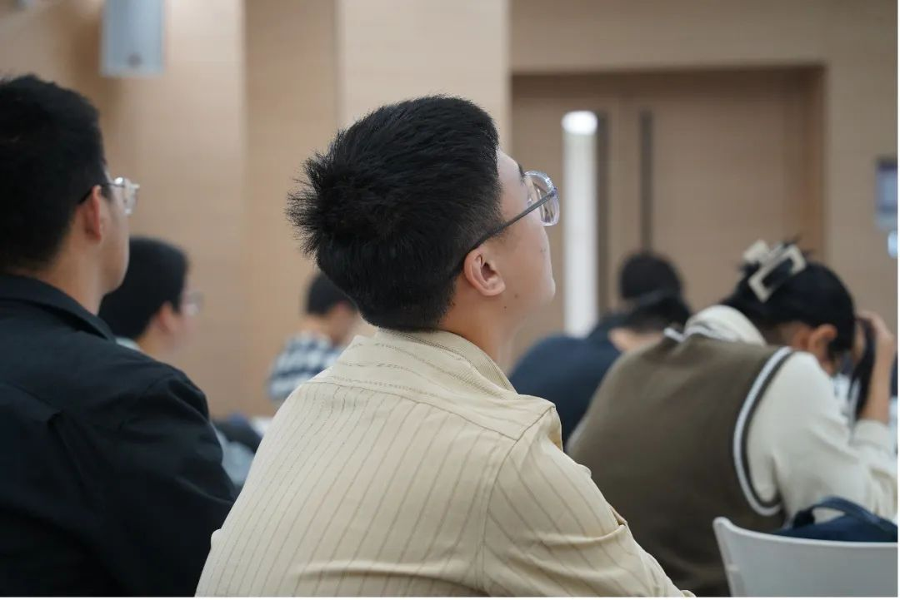

<center>
<h1>科创引导会</h1>
<strong>自动化系 学生科协</strong><p />
</center>

10 月 29 日下午，我们有幸邀请了史明磊、罗奕桐、杨馨惟和汪润几位在科研科创方面颇有心得的同学。在此次引导会上，他们为大家详细地介绍了**星火计划、SRT、智能车竞赛、电子设计大赛等科研项目和科创比赛**的相关事项，分享了他们的科创经历和科研学习经验，并为本科生在科创道路上提供了一些规划建议。让我们在几位同学丰富而有趣的分享中，一起看看他们的科研之路吧！

{/* truncate */}

{/* ```mdx-code-block  */}
import Tabs from '@theme/Tabs';
import TabItem from '@theme/TabItem';

<Tabs>
  <TabItem value="1" label="现场图片 1">
    
  </TabItem>
  <TabItem value="2" label="现场图片 2">
    
  </TabItem>
</Tabs>
{/* ``` */}

## 科创经验分享

- **史明磊**

    史明磊推荐系内同学们参与的比赛包括软件设计大赛、电子设计大赛、智能车竞赛等。在推荐了一些科创比赛之后，他深入浅出地说明了参加科创比赛的益处。

    首先，他分享了**利用 CSDN、GitHub、bilibili** 等**提升 Coding 能力**的经验，以及在比赛中对团队合作和团队管理的心得。随后，他强调在比赛中**学习新的知识**比获取奖项更加重要。最后，他介绍了学推计划的相关信息，鼓励同学们积极参与科创比赛和学推、ATOM、星火等培养计划。

    
    <center><small>史明磊分享关于科创赛事的建议</small></center>

- **罗奕桐**

    罗奕桐从自己的科研经历出发，按照时间顺序提供了入门科研的建议和规划。

    首先，在大一下到大二上的准备阶段，他推荐同学们**打好数理基础，学会使用各种工具**并掌握一定的科研技巧，不必着急进组。而后，在大二上到大二下的初探阶段，他建议**培养科研素养**，不急于求成，先修一些专业课。同时，在文献搜索及阅读方面，罗奕桐推荐了 **Google Scholar、EndNote、CCF 中国计算机学会推荐会议/期刊**等途径。罗奕桐在分享的过程中也提到了一个有趣的观点，即在学业、科研、睡觉和玩乐中，四项最多只能选两项半。最后，他对科研相关的一些问题分享了自己的理解，并对星火计划进行了介绍。

    
    <center><small>罗奕桐分享科研建议和规划</small></center>

- **杨馨惟**

    杨馨惟介绍了她的 SRT、MetaSRT 参与经历。在每周的组会中，她会向师兄学习 Python 和 PyTorch 等基础知识，并通过论文阅读提升知识水平。她认为报名 SRT 是很好的科研入门方式，可以从中获得老师和师兄的指导。学姐强调，科研需要**个人内驱力，进行主动投入**，这样才能有所收获。

    杨馨惟还给出了一些具体可行的经验和心得：

    1. 科研有很多内容需要自学，有些知识如 Linux 命令行、Git、Python 等，不需要专业前置课程，可以并行地学习。善用 GPT 帮助写代码。
    2. 我们可能最初并不了解自己感兴趣的研究方向，需要在探索过程中体会。可以通过自动化系官网了解感兴趣的所里老师的研究，也可以跟学长学姐约饭交流、解决困惑。
    3. 对于英文论文，不建议总用全段翻译，会产生语义差别，不利于理解。

    
    <center><small>杨馨惟介绍自己的 SRT 经历</small></center>

- **汪润**

    汪润首先给大家分享了自己丰富的科研科创经历。他在大一暑假参加科研训练，从文献阅读开始入手。大二上他参加电子设计大赛获得二等奖，在此后的寒假中加入研究所课题组。大三下进行自我回顾时，他发现自己喜欢的方向其实是 Robotics。目前汪润在做 RL-based Control。尽管离开原课题组的沉没成本较大，但他找到了自己真正喜欢的东西。

    随后，汪润分享了自己对学术生涯的思考：找到自己喜欢的东西很重要，如果没想明白就多尝试。不要妄自菲薄、患得患失、自我内耗，要立即行动！

    对自动化系的同学们，汪润也给出了一些科研过程建议：

    1. 写代码可以 dirty and quick，不必追求太优雅，需要增加写代码效率。
    2. 重视沟通，不要不回微信，不必假装有进展。交流时有没听懂的地方，可以当场提出，不必不懂装懂。

    最后，汪润表示，科研和科创之间存在区别。科创以拿奖为目的，而科研以论文为导向。校内科创赛事的对推研和出国的功利性价值不大，科研相对而言更具有功利价值。

    
    <center><small>汪润分享科创经历</small></center>

## 同学感言

<center>同学们也在引导会中收获良多。</center>



- **冯海燕**

    身为大一上学期的学生，我深知自己并不具备很多技能和知识，也不知道如何下手，因此虽然对科研感兴趣，但始终望而却步。了解了学长学姐们的科创历程，我明晰了应该做哪些准备，珍惜哪些机会，大约在什么时间合适迈出第一步。这次会议也刷新了我对于科研方向选择的理解，在探索过程中，我们并不一定能遇到真正感兴趣的命题，但一定能知道我们对哪些方向不感兴趣，学长学姐们多次提到的这一点给了我更多接触科研的勇气和动力，期待未来能听到更多类似的经验分享会，大一新生真的很爱。

- **陈奕帆**

    在本次课程上，学长给我们介绍了他们科研的经历以及收获感受。包括一些大一新生可以参加的具体的比赛、科研过程中需要用到的技能方法以及科研对我们在未来专业方向确认上的意义与价值。学长学姐有的经历科研百战，有的还是科研小白。不同的分享让我有更多不同方面的了解以及收获，也对未来是否要进行科研有了进一步的了解。这场分享会，我收获满满，希望未来可以有机会继续参加科协的相关讲座。

- **小张同学**

    这次科创引导会解答了我之前对于大学生活如何分配时间的问题，让我对未来如何平衡科研、学业、睡觉、玩乐这些事情有了一些自己的思考。听完学长学姐的分享后，我对学校很多的科创赛事、科研计划有了更多了解，顿时有了一种想参与其中的冲动。

- **小易同学**

    我参加这次科创引导会最大的收获便是打破了科研在我心中的刻板印象。听完学长学姐们的讲述，我感觉本科生阶段参加科研似乎并不是一件那么困难、高大上、遥不可及的事，也没有说需要我耗费难以想象的时间和精力来参与一些科研科创活动。科研科创似乎也没有那么难，我感觉自己可以勇敢地去尝试。



## 结尾

如果你有对科创科研的热情，不妨投身科创赛事和科研项目。SRT、星火计划、学推、挑战杯等项目将为你的科创科研之路提供最好的支持！

---

文案 | 自动化系学生科协项目部  
排版 | 唐康家  
审核 | 汪润 桂沄
