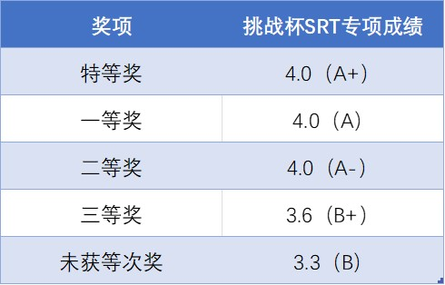

**
清华大学第 42 届挑战杯报名开始啦！**

清华大学 **“挑战杯”** 学生课外学术科技作品竞赛是由清华大学教务处、科研院、研究生院、校团委和校学生科协共同主办的全校性学生课外学术科技作品竞赛，是清华大学**规模最大、历史最长、水平最高、最具影响力的学生课外科技赛事。**

<!--truncate-->

## 章程修改内容

**今年的挑战杯与往年相比有许多不同之处，有意愿报名的同学请多加注意：**

1. 增设民生专项赛赛道。后续将根据章程中对专项赛的描述设置民生赛道分场，重点动员相关院系组织动员队伍参赛。

2. 对于有共同第一作者的项目，原则上最多申报 4 人。

3. 作品成员信息中应当包含第一作者信息。

4. 各院系评审委员会对本院系所有申报参赛的作品（含专项赛作品）进行审查。

5. 专项赛作品不占用院系主体赛作品推荐名额，均可直接进入校级终审。

6. 每件作品的评委原则上不少于五人。

7. 专项赛单独设立答辩分场。

8. 本科生作品获一、二、三等奖数目分别为本科生参加校级终审作品总数的5%、15%、30%向下取整值，原则上至少设置 10 名一等奖，30 名二等奖，60 名三等奖。

9. 对参与专项赛的作品，主办方将额外发放一等奖、二等奖和三等奖。专项赛专场一、二、三等奖数目分别为专项赛专场参加校级终审作品总数的 5%、15%、30% 向下取整值，原则上至少设置 1 名一等奖，2 名二等奖，3 名三等奖，应兼顾学科均衡，可根据具体情况进行调整。

## 报名信息

### 学科主题

信息技术、机械控制、环保建设、能源化工、基础科学、人文社科。

### 申报途径

**1. 院系申报：**  
   凡在竞赛举办学期初正式注册的全日制本科生、硕士研究生和博士研究生（均不含在职研究生）都可通过院系申报作品参赛。

**2. 校科协申报：**  
   在学校有关部门正式注册的社团协会（包括科技兴趣团队）、学生组织、实践支队可以以**团体**的名义通过校学生科协申报参赛，不占用院系推荐作品名额。

### 作品要求

1. **申报参赛的作品分为自然科学类学术论文、哲学社会科学类社会调查报告和学术论文、科技发明制作三大类型。** 科技发明制作类作品须有实物或模型参展。

2. **往届参赛作品**，如有重大改进和提高，**经院系严格评审并报组委会批准后**，可再次参加竞赛。

3. **学位论文、国际竞赛中获奖的作品、获国家级奖励成果**等均不在申报范围之列。

4. 原则上要求第一作者的工作量应该占整个项目工作量 **40%** 以上，其余作者每人工作量不低于 **10%**。作者总数不超过 **6** 人（团体作者除外），对于有共同第一作者的项目，原则上最多申报 **4** 人。

## 赛程与评审

1. 评审分为**院系初审、院系复审、校级终审、特奖答辩**四轮进行。院系初审原则上于**校历第 16 周周日**前进行，仅对作品立项和进度设计做考察，**不设置筛选淘汰机制**。

2. 院系复审：原则上于 **2024 年春季学期第 1、2 周**进行，为院系**筛选性审查**，审查后提交 **6 个推荐作品**。

3. 团体作品的初审与复审后续由 **校学生科协** 组织。

## 挑战杯 SRT 专项

1. 挑战杯 SRT 专项是 SRT 的一个子项目，随作品申报书（附件 1）申请，**无须在 Info 上申报**，活动的具体执行由学生科协负责，成绩评定依托于清华大学挑战杯竞赛。

2. 推荐以新项目申报挑战杯的作者选报挑战杯SRT专项。如同时参与多个项目，可以以多个项目申报挑战杯SRT。但由于课程号限制，**最多只能获得 2 学分**，且**只能选择一个项目计入成绩**。

3. 院系复审中，对报名挑战杯SRT专项的项目给出三个等级：
   - **优秀**：项目阶段性成果优秀，由院系推荐进入“挑战杯”后续评审的项目。
   - **良好**：项目阶段性成果良好，但院系不推荐“挑战杯”后续评审的项目。
   - **不通过**：相关材料随院系复审材料一同上交。

4. 挑战杯 SRT 专项项目应在**春季学期第 14 周前完成结题**，相关材料后续另行通知。并对相应院系评定等级**获得不同项目支持额度**。

5. 每个挑战杯 SRT 专项**参与挑战杯终审并结题**后，均可以**申请学分**，该项目的所有成员均获得 2 学分，项目作者也可**选择不申请学分**。挑战杯成绩和挑战杯 SRT 专项成绩的对应关系为：

## 材料提交

- **学院系申报作品（包含挑战杯SRT专项）**

   报名**截止至 12 月 31 日（校历第 15 周周日）24：00**。  
   将报名文件夹上传至[链接](https://cloud.tsinghua.edu.cn/u/d/260b25135b72416fb8fb/)。  
   作品上传后**如需修改，不得再次上传**，请联系自动化系学生科协项目部部长罗奕桐。

- **团体申报作品**

   将附件材料 1（封面中申报单位**填写“校学生科协”**）和附件材料 2 打包发送至 <kexie@mail.tsinghua.edu.cn>，材料包和邮件主题**均命名为“42 届挑战杯团体报名-团体名称”**。

请所有参赛同学扫码填写参赛作品情况统计：

文案 | 自动化系学生科协  
排版 | 刘烁  
审核 | 汪润 桂沄
