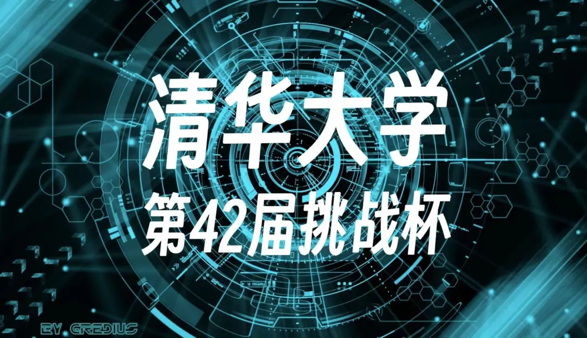
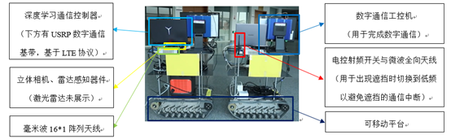
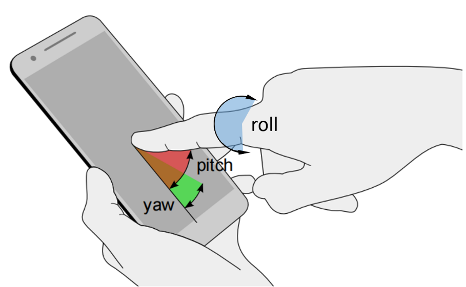
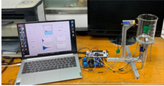
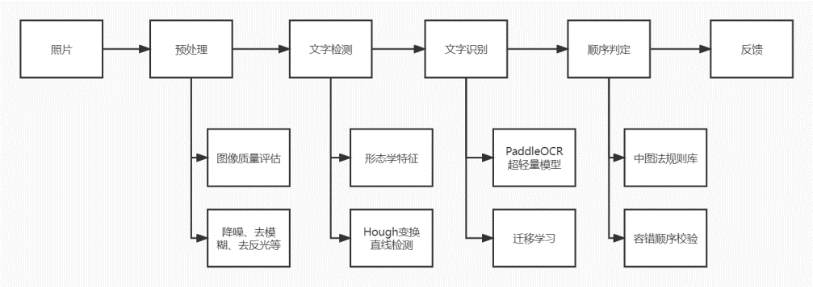
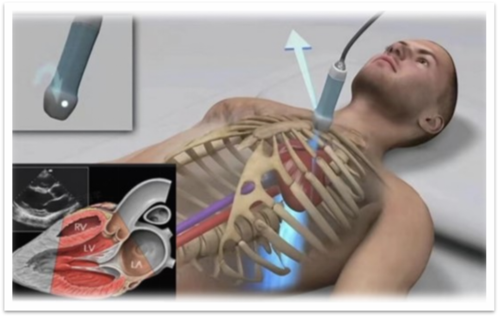
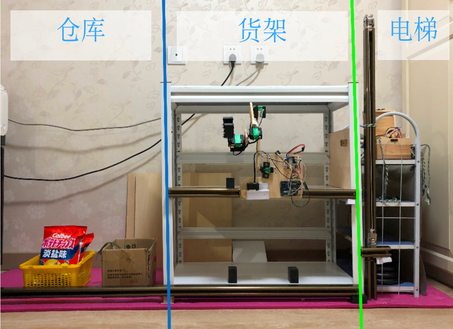

第 42 届挑战杯报名已经开始，你是不是也迫不及待参与这场盛大的科创赛事了呢？为感兴趣或还在犹豫的同学们，紫冬科协准备了往届获奖作品介绍，以及参与挑战杯的相关答疑，鼓励有科创热情的同学参与其中！

<!--truncate-->

## 往届作品介绍

### 2021

#### 基于雷视感知的毫米波动态通信平台

- 作者：张腾宇、孙杨、尹航、蒋玉骅、蒋沅
- 奖项：二等奖

本作品搭建了一套视觉-雷达多模态感知辅助毫米波通信的硬件平台。采用立体深度相机、激光雷达等多种传感器，并结合卷积、GRU/LSTM 时序神经网络构造深度神经网络，使得毫米波通信系统能够提前主动感知环境，避免因毫米波直射径遮挡引起的通信中断，并实现实时毫米波波束跟踪、保证动态高可靠的毫米波无线通信。

#### 基于手指姿态估计的人机交互系统

- 作者：张睿喆、杜邦得、谭跳
- 奖项：二等奖

该系统主要由指纹采集端、姿态估计模型、坦克实物三部分组成。指纹采集端通过触摸方式收集指纹图像，传输给姿态估计模型；姿态估计模型利用指纹图像，给出估计的手指姿态，每个手指给出三个姿态角：yaw、pitch、roll 即对应手指在三维空间中的角度；坦克车接收到这三个维度的信息，pitch 和 roll 控制车身移动，yaw 控制车身上的云台。

#### 振动式液量检测装置

- 作者：姚泊先、王雨晨
- 奖项：三等奖

作品以生活中常见的敲击不同液量的玻璃杯产生不同音高这一现象为入手点，设计了一个基于此方法的非侵入式液量检测的系统装置。该装置适用于如装有高毒性，强腐蚀性液体的储液罐等特殊场合，完全实现了非侵入式测量。  
系统通过电磁铁驱动弹片实现敲击激励，并由压电传感器检测震动信号。设计电路板实现信号的滤波与放大，然后通过单片机传输数据给上位机。上位机实现频率的分析与液量拟合预测。

#### 基于计算机视觉的智能图书整理助手

- 作者：胡家祺、闫泽、蔡宇哲、张芸睿
- 奖项：三等奖

基于计算机视觉等技术开发实用的“顺书” App 工具以减少人工的机械化重复劳动。该方案的核心是如上图所示的书号顺序检测系统，以图片为输入，首先评估图像质量，并通过降噪、去模糊、去反光等方式进行图像的预处理，获得高质量图像；再进行基于形态学特征、 Hough 变换等方法作目标检测，提取书号位置；运用在自制图书馆数据集上细调的 PaddleOCR 超轻量深度引擎对书号区域作文字识别，提取出书号；根据中图法规则库对识别的书号作容错处理，判断书号顺序是否正确，给用户提供反馈结果。算法预期部署在移动设备，并要求能够实时处理数据。

### 2022

#### 智能心脏超声机器人

- 作者：罗奕桐、王洹芊、吴国昆
- 奖项：三等奖

本项目致力于设计开发一套智能心脏超声扫描系统，实现由智能系统操控机械臂完成心脏超声检查的全过程，自动搜寻最佳扫描检查路径并存储高质量超声图像。  
本项目运用 yolov5 图像分割检测模型实现人体胸腔的识别，并根据手眼标定技术和基于误差驱动的速度控制器实现机械臂的精确平滑移动，从而实现了根据外置相机信息使机械臂自动移至患者胸腔表面的功能。同时运用离线强化学习 AWAC 算法根据超声图像信息自动控制机械臂找到四腔心影像，实现超声扫描全过程自动化。

#### 无人商店自动补货系统

- 作者：杨以宁、张心旭
- 奖项：三等奖

我国正在成为无人商店的新兴市场。作为一种新的商业运营模式，无人商店可以为顾客提供方便快捷的购物服务，降低商店运营成本。但无人商店仍需定期采用人工方式为货架补货，国外虽有货架自动补货的初步尝试，但机器人能抓取的商品形状单一，且存在路权争夺的问题。为此，本项目重点针对“从仓库提货并自动补充到货架”这个亟待拓展的无人化环节，设计完成了一套“无人商店自动补货系统”，由沿滑轨运行的带有四自由度机械臂的机器人及其模拟工况环境组成。模拟的工况环境分为仓库、货架、电梯三部分，各部分均有用于在各部分内和各部分之间移动用的轨道。

## Q&A

**Q**：请问现在面临各种学习、大作业的压力怎么办？  
A：距挑战杯报名截止还有一些时日，并且有大约半年的时间来完成该项目。虽然本学期就会有材料初审，但是初审只需要做出一个雏形，且初审将不设置淘汰机制。

**Q**：请问我现在没有项目怎么办？  
A：1. 参加 SRT 或实验室的同学可以直接向导师咨询，其他同学也可以主动联系老师们寻找项目（例如班主任、任课老师等）。  
2. 如果你有好的创意，可以以此作为项目。例如参加过创意大赛的同学可以试着将当初的创意实现。  
3. 如果你还有参加星火的意向，你可以把星火的项目报名挑战杯。

**Q**：请问我担心自身能力不足怎么办？  
A：最终能否进入挑战杯终审，完全取决于在项目申请过程中的成长与收获。专业排名和学分绩不构成直接影响。在项目选拔过程中主要分为初审、终审环节，是否进入取决于项目规划、项目展示、项目实用性以及整个项目研究过程中表现出来的创新思维和能力。

**Q**：在挑战杯中我能获得些什么？  
A：1. 挑战杯奖项具有不错的分量，而这样的奖项也是作为一种肯定，激励你在科研上乘风破浪。  
2. 即使最终非常可惜地没有取得很好的成绩，但在这半年多的付出中，你可以收获宝贵的科研经历，这对未来进一步深入科研是大有裨益的。  
3. 除了挑战杯，自动化系也有类似的培养计划，例如不久后将开始招募的自动化系英才计划（ATOM 计划），同样可以获得优质的科研资源。

---

文案 | 自动化系学生科协  
排版 | 张雯旭  
审核 | 汪润 桂沄
