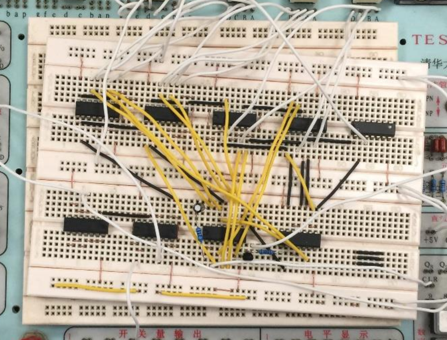
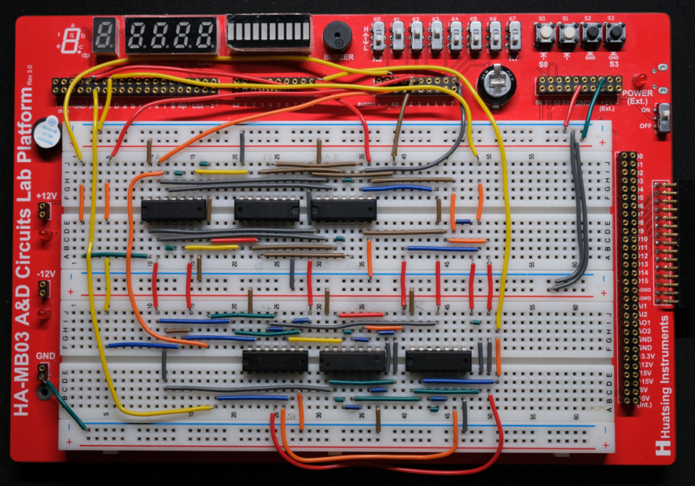

<h2>“飞线杯” 电路排布大赛</h2>
<strong>自动化系学生科协</strong>

**前言**

正在进行数电实验的你，已对面包板上的整洁接线小有心得？

正在准备电路验收的你，已对电子元件的优雅排布得心应手？

即日起，自动化系学生科协面向正在数电实验的所有同学，举办第一届“飞线杯”电路排布大赛！

<!--truncate-->

## 比赛介绍

小小电路板的接线，蕴含着不小的门道。倘若单纯追求搭建速度，一通操作猛如虎，接通电源，惊觉每个灯的亮灭都在意料之外，在“鸟巢”般的飞线中排查 bug，则令人倍感头秃：

 <small>漫天飞线一时爽，飞完 debug 火葬场</small>

本次“飞线杯”，旨在探索我们理工院系特色的工程之美。美不只有琴棋书画、歌舞雕刻，还体现在面包板接线的整洁、元件排布的大气，抑或代码仓库的规范、变量命名的优雅。

 <small>如果这样的话，debug 应该会方便一些吧？</small>

本次比赛以面包板搭建为主题，提供给同学们展现自己审美力和借鉴他人审美力的平台，帮助同学们提高电路的布局设计能力，欢迎大家参与~

## 比赛主题

本次比赛以数电实验——时序逻辑电路设计为主题，在搭建完该次实验的电路后，拍摄自己的面包板接线的正面照片（参考以上插图的样式）即可。

## 评价标准

总分由评审小组评分、大众投票得分两部分构成。学生科协评审小组将综合考虑电路的美观性、整洁性进行评价。同时，我们也将进行公开投票，同学们可以将票投给心中最佳的作品。

## 作品提交方式及截止时间

参赛同学将自己的作品提交到云盘链接即可。

- 【命名格式】：`班级_姓名`（如“自21\_张三”）
- 【截止时间】：2023 年 12 月 17 日 24:00
- 【云盘链接】：[https://cloud.tsinghua.edu.cn/u/d/fa441d54acad43d99fc9/](https://cloud.tsinghua.edu.cn/u/d/fa441d54acad43d99fc9/)

## 比赛奖励

本次比赛奖励如下，按评审小组评分和大众投票得分综合排序的前10名同学可以从以下两样奖品中选择一样。  
（奖品数量、内容可能会随实际报名作品数量而调整。）

1. 漫步者 TWS1 Pro 无线蓝牙耳机

   

2. 3D-JP 城市建筑拼图 puzzle

   
   
<small>（拼图具体图案可能与上图不同）</small>

---

文案 | 自动化系学生科协  
排版 | 夏泽天  
审核 | 汪润 桂沄
