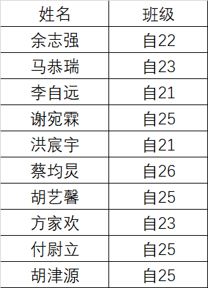
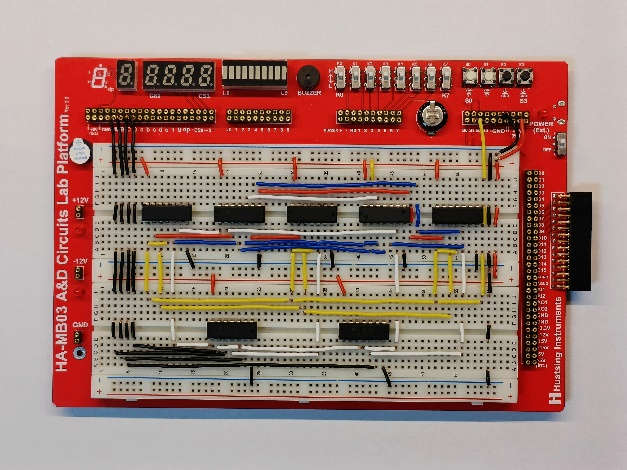
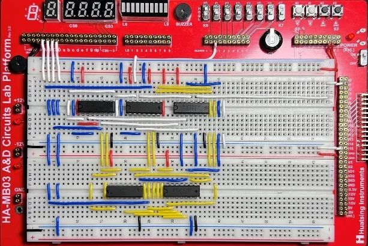
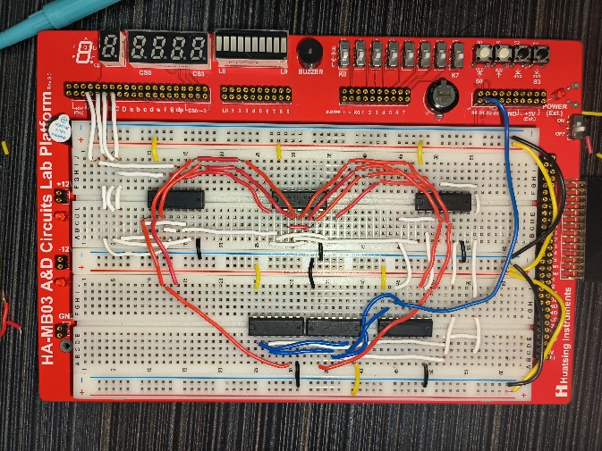
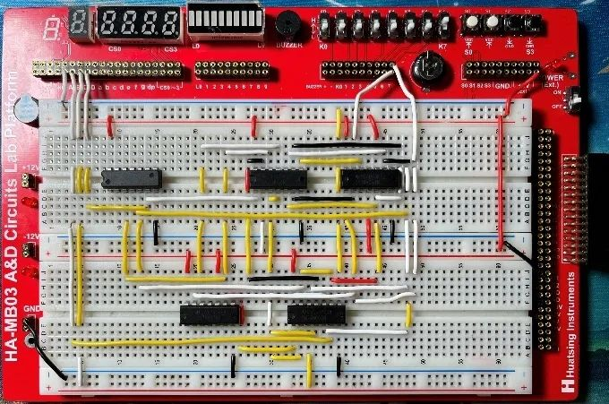
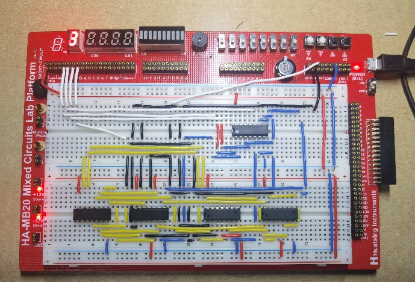
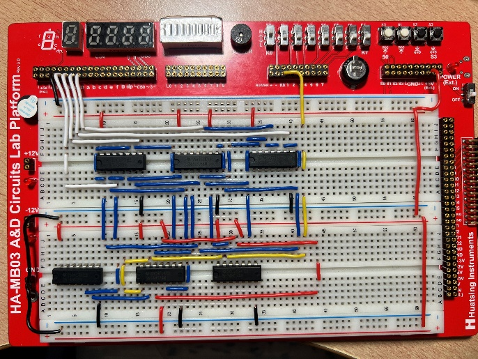
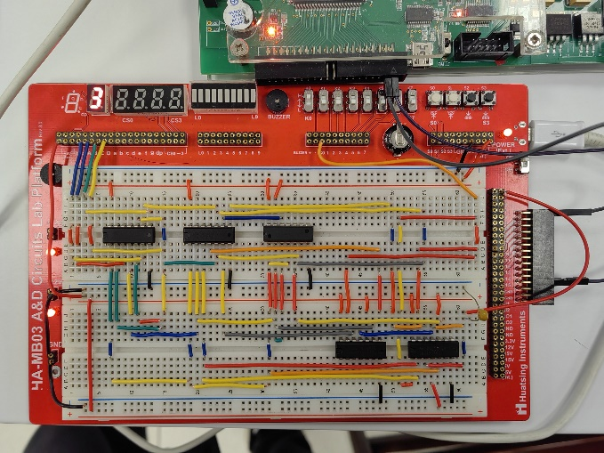
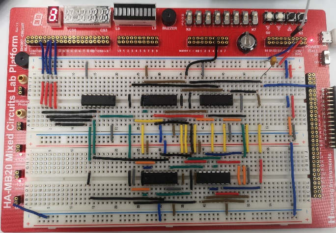
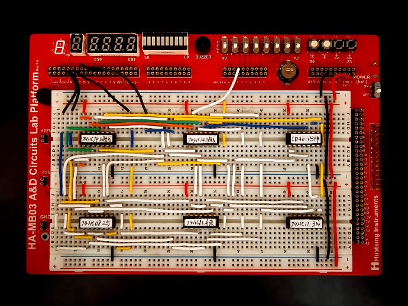

## 比赛简介

“飞线杯”旨在探索我们理工院系特色的美育。美育不只有琴棋书画、歌舞雕刻，还体现在面包板接线的整洁、元件排布的大气，抑或代码仓库的规范、变量命名的优雅。

本次比赛以面包板搭建为主题，提供给同学们展现自己审美力和借鉴他人审美力的平台，帮助同学们提高电路的布局设计能力。

<!--truncate-->

## 获奖名单

经过大众海投和科协评审，产生了 10 位获奖同学，以下是获奖名单和获奖作品，让我们一起来欣赏一下他们的电路吧~

请获奖的同学到紫荆二号楼 618B 科协活动室领取奖品（耳机/拼图 puzzle 二选一）。

## 获奖作品集锦

  
**余志强** 自22

  
**马恭瑞** 自23

  
**李自远** 自21

  
**谢宛霖** 自25

  
**洪宸宇** 自21

  
**蔡均炅** 自26

  
**胡艺馨** 自25

  
**方家欢** 自23

  
**付尉立** 自25

  
**胡津源** 自25

---

活动组织 | 自动化系学生科协  
排版 | 自动化系团委宣传组
