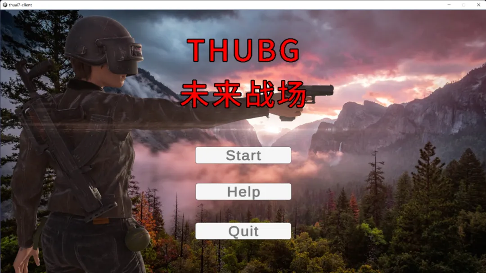

<strong><mark>清华大学第七届人工智能挑战赛</mark></strong>
<h2>自动化系×软件学院 “未来战场”赛道 即将到来！</h2>

<!--truncate-->

## 背景简介

在自动化系学生科协精心策划的《未来战场》赛道中，你将作为一名英勇的战士，踏入这个充满挑战与机遇的战场。在这个高度自动化的近未来世界中，战争已经演变为无人化、智能化的较量。你置身于现实与虚拟的交汇点，操控着先进的无人作战系统，与来自世界各地的对手展开激烈的角逐。

你肩负着守护家园的重任，需要充分发挥智慧和勇气，运用各种高科技装备，制定出精妙的战略和战术。你编写的无人作战系统将成为得力助手，它们具备高度自主性和智能化能力，能够在战场上独当一面。然而战场危机四伏，敌人猛烈的攻击如狂风暴雨，网络病毒的侵袭更似幽灵潜行。你需要步步为营，智勇并举，才能在这场未来战争中披荆斩棘，报效家国。

每一次胜利，都是你为国家荣誉而战斗的见证；每一分成绩，都是你为国家利益而努力的回报。在这场近未来无人化战争的舞台上，你将用自己的智慧和勇气，书写下激励人心的英雄篇章！让我们共同为国家的繁荣和强大而努力，展现出新时代青年的风采与担当！

## 赛事简介

清华大学人工智能挑战赛自动化系赛道，原为自动化系 C 语言大赛，具有广泛的影响力，至今已成功举办 20 届。

本次赛事名称为“未来战场”，由自动化系学生科协和软件学院学生科协合作自主开发，为大家准备了精美的赛事平台和挑战性的玩法。采用 C++ & Python 双接口形式，选手可以任选两种语言之一参与比赛、同台竞技。

## 玩法简介

每场比赛均由两个组展开激烈对战。

在比赛开始前，每支队伍的无人作战系统将被随机分配到地图的两个相对的角落作为起始点。选手们需要在比赛开始前通过代码预先设定好起始位置，以便在比赛开始时迅速进入战斗状态。

比赛开始后，地图上会随机分布着各种资源，包括武器、弹药、护甲、药品和手榴弹。选手们需要通过智能算法控制无人作战系统在地图上移动，寻找并收集这些资源，以提升自身的战斗力。同时，选手们可以对其他队伍的无人作战系统发起攻击，争夺优势。

地图上会有一个不断缩小的安全区，安全区外的区域会受到网络病毒的影响。选手在安全区外每秒会受到伤害，因此需要时刻注意安全区的变化，避免被病毒侵蚀。同时，安全区的缩小也会迫使选手们逐渐靠近，增加战斗的频率和激烈程度。

比赛持续到只剩下最后一个无人作战系统存活，该系统所属的队伍即为胜利者。如果在规定的时间内，所有队伍的无人作战系统都已全部被淘汰，那么存活时间最长的队伍将获胜。

关于数值策划等细节，参见[赛事网站](https://thuasta.github.io/thuai-7)。

选手需要写出一个完整的程序，能够完成选择出生地、移动、拾取资源、攻击、使用药品、使用手榴弹、获取战场信息等操作，并根据战场形势决定最优策略。选手的所有逻辑，包括条件判断、动态的检测与决策等，都必须在代码中完成，一旦开始对战就无法通过任何形式（如命令行）改变逻辑或手动输入命令。选手最终提交一个 `.cpp` 或 `.py` 文件，其中必须包括所有的代码。

## 赛程安排和奖励办法

比赛日程安排如下。

| 比赛阶段 |          时间          |
| :------: | :--------------------: |
|   初赛   | 预计 2024 年 5 月 5 日 |
|   复赛   | 预计 2024 年 5月 19 日 |

赛道的前 8 名队伍将获得丰厚的奖金奖励，奖项及奖金数额见下表。

|  奖项  | 数量  | 奖金数额/元 |
| :----: | :---: | :---------: |
| 特等奖 |   1   |    8000     |
| 一等奖 |   1   |    5000     |
| 二等奖 |   2   |    3000     |
| 三等奖 |   4   |    1000     |

除了丰厚的奖金奖励，表现优异的同学还可以获得范静涛老师《面向对象程序设计训练》课程（自动化系必修课）的总评加分激励哦~

## 报名途径

请大家访问[问卷链接](https://wj.qq.com/s2/14528984/c7b2/)，扫描二维码，加入 THUAI7 自动化系 × 软件学院赛道选手群。

---

排版 | 詹文涛  
审核 | 汪润 桂沄
