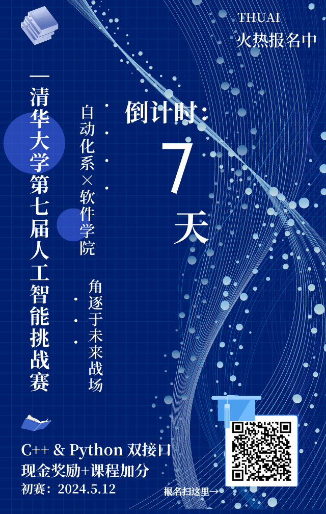
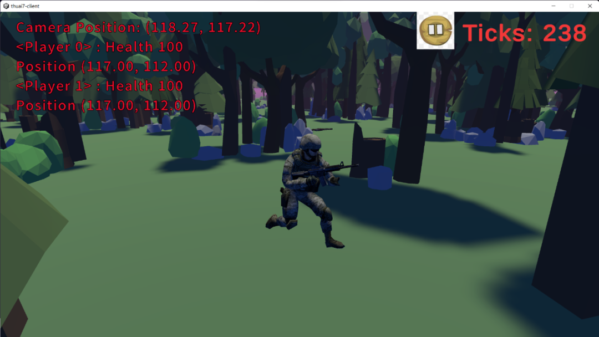

<!--truncate-->

  <strong>清华大学第七届人工智能挑战赛</strong> 
  <small>2024 THUAI7</small> 
  自动化系 × 软件学院 “未来战场”赛道
  <h2>启动！</h2>

## 背景简介

在自动化系 × 软件学院“未来战场”赛道中，你将作为一名英勇的战士，踏入这个充满挑战与机遇的战场。在这个高度自动化的近未来世界中，战争已经演变为无人化、智能化的较量。你置身于现实与虚拟的交汇点，操控着先进的无人作战系统，与来自世界各地的对手展开激烈的角逐。

你肩负着守护家园的重任，需要充分发挥智慧和勇气，运用各种高科技装备，制定出精妙的战略和战术。你编写的无人作战系统将成为得力助手，它们具备高度自主性和智能化能力，能够在战场上独当一面。然而战场危机四伏，敌人猛烈的攻击如狂风暴雨，网络病毒的侵袭更似幽灵潜行。你需要步步为营，智勇并举，才能在这场未来战争中披荆斩棘，报效家国。

每一次胜利，都是你为国家荣誉而战斗的见证；每一分成绩，都是你为国家利益而努力的回报。在这场近未来无人化战争的舞台上，你将用自己的智慧和勇气，书写下激励人心的英雄篇章！让我们共同为国家的繁荣和强大而努力，展现出新时代青年的风采与担当！

## 重生之我在未来战场当兵王

在遥远的未来，一个名为“未来战场”的虚拟战场上，一场紧张刺激的比赛正在上演。这个战场充满了未知与危险，只有最后的生存者才能赢得“吃鸡”的荣誉。

小帅，一个经验丰富的“绝地求生”玩家，他在这场比赛中担任着领导者的角色。他与他的三名队友，小美、小明和小王，组成了一支默契十足的四人小队。  
比赛一开始，四人小队迅速分散，各自寻找武器和装备。小帅在一片废墟中发现了一把狙击步枪，并配备了一个高倍率瞄准镜。这使他充满了决心。他立即利用地形优势，爬上了一座废弃建筑的屋顶，开始为队伍提供远程火力支援。  
小美则在一个仓库里找到了一套防弹衣和一把冲锋枪。她利用仓库的掩护，迅速向敌人发起了攻击。她的迅猛和果断为队伍争取到了宝贵的时间。  
小明和小王则在一片密林中搜索物资。他们小心翼翼地前进，避免被敌人发现。他们找到了一些医疗包和弹药，为队伍提供了重要的补给。

比赛进行到白热化阶段，小帅刚刚击败了一个难缠的敌人。他回头望向小明和小王，发现他们两个还在捡拾物资。小帅亲眼看着他们背包里的弹药数由 65475 变成 65505 ，再变成 65535，再然后，他们就变成了一束白光消失不见。小帅又看向了小美，发现她一直在对着远处的敌人扣动着扳机——虽然她已经没有弹药了。小帅看着她站在原地被毒圈吞没，片刻后右上角的淘汰栏处出现了小美的名字。

孤身一人，面对毒圈和凶悍的敌人，小帅又将何去何从？这由你来决定！

## 报名途径

访问[以下链接](https://wj.qq.com/s2/14528984/c7b2/)或扫描二维码填写问卷并加入 THUAI7 自动化系 × 软件学院赛道选手群。

---

文案＆排版 | 孙润泽  
审核 | 汪润 桂沄
