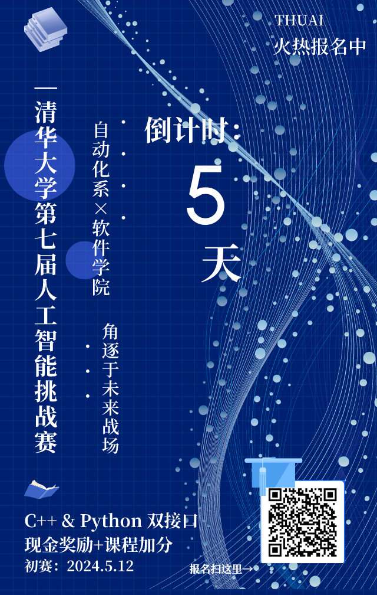
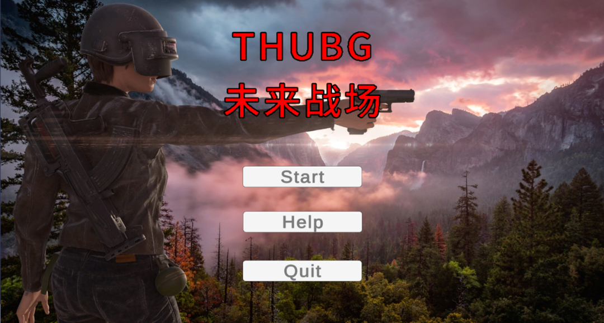

<!--truncate-->

  <strong>清华大学第七届人工智能挑战赛</strong> 
  <small>2024 THUAI7</small> 
  自动化系 × 软件学院 “未来战场”赛道
  <h2>启动！</h2>

## 开放世界冒险

**
战术无界，自由称王**
 在“未来战场”的广袤宇宙中，每一个玩家都是一位无畏的指挥官，手握战术的权杖，在星际间展开一场智与勇的较量。这里，战术不再是固定的框架，而是你手中的画笔，绘制属于你的胜利之路。

在《未来战场》中，自由度是你最坚实的后盾。你可以选择孤身一人，潜伏在暗处，用精准的狙击和巧妙的陷阱，成为每个敌人心头的噩梦。你也可以用火力压制和协同作战，将敌人逼至绝境。你也可以隐于荒野，用充足的医疗用品跟敌人打一次实打实的消耗战。此外，还可能有前所未有的各种战术等待你来开发。  
在这里，每一种战术都有其独特的魅力，每一次选择都关乎生死存亡。

<big>你，准备好了吗？</big>

## 最新动态

初赛截止日期为 【5 月 12 日】，调试者需要在截止日期前在平台上提交。

目前本地调试平台已上线，各位调试者可以访问[游戏文档](https://thuasta.github.io/thuai-7)了解相关资讯并开始编写代码。

在线评测平台已上线，调试者可以访问 [https://www.saiblo.net/game/36](https://www.saiblo.net/game/36) 评测自己精心编写的代码。同时，请各位调试者在顶栏“小组”中加入小组“清华大学第七届人工智能挑战赛”。

希望各位参赛同学积极参与调试，不断优化自己的代码！

## 报名途径

访问[以下链接](https://wj.qq.com/s2/14528984/c7b2/)或扫描二维码填写问卷并加入 THUAI7 自动化系 × 软件学院赛道选手群。

---

文案 & 排版 | 孙润泽  
审核 | 汪润 桂沄
