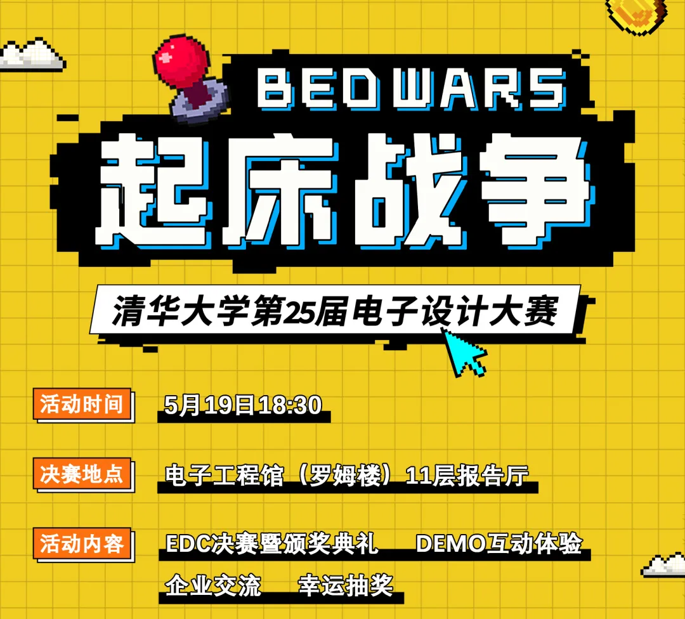
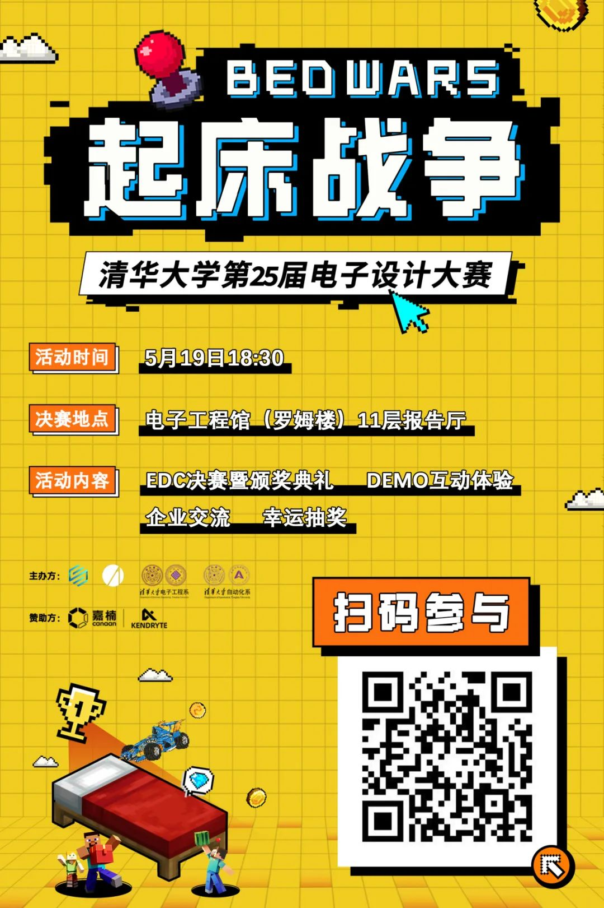
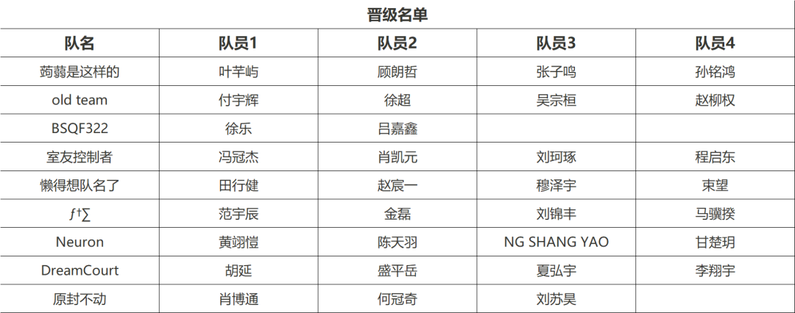
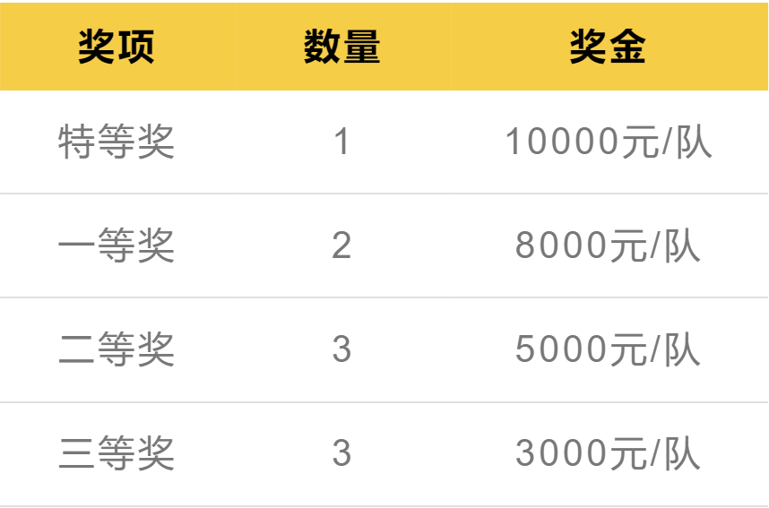
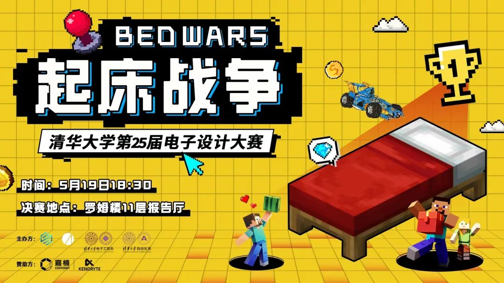

<!--truncate-->

**
2024 年 5 月 19 日**  
**校历第 12 周 周日 18:30**  
**电子工程馆 11 层**  
<mark>期待您的到来！</mark>

↓↓快来扫码参与吧↓↓  
  
<small>报名二维码</small>

## 赛事介绍

**清华大学电子设计大赛（EDC）** 是由电工电子实验教学中心和电子工艺实习基地主办、由**电子系**和**自动化系**两系学生科协联合承办的高水平科技赛事，是学校**历史最悠久、含金量最高**的比赛之一。

本次电子设计大赛，以 Minecraft 多人在线对战游戏 **“起床战争”** 为赛题背景。参赛队伍需要利用自行搭建的**智能小车**扮演起床战争中的玩家，构建自己的策略采集资源、强化自身属性、攻击对手，最终摧毁对方的**床**，获得胜利。

## 前期赛果

经过初赛与复赛，9 支队伍脱颖而出。  
他们分别是：

让我们期待各支队伍在决赛中的精彩表现！

## 比赛奖金

## 赛事赞助商：嘉楠科技

**嘉楠科技（Canaan）** 是一家领先的 ASIC 芯片设计公司，以 **“区块链+AI”** 为多元化经营战略，业务范围涵盖高性能 ASIC 计算芯片及设备研发、AI 芯片及产品开发。作为一家纳斯达克上市公司，嘉楠科技是全球 **“区块链第一股”**，也是第一家在美上市的**中国自主知识产权 AI 芯片公司**。嘉楠科技希望通过 ASIC 技术 **“提升社会运行效率，改善人类生活方式”**，并成为**区块链**和 **AI 高性能计算的**领导者。

**2024.5.19 18:30**  
**电子工程馆 11层**  
**清华大学**  
**第25届电子设计大赛·决赛**  
**<mark>起床战争，一触即发</mark>**  
**<mark>保卫你的床</mark>**

---

文案 | 毕嘉仪  
排版 | 毕嘉仪  
审核 | 刘丹阳
