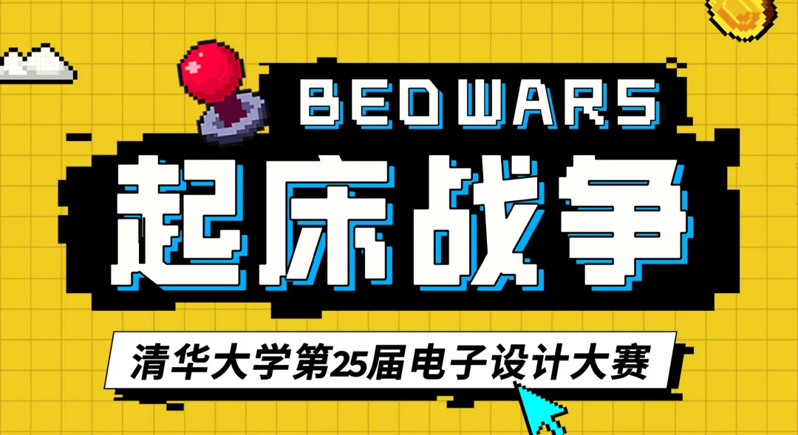
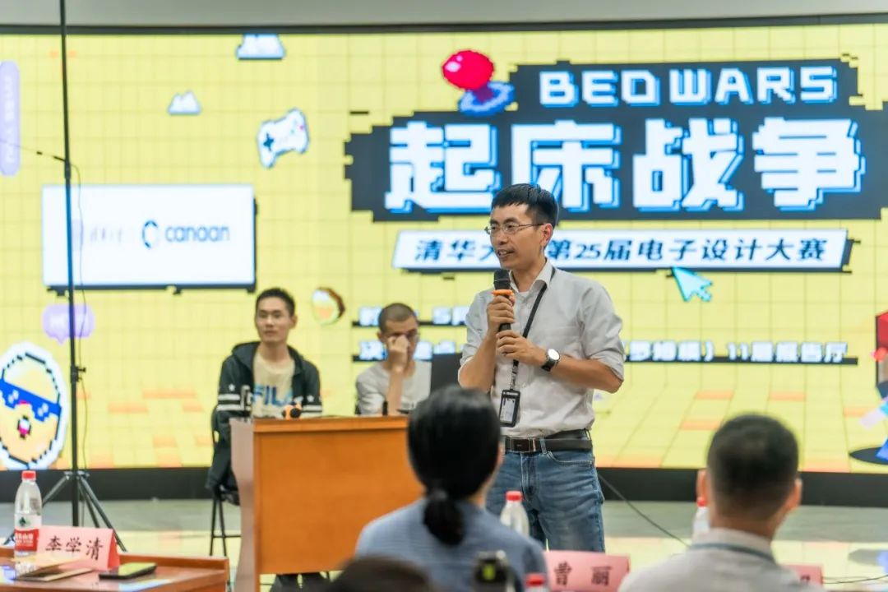
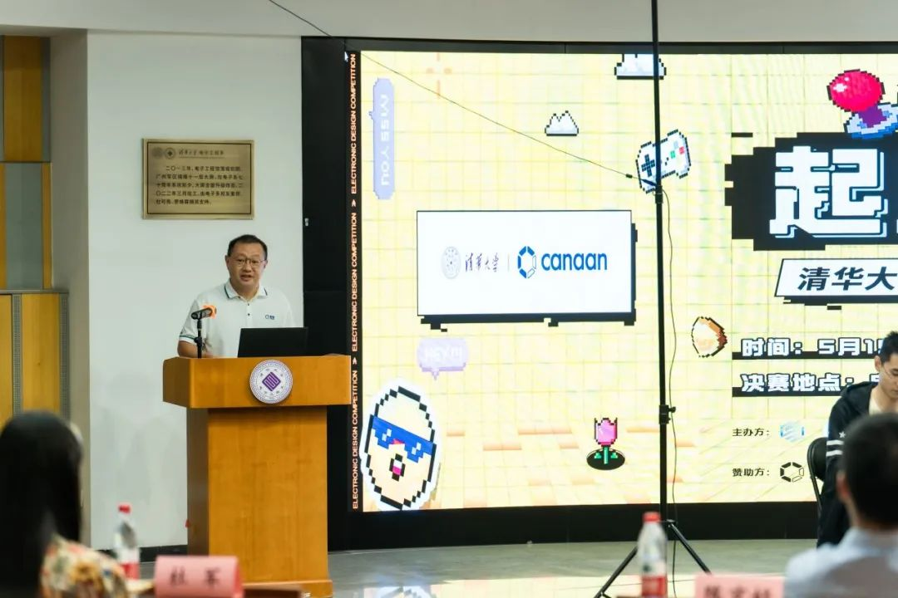
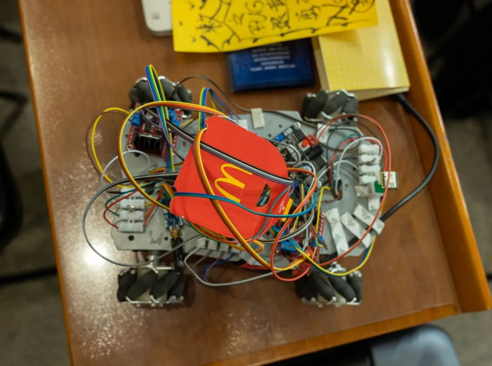
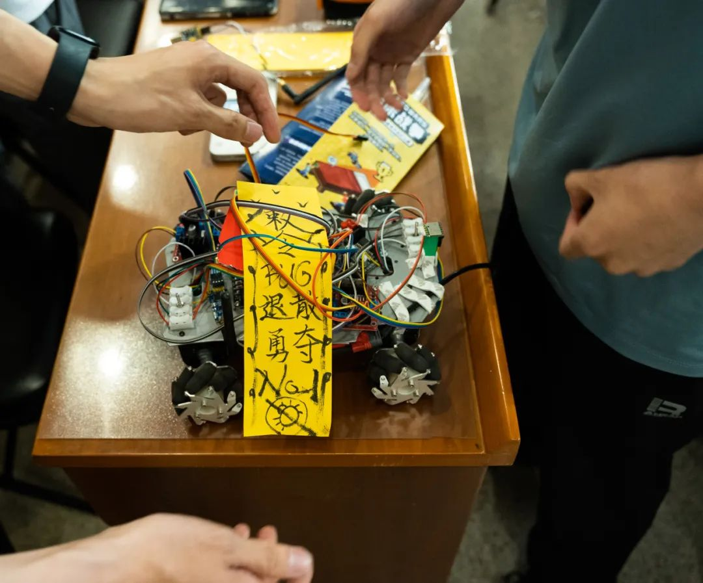
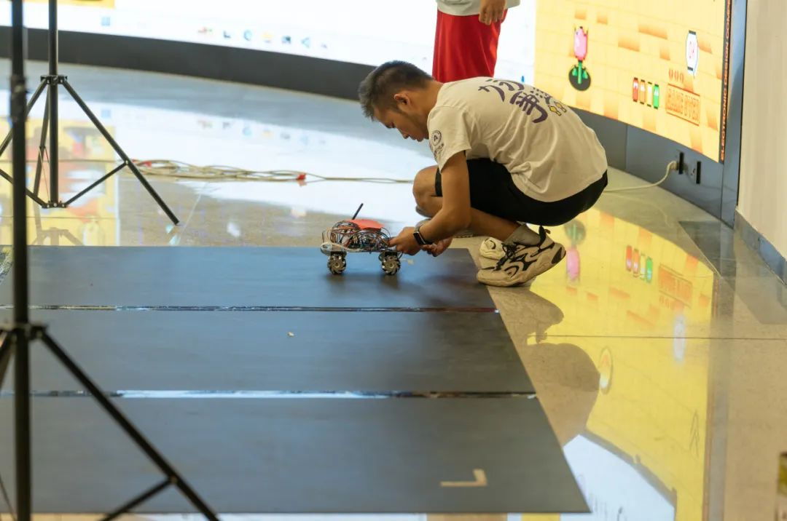
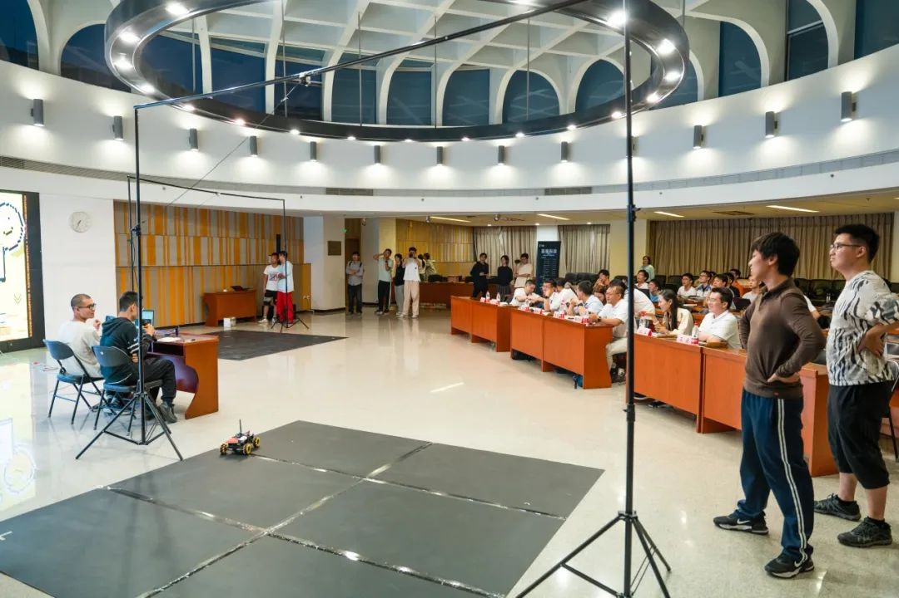
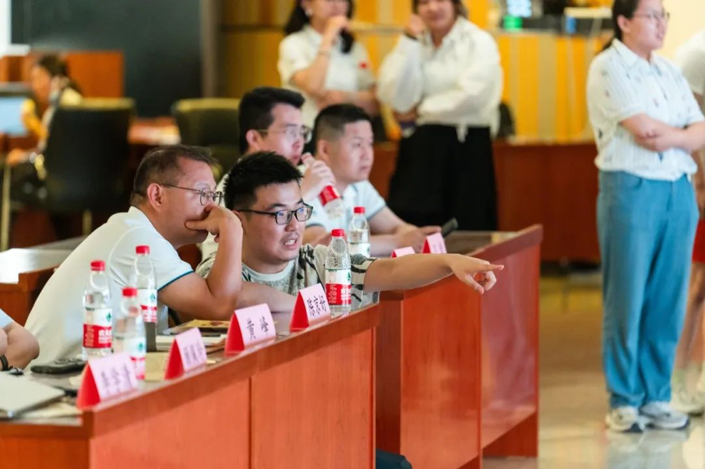
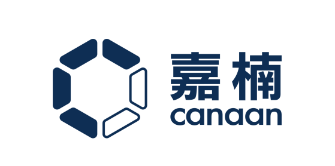

## 赛事介绍

**清华大学电子设计大赛（EDC）** 是由电工电子实验教学中心和电子工艺实习基地主办、由**电子系**和**自动化系**两系学生科协联合承办的高水平科技赛事，是学校**历史最悠久、含金量最高**的比赛之一。

本次电子设计大赛由**嘉楠科技（Canaan）** 赞助，以 Minecraft 多人在线对战游戏 **“起床战争”** 为赛题背景。参赛队伍需要利用自行搭建的**智能小车**扮演起床战争中的玩家，构建自己的策略采集资源、强化自身属性、攻击对手，最终摧毁对方的**床**，获得胜利。

{/* truncate */}

## 决赛回顾

经过初赛和复赛，共九支队伍挺进决赛。决赛开始前，电子系学生组组长李学清老师表达了对赛事各方的感谢。嘉楠科技副总裁陈京好先生，也是清华大学的校友，当晚与诸多学弟学妹们一起分享了一名清华学子从未改变的初心和梦想，科技改变未来，梦想创造未来；同时也表达了对决赛的殷殷期待。

<center>**嘉宾讲话**</center>
{/* ```mdx-code-block  */}
import Tabs from '@theme/Tabs';
import TabItem from '@theme/TabItem';

<Tabs>
  <TabItem value="1" label="李学清老师" default>
    
  </TabItem>
  <TabItem value="2" label="陈京好先生">
    
  </TabItem>
</Tabs>
{/* ``` */}

决赛期间，九辆小车步步为营，见招拆招，为我们带来了精彩的攻防比拼。让我们来看看紧张刺激的决赛现场吧！

<center>**选手小车选览**</center>
{/* ```mdx-code-block  */}
<Tabs>
  <TabItem value="1" label="小车 1" default>
    
  </TabItem>
  <TabItem value="2" label="小车 2">
    
  </TabItem>
</Tabs>
{/* ``` */}

<center>**比赛现场**</center>
{/* ```mdx-code-block  */}
<Tabs>
  <TabItem value="1" label="调试小车" default>
    
  </TabItem>
  <TabItem value="2" label="激烈角逐">
    
  </TabItem>
  <TabItem value="3" label="评委讨论">
    
  </TabItem>
</Tabs>
{/* ``` */}

## 获奖情况

经过激烈的角逐，比赛决出了一支特等奖，两支一等奖，三支二等奖和三支三等奖，获奖名单如下：

|  奖项  |    奖金     |                 队名                 |
| :----: | :---------: | :----------------------------------: |
| 特等奖 | 10000 元/队 |              DreamCourt              |
| 一等奖 | 8000 元/队  |      蒟蒻是这样的<br />old team      |
| 二等奖 | 5000 元/队  | 室友控制者<br />Neuron<br />原封不动 |
| 三等奖 | 3000 元/队  | ƒ†∑<br />BSQF322<br />懒得想队名了 |

每一支队伍都赛出了自己的水平和风采，对每一支参赛队伍表示尊敬，表达感谢！

## 赛事赞助商：嘉楠科技

此次比赛，赛场旁搭建有嘉楠科技为观众和选手搭建的趣味体验区，展示了基于 K230 的人脸姿态估计和手部实时渲染功能，为观众带来趣味的同时，展现出嘉楠科技的水平与实力。

**嘉楠科技（Canaan）** 是一家领先的 ASIC 芯片设计公司，以 **“区块链+AI”** 为多元化经营战略，业务范围涵盖高性能 ASIC 计算芯片及设备研发、AI 芯片及产品开发。作为一家纳斯达克上市公司，嘉楠科技是全球 **“区块链第一股”**，也是第一家在美上市的**中国自主知识产权 AI 芯片公司**。嘉楠科技希望通过 ASIC 技术 **“提升社会运行效率，改善人类生活方式”**，并成为**区块链**和 **AI 高性能计算的**领导者。

<center></center>

<center><strong>
清华大学  
第 25 届电子设计大赛·决赛  
圆满结束！

第 26 届电子设计大赛  
期待你的到来！
</strong></center>

---

排版 | 王俊维  
审核 | 汪润 桂沄
