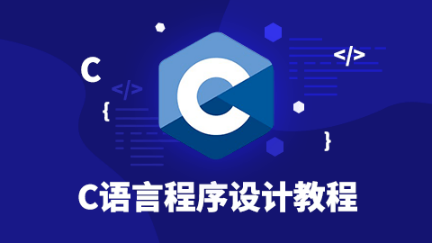
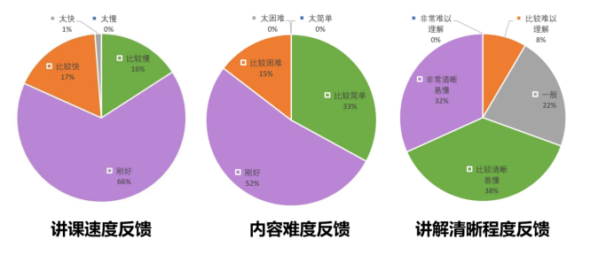

你是否对编程世界充满好奇，却担心零基础的自己难以入门？是否想在大学的第一堂编程课上就自信满满，游刃有余？那么，你绝对不能错过紫冬科协为你精心准备的 **2024 年暑期零基础编程公益培训！**

本次培训由清华大学自动化系学生科协倾情奉献，汇集了众多经验丰富的讲师和优秀学长学姐。他们将以专业的视角、生动的案例，带你走进编程的奇妙世界。本次培训采用**线上教学模式**，无论你身处何方，都能轻松加入这场编程培训活动！并且该活动面向 2024 年高中毕业、即将升学的同学，**不限于报考清华的同学。**

<!--truncate-->

## 课程内容

C 语言，作为自动化系新生的第一课，也是许多人编程生涯的起点。本课程将深入浅出地讲解 C 语言的基础知识与实战技巧，涵盖**数据类型、运算符、条件分支、循环结构、数组、函数**等核心内容，助你快速入门，在入学后第一学期的编程课上更加从容，为未来的学习打下坚实基础。

## 课程安排

我们精心规划了为期三周的线上暑期培训，共设 **7 次**精彩授课，每次课程约一个半小时，间隔三天进行，确保你有足够的时间消化知识。在每一讲后会布置一些简单的**小作业**供同学们练手，同时，我们还准备了**课后集中答疑环节**，随时解答疑惑。活动将于 7 月 22 日至 8 月 11 日举行，让我们携手共进，探索编程的无限可能！

为了让你更好地掌握所学知识，我们还将**提供丰富的学习资源**，包括每次授课的 PPT、录屏视频以及精选的编程习题和案例。这些资源将同步上传至 Bilibili 清华大学自动化系科协账号 [thuasta](https://space.bilibili.com/676450636)，供你随时查阅、巩固基础！

为了鼓励大家积极参与学习、挑战自我，我们还设立了奖励机制。培训结束后，我们将根据作业完成情况、课堂表现以及项目实践等多方面因素评选出优秀学员，并为同学们**颁发精美礼品。**

## 往年课程反馈分析

去年有大约 300 名同学参加了此次零基础编程公益培训，其中大部分是清华自动化系的准大一新同学。以下是课程评价调研情况：

从去年同学的反馈中可以看出，同学们对于课程整体上是较为满意的。大部分同学感觉**课程速度和难度都很合适，讲解效果也比较清晰。** 有部分同学感觉难度较大，不容易听懂，则可以观看回放，或者直接与讲师交流，以解答疑惑。许多参与过培训的同学表示，这次经历不仅让他们掌握了编程技能、拓宽了视野和思路，更重要的是激发了他们对编程的热爱和追求。

欢迎大家积极参加此次暑期零基础编程公益培训活动！在这里你将参与丰富的编程实践、遇到志同道合的伙伴并得到讲师的悉心指导。清华大学自动化系科协 2024 暑期公益编程培训期待你的加入！

---

**
欢迎关注紫冬科协哔哩哔哩官方号**  
**[【THUASTA】](https://space.bilibili.com/676450636)**  
**欢迎关注紫冬科协官方网站**  
**[https://thuasta.org](https://thuasta.org)**  
**获取更多紫冬科创信息~**

文案 | 自动化系学生科协  
排版 | 凌子霄  
审核 | 张琰然 肖一翃 周义函
