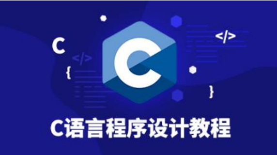
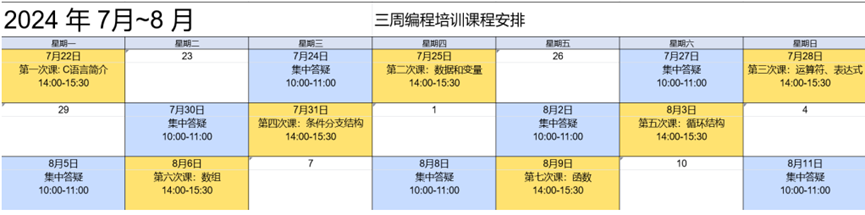
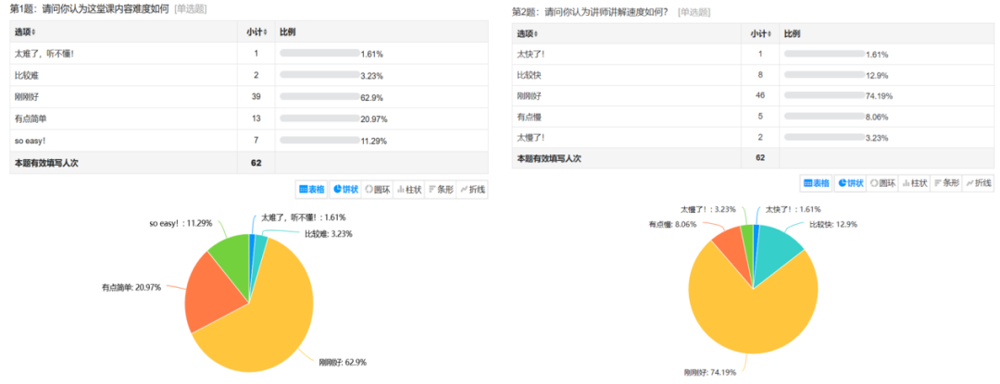
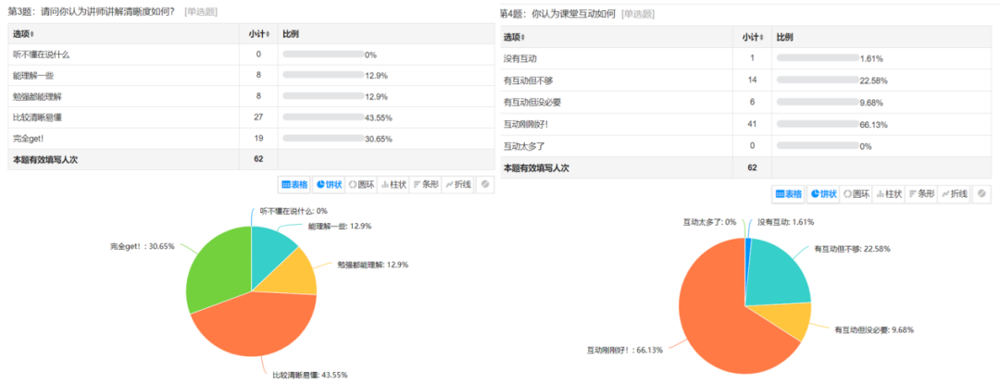
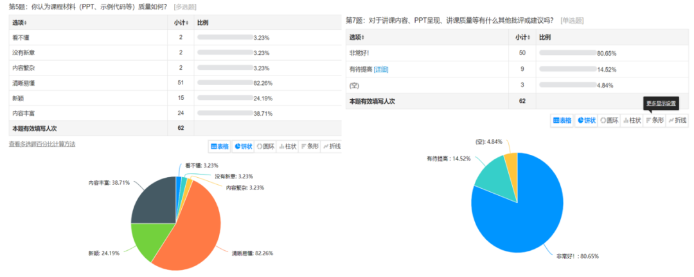
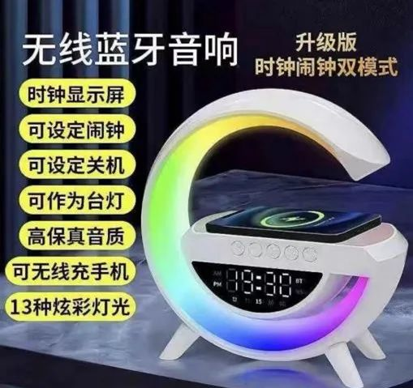
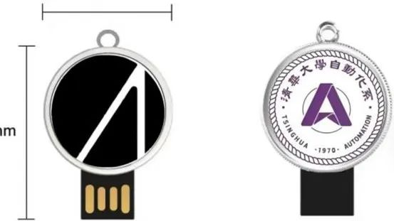
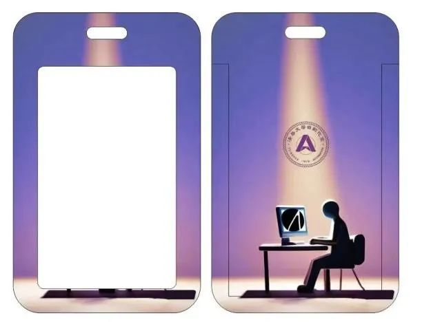

7 月 22 日 - 8 月 11 日，清华大学自动化系学生科协为即将踏入大学校门的四字班新生，精心打造了一场别开生面的线上**零基础编程公益培训**。为期三周，跨越七次课程的编程盛宴，不仅传授了 C 语言的精髓，更激发了学子们对数字世界的无限憧憬。

<center>
从“Hello, World!”的初次邂逅  
到**数据类型、变量、常量**的深入浅出  
从**运算符**的灵活运用  
到**条件分支、循环结构**的精妙布局  
从**数组**的存储魔力  
到**函数**的封装之美  
每一步都凝聚着讲师们的悉心教导与学长学姐的殷切期望。
</center>

我们构建了一个完整而系统的学习框架。每一次授课，都是一次知识的累积；每一次练习，都是一次能力的提升。通过这七次精彩纷呈的讲座，同学们熟练掌握编程的核心技能，为未来的学习打下坚实的基础。

{/* truncate */}

<center></center>

为了让同学们的学习之路更加顺畅，我们特别设置了**课后集中答疑环节**。无论在学习过程中遇到何种难题，都可以在这里找到答案。同时，我们还准备了丰富的学习资源，包括**授课 PPT、录屏视频以及精选的编程习题和案例**，供学员随时查阅、巩固所学。

我们还设立了奖励机制，以鼓励大家积极参与、挑战自我。培训结束后，将根据**作业完成情况、课堂表现以及比赛结果**等多方面因素评选出优秀学员，并**颁发精美礼品**以资鼓励。这不仅仅是一份荣誉的象征，更是对努力与坚持的最好肯定。



## 课程反馈

自本次零基础编程公益培训启动以来，我们欣喜地见证了其广泛的影响力与显著的成效。活动不仅吸引了来自清华大学自动化系及多个院系的新生前来参与，更吸引了校外众多对编程充满热情的学生加入，累计覆盖人数已突破 **300** 名，充分展现了其跨专业、跨校际的吸引力。值得一提的是，其中约有 **140** 名同学主动加入洛谷团队，巩固自己的程序设计基础。这标志着我们的培训不仅传授了知识，更激发了学员们对编程的浓厚兴趣与持续探索的动力。

我们在每节讲座后都收集了课程反馈问卷，涵盖了**课程难度、讲解速度、清晰度、互动程度、材料准备**等多维度评价指标，旨在评估授课质量。我们汇总的部分问卷结果图表如下：

{/* ```mdx-code-block  */}
import Tabs from '@theme/Tabs';
import TabItem from '@theme/TabItem';

<Tabs>
  <TabItem value="1" label="结果 1" default>
    
  </TabItem>
  <TabItem value="2" label="结果 2">
    
  </TabItem>
  <TabItem value="3" label="结果 3">
    
  </TabItem>
</Tabs>
{/* ``` */}

从反馈数据可以看出，**较高质量的课程设计、清晰易懂的课程讲解**让参与培训的同学们收获颇丰，大部分同学对此次编程培训课程都比较满意。每次课后我们会及时剪辑并上传课程回放，方便同学们进行复习。同时我们也会收集同学们的疑惑，安排答疑课来解答在编程实践中遇到的问题。

值得注意的是，在洛谷编程平台上的实战演练中，同学们展现出了极高的学习热情与出色的实战能力。作业满分人次达到 **200** 人次，这一成绩不仅是对学员个人努力的肯定，也是对我们培训质量的有力证明。学员们在实战中不断挑战自我、突破极限，不仅掌握了编程技能，还培养了解决问题的能力与团队合作精神。

## 奖品设置

为了鼓励在此次培训中表现突出的同学，我们按照**作业 70% + 比赛 30%** 的计算方式，为同学们准备了不同的小礼品。

{/* ```mdx-code-block  */}
<Tabs>
  <TabItem value="1" label="蓝牙音响" default>
    <center>
          
        5 份蓝牙音响
    </center>
  </TabItem>
  <TabItem value="2" label="鼠标">
    <center>
          
        10 份鼠标
    </center>
  </TabItem>
  <TabItem value="3" label="定制 U 盘">
    <center>
          
        10 份定制 U 盘
    </center>
  </TabItem>
  <TabItem value="4" label="定制卡套">
    <center>
          
        100 份定制卡套
    </center>
  </TabItem>
</Tabs>
{/* ``` */}

## 总结

此次编程培训活动是一场关于编程知识的盛宴。同学们在这里也结识了志同道合的伙伴，得到了经验丰富的讲师和学长学姐的悉心指导。每一次课后的集中答疑，都是思维碰撞的火花；每一次作业的提交，都是自我超越的印记！

随着培训活动的圆满落幕，四字班同学们即将踏上新的征程。他们所收获的编程技艺，以及在编程之路上培养的勇气与决心，将伴随他们走过未来的学习与生活，成为他们探索未知、创造未来的强大动力。

这是紫冬科协第二次主办新生编程暑培，欢迎同学们关注科协后续的活动，也欢迎同学们加入紫冬科协大家庭。今年在课程中懵懵懂懂汲取知识的你，也许明年会成为为新一届学弟学妹传承知识的领路人~

---

<center>
**欢迎关注紫冬科协哔哩哔哩官方号[【THUASTA】](https://space.bilibili.com/676450636)**  
**欢迎关注[紫冬科协官方网站](https://thuasta.org)**  
**获取更多紫冬科创信息~**
</center>

文案 | 清华大学自动化系学生科协  
排版 | 薛珅烨 田荣琪  
审核 | 张琰然 刘书然 周义函
