历时一个月，清华大学自动化系学生科协（ASTA）**2024 年暑期技术培训**在全体科协同学的热情参与下圆满结束。这是一次集知识传授与技能实践于一体的综合训练活动，它不仅为同学们提供了宝贵的学习机会，更在专业技能与团队协作方面取得了显著成效。现在，让我们一起回顾这段技术旅程！

## 暑培背景

为了**提高自动化系学生科协干事的专业技能和综合素质**，更好地服务于科协的工作和活动，科协决定在暑期开展一项综合性的技术培训活动。这次技术培训活动作为第二课堂，能够作为课程内容的补充，从而全面地提升科协学生干事的技术能力。本次培训分为两个阶段进行，**不仅包含理论知识的讲解，还将进行实践操作**，使参与者在学习过程中能够动手实践，实现干事们从理论到实践的全方位提升。

{/* truncate */}

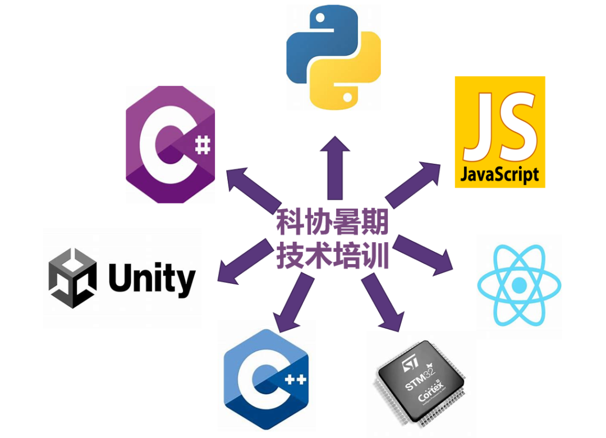

## 暑培形式

本次技术培训采取了灵活多样的在线形式，每次培训均在腾讯会议上以**直播**的方式进行，确保每一位干事都能够实时参与到学习过程中来。每节课设置为**两至三小时**的教学时长，这样的安排既能保证干事们维持高度的注意力与专注度，又能确保他们有充足的时间进行思考与消化。同时，每节课程都预留了充足的实践操作时间，让干事们能够在实践中深化理解、巩固所学。

此外，授课团队由**自动化系学生科协内部各部门部长以及科协外具有丰富经验的讲师**共同组成。他们不仅具备深厚的专业知识储备，还拥有丰富的实践经验与教学技巧。在授课过程中，讲师们结合自身经验与见解，带来了生动实用的教学内容，使抽象的概念变得易于理解。

## 暑培安排

培训活动分为两个阶段进行：

- **第一阶段为统一培训阶段**（8 月 8 日至 8 月 14 日），主要进行基础理论与核心技术的讲解与实践，包括编程的基本工具如 **git/github/mermaid 以及前端、后端、Python** 等基础知识；

- **第二阶段为分部门培训阶段**（8 月 20 日至 8 月 25 日），针对各部门的具体需求与特点进行深入的技能培训与项目合作。期间，学创部讲师分享了宝贵的**外联经验**，而软件部和硬件部讲师则详细介绍了**C++ 进阶、C# 语言、Unity 引擎、软件工程、嵌入式开发**等专业知识，极大地丰富了同学们的编程知识，提升了他们的技术能力。

为了方便大家巩固复习，我们还将回放、课件等学习材料上传到了**科协云盘**中，这不仅有助于个人的学习，也有利于科协的技术传承与发展。接下来，让我们一起进入精彩的作业成果环节，感受同学们的努力成果与创造力。

{/* ```mdx-code-block */} import Tabs from '@theme/Tabs'; import TabItem from '@theme/TabItem';

<Tabs>
  <TabItem value="1" label="暑培安排" default>
    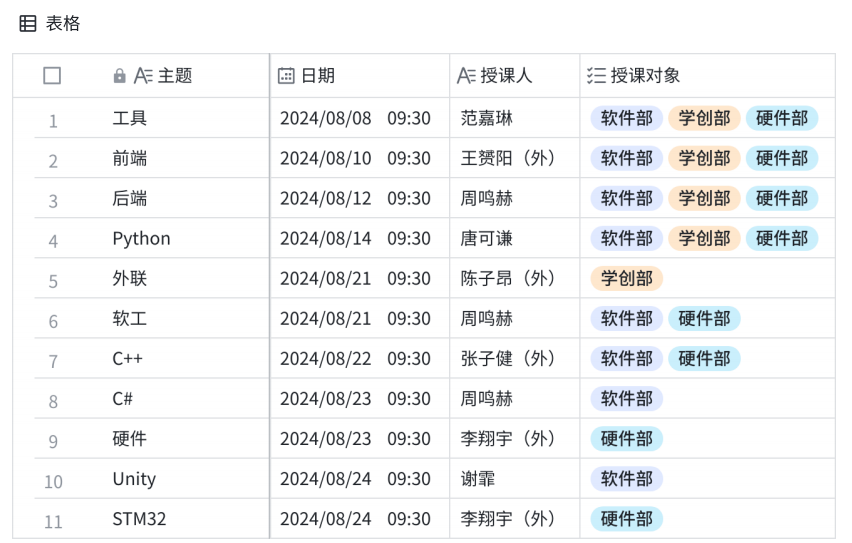
  </TabItem>
  <TabItem value="2" label="云盘暑培资料">
    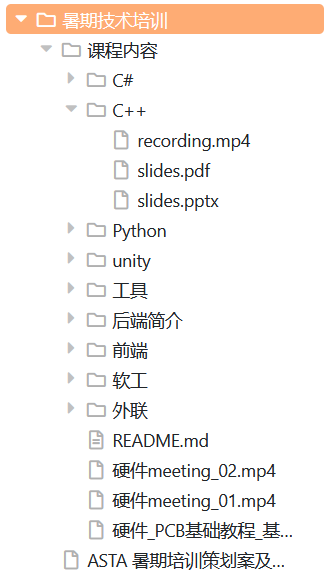
  </TabItem>
</Tabs>
{/* ``` */}

## 作业集锦

为了确保每一位同学都能从暑培中受益，负责此次课程的讲师们早在培训开始之初便明确了**各项作业的要求与提交方式**。作业内容不仅包括了理论知识的复习，还包括了一系列实践操作。这些任务旨在鼓励同学们将所学知识应用于实际问题解决中，从而更好地理解和掌握关键概念和技术，更好地完成科协未来的事务。

同学们在规定时间内完成了各自的作业，并通过**科协 github 组织**进行了提交。讲师们对每一份作业都进行了细致的批改，并给予了针对性的反馈意见。这样的互动不仅帮助同学们及时发现并纠正了错误，同时也极大地提升了他们的学习效果。作业截止日期为开学前的 9 月 9 日，科协的每一位成员都认真对待，**最终呈现了一份份优秀的作业成果**。下面，让我们来看看同学们的精彩作品。

<center>
   github
  上的[暑培作业提交仓库](https://github.com/thuasta/summer-training-2024)
</center>

### 前端开发作业

在**前端开发作业**中，同学们运用**HTML、CSS、JavaScript以及React**等前端语言和框架，构建了一系列独特的前端界面。这些作品不仅展示了同学们扎实的编程基础，同时也体现了他们在创意设计方面的能力。通过GitHub的静态页面托管服务，每位同学都成功地**展示了自己的个人网页**，它们风格各异，有趣实用，成为了个人技术实力的有力证明。

{/* ```mdx-code-block */}

<Tabs>
  <TabItem value="1" label="2 维弹弹球" default>
    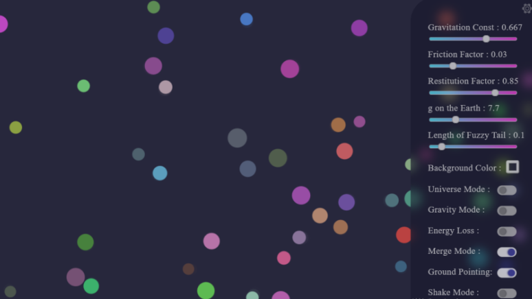
  </TabItem>
  <TabItem value="2" label="任务管理系统">
    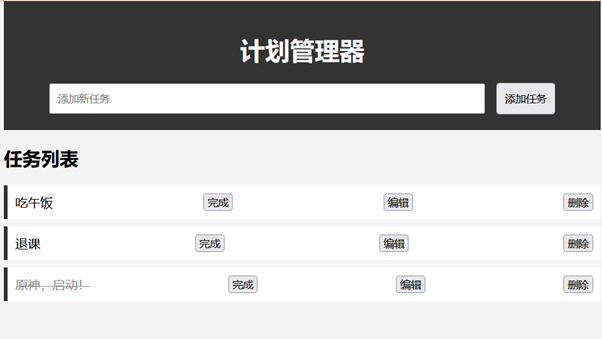
  </TabItem>
  <TabItem value="3" label="简易计算器">
    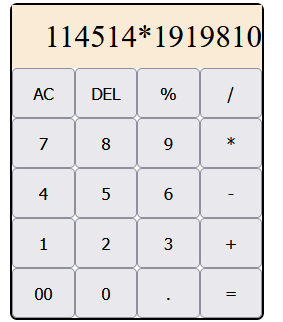
  </TabItem>
  <TabItem value="4" label="简易计时器">
    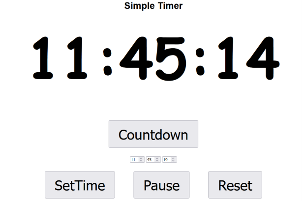
  </TabItem>
</Tabs>
{/* ``` */}

### 硬件部

硬件部的同学们在暑培期间的其中一项作业是**点亮 STM32 开发板上的 LED 灯**。这项任务虽然很基础，但对于每一位硬件工程师而言，都是至关重要的第一步。通过配置 CUBE IDE 环境，并编写简单的代码来实现 LED 灯每 500 毫秒切换一次亮灭状态，同学们不仅掌握了基本的硬件编程技巧，还体验到了硬件开发的魅力所在。

<center>
  [STM32，启动！](https://mpvideo.qpic.cn/0bc334aboaaaxqabqypqk5tfbx6dc7pqafya.f10002.mp4?dis_k=197587b8564cf1cb2625431b610e586c&dis_t=1742726830&play_scene=10120&auth_info=E7bIx5ECFnlOgcPzk19bekwBczNKA01wJTVbOE4QOlEhYmlAQWBgHzA+Zhs/ZENrTAR0K3soEjp8YwNjUBUkWQ==&auth_key=87b18bd9ea6323f92c6e7dae8a26d3ba&vid=wxv_3647640913762664449&format_id=10002&support_redirect=0&mmversion=false)
</center>

在此基础上，硬件部的同学们进行了更复杂的实践——使用串口实现了一个简单的数学计算程序。此后还学习了**嘉立创 EDA** 的基本操作，并根据手中的 STM32 开发板资料（包括原理图和规格尺寸），设计了一块基础的“扩展板”。在这个过程中，同学们展示了出色的创造力和动手能力，**成功绘制出了自己的 PCB 电路板**。

{/* ```mdx-code-block */}

<Tabs>
  <TabItem value="1" label="电路板外观 1">
    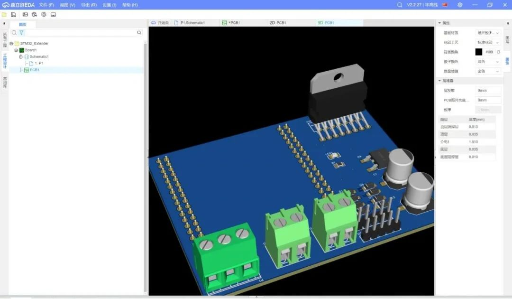
  </TabItem>
  <TabItem value="2" label="电路板外观 2">
    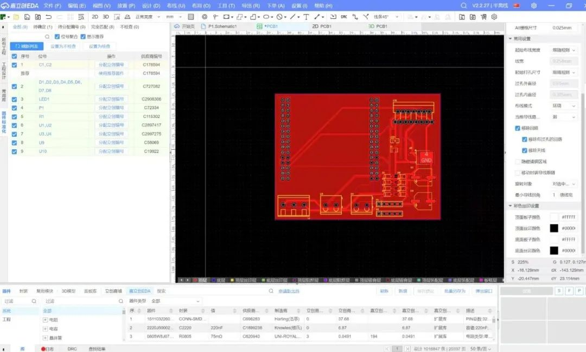
  </TabItem>
  <TabItem value="3" label="电路板排线">
    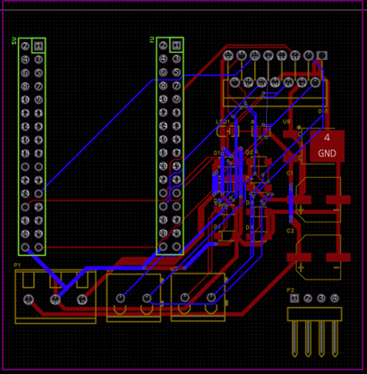
  </TabItem>
  <TabItem value="4" label="电路板设计">
    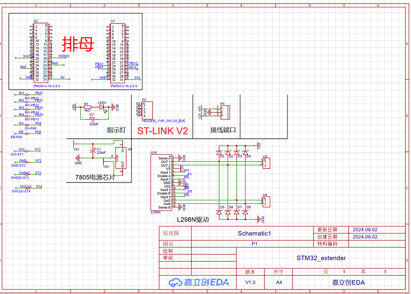
  </TabItem>
</Tabs>
{/* ``` */}

### 软件部

软件部的同学们则**在 Unity 中实现了一个“心海普攻”的项目**。他们首先研究了这一功能的具体表现形式，并找到了合适的素材来模拟普攻发射的弹幕。接着，编写脚本来实现按鼠标左键发射弹幕，并在飞行一段距离后消失。部分同学还额外增加了心海普攻的动画，提升了作品的表现力。以下是一段演示视频：

<center>
  [心海普攻](http://mpvideo.qpic.cn/0bc3tmabqaaayqaarhxqkztfbg6ddcnqagaa.f10002.mp4?dis_k=36c23f2feac15e2bdab97900b310018d&dis_t=1742730813&play_scene=10120&auth_info=b6y0xKkgVURJ7ZGg6AFLbm9tHR9oNkNgbzxIMTZNYUBdcmxNXEAjIjdSNEhEOlN/b2gaB1kdHCo2ahBqKEh/SA==&auth_key=9d57136ae1626991021be0917a70685d&vid=wxv_3647645141336260613&format_id=10002&support_redirect=0&mmversion=false)
</center>

## 暑培总结

通过本次暑培，同学们不仅在技术领域取得了显著进步，更重要的是**增强了团队合作意识与项目管理能力**，为他们未来的学习、科研和科创都奠定了坚实的基础。同时，同学们积极参与科协的各项活动，为科协的发展注入了新的活力。

感谢每一位参与暑培的同学，你们的努力与付出让这段经历变得无比珍贵。同样要感谢所有策划者、讲师以及幕后支持人员，正是有了你们的支持，本次暑培才能顺利进行。

未来，我们也希望能够将这些宝贵的技术知识通过各种形式传播给科协之外的同学们，比如**举办技术讲座、在线直播课程或者技术推送分享**等，让更多同学接触到技术开发理念与实践方法，从而帮助更多的同学提升技术开发能力。期待紫冬科协能够继续带领大家探索科研科创的无限可能！

---

<center>
  **欢迎关注紫冬科协哔哩哔哩官方号[【THUASTA】](https://space.bilibili.com/676450636)**
  **获取更多紫冬科创信息**
</center>

文案 | 清华大学自动化系学生科协  
排版 | 田荣琪  
审核 | 张琰然 刘书然 周义函
