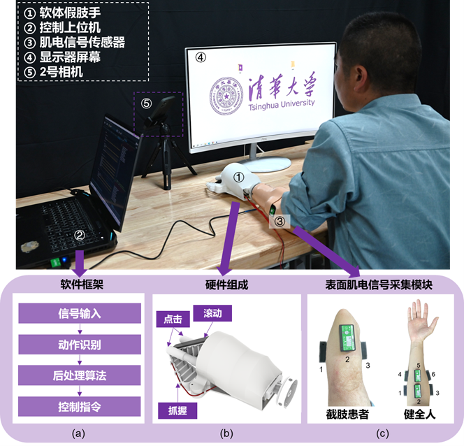
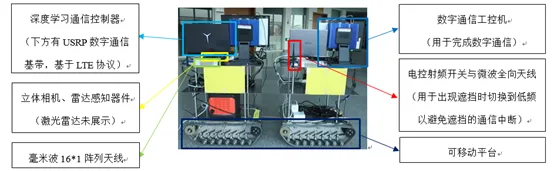
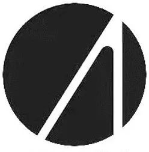

    <i>清华大学自动化系</i> 
    <strong>2024</strong>
    <h1>挑战杯 开始啦！</h1>
    <strong>第四十三届</strong>

## 挑战杯简介

清华大学 **“挑战杯”** 学生课外学术科技作品竞赛是由清华大学教务处、科研院、研究生院、校团委和校学生科协共同主办的全校性学生课外学术科技作品竞赛，是清华大学**规模最大、历史最长、水平最高、最具影响力的学生课外科技赛事**。

<!--truncate-->

## 报名信息

### 作品要求

1. 申报参赛的作品分为**自然科学类学术论文、哲学社会科学类社会调查报告和学术论文、科技发明制作**三大类型。科技发明制作类作品须有实物或模型参展。
2. **往届参赛作品**，如有重大改进和提高，**经院系严格评审并报组委会批准后**，可再次参加竞赛。
3. **学位论文、国际竞赛中获奖的作品、获国家级奖励成果**等均不在申报范围之列。
4. 原则上要求第一作者的工作量应该占整个项目工作量 **40% 以上**，其余作者每人工作量**不低于 10%**。作者总数不超过 **6 人**（团体作者除外），对于有共同第一作者的项目，原则上最多申报 **4 人**。如两人工作量相似，且均满足第一作者要求，可以以共同第一作者申报。

### 学科类型

信息技术、机械控制、环保建设与碳中和、能源化工、基础科学、人文社科。

### 申报途径

作品需明确一位申报人，申报人应为作品第一作者，或共同第一作者中的一人。

1. **院系申报**：  
   凡在竞赛举办学期初正式注册的全日制本科生、硕士研究生和博士研究生（均不含在职研究生）都可通过院系申报作品参赛。
2. **校科协申报**：  
   在学校有关部门正式注册的社团协会（包括科技兴趣团队）、学生组织、实践支队可以以团体的名义通过校学生科协申报参赛，**不占用院系推荐作品名额**。

## 赛程与评审

### 赛程节点

1. 报名即刻开始，预计于**第 13 周末截止**，在此之前，可持续进行作品申报。
2. 院系初审 预计于**第 15 周周四下午**举行。
3. 院系复审 预计于**春季学期第 1 周**进行。在院系复审确认推荐名单前，作品信息可以联系申报单位修改。院系复审确认推荐后，作品信息不能进行修改，申报单位也不可补报作品。
4. 校级终审 校科协统一组织，于**春季学期第 4 周**进行。

### 评审相关

1. 院系初审仅对作品立项和进度设计做考察，**不设置筛选淘汰机制**。
2. 院系复审为院系**筛选性审查**，审查后提交 **6 个推荐作品**。
3. 校级终审为材料网上评审与现场答辩，具体信息请关注后续通知。
4. 团体作品的初审与复审后续由**校学生科协**组织。
5. 院系复审完成后，各院系可推荐至多 1 项未通过复审选送且具有交叉学科性质的作品至校学生科协。校学生科协于春季学期第 3 教学周前对校科协作品与院系推荐的交叉学科作品组织复审，筛选不多于 10 个项目进入校级终审。

## 挑战杯 SRT 专项

1. 挑战杯 SRT 专项是 SRT 的一个子项目，随作品申报书（附件 1）申请，**无须在 Info 上申报**，活动的具体执行由学生科协负责，成绩评定依托于清华大学挑战杯竞赛。

2. 推荐以新项目申报挑战杯的作者选报挑战杯 SRT 专项。如同时参与多个项目，可以以多个项目申报挑战杯 SRT。但由于课程号限制，**最多只能获得 2 学分，且只能选择一个项目计入成绩**。

3. 院系复审中，对报名挑战杯 SRT 专项的项目给出三个等级：

   - **优秀**：项目阶段性成果优秀，由院系推荐进入“挑战杯”后续评审的项目。
   - **良好**：项目阶段性成果良好，但院系不推荐“挑战杯”后续评审的项目。
   - **不通过**：相关材料随院系复审材料一同上交。

4. 挑战杯 SRT 专项项目应在**春季学期第 14 周前完成结题**，相关材料后续另行通知。并对相应院系评定等级获得**不同项目支持额度**。

5. 每个挑战杯 SRT 专项**参与挑战杯终审并结题后**，均可以**申请学分**，该项目的所有成员均获得 2 学分，项目作者也可以选择不申请学分。挑战杯成绩和挑战杯 SRT 专项成绩的对应关系为：

| 奖项       | 挑战杯 SRT 专项成绩 |
| ---------- | ------------------- |
| 特等奖     | 4.0（A+）           |
| 一等奖     | 4.0（A）            |
| 二等奖     | 4.0（A-）           |
| 三等奖     | 3.6（B+）           |
| 未获等次奖 | 3.3（B）            |

## 往届优秀范例

### 面向鼠标操作的软体假肢

**团队成员**：王栋 贺一鸣 颜登烽 邵逸峰

本作品融合机械工程、计算机等学科，针对上肢截肢者无法操作计算机鼠标的问题，研制出一款基于表面肌肉电信号传感器的软体假肢手。基于绳驱手指和同步带实现掌内操作，通过软体夹爪设计实现稳定抓握；利用神经网络分类器将肌肉电信号映射为操作意图；采用后处理算法简化操作流程，提高操作效率和自然性。

本作品充分利用软材料的特点，在进行掌内操作和抓握过程中为软体机械手提供被动自由度；神经网络分类器直接将肌电信号映射为运动意图，决策窗后处理算法实现了单个手部动作到多个鼠标操作的映射。与现有技术相比，该假肢手充分利用截肢者残肢末端的运动能力，在模拟人手操作鼠标动作的自然性、控制的准确性以及用户操作的便捷性方面均有显著进步，提高了截肢者的计算机操作能力，具有重要的科学和应用价值。

### 基于惯性传感的多功能手势交互智能指环设备

**团队成员**：王子轩 尤敬严 赵子轩 王林之 何哲

本研究精心设计并运用了智能指环这一前沿交互设备，有效整合了其节能、高精度、成本效益和便携性等关键特性，从而成功实现了三项重要的人机交互基本功能。这些功能包括：通过手势识别技术进行命令输入，借助触控识别和光标控制实现目标选择，以及利用光标滑动与手势配合完成文本输入。

在功能完备性方面，当前市场上的智能指环，以 Oura 戒指为例，主要定位于健康监测领域。我们实现的同时能实现命令输入，目标选择，文本输入这三个人机交互基础任务的指环在市场上面还没有出现。

在功能效果方面：本研究对挥手、握拳等 17 个常用手势进行了识别，实现了低算力、低功耗条件下的手势识别，识别的准确率可达 93.11%，在业内达到了较高水准。

### 知识引导的结构化数据学习方法研究

**团队成员**：刘光奕

这个项目提出了新的知识引导的结构化数据学习方法，在图数据上设计子图网络，以挖掘显式知识，实现准确、可解释的推理；进一步地，通过图模型与大语言模型双向增强从而结合利用显隐知识，实现更加可信的输出。他们在推荐系统和问答系统两个场景中进行了实践，验证了方法性能。对于推荐系统，他们为知识增强型推荐提供了新的思路——子图学习推荐，显著改进了新物品的推荐效果，减轻了对于大量交互数据的依赖，实现了更加准确、高效、可解释的推荐，并产出了论文被国际顶级会议录用。对于问答系统，他们提出使用轻量级图模型辅助大语言模型，为增强大语言模型、提升可解释性提供了新的方案，实现了更加准确、可信、灵活的问答系统，同样产出了论文向国际顶级会议投稿。

### 基于雷视感知的毫米波动态通信平台

**团队成员**：张腾宇、孙杨、尹航、蒋玉骅、蒋沅

本作品搭建了一套视觉-雷达多模态感知辅助毫米波通信的硬件平台。采用立体深度相机、激光雷达等多种传感器，并结合卷积、GRU/LSTM 时序神经网络构造深度神经网络，使得毫米波通信系统能够提前主动感知环境，避免因毫米波直射径遮挡引起的通信中断，并实现实时毫米波波束跟踪、保证动态高可靠的毫米波无线通信。

## 挑战杯支持

在备赛期间，紫冬科协将全力为各位参赛选手提供各方面的支持。如果你没有合适的项目，我们将提供一些**实验室项目资源**供你选择。我们也将举办**挑战杯微沙龙**，邀请往届优秀获奖选手分享他们的参赛故事和获奖经验。资源信息以及报名相关文件将在挑战杯意向群发布，**群聊二维码将直接发布在各年级群，请有意愿参加挑战杯的同学及时入群！**

:::info

[**点击链接**](https://cloud.tsinghua.edu.cn/d/d2be075a505a48db9cd2/)获取报名文件以及报名链接。

:::

---

  
**THUASTA**  
**清华大学自动化系学生科协**

文案 | 石晓玥  
排版 | 李语轩  
审核 | 张琰然 周义函
