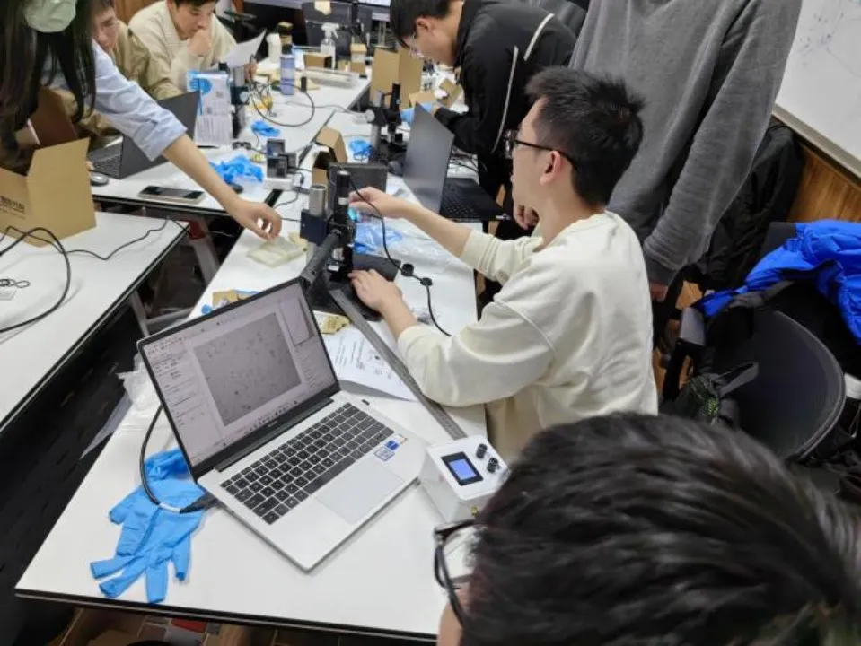
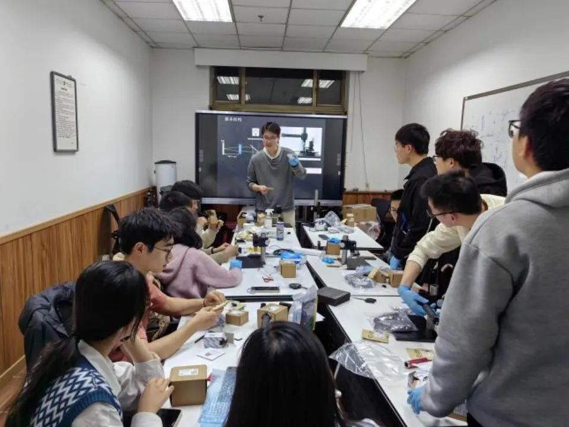
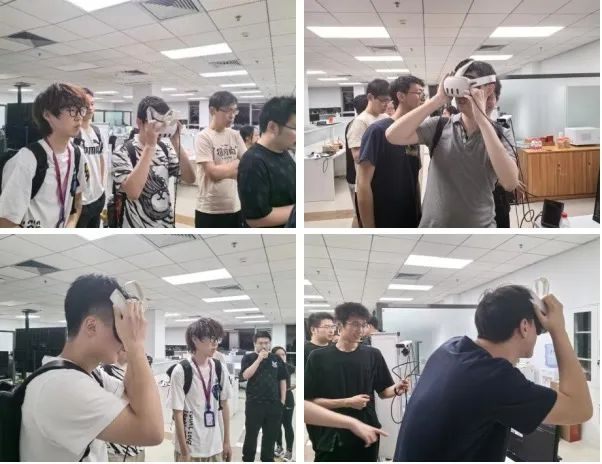
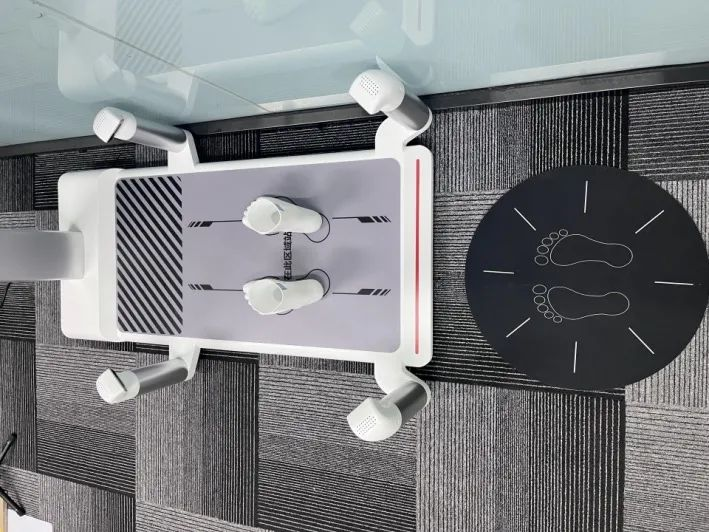
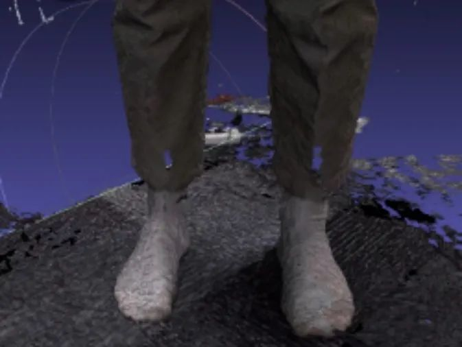

    <h2>◀交叉训练课程 选课指南来啦▶</h2>

### 交叉项目训练 - 智能计算成像

#### 开课教师：万森、戴琼海

#### 课程介绍

本课程依托自动化系成像与智能技术实验室在人工智能、计算成像、脑与认知科学领域的学科优势及前沿进展，通过教学及实验让学生完成整套光场智能成像系统（**即搭建一套计算成像显微镜**），将系统设计、建模仿真、光学调试、计算重构、智能分析等多学科有机结合，软硬件融合突破传统成像极限，解决一系列实际问题。

<!--truncate-->

教学内容包括计算成像基础、成像系统设计、系统仿真、构建计算光场成像系统和智能图像分析实验等环节。通过本课程的学习，学生将对计算成像的基本知识和应用有初步了解。培养学生从事交叉学科研究的兴趣与技能，并引导学生参加计算机视觉挑战赛、计算机视觉顶级会议等。

 

### 交叉项目训练 - 智能机器视觉

#### 开课教师：于涛、戴琼海

#### 课程介绍

本课程以课堂讲授结合专业实践的方式进行，讲授机器视觉领域相关的人工智能技术及其应用，并通过大作业形式进行系统科研训练。课程设计题目通过典型应用案例进行交叉训练，完成需求分析、成像系统选型与设计、以及中高层视觉应用算法的开发，并在实际系统上进行验证，实现智能视觉系统开发的科研训练。

课程主要特色培养学生对视觉系统的硬件与软件有统一的认知，指导智能成像系统的设计与实现。一方面讲授智能成像系统介绍相机的组成与可控对象、常用成像模型、成像系统的指标与设计、成像系统的发展趋势与最新进展；另一方面介绍智能视觉系统的主要任务、以及基于图像与视频的处理算法。

#### 往届实践设计内容

1. **沉浸式光场重建**：利用 3DGS 实现可用于 VR 的周围场景的重建。

2. **足部三维测量**：利用多深度相机系统实现足部特征维度测量。

 

### 交叉项目训练 - 数字生物学

#### 开课教师：于国强

#### 课程介绍

数字生物学是智能技术和生物医学技术进入新的发展时期后的自然融合，是数据、算力、算法和生物医学知识的整合与升华。本课程开设"晓我"课堂，计划采集自己的唾液，委托第三方公司进行人类基因组以及口腔内微生物测序（学生本人无需支付相关费用），从对自己基因组及微生物基因组数据的解读开始实践数字生物学分析技术。

本课程的教学内容主要包括数字生物学与智能健康概论，人类基因组数据分析，宏基因组建模，单细胞组学数据建模与算法，空间转录组学，生物医学影像信息学等，及其对应实验环节。对每个主题，教师将讲授主要概念，生物学知识，数学知识及分析技术，后面紧跟实验环节。

---

**
获取更多课程信息**  
**紫冬科协**  

文案 | 王择 张博仕 范嘉琳  
排版 | 田荣琪  
审核 | 张琰然 周义函
