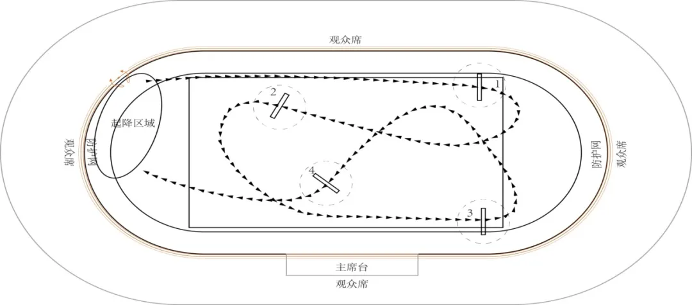
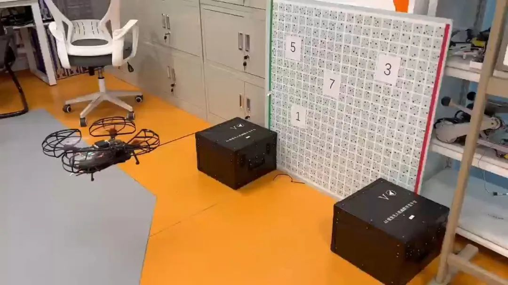
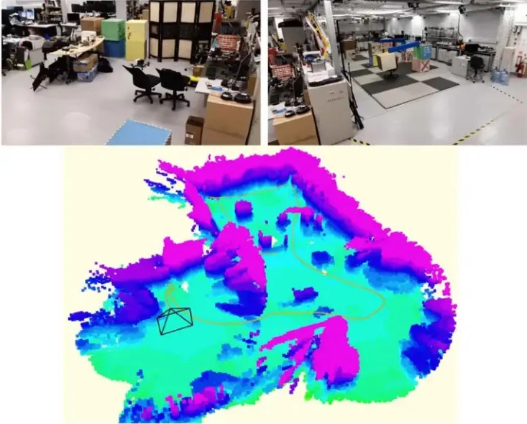
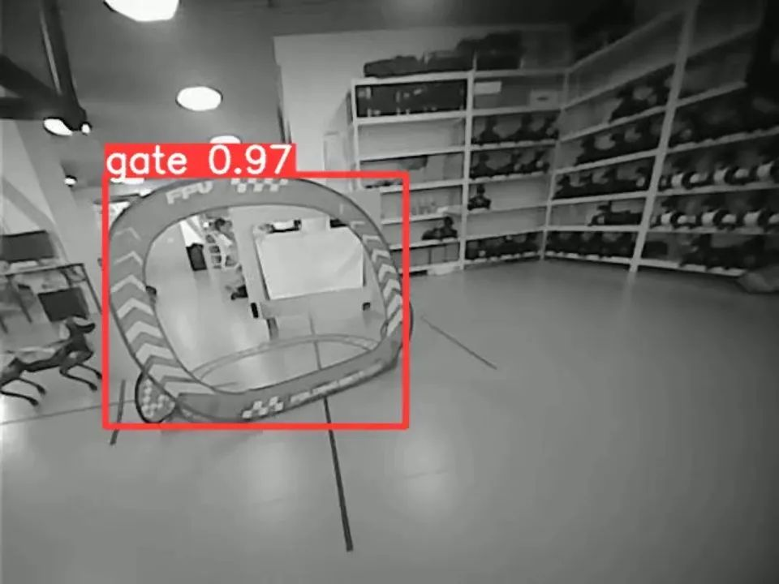
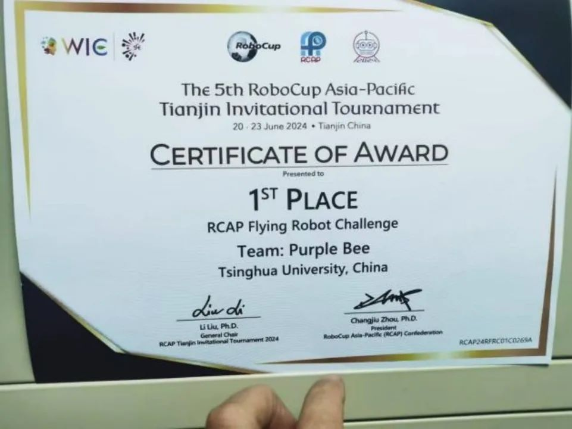
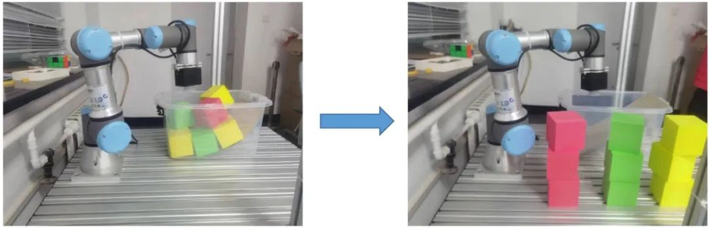

    <h2>◀交叉训练课程 选课指南来啦▶</h2>

### 交叉项目训练 - 智能无人机系统（2）

#### 开课教师：陆耿

#### 课程介绍

交叉课程综合训练 A（空中机器人）是一门旨在了解、学习、探索、制作以无人机控制为核心的智能空中机器人的综合训练课程。选课同学通过学习和训练，可了解包括无人机控制、无人机视觉、协同控制、传感器融合滤波、嵌入式系统开发、电路制作及调试等方面的基础及前沿知识。通过团队开发训练，最终完成一套可实现自主飞行、视觉避障、视觉导航、协同控制的以小型无人飞行器为核心的智能空中机器人，并有机会参加包括 IARC、IMAV 等国际国内顶尖赛事。

<!--truncate-->

#### 实践内容

在上学期的智能无人机系统（1）中，讲授了无人机从控制、传感、到滤波、视觉，从 SLAM到视觉跟踪等一系列知识。本学期的智能无人机系统（2），就为你提供了将这些技术用于实践的平台。

课程中，每 2~3 位同学组成一个小组，共有 2 项必做任务和 1 项选做任务。

- **第一项必做任务：视觉穿越竞速**  
  你将完成**视觉穿越竞速**，让无人机在有虚线引导的地面上方穿过 4 个障碍门，用时越短，得分越高。老师还鼓励使用智能学习算法对无人机进行轨迹控制。

  

- **第二项必做任务：无人机的视觉导航和空中操作**  
  你的目标将是让无人机用身上的触碰棍触摸墙上的数字。触碰的数字数值越大，从起飞到完成触碰操作的时间越短，得分越高。

  

- **选做任务：无人机自主编队搜索**  
  你将编写算法，用 2 台无人机，在实验室进行自主导航、避障和搜索，在室内的 4 个目标上方停留并拍下照片，总分数 = 搜索到的目标分数/完成时间。

  

往年有学长利用机载计算机和摄像头，就解决室内自主定位、地面引导线识别、门框识别、路径生成、位姿控制、自主避障等一系列问题，还根据无人机算力进行了基于 NPU 的模型训练，最终取得了极优异的成果。

本课程也大力鼓励同学们参加课外竞赛，总成绩由无人机飞行结果、答辩、报告和课外竞赛或选做任务的加分组成。今年 6 月 20 日至 23 日，由宋宸韬、杨朔、与朱俊 3 位同学组建的队伍在 2024 亚太机器人世界杯（RCAP）天津国际邀请赛中取得了一等奖。明天春季学期，老师更是鼓励同学们去参加第 10 届国际空中机器人比赛（IARC）。

### 交叉项目训练 - 机器人智能操作

#### 开课教师：李翔

#### 课程介绍

本课程包括三部分：

- **理论课** - 讲授机器人相关的理论知识；
- **课程项目** - 搭建机械臂操作系统，编程实现算法，控制机器人执行抓取任务，进行比赛来展示其性能；
- **专题讲座** - 介绍机器人领域最新最热门的进展。

课程将教学与最新科研进展结合，教学内容包括大量机器人领域旗舰期刊与会议的最佳论文与视频介绍（Science Robotics, IJRR, TRO, ICRA, IROS）；通过设计课程项目，强化学生对于理论知识的理解，鼓励学生去追踪热点，采用最新的技术与算法去解决问题，综合提高学生的理论深度、动手能力、解决问题的能力与发散思维。

#### 实践内容

1. **视觉感知实验**  
   基于 RGB 图像进行标识的自动识别和位姿估计；可采用基于深度学习的检测与识别算法，或传统图像处理方法检测识别 RGB 图像中的标识位置，并估计其相对于相机坐标系的位姿，提供给后续的物块抓取及放置等模块；在保证识别精度的同时，降低识别耗时提高帧速率。

2. **视觉伺服抓取**  
   机械臂末端到达导航的目标点，正对物块，检测模块返回特征在相机坐标系中的位姿；关节运动，根据机器人底座与特征之间的相对位姿，设计反馈控制器，输出机器人关节速度控制指令，使机器人末端到达物块前方的一个适当的位置；根据当前机械臂末端与特征之间的相对位姿，控制机械臂，将夹爪移动到物块正上方；闭合夹爪，机械臂复位，机器人后撤。

   

### 交叉项目训练 - 智能网联系统

#### 开课教师：莫一林

#### 课程介绍

智能网联系统导论是自动化系一门经典的限选课程，该课程从基础和底层出发，系统全面地介绍了“万物互联”的物联网，是一门集理论与实践的优质课程。

详情可见：[《课程介绍——智能网联系统导论》](https://mp.weixin.qq.com/s?__biz=MjM5MjYxMDA1Nw==&mid=2655556544&idx=1&sn=1587f1d7e146340e1052718ae5556669&scene=21#wechat_redirect)

---

**
获取更多课程信息**  
**紫冬科协**  

文案 | 王择 张博仕 范嘉琳  
排版 | 田荣琪  
审核 | 张琰然 周义函
