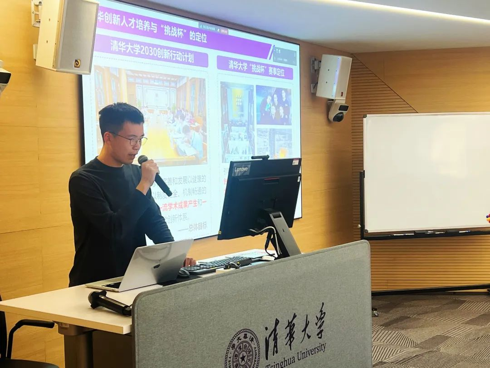
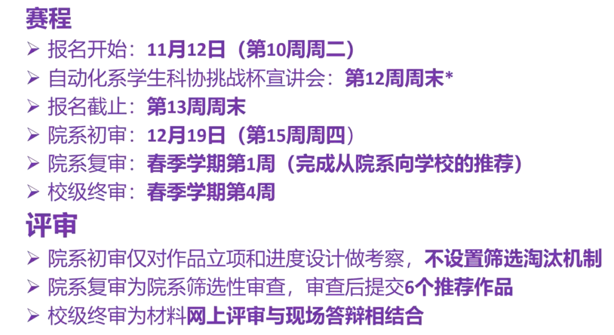
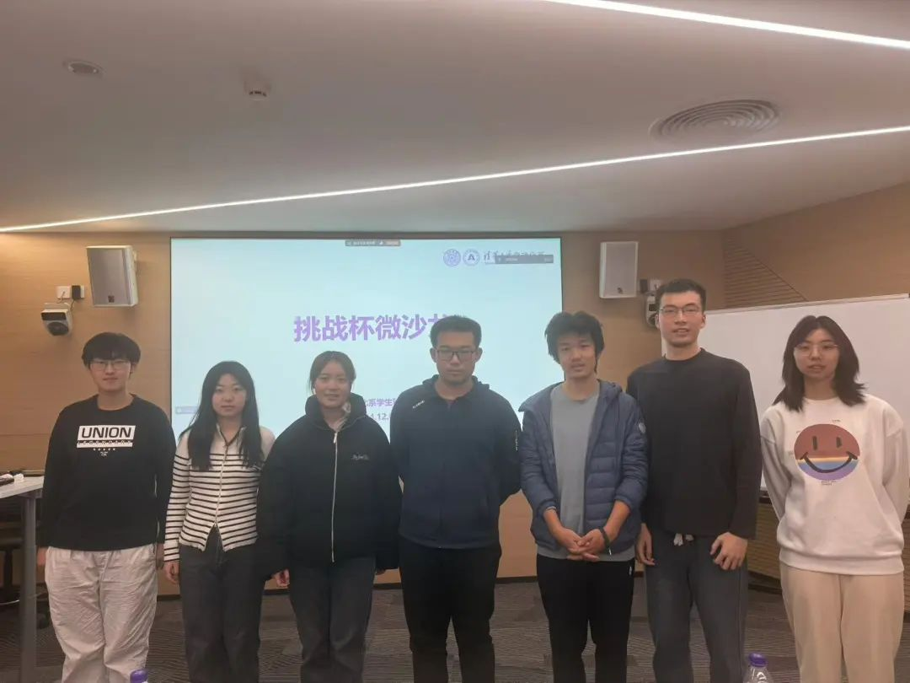
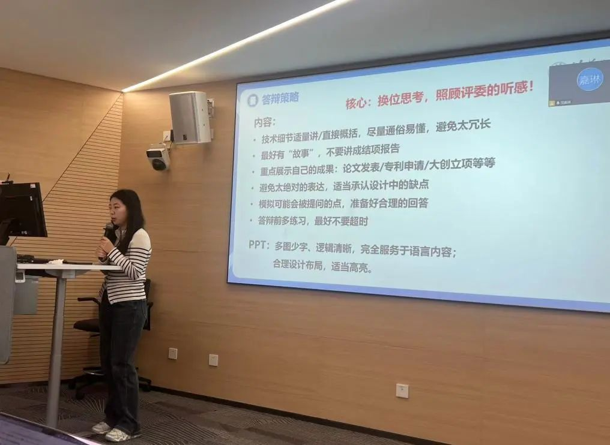
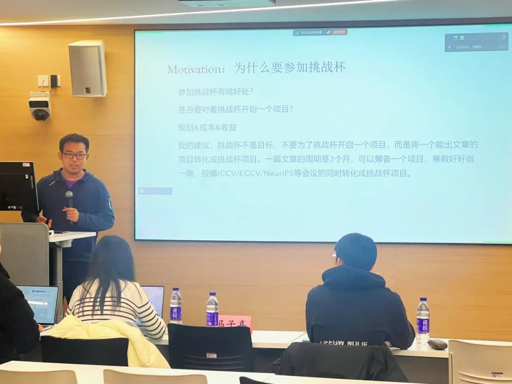
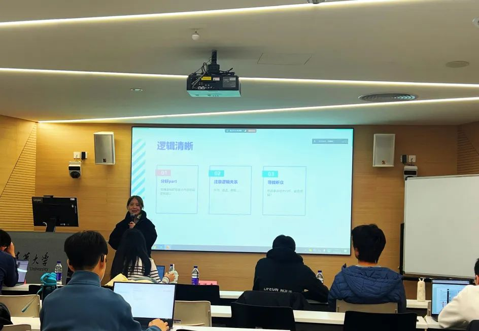
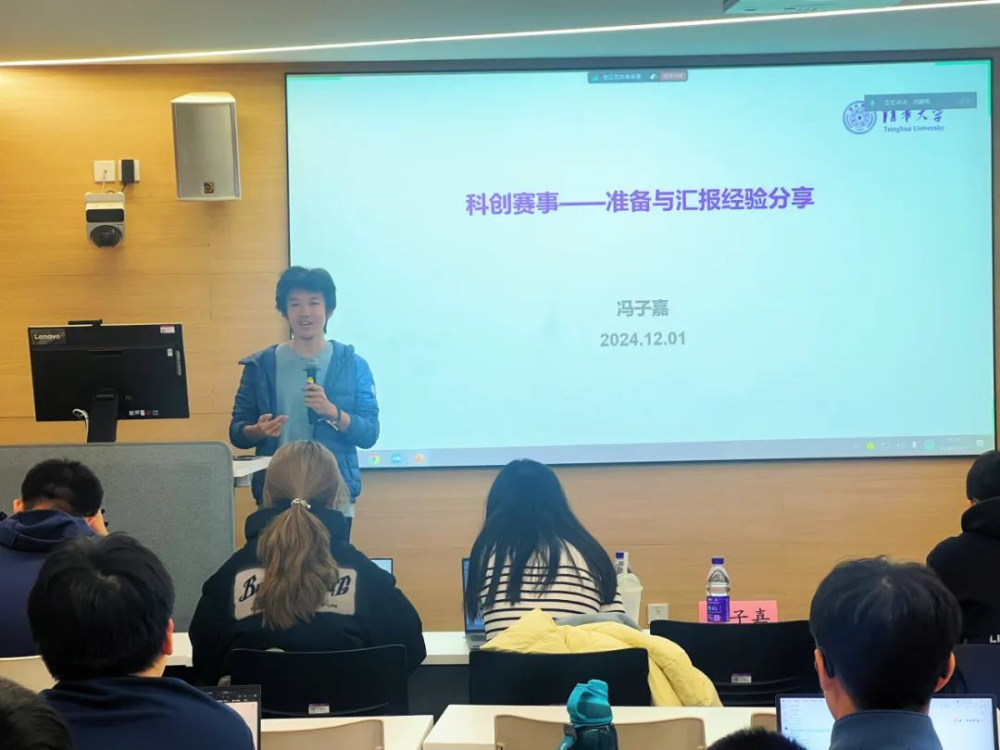
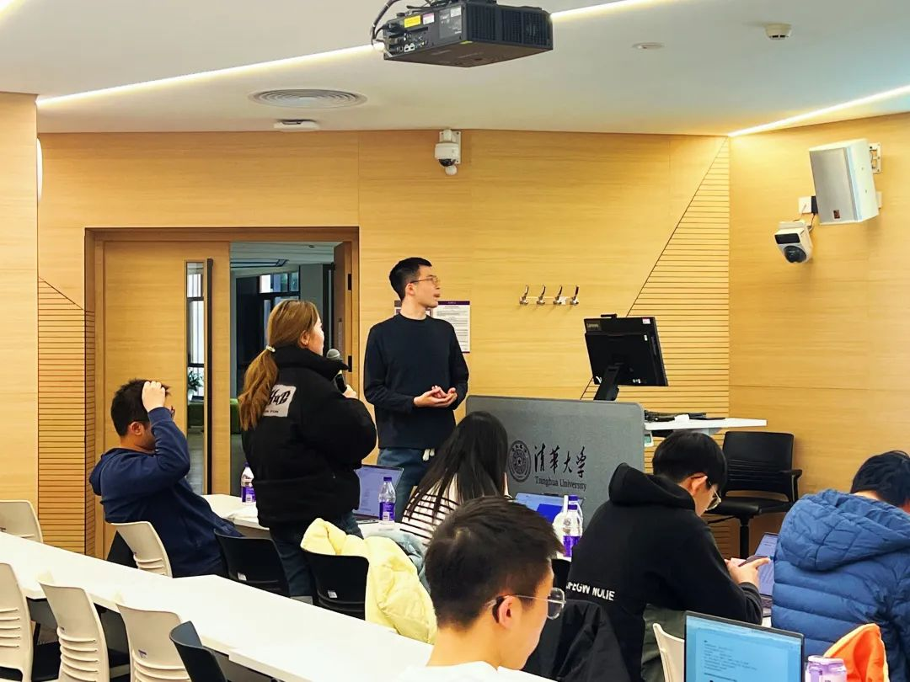
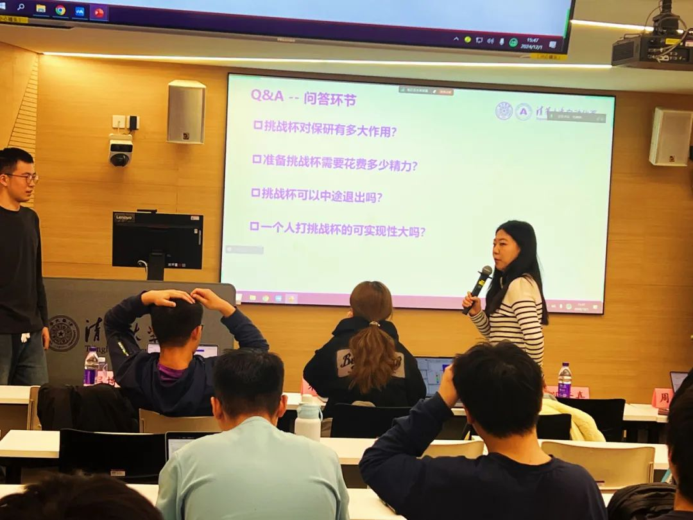
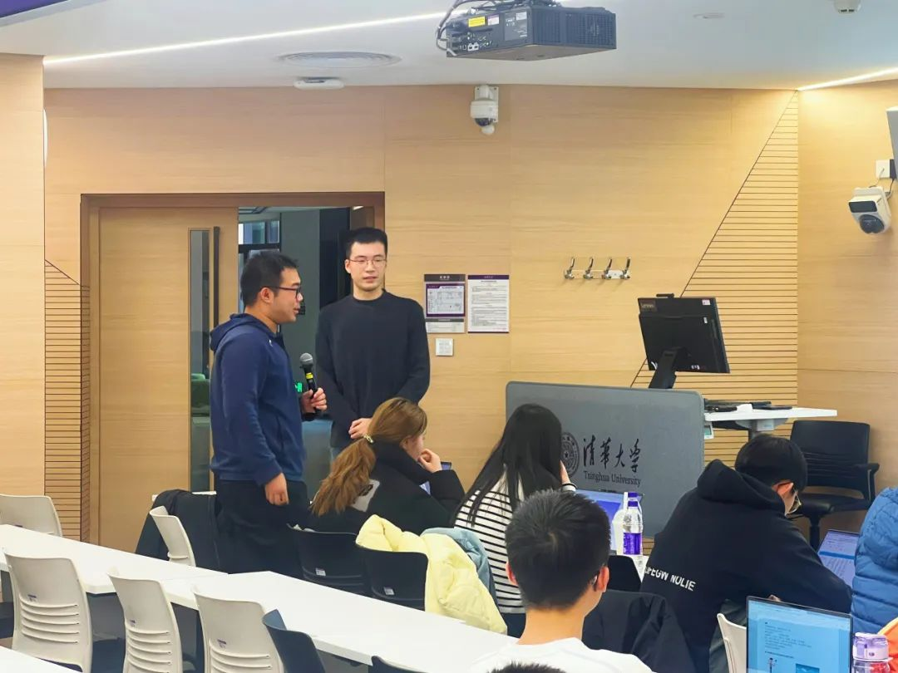

<center>
    <strong>自动化系 2025 年</strong>
    <h1>挑战杯微沙龙<br />总结推送</h1>
    <strong>2024.12.1</strong>
</center>
<center>

</center>

## 流程

12 月 1 日下午，自动化系 2025 年挑战杯微沙龙成功举办。本次微沙龙主要分为三个环节：

1. 介绍本届挑战杯的章程
2. 往届挑战杯获奖嘉宾经验分享
3. 问答环节 Q&A

{/* truncate */}

## 挑战杯简介

<center>

主持人张博仕介绍挑战杯章程
</center>

首先，主持人张博仕向同学们简要介绍了挑战杯的发展历史、定位以及申报挑战杯的流程。

挑战杯学生课外学术科技作品竞赛由清华大学教务处、科研院研究生院校团委和校学生科协共同主办，至今已成功举办 42 届。挑战杯旨在通过产生一流的学术成果和培养一流的人才，发现与培养在学术科技领域具有潜力的优秀人才。参赛要求以团队形式报名，团队人数不超过六人，第一作者的工作量需占总量的 40% 以上，其余成员不少于 10%。初审阶段不设淘汰环节，而复审阶段则需提交六个作品，最终成绩将根据提交的材料和现场答辩结果综合评定。



再次提醒大家，我系挑战杯<mark>**报名截止时间为本周周日（12月8日）**</mark>，请感兴趣的同学尽快将自己的想法落实，及时提交报名材料。

<center></center>

## 嘉宾分享

在这次微沙龙中，我们有幸邀请到四位曾积极参与挑战杯赛事并取得优秀成果的同学。他们分享了自己与挑战杯的故事，讲述了当年准备挑战杯的具体流程，以及制作 PPT、答辩和撰写项目介绍文件等方面的技巧。这些经验让同学们对准备挑战杯项目的过程有了更加清晰的认识，增强了他们的信心。

<center>

本次微沙龙负责人与各位嘉宾合影留念
</center>

### 王艺陶

王艺陶同学介绍了她的作品——基于手机排线的超薄天线设计。凭借这项作品，她获得了校挑战杯的一等奖，并在天线领域的顶级会议上发表了论文。她分享了在项目开发规划、文书材料优化和答辩策略三个方面的宝贵经验。

王同学强调，在提交材料之前，一定要**确保作品的完整性**，并准备好详细的研究计划。在准备提交的文书资料时，务必仔细审校各类文件，如作品申报书、评审材料（包括项目简介、项目文档和海报等），并认真制定答辩策略，换位思考，关注评委的听感。

此外，她还分享了一些答辩的技巧与注意事项，包括与室友或朋友讨论项目，突出自身的特色，强调成果，保持语言严谨，适当承认设计中的缺陷，进行多次练习。在 PPT 的制作上，**建议以图为主**，确保布局合理、逻辑清晰等。

<center>

王艺陶同学分享
</center>

### 吕博涵

吕博涵同学主要分享了他参加挑战杯比赛的经历和感悟。他提到，在报名参加计算机系的比赛时，由于复审未能通过，后来转而报名经管学院，最终成功参赛。由此可见院系**复审时项目质量**的重要性。

此外，吕同学建议同学们不要为参加挑战杯而单独启动一个项目，而应将已有的学术项目转化为挑战杯项目。最后，他分享了自己在比赛中获得的收获，包括申请到闯世界计划和星火计划等。他鼓励大家积极参与挑战杯，把自己的想法变成现实，同时积累更多的科研经验。

<center>

吕博涵同学分享
</center>

### 朱绍清

朱绍清同学主要分享了在挑战杯比赛中如何减轻成本负担的方法，例如寻求有相关经验的同学帮助。同时，她通过自身的经历，分享了如何在答辩中讲好故事，以提高分数。

朱同学还提供了一些答辩经验，包括逻辑、语言表达和临场表现等方面。首先，PPT要**结构清晰**，每个部分的内容要明确，并且逻辑关系要清楚。其次，语言表达要流畅，尽量**减少语气词**，以便让评委更好地理解。再次，要**表现出自信**，不要受到其他人表现的影响。最后，面对评委的提问时，要**保持礼貌**，尽可能流畅地回答问题。如果遇到不会的问题，也不要害怕，只需礼貌地回应就足够了。

<center>

朱绍清同学分享
</center>

### 冯子嘉

冯子嘉同学向大家分享了他在科创赛事中的准备思路和经验。在准备 PPT 和讲稿时，他强调需要注重研究的重要性，突出重点，并适当地展示工作量。在演讲中，要抓住评委的注意力，使用**通俗易懂**的语言解释研究内容，并突出研究成果。同时，需避免自娱自乐，确保演讲内容与评委的关注点相符。

此外，冯同学强调要准备**实物作品或视频展示**，以帮助评委更好地理解项目。同时，要突出解决方案的优势，并与以往的工作进行**对比**。在讨论部分，可以展望未来的前景和意义，以呼应前面的介绍。

最后，他推荐了一些科学汇报的 PPT 模板，但提醒大家在挑战杯等科创赛事中需考虑受众的需求，注意表达的观感和方式。

<center>

冯子嘉同学分享


</center>

## 问答环节 Q&A

{/* ```mdx-code-block  */}
import Tabs from '@theme/Tabs';
import TabItem from '@theme/TabItem';

<Tabs>
  <TabItem value="1" label="图片 1" default>
    
  </TabItem>
  <TabItem value="2" label="图片 2">
    
  </TabItem>
  <TabItem value="3" label="图片 3">
    
  </TabItem>
</Tabs>
{/* ``` */}

**Q：挑战杯对保研有多大作用**  
相信大家已经了解到自动化系今年推出的新政策：对于三字班的同学，挑战杯奖项可以计入推研成绩，等级越高，增加的 GPA 系数也越大。

虽然嘉宾们所在的院系可能没有类似的政策支持，但他们一致认为，参与挑战杯是一次非常宝贵的锻炼机会。这不仅能帮助大家深入了解如何完成一个项目，还能将想法付诸实践，丰富大家的科创经验。

**Q：准备挑战杯需要花费多大的精力**  
对于大部分同学来说，准备挑战杯主要是在复审、初审和答辩这些关键节点之前投入较多时间。完成一个项目需要付出相当大的精力，而这也与前期准备过程中科研投入的多少密切相关。如果前期的科研工作已经基本完成，那么后期主要集中在答辩材料的准备上，所需的时间投入就会相对较少。

**Q：挑战杯可以中途退出吗**  
项目复审之前都是可以退出的，其实复审之后的工作也不多了。当然能坚持下来是最好的，坚持下来的同学们收获也是最大的。

**Q：一个人可以打挑战杯吗**  
四位嘉宾表示，完成一个项目的过程中，大部分工作通常由一到两个人承担，其余参与者往往在一段时间后逐渐淡出，或者主要负责文书和宣传等工作。毕竟，挑战杯需要同学们投入大量精力，并且有充分的动机和兴趣去完成这个项目。因此，只要大家愿意投入一定的时间，一个人参加挑战杯是完全可行的。

<center></center>

## 总结

本次微沙龙为同学们提供了一个交流学习的平台，让大家对挑战杯的准备流程和技巧有了更清晰的认识。

虽然微沙龙已经圆满结束，但挑战杯的征程才刚刚开始。我们相信，通过这次活动，同学们将以更加饱满的热情投入到挑战杯的备战中，为实现自己的想法而努力拼搏。在此，我们预祝所有参赛团队在挑战杯中取得优异的成绩。

---

图文 & 排版丨谭雯心 李晨希  
审核 | 田荣琪 张琰然 周义函
