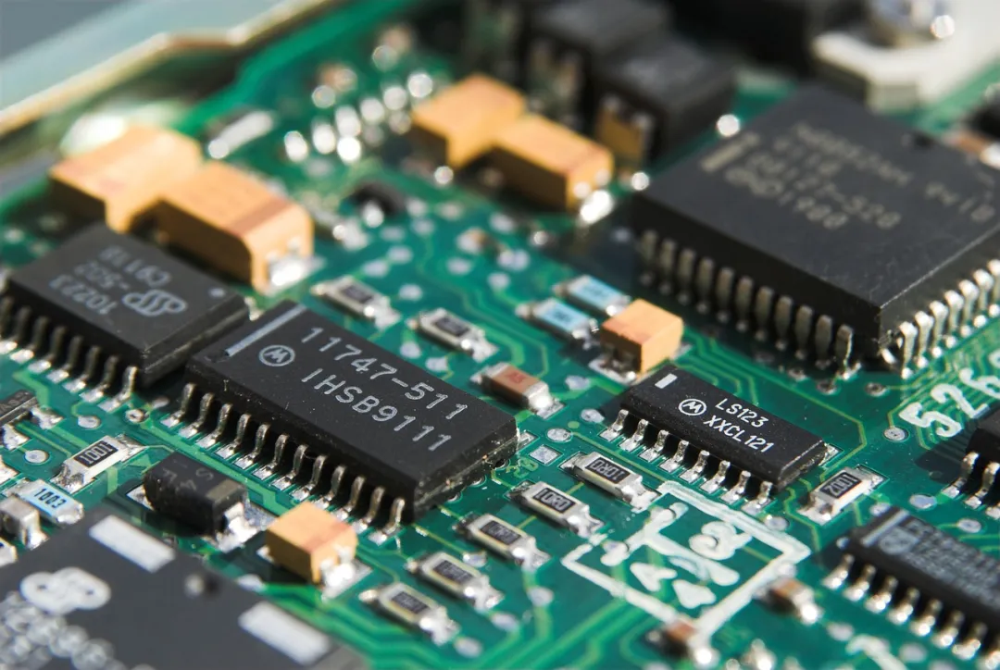
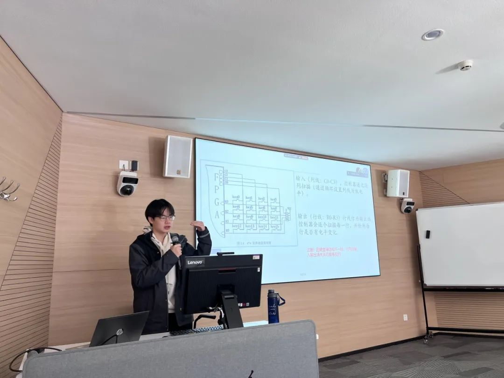
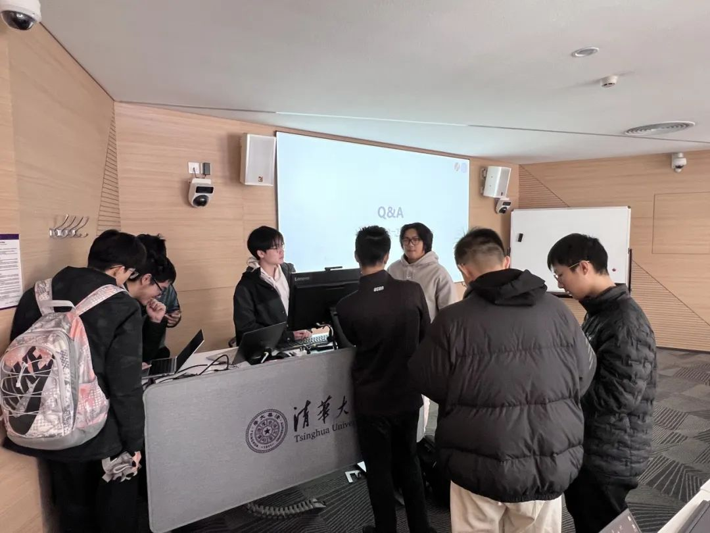

### 活动简介

FPGA 是可以通过编程来改变内部结构的芯片。通过 EDA 平台学习设计和实现电路的方法，并下载到 FPGA 板验证是数电实验课程的核心目标之一。本次讲座主要面向数电实验最后的 EDA3 大作业核心模块和蜂鸣器的设计和开发。

{/* truncate */}

### FPGA 微沙龙讲座（2）



#### 主讲内容

1. 大作业控制模块的设计与开发
2. 蜂鸣器模块设计思路
3. 相关编程和 debug 技巧

#### 活动详情

- **日期：12 月 15 日（星期日）**
- **时间：上午 10:30 ~ 11:30**
- **地点：三教 3104**

#### 往期活动回顾

{/* ```mdx-code-block */} import Tabs from '@theme/Tabs'; import TabItem from '@theme/TabItem';

<Tabs>
  <TabItem value="1" label="图片 1" default>
    
  </TabItem>
  <TabItem value="2" label="图片 2">
    
  </TabItem>
  <TabItem value="3" label="图片 3">
    
  </TabItem>
</Tabs>
{/* ``` */}

#### 欢迎参与

欢迎大家扫码入群！当天提供现场答疑，欢迎来现场交流~

<center></center>

---
