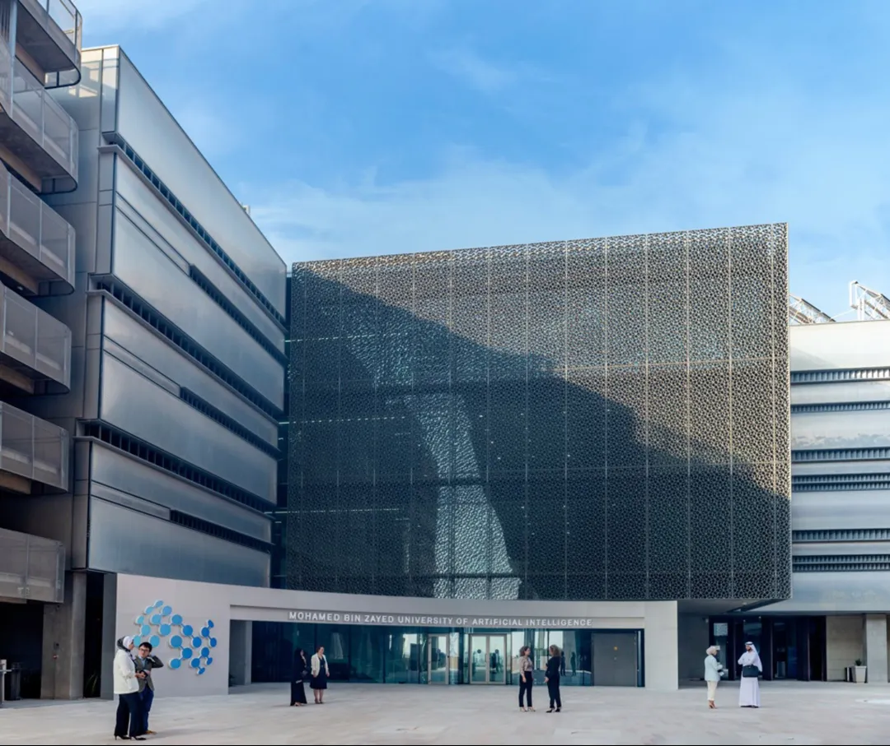
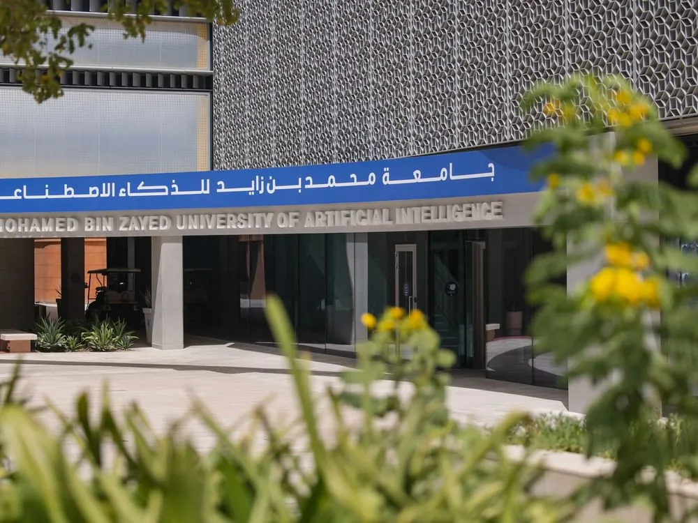

**
穆罕默德·本·扎耶德人工智能大学**  
**讲座预告**  
**2025.3.14**

## 学校简介

**穆罕默德·本·扎耶德人工智能大学**（Mohamed bin Zayed University of Artificial Intelligence，简称 MBZUAI）位于阿联酋首都阿布扎比，成立于 2019 年，是全球首所专注于人工智能领域研究的高等学府。该校以阿联酋阿布扎比王储穆罕默德·本·扎耶德·阿勒纳哈扬命名，旨在推动人工智能技术的创新与应用，培养全球顶尖 AI 人才。穆罕默德·本·扎耶德人工智能大学配备先进的教学设施，向本地学生和留学生提供**机器学习、计算机视觉、自然语言处理、机器人、计算机科学和统计与数据科学** 6 个专业的硕士（两年）和博士（四年）课程。

<!-- truncate -->

## 宣讲会信息

为帮助同学们深入了解 MBZUAI 的**学术环境与招生政策**，自动化系科协学创部邀请了 MBZUAI 招生负责人与 2025 级博士新生进行专场分享，具体安排如下：

- **时间：2025 年 3 月 14 日（本周五）10:00-11:30**  
- **地点：中央主楼 511**  

### 主讲嘉宾

- **黄静静**：MBZUAI 全球招生办公室负责人，清华大学校友。在宣讲会上将为同学们解读 MBZUAI 的**招生政策、全额奖学金政策、项目优势**等。

- **赵子远**：自动化系自 1 年级本科应届生，2025 级 MBZUAI 博士新生。他将为同学们分享 MBZUAI 的**申请经验与科研规划**。

### 活动内容

1. MBZUAI 学术体系与科研资源详解。  
2. 硕士/博士项目申请流程与录取标准详解。
3. 互动答疑环节。

### 报名方式

请有意参与的同学扫描下方二维码填写报名问卷，以便统计人数并预留座位。

---

文案 | 李晨希  
排版 | 谭雯心  
审核 | 张琰然 周义函
