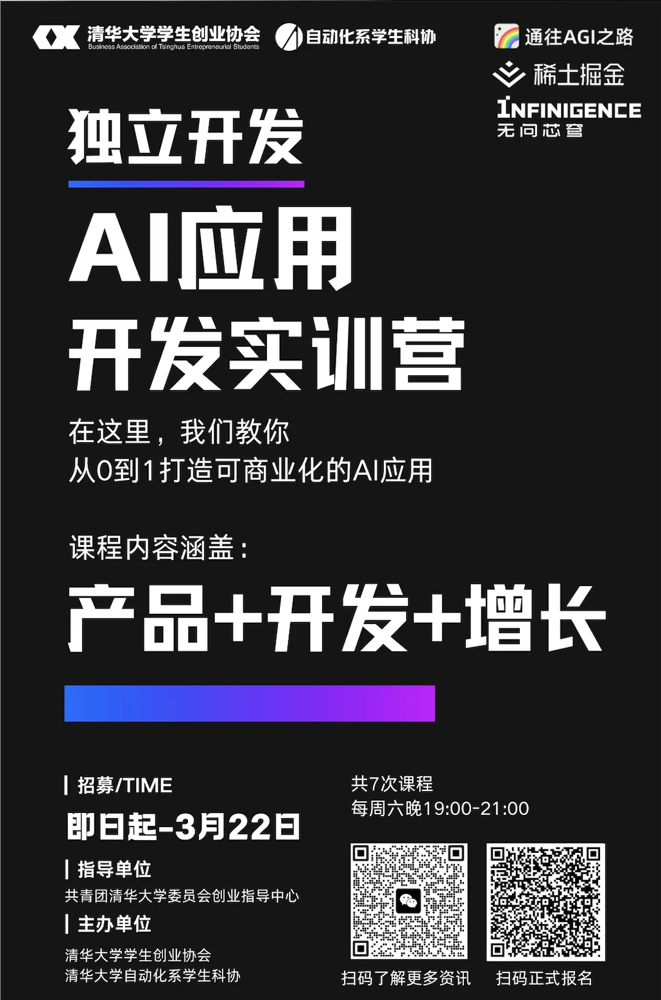
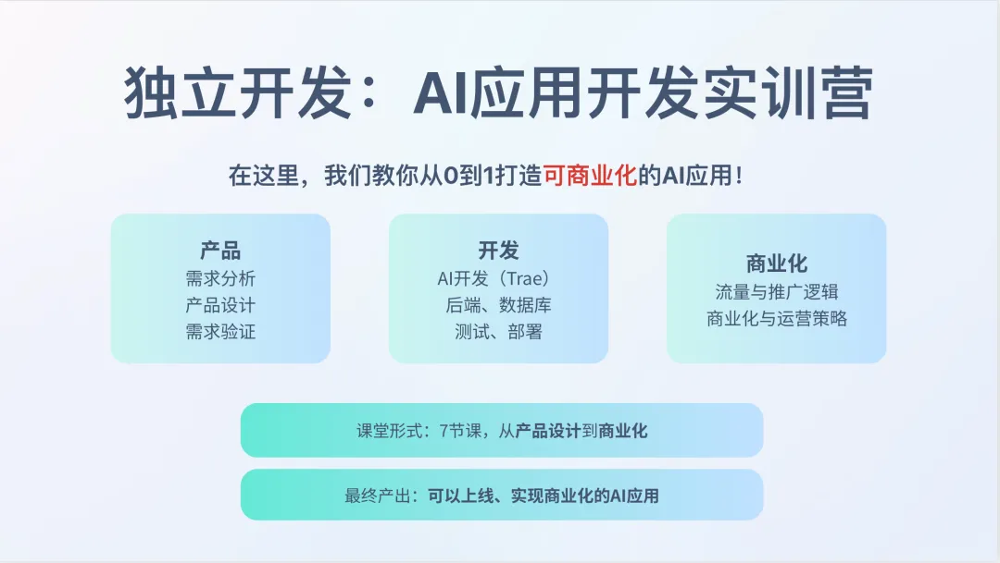
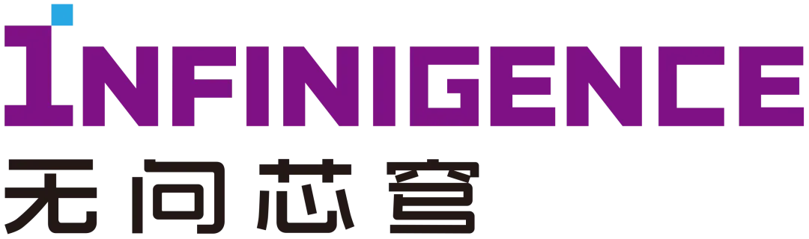

<center>
    <strong>独立开发</strong>
    <div><h2>AI 应用开发实训营</h2>活动招募</div>
</center>

{/* truncate */}

## 活动主题

<center><strong>以【独立开发模式】做【可商业化】的【AI应用】</strong></center>

清华大学学生创业协会联合自动化系学生科协、WaytoAGI 举办【独立开发｜AI 应用开发实训营】，邀请 **AI 领域资深开发者，业界产品经理**，为同学们提供系统化的指导与实战演练。**你将在本课程中从零到一打造具有【商业化潜力】的【AI应用】**。

在这里，你将学习<strong>【产品设计】+【应用开发】+【运营与增长】</strong>，并产出至少一个具备商业化潜力的 AI 应用。

## 课程亮点

### 实战为王，项目驱动

课程采用“理论认知 + 动手实践”双轨模式，**让你在真实项目中积累经验**。**从需求分析到产品设计，从开发到部署上线，再到最终的商业化运营，你将全程参与，主导开发属于自己的 AI 应用**。

### 专业导师，深度指导

我们邀请了**独立开发者、资深工程师、产品经理**，他们将凭借丰富的行业经验和深厚的专业知识，为你提供指导与建议。在课程中，你将与他们深度交流，汲取实战经验，少走弯路，加速成长。

### 资源支持，助你腾飞

为了让你的 AI 应用项目顺利落地，我们提供 **API、算力等资源**支持，降低你的开发成本，为你的实践之旅加油助力。

## 课程框架



## 课程嘉宾

```mdx-code-block
import ProfileCard from '@site/src/components/ProfileCard';

<ProfileCard
    avatarUrl={require('./img/3.webp').default}
    name="向阳乔木"
    description="前 TikTok 商业化产品经理。连续创业者，曾参与创办过两家互联网公司。"
  />
<ProfileCard
    avatarUrl={require('./img/4.webp').default}
    name="晨然"
    description="ONE2X AI 全栈工程师，AI 视频剪辑开发负责人。本科就读于复旦计算机系，研究生就读于康奈尔计算机，毕业后持续做 AI 全栈独立开发。"
  />
<ProfileCard
    avatarUrl={require('./img/5.webp').default}
    name="AI 产品黄叔"
    description="现任荣耀手机/360 集团产品顾问，协助落地 AI 手机和纳米 AI 搜索。"
  />
<ProfileCard
    avatarUrl={require('./img/6.webp').default}
    name="Kostja"
    description="曾在 Cutout.pro 和 PromeAI 两款 AI 产品中负责全渠道增长，如 SEO，内容营销，红人，EDM，社媒等。"
  />
```

<center>更多嘉宾确认中......</center>

## 活动信息

- **指导单位**  
    共青团清华大学委员会创业指导中心

- **主办单位**  
  - 清华大学学生创业协会
  - 清华大学自动化系学生科协
  - 通往 AGI 之路

- **课程地点**  
    清华大学校内 具体地点群内通知

- **课程时间**  
  - 2025 年 3 月 22 日至 5 月 3 日
  - **共计 7 次课程，每节课程 2 小时**
  - 课程主要安排在**周六 19:00 - 21:00**

- 课程对象  
    线下课程仅面向清华本硕博学生

## 报名方式

- **报名时间**：即日起至 3 月 21 日

- **课程报名方式（两种）**：

  - **旁听通道**
    - 可旁听课程，不提供 API 与算力资源
    - 不参与产品开发与产品最终展示

  - **正式报名**
    - **提供 API 与算力资源**
    - **提供课程辅导与答疑**
    - **产出至少一个可商业化的 AI 应用**
    - **优秀项目将获得曝光机会与精美礼品**
    - 将设置签到，签到影响最终结业展示评分
    - 课程将采用 Build In Public 模式，每周需同步应用开发进度
    - **（课程容量有限，将根据报名情况录取）**

<center>
请扫描下方二维码报名  
**对正式报名的同学**，后续工作人员  
**将通过微信通知录取结果**  

</center>

## 合作伙伴

<center>
**WaytoAGI**


**稀土掘金**


**无问芯穹**

</center>

<details>
<summary>清华大学学生创业协会</summary>

**协会简介**  
清华大学学生创业协会（简称“创协”）成立于 1997 年 1 月，是全国成立最早的高校学生创业协会之一。协会由共青团清华大学委员会创业中心指导，是清华创新创业教育生态的关键一环。28 年来，协会始终以“培养未来兴业之士”为宗旨，聚集创业爱好者，服务创业实践者，链接创业支持者。
</details>

---

编辑｜郑从杰  
审核｜张琰然 肖一翃
