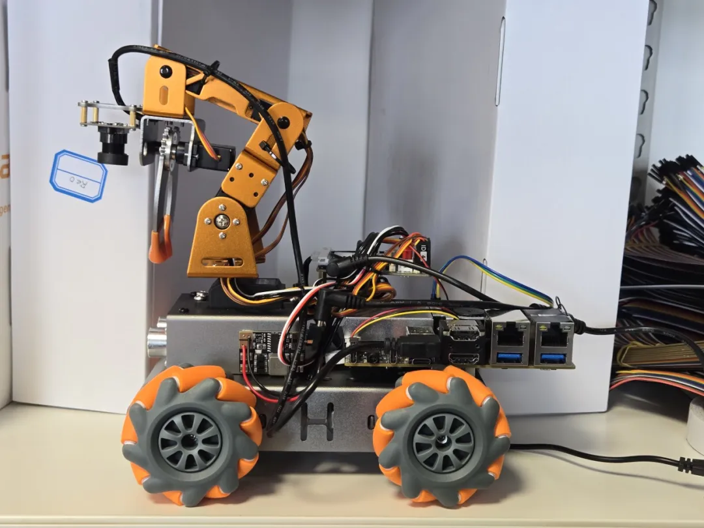

<h3>2025 COMPETITION</h3>

  
🎉 <strong>智能与创意的巅峰对决，即将上演！</strong>🎉

<!--truncate-->

## 决赛介绍

由**清华大学自动化系**和**清华大学基础工业训练中心**主办，**自动化系学生科协**承办的**具身智能挑战赛**，经过前期的报名、准备、培训，终于迎来了万众期待的**决赛**！各路高手已经整装待发，准备在决赛中一展身手！无论你是参赛选手，还是对智能硬件感兴趣的观众，这场科技盛宴都不容错过！本次比赛得到了**昇腾 AI 硬件**的大力赞助！感谢他们对智能硬件与自动化技术创新的支持，为参赛选手提供了更广阔的舞台，也为活动注入了更多科技力量！

📅 **决赛时间**  
4 月 3 日（周四）  
下午 14:00

📍 **决赛地点**  
中央主楼 520  
智能无人系统创客空间

## 决赛看点

- **科技感满满**

    智能小车在模拟家庭中完成清洁、运送、垃圾分类等任务，展现具身智能的魅力！

- **创意大比拼**

    从精准导航到机械臂表演，选手们的脑洞与技术将带来无限惊喜！

- **紧张又刺激**

    5 分钟的计时赛制，罚分与加分的博弈，谁能笑到最后？

- **学习与交流**

    无论你是参赛者还是观众，都能近距离感受自动化技术的应用与创新！

## 关于具身智能挑战赛

**具身智能挑战赛**是清华大学自动化系和清华大学基础工业训练中心创客空间联合打造的科技竞技舞台，旨在探索智能硬件在家庭场景中的应用潜力、点燃智能硬件在家庭场景中的创新火花。比赛以充满生活气息的模拟家庭为舞台，智能小车将穿梭于客厅、厨房、卧室之间，挑战自主感知与决策的极限，展现多任务协调的智慧。

从报名到决赛，每支队伍都经历了种种考验，只为在 5 分钟的赛场上绽放光芒。通过模拟家庭环境，可以综合考验智能小车的**自主感知与决策**、**多任务优化执行**以及**路径规划与避障能力**。同时，也在考验参赛者们硬件调试与算法优化能力！

速度与智慧的博弈，创意与技术的碰撞，这注定是一场激动人心的较量！在这里，参赛者不仅是在突破自己的极限，更是在探索具身智能的无限可能性！

<strong>想为喜欢的队伍加油助威？  
想一睹智能小车的风采？  
我们诚邀校内外所有对科技感兴趣的同学  
前来观赛！  
4 月 3 日，中央主楼 520，  
我们不见不散！</strong>

## 更多信息

- **比赛背景与规则**可回顾[报名推送](/blog/2025/02-27)；

- 后续其他细节会通过微信推送及时更新，请大家保持关注！

<strong>清华大学自动化系

清华大学基础工业训练中心  
自动化系学生科协  
昇腾 AI</strong>

---

文案 | 自动化系科协硬件部  
排版 | 朱培荣 刘烁  
审核 | 肖一翃 刘书然 周义函
