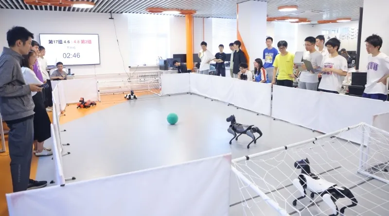
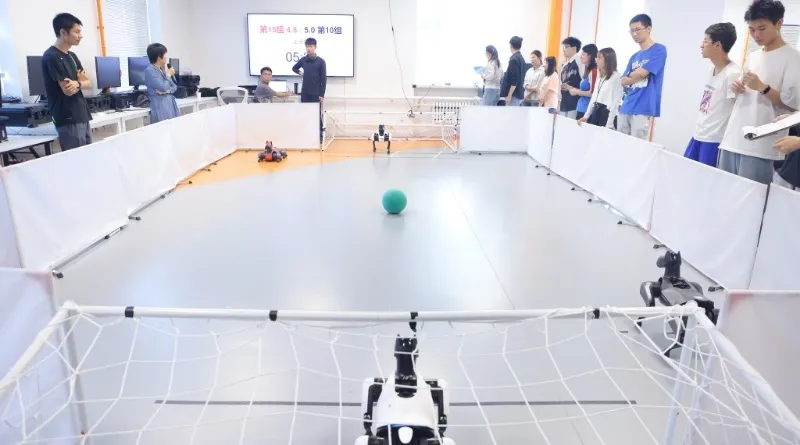
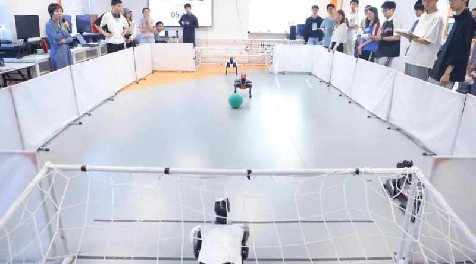
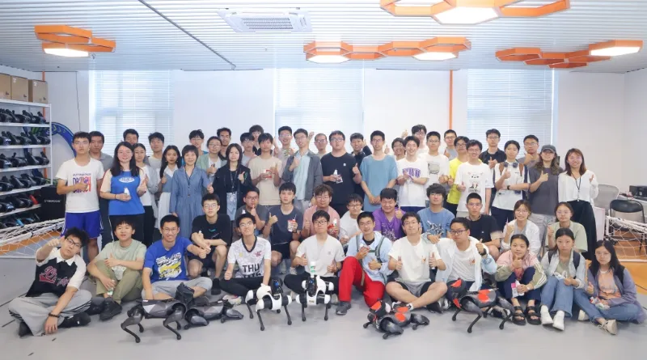

<center>


## 赛事预览

**时间**：4 月 22 日 - 5 月末  
**地点**：清华大学自动化系智能无人系统创客空间  
**组队**：3~5 人/队（可跨院系）  
**装备**：每队配备两只机器狗（前锋 + 后卫）  
**报名**：扫码填写文末问卷，限 24 队，先到先得


</center>

{/* truncate */}

## 绿茵场上的智能革命

哨声划破实验室的宁静，四道矫健的身影如离弦之箭冲向场地中央。前锋的 RGBD 摄像头快速扫描，在 0.1 秒内锁定足球位置；后卫则通过算法预判，在动捕系统的指引下迅速移动，稳稳卡住最佳防守位。这不是科幻电影，而是机器狗大赛的真实赛场——在这里，每一帧画面都是代码与算法的完美共舞。

{/* ```mdx-code-block  */}
import Tabs from '@theme/Tabs';
import TabItem from '@theme/TabItem';

<Tabs>
  <TabItem value="1" label="照片 1" default>
    
  </TabItem>
  <TabItem value="2" label="照片 2">
    
  </TabItem>
  <TabItem value="3" label="照片 3">
    
  </TabItem>
  <TabItem value="4" label="照片 4">
    
  </TabItem>
</Tabs>
{/* ``` */}

去年，我们见证了单枪匹马的英勇冲锋；今年，我们将欣赏真正的团队艺术。两只机器狗将像默契的搭档，通过无线通信实时协同：一个佯攻突破，一个伺机射门；一个前场逼抢，一个后场补位...这是智能机器狗足球赛的全新篇章！

:::info[这是一场什么样的比赛？]

清华大学机器狗开发大赛是由**自动化系实验教学中心**主办、由**自动化系学生科协**协办的高水平科技赛事，本届机器狗开发大赛以"踢球大战"为赛题，参赛队伍需要利用两只机器狗，完成场地内的足球传球、射门、拦截等动作。

:::

## 今年三大升级

1. **真正的团队竞技**  
   告别去年"单兵作战"模式，全新规则要求两只机器狗实现战术配合——交叉跑位、协防补位、攻防转换，代码写的不仅是算法，更是团队智慧！

2. **公平的规则判罚**  
   升级的比赛规则将监测冲撞、越位等行为，让技术较量更纯粹。

3. **全方位技术支持**  
   全新高精度动作捕捉定位系统上线！赛事方提供从入门到实战的全程指导：
   - Linux/ROS 系统搭建
   - 视觉识别与决策算法
   - 运动控制调试技巧

## 参赛即收获

- **硬核技能**：掌握机器人开发全流程技术栈
- **团队成长**：与队友熬夜 debug 的难忘经历
- **丰厚奖金**：参赛队伍有机会获得丰厚奖金

<center>
**特等奖**：5000 元/队  
**一等奖**：2500 元/队  
**二等奖**：1800 元/队  
**三等奖**：600元/队
</center>

## 赛程安排

### 报名时间

- **即日起至 4 月 22 日（第十周周二）**
  - 校内在读本科生**自由组队**（可跨院系组队），每队 **3~5 名同学**（含 1 名队长），每队提供两只机器狗。报名请队长先填写报名问卷（链接见文末二维码），然后加入选手群（群聊二维码在问卷中）。**限 24 队，先到先得**。

### 初赛培训时间

- **4 月 24 日（第十周周四）晚 7~9 点，清华大学自动化系智能无人系统创客空间（中央主楼 520）**
  - 注意：初赛培训涉及比赛基础知识培训和机器狗发放，需要每支队**半数以上成员到场**，不能到场的队伍请勿报名。

### 初赛时间

- **5 月 8 日（第十二周周四）**
  - 完成比赛所需的基础操作验收，包括 Linux/ROS 系统操作，视觉识别等基础 demo 实现等。
  - 完成初赛验收后，将进行第二次培训，届时将明确决赛规则和比赛细节。

### 决赛时间

- **5 月 31 日或 6 月 1 日（第十五周周末，具体时间待定）**

### 决赛地点

- **清华大学自动化系智能无人系统创客空间（中央主楼 520）**

### 报名人数

- **限 24 队，先到先得**

<center>
**立即扫码报名，  
用代码书写你的绿茵传奇！**  


<mark>在这里，<br />每一个算法优化<br />都可能创造赛场的奇迹</mark>
</center>

---

排版 | 田荣琪  
审核 | 张琰然 刘书然 周义函
