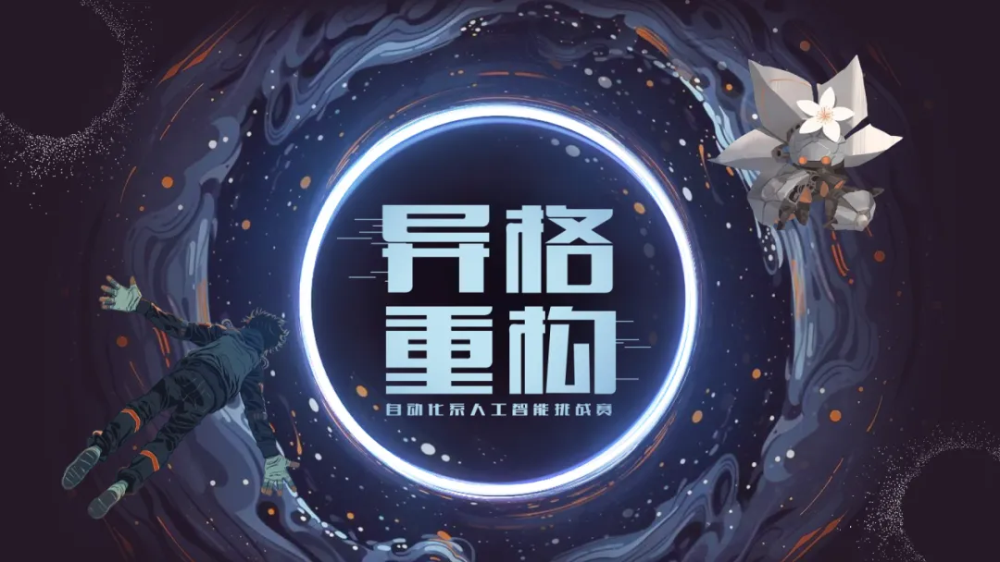

清华大学人工智能挑战赛自动化系赛道已成功举办多年，在校内形成了广泛的影响力和良好的口碑。每届比赛都吸引近百名学生积极参与，参赛选手不仅来自系内，更有众多跨院系的同学踊跃报名。至今，本赛事已然成为本科生深入理解程序设计原理、探索人工智能前沿、提升实践能力的重要平台。

**清华大学第八届人工智能挑战赛**（THUAI8）**自动化系赛道“异格重构”** 接收报名中。比赛中，选手需要使用 C++/Python 两种语言之一编程控制游戏角色，与另一名选手展开对战，决出胜负。

<!-- truncate -->

## 比赛流程

比赛共分为初赛与决赛两个阶段，依托 [saiblo 平台](https://www.saiblo.net/game/45)进行。选手可**组队**参赛，队伍人数**至多三人**。

**初赛阶段**：4 月 22 日至 **5 月 7 日**  
**决赛阶段**：5 月 8 日至 **5 月 23 日**

每个阶段最后一日 23 时 59 分前，选手需在 saiblo 平台对应比赛中提交代码，派遣参赛的 AI。比赛赛制为循环赛，最终以参赛 AI 的胜场数进行排名。

此外，saiblo 开放**天梯模式**，会以一定的规则和频率自动对派遣到天梯上的 AI 发起对局；阶段中还将不定时开放额外的**循环赛**。选手可通过将 AI 派遣至天梯及报名参加循环赛，检验自身 AI 策略的实效。天梯与循环赛的排名与最终**奖项评定无关**。选手还可利用**自定义对局**功能，手动向他人公开的 AI 发起对局进行测试。

初赛阶段中，只需提交**初步可执行的代码**即可**百分百晋级决赛**。初赛的排名仅供参考，与最终**奖项评定无关**。

## 奖项设定

本次比赛奖项唯一评定依据为**决赛排名**。设立奖项及对应奖金如下：

- **一等奖 1 队**，每队**4000 元**；
- **二等奖 2 队**，每队**2000 元**；
- **三等奖 3 队**，每队**1000 元**。

## 推送预告

- [故事揭晓（点击获取推送）](03-29)
- [规则展示（点击获取推送）](04-18)
- **赛程公布**
- 内测预览

最初的敌人，  
最终的敌人，  
难道都是自己？  
坚信自己的选择，  
击败过往的想象！  
扫描下方二维码，  
进入选手微信群，  
我们期待你的到来！  
  
<small>问卷二维码 / 群聊二维码</small>

---

文案 | 张德洵  
排版 | 张德洵  
审核 | 张琰然 肖一翃 周义函
