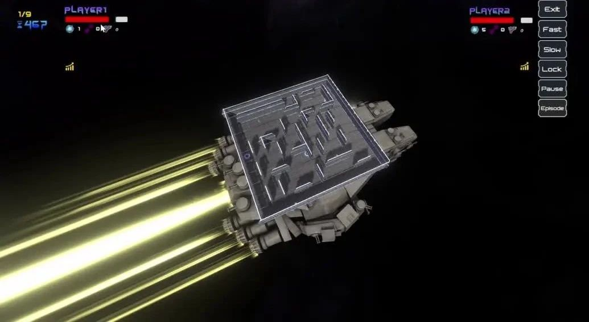
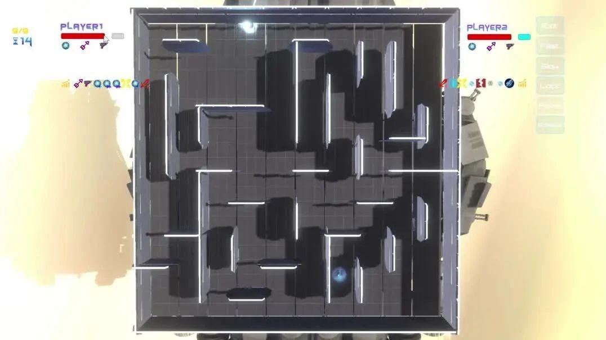
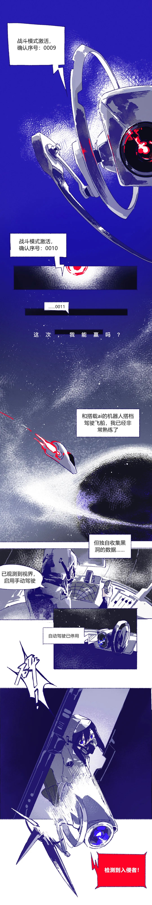
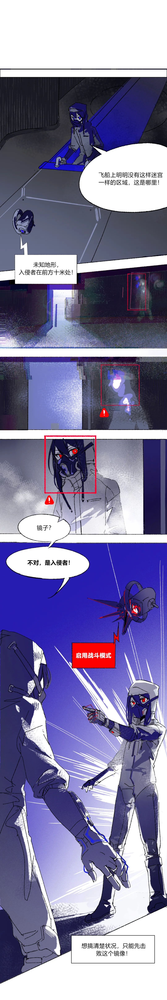
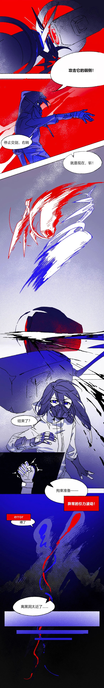
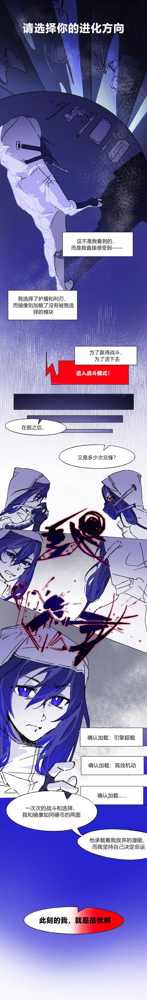

清华大学人工智能挑战赛自动化系赛道已成功举办多年，在校内形成了广泛的影响力和良好的口碑。每届比赛都吸引近百名学生积极参与，参赛选手不仅来自系内，更有众多跨院系的同学踊跃报名。至今，本赛事已然成为本科生深入理解程序设计原理、探索人工智能前沿、提升实践能力的重要平台。

**清华大学第八届人工智能挑战赛**（THUAI8）**自动化系赛道“异格重构”**仍在接收报名，报名**截至 5 月 7 日**（需在 5 月 7 日 23:59 前**在初赛中提交代码**，详见[赛程推送](../04-20/index.md)）。比赛中，选手需要使用 C++/Python 两种语言之一编程控制游戏角色，与另一名选手展开对战，决出胜负。

<!-- truncate -->

## 奖励更新

除奖金奖励外，参加比赛的同学，在 2025 年夏季学期的“**面向对象程序设计训练**”（课程号 20250201）课程中可以获得如下**分数奖励**：

- 一等奖：+5 分
- 二等奖：+3 分
- 三等奖：+2 分
- 优秀奖：+1 分

## 内测预览

### 太空漫游

漫游太空中，决胜迷宫里。平稳行驶的飞船上，激烈的厮杀正在开展。

### 生死博弈

激光是改变攻击逻辑的强大武器，但强大中也暗藏着风险。单次发射，全路径触发；完美索敌，却自顾不暇。

是以身入局的孤注一掷，还是精打细算的绝对掌控？胜负之数，正在这毫厘之间。

## 漫画异格

   

## 推送概览

- [故事揭晓（点击获取推送）](03-29)
- [规则展示（点击获取推送）](04-18)
- [赛程公布（点击获取推送）](04-20)
- **内测预览**

最初的敌人，  
最终的敌人，  
难道都是自己？  
坚信自己的选择，  
击败过往的想象！  
扫描下方二维码，  
进入选手微信群，  
我们期待你的到来！  
  
<small>问卷二维码 / 群聊二维码</small>

---

文案 | 张德洵  
排版 | 张德洵  
海报 | 布谷  
审核 | 张琰然 肖一翃 周义函
