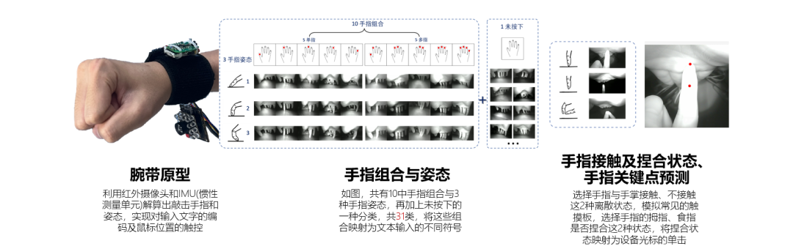
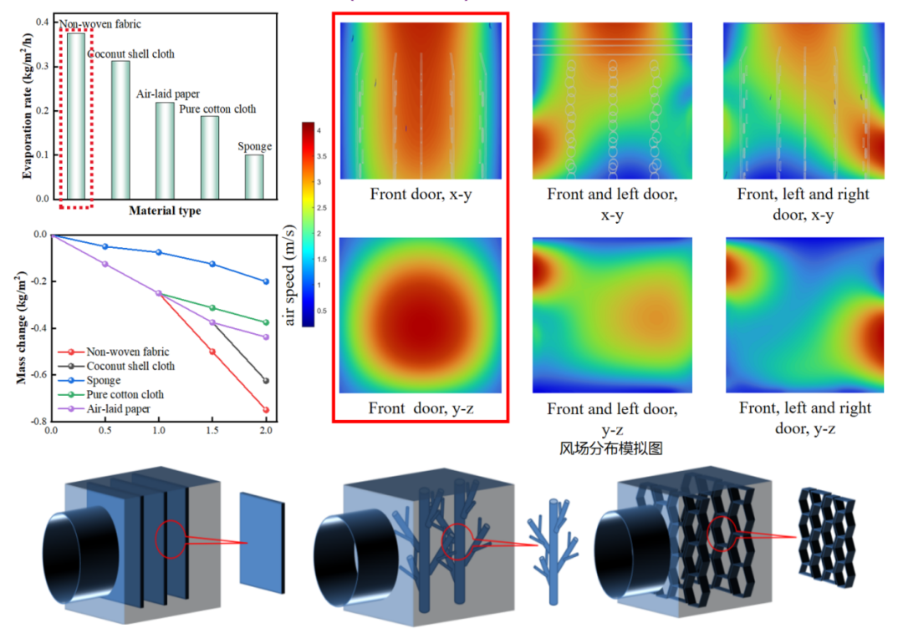
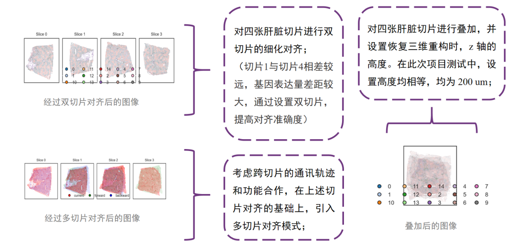
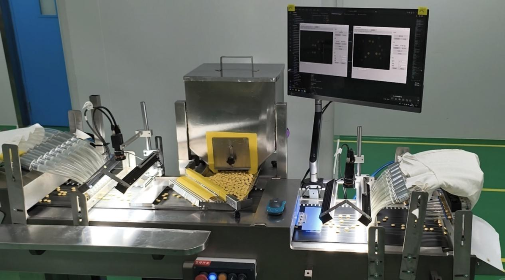
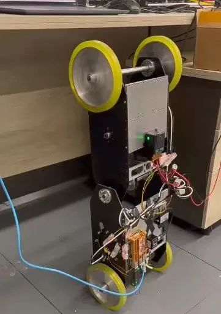
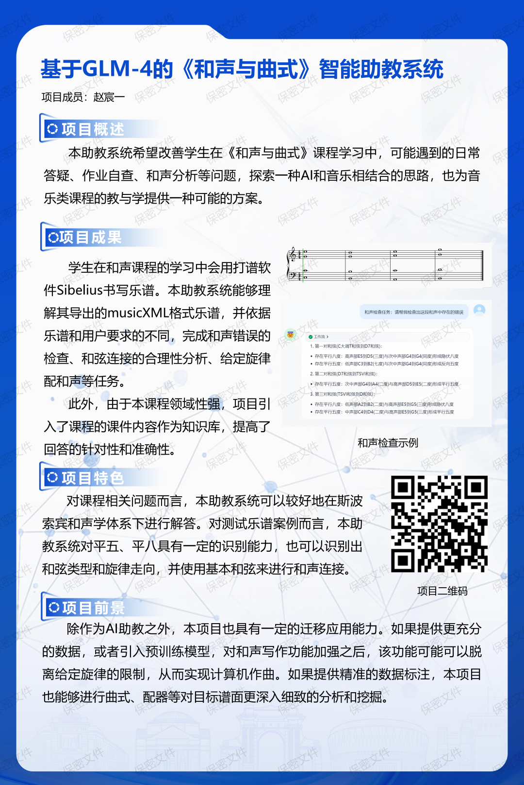
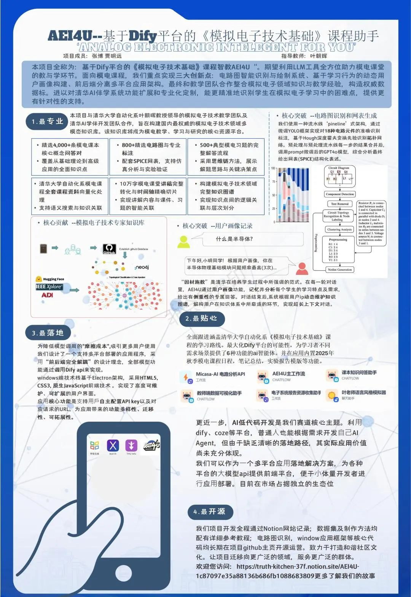

<h3>挑战杯</h3><h1>喜报</h1>

在清华大学第 43 届“挑战杯”赛事中，自动化系团队秉持创新初心，以奋勇拼搏的姿态投身角逐，最终在校级终审舞台上斩获佳绩。共获得

<h3><mark>
一等奖 1 项 
二等奖 1 项 
三等奖 3 项
</mark></h3>

（以第一作者/共同第一作者计）

其中，经自动化系推荐的 3 个项目获
<h3><mark>
一等奖 1 项 
三等奖 2 项
</mark></h3>

经秀钟书院推荐的 1 个项目获
<h3><mark>二等奖 1 项</mark></h3>

经校科协推荐的 1 个项目获
<h3><mark>三等奖 1 项</mark></h3>

<!-- truncate -->

## 作品展示

### 一等奖——腕带式 XR 智能文本输入和触摸交互系统

赛道：信息技术  
第一作者：孙润泽，高铭泽  
指导教师：冯建江

本项目实现了一种**腕部可穿戴智能细粒度敲击手势识别与指尖坐标预测系统**，基于摄像头与 IMU，通过三姿势与手指组合实现单手全键盘映射，可在任意平面上实现无需注视的全文本输入，最多可识别 93 种细粒度手势；基于单红外摄像头实现手指接触识别及关键点预测系统，通过手指与手掌的接触状态判别与手指坐标预测实现触摸交互——包括智能设备的光标相对移动与单击。

### 二等奖——基于风驱三维蒸发技术的工业废水零排放与资源化利用系统

赛道：环保建设与碳中和  
第一作者：王玥潼 李想  
指导教师：陈熹

本项目基于**风驱三维界面蒸发技术提出一种风场耦合三维蒸发器**。利用空气动力学理论论证研究可行性，采用 Ansys 仿真模拟程序探究内部流场分布，设计多种小试装置进行实验选优。本项目利用仿真模拟程序与实验相结合的方法，明确了流场-结构-性能的关联机制，构建效率-能耗核算模型，开发出一种高效低耗、高稳定性的自适应蒸发器，突破当前热点技术蒸发率极限，解决投产能耗问题，推动分布式清洁水生产技术的实际应用与优化。

### 三等奖——基于空间转录组学的肝脏器官三维重构

赛道：基础科学  
第一作者：乔英姿  
指导教师：古槿

现有提取空间转录组学数据的技术大多存在成本高，效率低等问题。而基于空间转录组学数据的三维重构框架存在对齐误差积累、部分数据损失、空间自相关性高等障碍。本项目**创新性发展三维重构算法体系**，通过引入深度学习网络优化标签标注、优化对齐算法、多模态数据相互补充融合等方式，借由绘图平台进行渲染，补充发展组织器官三维重构思路。在人体肝脏器官数据集中的测试应用则补全该领域研究缺失，并尝试探索肝脏相关疾病的致病机理。另一方面，预期通过与同功能算法在数据集中的基准测试，提高模型效能，验证其可迁移性。

### 三等奖——片剂表面缺陷智能检测与剔除系统

赛道：信息技术  
第一作者：杨博尧 李孟涵  
指导教师：彭黎辉

制药业长期依赖的人工目检等传统片剂表面缺陷检测方法，存在准确率低（<90%）等问题。本研究提出**基于深度学习的检测与剔废系统**：算法上，对 VGG16 引入热力图注意力训练法，用缺陷掩膜图像引导特征聚焦，模型准确率从 93.55% 提升至 97.36%，优于 YOLO11（97.24%）；硬件上，自主研发低成本、高精度多路气动剔废装置；图像预处理来用 R/G 双通道阈值与形态学操作后进行轮廓检测提取单个药片图像，解决了药片相邻时易被误识别为同一个药片的问题，增强鲁棒性。

### 三等奖——可变构型的四轮机器人系统

赛道：信息技术  
第一作者：郑奕，曾文轩  
指导教师：陈章

移动机器人在生产生活中应用愈发广泛，考虑到足式机器人和轮式机器人各自在续航能力和通过能力的不足，本项目提出了**一种可变构型的四轮机器人系统**，通过引入腰部关节赋予机器人自主跳跃的能力，提高了不连续地形的通过能力；同时提出了基于深度强化学习的运动模式转换与主动跳跃控制算法，旨在将不同构型移动机器人的特点相结合，尝试对机器人在物流运输、环境探测等复杂工作场景下的表现进行改进。

## AI 助教赛道

在本次挑战杯新开设的 AI 助教赛道，自动化系有两支队伍参赛，中期考核全部成功通过，并将在学期后期展开评奖。

### 基于 GLM-4 的《和声与曲式》智能助教系统

项目成员：赵宸一

本助教系统希望改善学生在《和声与曲式》课程学习中，可能遇到的日常答疑、作业自查、和声分析等问题，**探索一种 AI 和音乐相结合的思路**，也为音乐类课程的教与学提供一种可能的方案。

### AEI4U——基于 Dify 平台的《模拟电子技术基础》课程助手

项目成员：张博 贾明远  
指导教师：叶朝辉

本项目全称为：**基于 Dify 平台的《模拟电子技术基础》课程智教 AEI4U**。期望利用 LLM 工具全方位助力模电课堂的教与学环节。面向模电课程，我们重点实现三大创新点：电路图智能识别与绘制系统、基于学习行为的动态用户画像构建、前后端分离多平台应用架构。最终和教学团队合作整合模拟电子领域知识与教学经验，构造权威数据标。进以对清华 AI 伴学系统功能扩展和专业化定制，能更精准地识别学生在模拟电子学习中的困难点，提供更有针对性的支持。

<h2>祝贺</h2>
<h3>在此，向以上所有获奖同学表示祝贺， 
也感谢全体参赛选手、指导老师、 
参与指导的同学和工作人员的辛勤付出！</h3>

<h3><mark>自动化系将继续 
在挑战杯等学生科创赛事中， 
勇攀科技高峰， 
在前沿领域洞察深耕， 
以科创力量贡献美好未来！</mark></h3>

---

文案 | 王择  
排版 | 赵梓轩  
审核 | 肖一翃 张琰然 周义函
