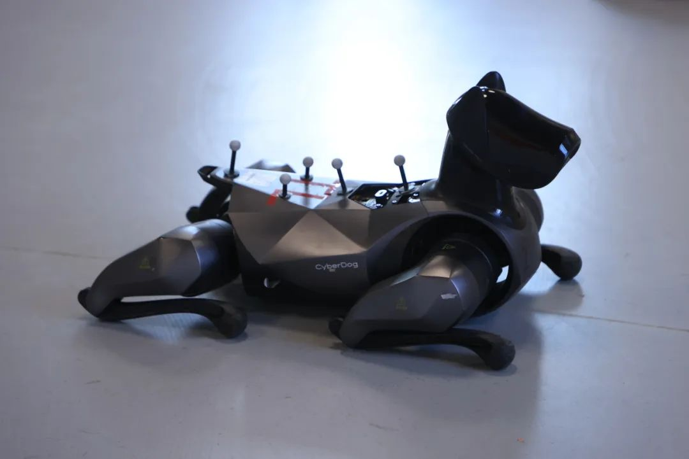
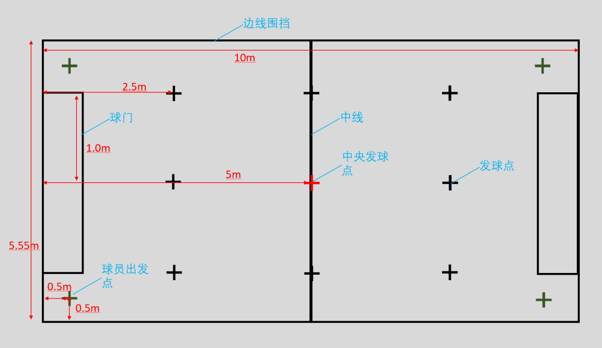
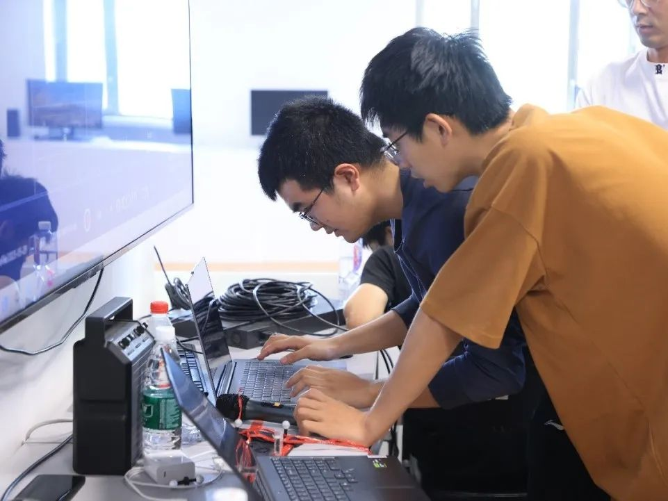
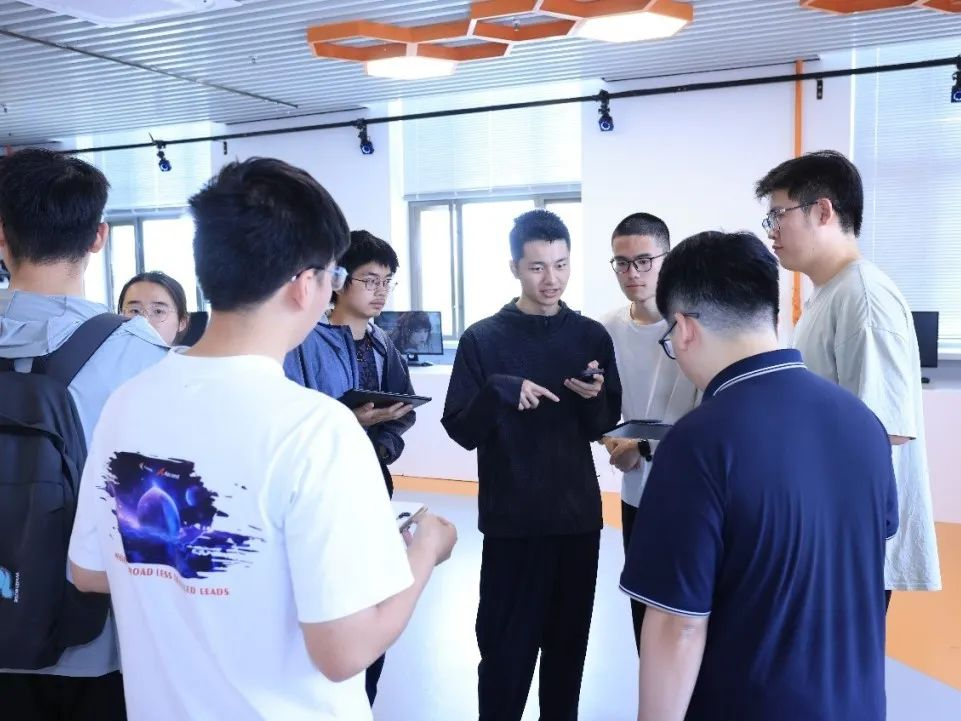
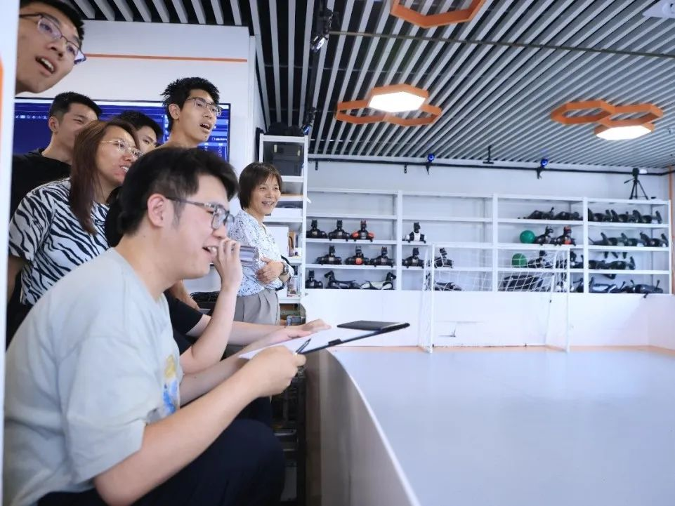
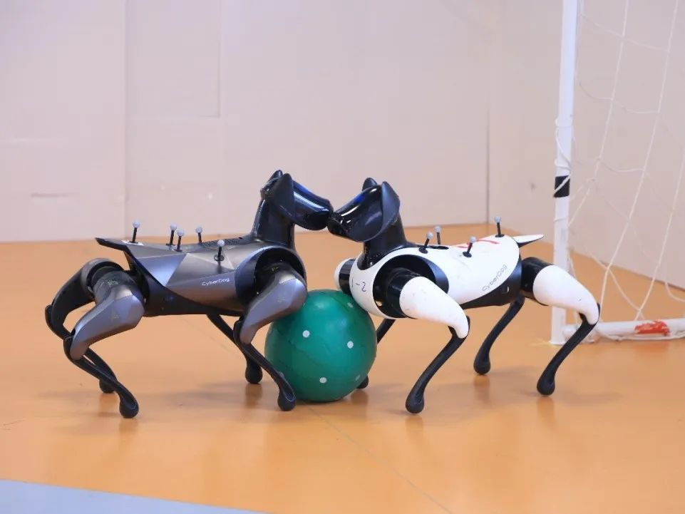
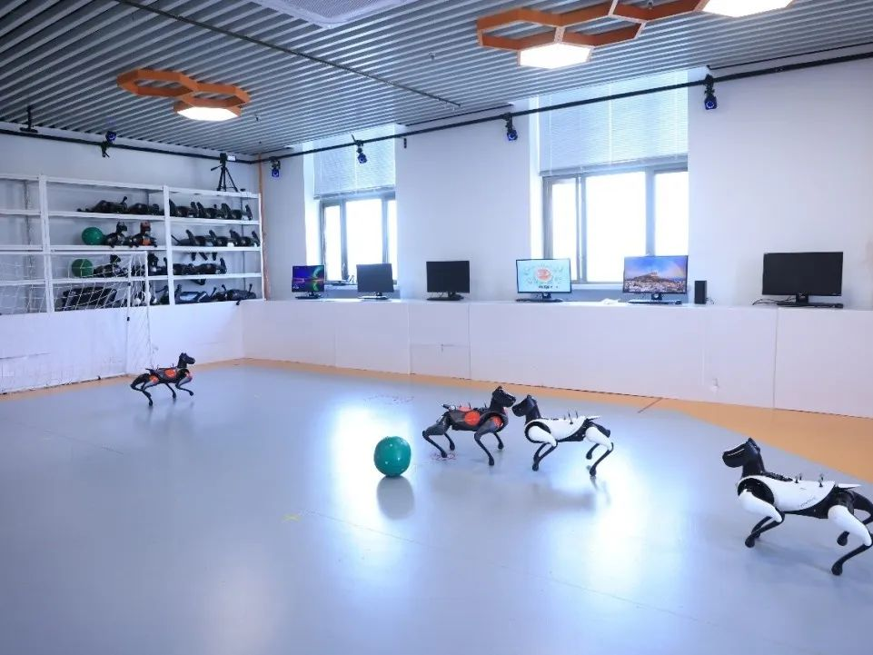
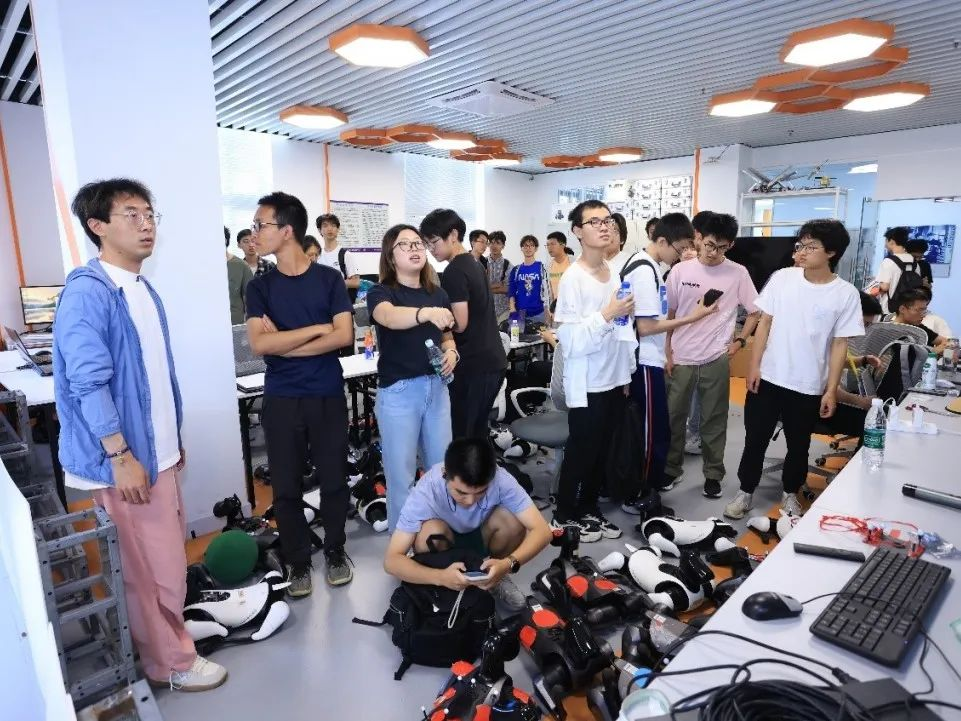
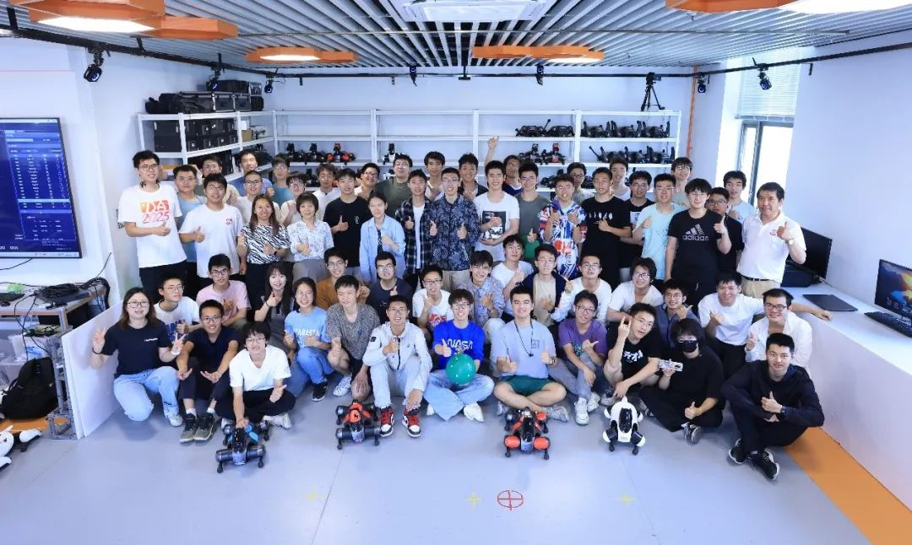

<center><h1>清华大学第四届<br />机器狗开发大赛</h1></center>


## 赛事介绍

2025 年 5 月 29 日下午 1 点，**清华大学第四届机器狗开发大赛**决赛在中央主楼 520“智能无人系统创客空间”拉开帷幕。机器狗开发大赛由**自动化系实验教学中心**主办、**自动化系学生科协**协办。在 2025 年清华大学学生课外学术科技赛事分级中，机器狗开发大赛被评为**十大赛事**，是展现选手科创风采的高水平舞台。

{/* truncate */}

本届大赛以“**机器狗踢足球**”为赛题，吸引了来自自动化系、新雅书院、行健书院、数学科学系、求真书院等 14 个院系的七十余名同学组队参赛。经过近 2 个月的初赛和复赛阶段的比拼，共有 14 支队伍进入决赛。

今年的比赛中引入了**动作捕捉系统**，参赛队伍可以通过动作捕捉系统获取球和双方狗的坐标，对机器狗进行精确定位和控制。

<center>

<small>粘上定位标的机器狗</small>


<small>场地地图</small>
</center>

## 比赛流程

决赛任务为**机器狗 2v2 踢球大战**。在球场内，两支队伍分别上场一只进攻狗和一只防守狗，进攻狗从场地对角出发，将场地内足球踢至对方球门内即可得分。每场比赛包括上下半场，每半场 4 分钟（第一阶段为 5 分钟），半场结束后双方交换场地。

决赛共分三个阶段，第一阶段通过一轮 14 进 6 的淘汰赛，第二阶段通过两轮比赛实现 6 进 3，第三阶段在前 3 支队伍中通过 6 场单循环赛决出最终的冠、亚、季军。

{/* ```mdx-code-block  */}
import Tabs from '@theme/Tabs';
import TabItem from '@theme/TabItem';

<Tabs>
  <TabItem value="1" label="赛前选手调试" default>
    
  </TabItem>
  <TabItem value="2" label="裁判准备">
    
  </TabItem>
</Tabs>
{/* ``` */}

## 精彩瞬间

比赛现场气氛热烈，三阶段的对决高潮迭起。各参赛队伍的机器狗在场上展开激烈角逐，每当机器狗发起进攻，或者两只狗进行“身体对抗”时，参赛队员与观众会在场下呐喊助威，整个创客空间洋溢着欢乐的助威声与笑语。

<center>机器狗焦灼对战，参赛队员、裁判、老师观战</center>
{/* ```mdx-code-block  */}
<Tabs>
  <TabItem value="1" label="精彩瞬间 1" default>
    
  </TabItem>
  <TabItem value="2" label="精彩瞬间 2">
    
  </TabItem>
  <TabItem value="3" label="精彩瞬间 3">
    
  </TabItem>
  <TabItem value="4" label="精彩瞬间 4">
    
  </TabItem>
</Tabs>
{/* ``` */}

最终，由自动化系 2023、2024 级本科生陈奕帆、张皓哲、张章、曾文凯、张博山组成的**第 15 组**凭借卓越的表现脱颖而出，获得第四届机器狗开发大赛的特等奖。

## 总结

本次机器狗开发大赛不仅展示了同学们的创新能力和团队协作精神，也为大家提供了一个实践和交流的平台。通过比赛，同学们在机器人技术、编程、团队合作等方面得到了锻炼和提升。未来机器狗开发大赛将进一步迭代，丰富比赛内容和形式，提升参赛体验。

<center>

<small>参赛队员、裁判与老师合影</small>

清华大学自动化系实验教学中心  
清华大学自动化系学生科协  
</center>

---

文字丨夏弘宇  
排版丨王鹤霏  
审核丨张博仕 周义函 白玉琦 任艳频
