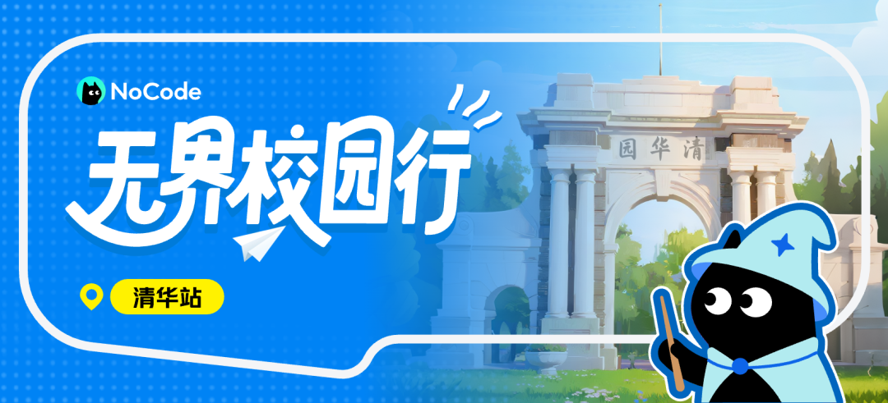

在 AI Coding 重塑开发范式、AI Agent 引领智能协作的浪潮下，技术的话语权正从单一代码者向多技能创意 er 们转移！

由此，美团倾力推出 NoCode 平台，这是一款无需编程背景和经验，通过自然语言和对话形式，即可快速生成应用的平台。

<!-- truncate -->

**「NoCode・无界校园行」**校园系列活动现正式启动，首站落地**清华大学**！

由清华大学自动化系、电子工程系、计算机科学与技术系，联合清华大学 - 美团数字生活联合研究院，共同发起**清华大学「AI 新范式作品征集活动」**！

邀请清华学子们参与作品征集和评选，更有定制奖杯证书、万元奖金等激励！

- 📌**AI 赋能，重构开发认知**：活动深度融合 AI Coding 与 AI Agent 前沿技术，见证代码自动生成的神奇，提前掌握下一代开发者的核心技能。

- 📌**创意实践，沉淀实战经验**：让创意落地生花，更能在实践过程中培养需求分析、技术应用等多维职业技能，为未来学术研究与职场积累宝贵经验。

- 📌**丰厚奖励，资源加持**：最高万元现金、定制奖杯、美团实习资格等惊喜福利！所有提交作品者均可获得参与证书。

### 参与方式

1. 点击 [nocode](https://nocode.host/aqtlkw) 直达活动官网，提交报名表
2. 使用 NoCode（nocode.cn）创建你的作品，主题不限
3. 在活动官网上传个人作品

### 参赛资格

清华赛区的作品征集活动，仅限清华在校学生参与，本硕博不限。

### 时间安排

- **报名与参与期**：即日起 ～ 8 月 31 日
- **活动宣讲与答疑日**：7 月 22 日（可扫描活动官网底部的二维码，加入创作者群，获取线上宣讲会议链接）
- **作品提交期**：7 月 22 日 ～ 8 月 31 日
- **评审期**：9 月中旬
- **颁奖日**：9 月下旬

### 奖励机制

🎁 由行业专家组成评审团，按创新性、实用性、完整性、影响力进行综合打分（评选规则详见活动官网），评选出一、二、三等奖及优秀作品奖，颁发定制奖杯 + 奖金。一、二等奖获奖者更有机会获得美团实习资格。

🥇 奖项设置 & 奖金分配

- **一等奖（1 名）**：奖金 10,000 元
- **二等奖（2 名）**：奖金 6,000 元/人
- **三等奖（3 名）**：奖金 3,000 元/人
- **优秀作品奖（5 名）**：奖金 1,000 元/人

本活动限清华大学在校学生参与，主办方将对获奖者身份进行二次核验，对于不符合本活动要求的参与者将取消其获奖资格及参与资格。  
所有奖金均为税前金额，主办方将依法代扣个税后发放税后奖金。

🔖 所有参与者：报名即享 NoCode 普通用户 10 倍对话次数额度，提交作品者均可获得活动参与证书。

➡️ 点击 [nocode](https://nocode.host/aqtlkw) 直达活动官网，报名并查看更多活动细则。  
⬇️ 扫描活动官网下方二维码加入创作者群，获取专业答疑，还有活动最新动态抢先知晓！  
—— 悄悄告诉你，这个页面也是由 NoCode 平台一手打造，直观展示零代码开发的魅力！

别让创意沉睡，快来解锁 NoCode 的无限可能~

---

图文 | 美团  
审核 | 张博仕 刘书然 白玉琦
