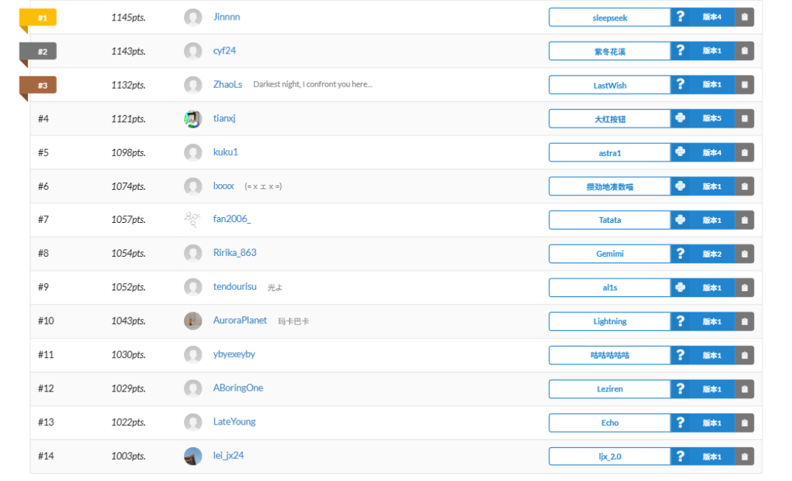
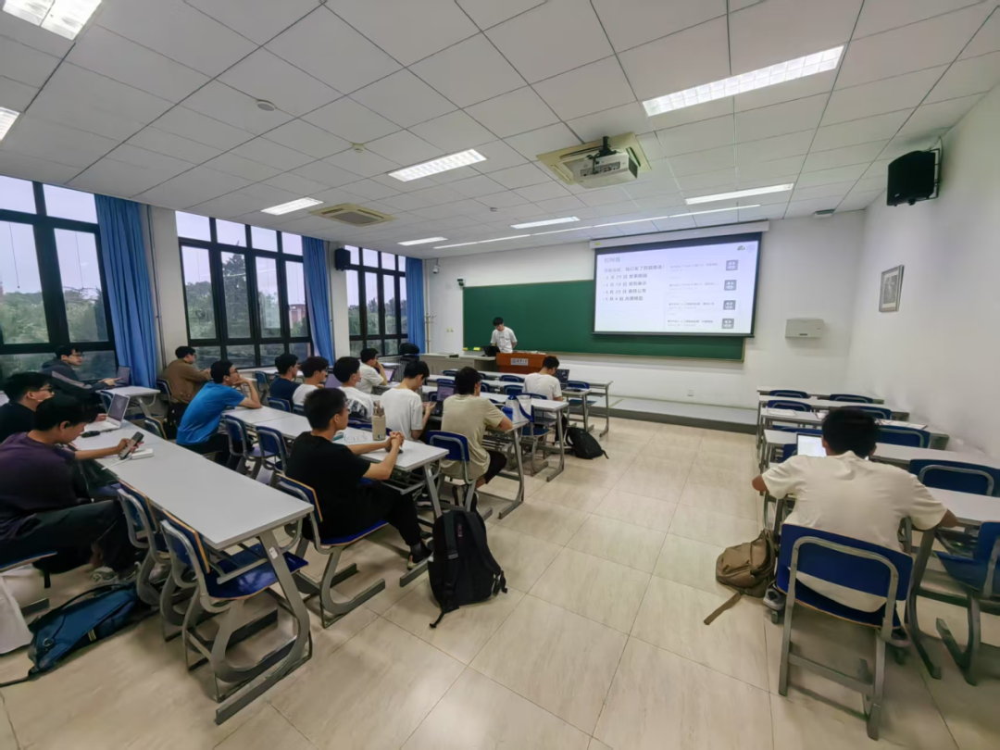
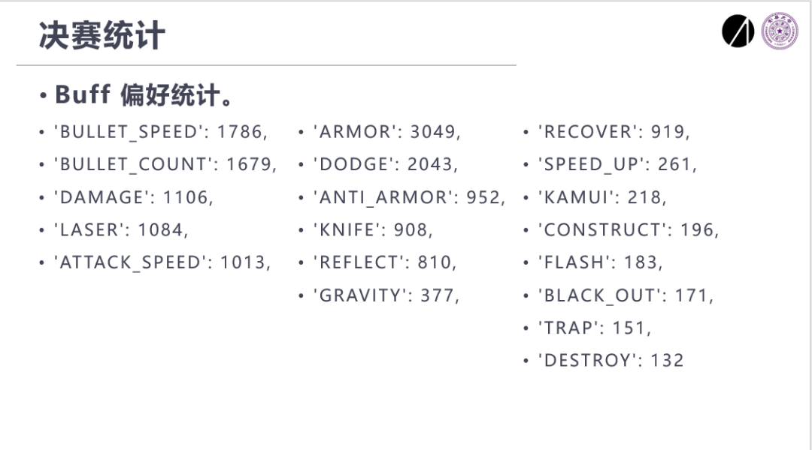
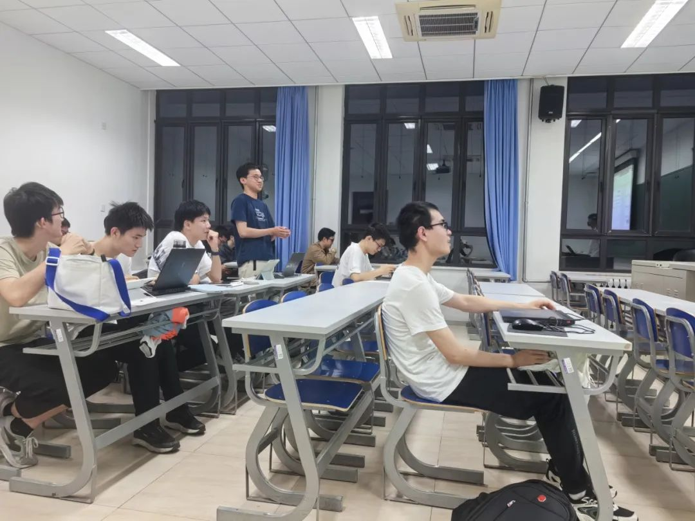
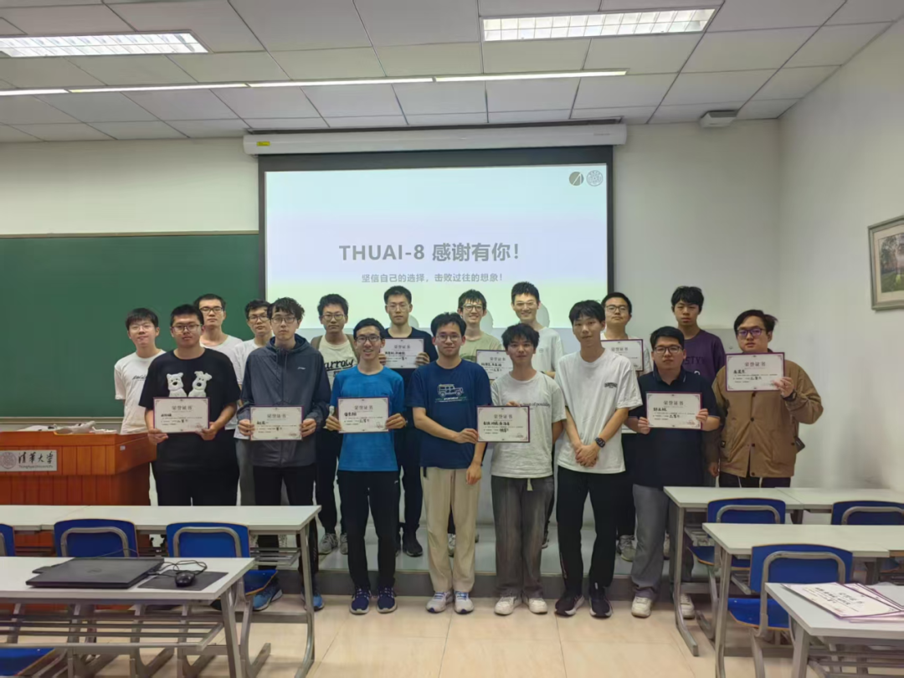
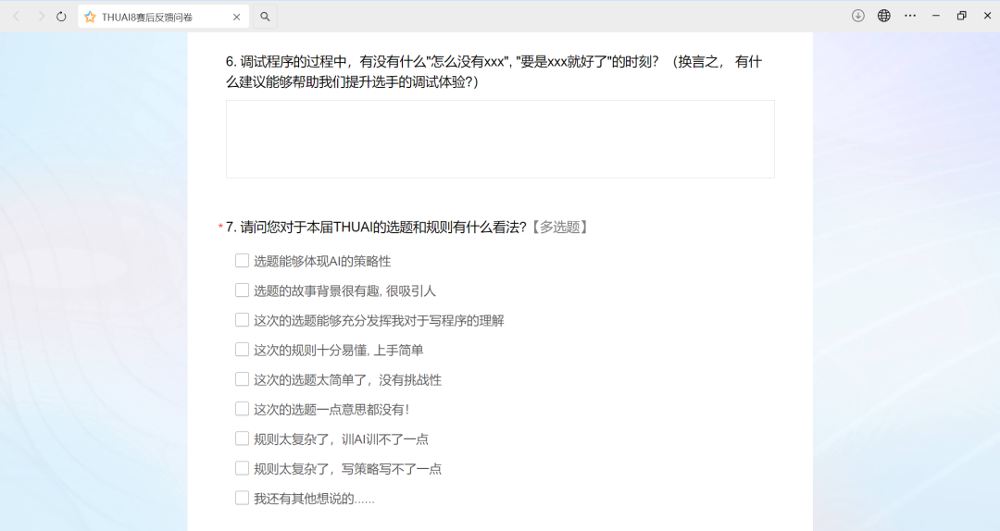

## 赛事介绍

清华大学人工智能挑战赛自动化系赛道已成功举办多年，在校内形成了广泛的影响力和良好的口碑。每届比赛都吸引近百名学生积极参与，参赛选手不仅来自系内，更有众多跨院系的同学踊跃报名。至今，本赛事已然成为本科生深入理解程序设计原理、探索人工智能前沿、提升实践能力的重要平台。

清华大学第八届人工智能挑战赛（THUAI-8）自动化系赛道“异格重构”由自动化系学生科协软件部主要负责。本次比赛以二维地图双人作战游戏为题；游戏共分为九个小局，选手需在小局内部控制游戏角色进行攻击、移动、转向和释放技能，并在每个小局结束时决策选择增益效果，努力地保全自身，击溃对手。

<!-- truncate -->

## 赛程回顾

比赛使用的前端、后端与评测机相关程序等由软件部成员自主开发，并依托计算机系开发的 Saiblo 平台进行评测。其中，后端主要使用 C# 语言进行开发，前端使用 Unity 引擎进行开发。比赛提供了 C++ 与 Python 两种语言的 SDK，可供选手自由选用。

### 初赛

初赛于 5 月 9 日截止提交，共有 16 支队伍完成了提交，每支队伍由至多 3 人组成。

初赛结束后，主办方根据自行测试与选手反馈，修复了提供的赛事程序的异常，完善并增添了前后端功能。同时，针对 Saiblo 使用方面出现的问题，主办方部也积极联系了计算机系相关人员，并使问题得到了修复。

### 决赛

考虑到本系学生的活动安排，决赛进行了适当的延期。决赛最终于 5 月 27 日截止提交，共有 14 支队伍完成了提交，完赛率达 87.5%。

决赛于 5 月 28 日评测完成，并于 5 月 30 日举办决赛总结晚会，颁发了各奖项。

  
<small>决赛提交情况一览</small>

## 总结晚会

总结晚会共分为三部分：时间线回顾、决赛统计与奖项颁布。

在时间线回顾环节，主持人带领与会人员回顾了本次比赛开发、报名、初赛、决赛的总流程，与大家共同回忆期间的困难与收获。

  
<small>时间线回顾</small>

在决赛统计环节，主持人展示了主办方统计的比赛各数据，包括增益效果的选择偏好、技能的使用频率等，并就各个数据的成因与选手进行了现场交流；同时，也对晚会前收集的选手反馈意见做出了一一解答。

  
<small>增益效果选择偏好统计</small>

最后，主办方公布了所有的获奖名单。根据调整，比赛最终颁发了特等奖 1 队，一等奖 2 队，二等奖 3 队，三等奖 8 队。本次比赛的冠军由自动化系四字班的李锦、邓威、黄洺希获得，亚军由自动化系四字班的陈奕帆、许褚熙获得，季军由自动化系二字班的赵宸一获得。

  
<small>选手发表获奖感言</small>

宣布获奖名单后，获得一、二、三名的队伍分别发表了获奖感言，陈述了参加比赛的心路历程，并表达了对活动组织的建议和期待。最后，所有到场的选手与工作人员进行了合照。

  
<small>选手与工作人员合照</small>

决赛晚会后，主办方向选手发布了赛事问卷，为日后赛事的优化收集反馈。

  
<small>赛事问卷</small>

## 推送回顾

- [故事揭晓](03-29)
- [规则展示](04-18)
- [赛程公布](04-20)
- [内测预览](05-04)

<strong>

THUAI-8 自动化系赛道  
顺利落幕！  
坚信自己的选择，  
击败过往的想象！  
THUAI-8，感谢有你！</strong>

---

图文 | 张德洵  
审核 | 张博仕 刘书然
