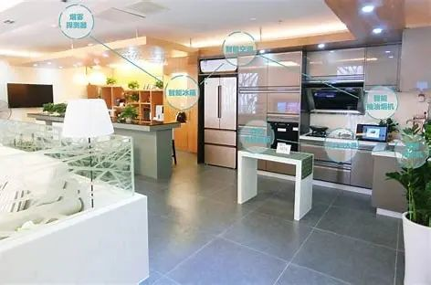

#

#  让你的机器人管家“活”起来！

## 大赛简介

**第一届具身智能挑战赛**是由**自动化系实验中心**主办，**自动化系学生科协**承办的科创赛事。比赛软硬件兼具，旨在提高学生的科研科创能力。

本次具身智能挑战赛为首届赛事，以“智能居家”为主题，聚焦**人工智能在家庭场景中的实际应用**。参赛队伍需利用智能小车作为“智能管家”，通过编程与算法设计，使其完成一系列任务，如**物品搬运、识别避障、路径规划**等，实现高效、智能的家居服务。

<!-- truncate -->

## 赛题背景——让机器人从思考到行动！

想象一下，你的机器人管家不再只是冰冷的代码，而是拥有“实体智能”的得力助手！在这场 **4 米×4 米**的模拟家庭场景中，你的机器人将面对 **9 大核心任务**的终极考验：从清洁水渍、制作甜点，到整理书籍、垃圾分类，甚至“浇花、送咖啡”！每个房间都暗藏玄机：客厅的灯需要开关、厨房的咖啡杯等待搬运、工具间的拖把亟待调用……还有随机出现的障碍物（如垃圾桶、小凳子）需要躲避。这将挑战机器人的图像识别、导航避障、多任务协调和与环境交互能力！

## 核心挑战——具身智能的全面爆发！

1. **智能导航**：让你的机器人像“未来战士”一样，规划最优路径，穿越客厅、厨房、书房，灵活躲避墙壁与障碍！
2. **精准操作**：机械臂抓取书本、水壶等物品，按编号排序或按颜色分类，展现“手眼协调”的极致操作！
3. **多线程优化**：在“等待制作甜点”时，能否同步执行其他任务？高效并行才是具身智能的真正实力！
4. **视觉感知**：通过人工智能算法，让你的机器人像“智慧之眼”一样，精准理解环境并做出智能决策！

## 参赛福利——从 0 到 1 的成长之旅！

1. **技术培训**：免费线上课程（开发板使用 + 运动学控制 + 视觉模型部署），即使是小白也能快速上手，打造属于自己的智能管家！
2. **验收指导**：阶段性任务 + 针对性指导，让你的开发过程不再迷茫，每一步都走得扎实!
3. **荣耀加冕**：总分最高的战队将荣获“智能家居大师”称号，还有丰厚奖金等你来拿！

## 赛程速递——未来智能，触手可及！

### 比赛时间

1. **报名截止**：3 月 3 日 第三周周一
2. **开发攻坚**：3 月 3 日 - 28 日
3. **终极对决**：3 月 29 日 - 30 日 第六周周末

### 技术培训 + 验收

- 第3周 培训 + 验收：**小车移动 + 导航 + 避障**
- 第4周 培训 + 验收：**识别 + 机械臂**

### 参赛须知

- 扫码加入比赛微信群，获取最新报名信息！

    

- 若二维码过期，请[点击链接](https://cloud.tsinghua.edu.cn/d/4abf010edfd947fbb140/)获取最新二维码进群：

- 校内在读本科生自由组队（可跨院系组队），每队 2 - 4 人，确定队名和 1 名队长，每名队员均需报名。组队成功后将提供调试场所和开发板套件！

- 共招 35 组，**名额有限，先到先得！**

**加入我们，让你的代码“活”起来！** 这不仅仅是一场比赛，更是一次具身智能的探索之旅！让你的机器人从虚拟走向现实，从代码走向实体，成为未来智能家庭的核心！**未来已来，具身智能由你定义！快来加入，让你的机器人管家成为具身智能的先锋！**

---

## 赛事独家赞助

本次大赛由**昇腾 AI 平台**提供技术支持，通过从训练、推理、调优到部署的一站式技术服务，实现全流程开发，更好地赋能学生实践和创新。

**昇腾计算产业**是基于**昇腾系列（HUAWEI Ascend）处理器**和**基础软件**构建的全栈 AI 计算基础设施、行业应用及服务，包括昇腾系列处理器、系列硬件、CANN（Compute Architecture for Neural Networks，异构计算架构）、AI 计算框架、应用使能、开发工具链、管理运维工具、行业应用及服务等全产业链。

**欢迎感兴趣的同学关注官方社区，获取详细信息。**

---

文案 | 自动化系科协  
排版 | 刘烁  
审核 | 肖一翃 刘书然 周义函  
  
自动化系学生宣传平台  
欢迎关注紫冬话语

:::note

[阅读原文](https://mp.weixin.qq.com/s/XS3RWjzcMLvoIkkhs8r35Q)

:::
