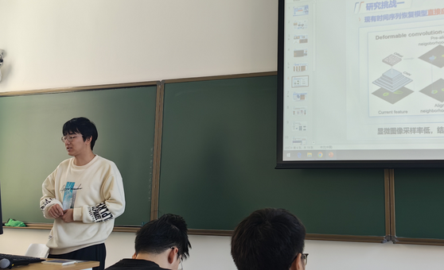
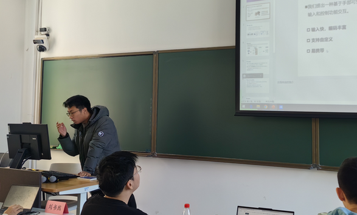
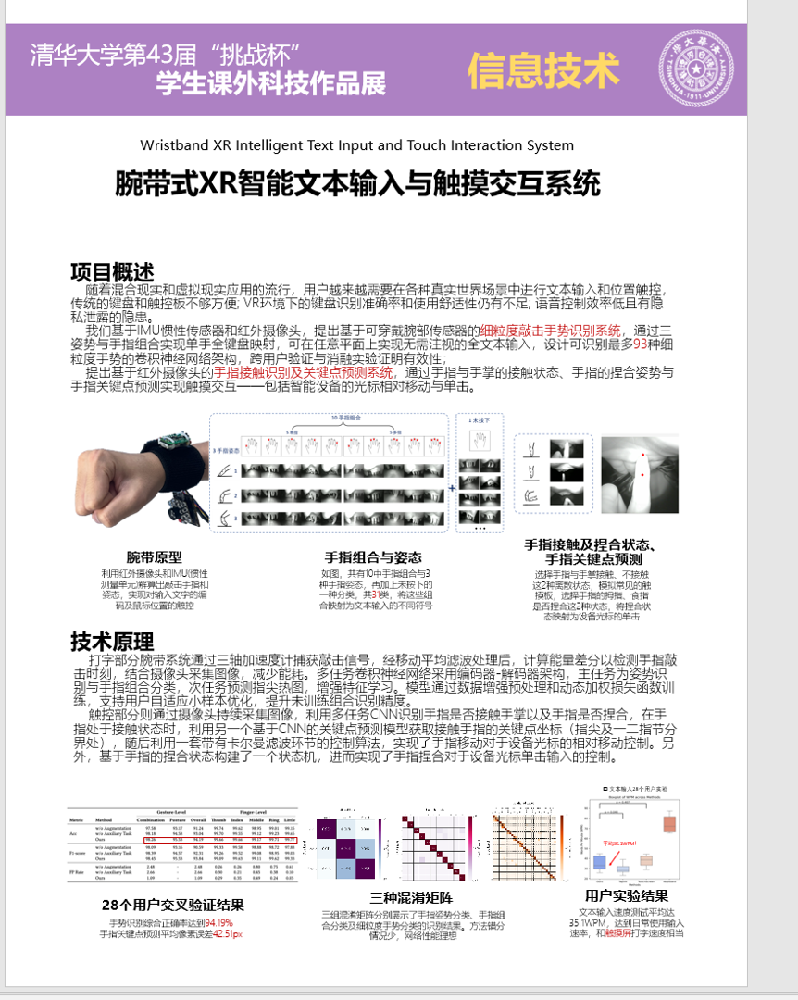
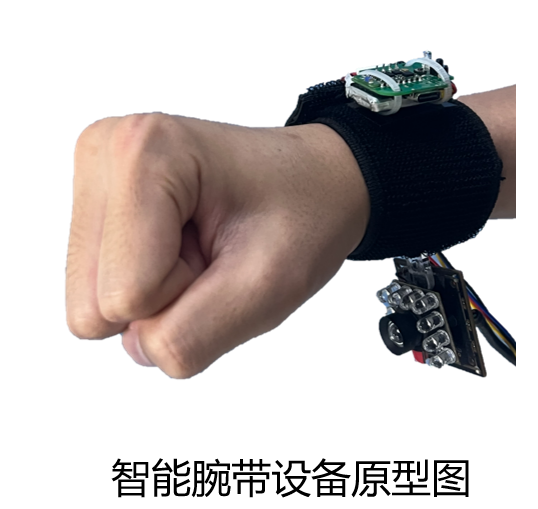
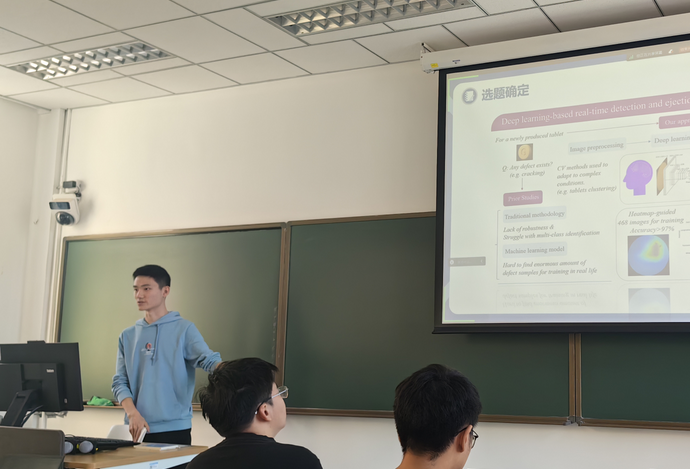
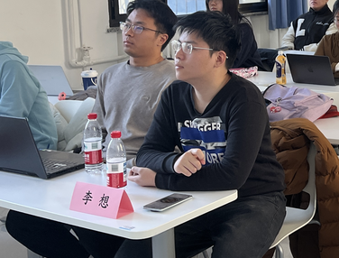
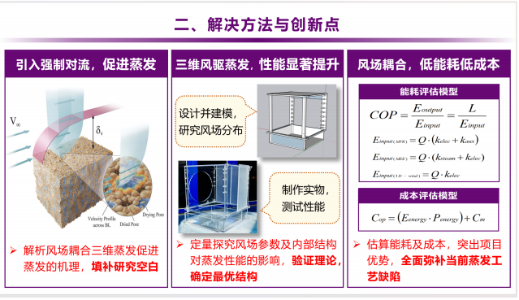

12月13日下午，自动化系2025年挑战杯微沙龙成功举办。本次微沙龙共邀请四位经验丰富的同学，从选题方向、时间规划、答辩准备等多个角度为同学们分享参赛经历与策略。

<!-- truncate -->

**— 自动化系 —**

**挑战杯微沙龙总结推送**

**2025.12.13**

12月13日下午，自动化系2025年挑战杯微沙龙成功举办。本次微沙龙共邀请四位经验丰富的同学，从选题方向、时间规划、答辩准备等多个角度为同学们分享参赛经历与策略。

## 01 刘书然 经验分享

*— 挑战杯微沙龙 —*

刘书然 分享经验

### 01 初期准备

- 从兴趣出发，找到导师并在实验室中发挥才能。
- 选择新兴且有发展前景的领域，注重**创新**。
- **团队协作**明确分工，项目推进中多交流。

### 02 答辩经验

提前做好准备，注意时间节点。答辩时图文结合，以图为主，**视频**更佳，并提前准备回答问题的策略。

## 02 孙润泽 经验分享

*— 挑战杯微沙龙 —*

孙润泽 分享经验

孙润泽同学介绍了挑战杯参赛项目 —— 腕带式 XR 智能文本输入与触摸交互系统。该项目基于 IMU 惯性传感器和红外摄像头，实现细粒度手势识别与触摸控制，支持各种计算设备的文字输入和控制功能交互。

他分享了选题技巧，强调**创新性核心**，可继承学长项目但需创新，有功能演示或实物展示的项目更具评审优势，商业化准备能加分。**团队协作**上，需明确分工，专人负责答辩，组员定期沟通，可同步产出论文实现双赢。

展示方面，PPT需**图文结合**，答辩前要练习控时、预判提问，合理应答并可通过实物或视频增强评审感知。

## 03 杨博尧 经验分享

*— 如何从零起手搓一个项目 —*

杨博尧 经验分享

### 01 挑战杯时间线

2025年挑战杯的重要时间节点如下，可供同学们参考。

- 2025.1.4　作品申报书
- 2025.1.19　院系初审答辩
- 2025.3　院系复审答辩
- 2025.3　提交函评材料
- 2025.4　终审答辩

### 02 选题确定

优先选择**硬件**可视化项目，项目成果直观（如实物、演示视频），评审易感知价值，更易短期出效果。

### 03 材料撰写/答辩策略

<strong>【合理分工】</strong>材料撰写任务量大，队内合作分工。

<strong>【优化风格】</strong>引言部分着重打磨，把握文风基本点，配图善用AI。

<strong>【答辩】</strong>照顾评委听感，技术细节适量讲，最好有故事。

## 04 李想 经验分享

*— 从校赛到国赛的探索之路 —*

李想 经验分享

### 01 参赛项目与成果

### 02 校挑流程与关键环节

院系初审与**复审**：竞争最激烈。

学校**函评**：时间极其紧张，提前做好准备。

决赛**答辩**：PPT精美清晰，控制时间。

### 03 策略与建议

<strong>【时间规划】</strong>尽早准备，联系老师。

<strong>【跨院系立项】</strong>与其他院系同学合作，竞争小，更容易进决赛。

<strong>【项目选择】</strong>选择有一定成果基础的项目，完成度高的项目 > 看起来高大上的题目。

<strong>【老师经验】</strong>老师的挑战杯经验 > 老师的科研方向相关性。

这次微沙龙为同学们搭建了一个交流与学习的平台，帮助大家更清楚地了解了挑战杯的准备流程和相关技巧。

希望通过这次微沙龙的启发，同学们能以更加高涨的热情投入到备赛当中，全力以赴去实现自己的创意与目标。

最后，衷心祝愿所有参赛团队在挑战杯中取得理想的成绩！

图片 | 石晓玥

文案&排版 | 李晨菲

审核 | 张博仕 孙艺宁 刘书然
