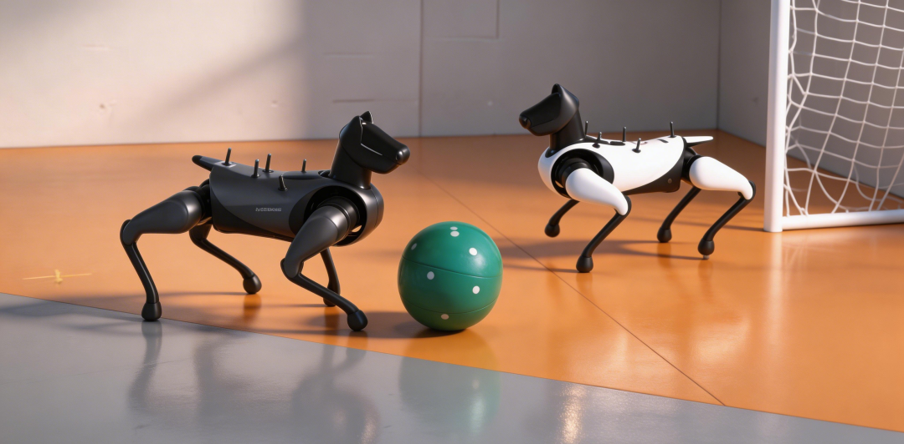
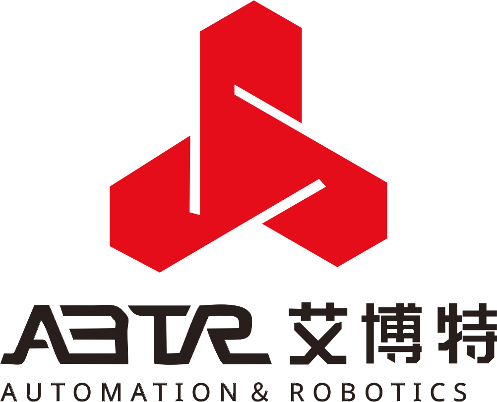

**第五届 清华大学机器狗开发大赛** 即将开始报名……

## 赛事简介 INTRODUCTION

清华大学机器狗开发大赛是由自动化系实验教学中心主办、由自动化系学生科协协办的高水平科技赛事。赛事至今已成功举办四届，并被评选为 2025 年清华大学学生课外学术科技**“十大科创赛事”**。

<!-- truncate -->

本届机器狗开发大赛以**“踢球大战”**为赛题，参赛队伍需要利用**两只机器狗**，完成场地内**避障行走、自主射门、自主守门**等任务，最终在决赛中与对手完成**2v2的踢球大战**。

通过参加本次比赛，你将能够掌握**Ubuntu/ROS2系统应用、运动控制、视觉目标检测、对抗和决策、通信**等实用而炫酷的技能，为未来的科研和应用打下坚实的基础。

## 赛事日程 PROCEDURE

完整赛事包含初赛、复赛和决赛。

### 报名阶段

**3.30（第六周周一）~4.1（第六周周三）**

校内在读本科生自由组队（可跨院系组队），每队**3~5**名同学（含1名队长），每队提供两只机器狗，限**20**支队伍。

报名问卷链接见文末二维码，**3月30日中午12：30**之后提交的队伍按先后顺序入选，报满即止；**该时间节点之前提交问卷无效**。建议队长提前填好报名问卷信息；填写问卷后请进入比赛群（群聊二维码在问卷中）

3.31/4.1发布参赛名单。

### 初赛阶段

**4.1（第六周周三）~4.27（第十周周一）**

**预计**4.1/2 第六周周三/四晚上发第一条机器狗，并进行**第一次培训**，**具体时间报名完成后确定。**培训每组至少到一个人。

**预计**4.27之前进行**初赛**。内容为**机器狗避障行走。**

### 复赛阶段

**4.28（第十周周二）~5.17(第十二周周日)**

4.28~4.30晚上**，复赛培训。**

**预计**5.17晚之前完成复赛验收，内容为**1v1踢球&防守**。

### 决赛阶段

**5.18(第十三周周一)~5.30/31(第十四周周末)**

5.30/31分别进行小组赛/决赛，即**2v2踢球大赛。具体规则另行通知**。

## 奖励办法 AWARDS

本次比赛设特等奖（5000元/队）、**一等奖（2500元/队）、二等奖（1800元/队）、三等奖（600元/队）**。完赛队伍的**前70%**均有机会获奖。

扫描上方二维码填写报名问卷，**记得加入比赛群哦~**

鸣谢小米、湖南艾博特机器人技术有限公司对本次活动的赞助。

文案 | 自动化系科协硬件部

排版 | 朱正涵 李锦 王鹤霏 夏弘宇

审核 | 张博仕 凌子霄 孙艺宁 刘书然
