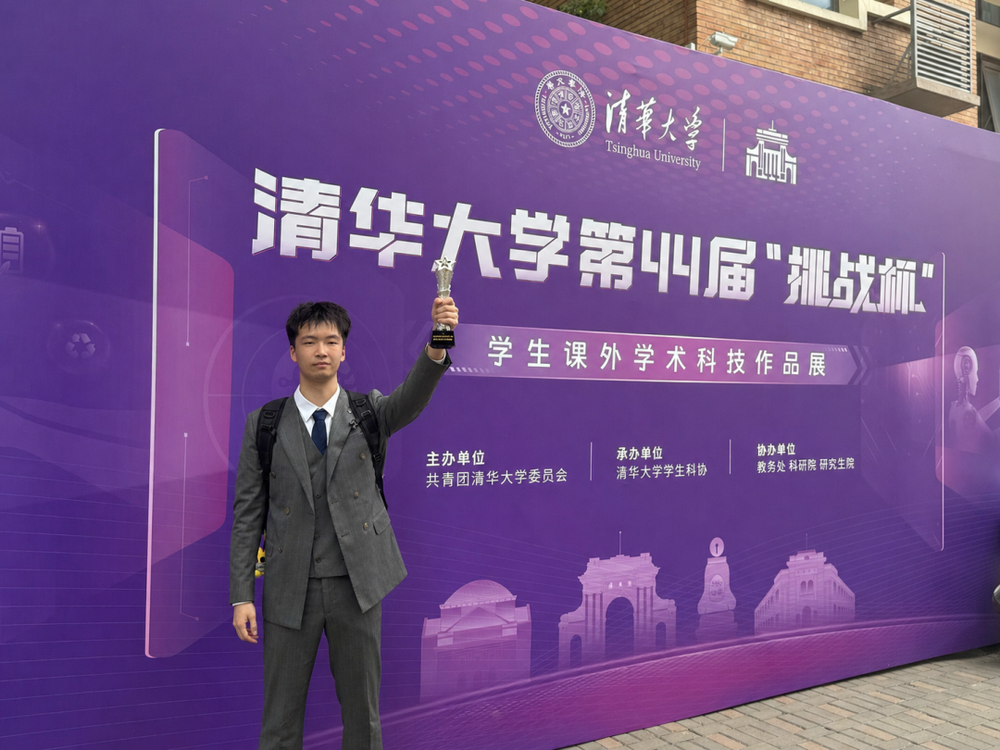
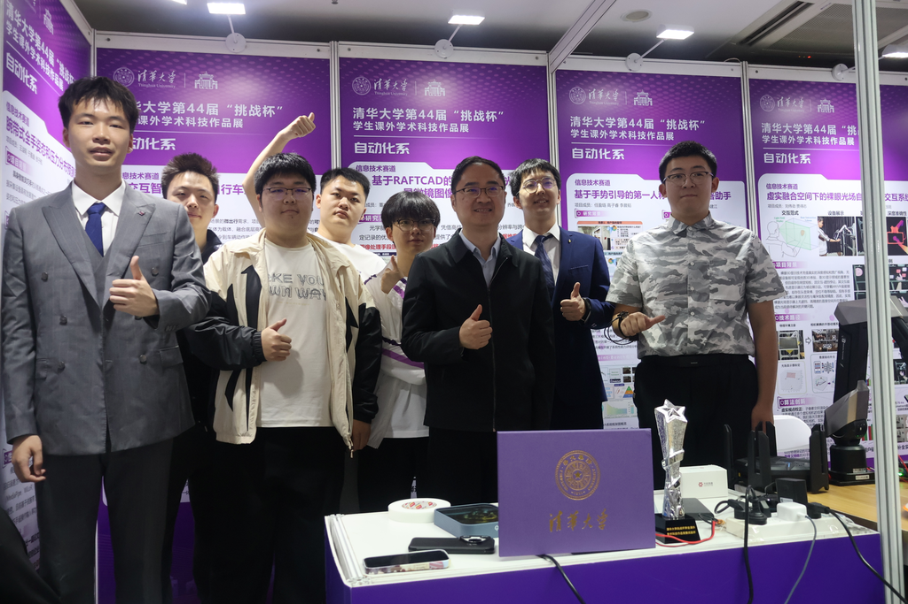

在清华大学第四十四届“挑战杯”学生课外学术科技作品竞赛中，自动化系夺得**团体第五名**，**时隔五年**再次荣获**优胜杯**！

<!-- truncate -->

<strong>热烈庆祝</strong> 
<strong>喜报</strong> 
实力领跑　佳绩斐然 
<strong>自动化系荣获优胜杯</strong>

在清华大学第四十四届“挑战杯”学生课外学术科技作品竞赛中，自动化系夺得**团体第五名**，**时隔五年**再次荣获**优胜杯**！

本届挑战杯中，自动化系夺得**四项二等奖**、**两项三等奖**。

## 二等奖

**王溢韬、于嘉逸**《腕带式全手姿态和压力分布预测系统》

**王泊、李翔宇**《可交互的智能自平衡自行车系统》

**董丰宁**《基于RAFTCAD的高速实时双光子显微镜图像处理系统》

**周子睿**《SCaR-3D: 基于多视图一致聚合的三维场景变化建模与连续重建系统》

## 三等奖

**任盈琏、高子睿**《基于手势引导的第一人称智能眼镜问答助手》

**刘伟劲、贾得志**《虚实融合空间下的裸眼光场自然手势交互系统》

**感谢选手们的积极参与，也祝贺自动化系再创佳绩！祝贺以上获奖选手！**

**【END】**

**编辑丨王众一 谭雯心**

**审核 | 张博仕 孙艺宁 刘书然**
