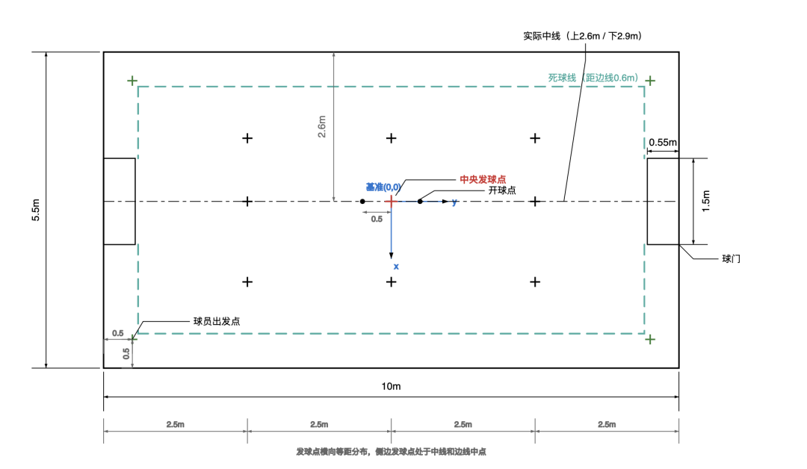
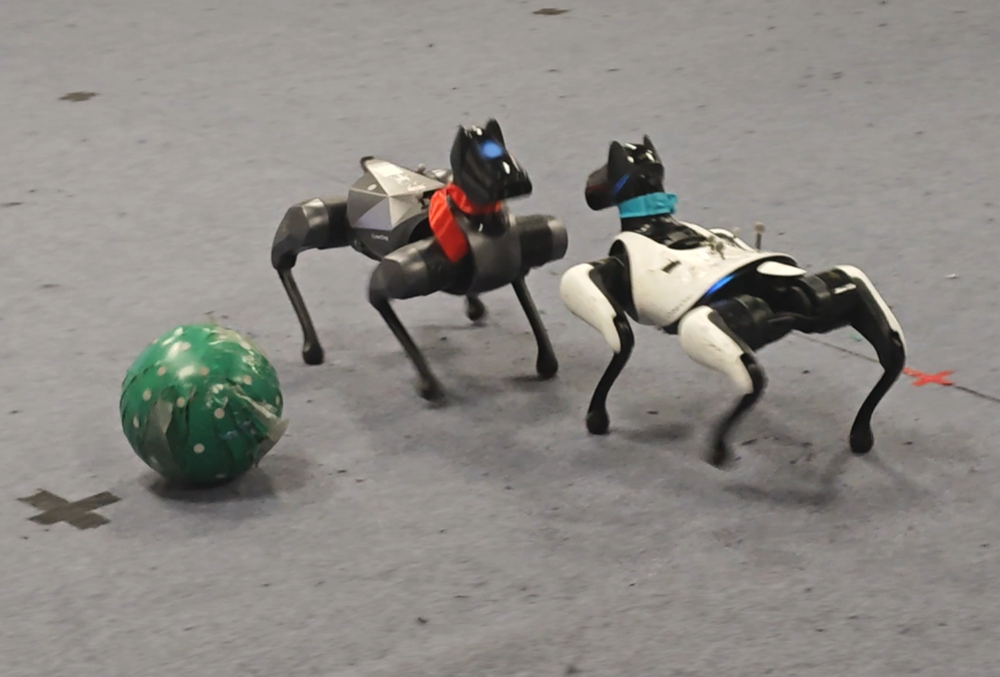
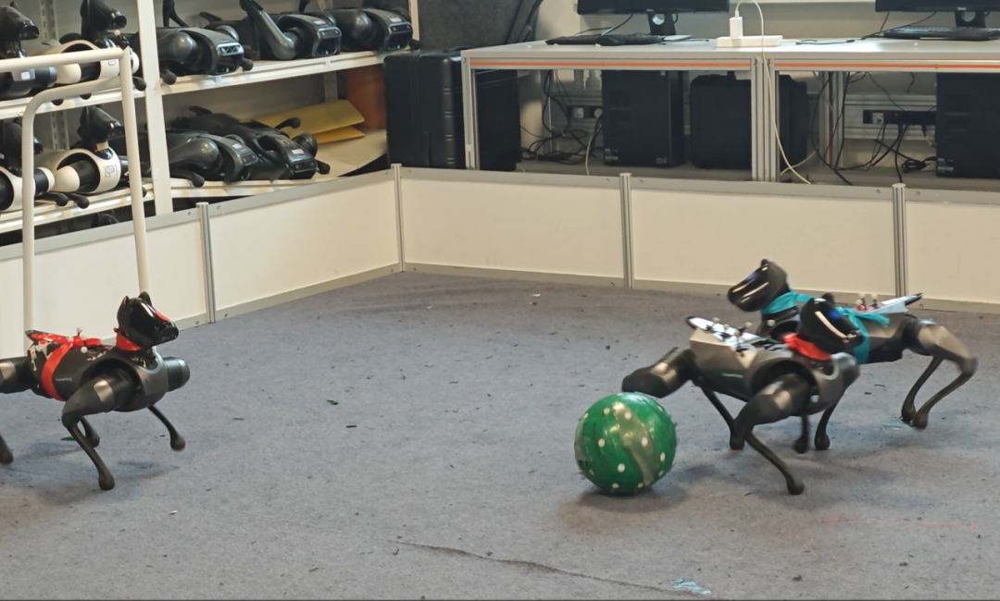
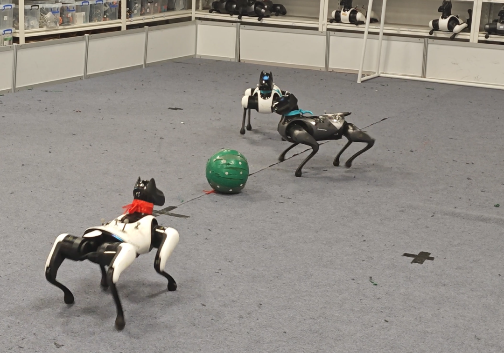
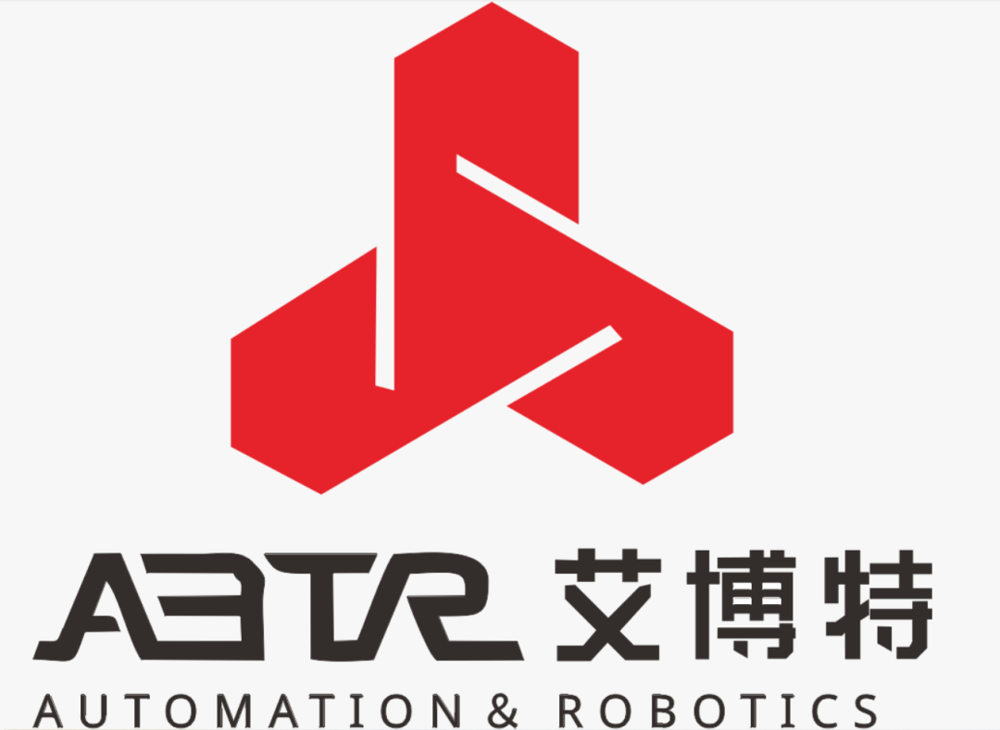

<h2>清华大学第五届机器狗开发大赛</h2>

2026 年 5 月 17 日，由清华大学自动化系实验中心主办、自动化系学生科协承办的**第五届机器狗开发大赛复赛**，在清华大学中央主楼智能无人系统创客空间顺利举行。本次赛事聚焦机器狗协同竞技能力，吸引全校 19 支精英队伍同台角逐，以 2V2 对抗的硬核形式，上演了一场科技感拉满的智能竞技盛宴。

<!-- truncate -->

## 赛事聚焦：机器狗足球，智趣交锋

本届复赛以机器狗足球对抗为核心场景，复刻专业足球赛制，打造沉浸式竞技体验。比赛场地设置边界围挡、球门、中线、发球点及死区等标准化区域，红蓝两队各派出两条机器狗协同作战，全程自主完成起身、跑位、控球、射门等动作，考验机器狗的视觉识别、路径规划、动态避障与多机协同能力。

比赛地图

复赛采用小组单循环赛制，19 支队伍分为 6 个小组，展开激烈的 2V2 循环对决。每场比赛时长 9 分钟，分上下半场各 4 分钟，进球后暂停复位、重新开球，规则严谨、节奏紧凑。

赛场上，机器狗灵活穿梭、精准攻防，时而快速突破、时而默契配合，摔倒后自主起身、卡顿时快速脱困，每一次精准射门、每一次成功防守，都引得现场掌声不断，尽显具身智能技术的硬核实力与竞技魅力。

「比赛掠影」

「精彩瞬间」

## 决赛预告：巅峰对决，线上直播

经过多轮激烈角逐，各小组排名尘埃落定，六支小组第一名的队伍将晋级决赛，向冠军荣誉发起冲击！

**决赛时间：** 2026 年 5 月 31 日上午  
**决赛地点：** 清华大学中央主楼智能无人系统创客空间  
**观赛方式：** 自动化系科协 B 站账号全程直播（[https://live.bilibili.com/30470019](https://live.bilibili.com/30470019)）

巅峰对决一触即发， 
智能绿茵即将再燃战火！ 
诚邀全校师生 
及广大科技爱好者线上齐聚， 
共赏机器狗的巅峰竞技， 
见证智能科技的无限可能！

## 赛事支持

鸣谢小米、湖南艾博特机器人技术有限公司对本次活动的赞助。

---

清华大学自动化系实验教学中心 
清华大学基础工业训练中心 
清华大学自动化系学生科协

文字丨王鹤霏 
排版丨朱培荣 
审核丨张博仕 孙艺宁 刘书然

