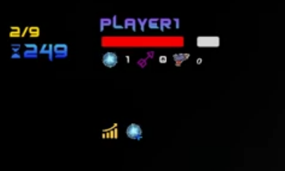

# 比赛规则

## 游戏流程

每场游戏分为 9 个**小局**，游戏时间以**帧**计算，可以粗略认为 1 秒内有 20 帧。小局实行**积分制**，每一小局会判定一次胜负，胜者获得 1 积分，败者不获得积分，若平局均不获得积分。所有小局结束后，总积分最高的选手获胜；若总积分相同，则进行一次加赛决出胜负；加赛平局的，系统将随机指定一名选手获胜。

小局内，选手将在地图中操纵角色进行行为。游戏角色的**生命值**是判定**小局胜负**的唯一参数。每个小局时限为 1200 帧，在倒计时结束前若有角色死亡（生命值不大于 0），则立即判定胜负；否则，生命值较高者胜出，若生命值相等则平局。

每小局结束后，下一小局开始前，会出现[**奖励**](#奖励)**阶段**。奖励共分为三组，系统将从每一组中分别随机刷新一个奖励，即总共刷新三个奖励。双方选手在 40 帧内互不可见地选择三项之一（双方可供选择的三项是相同的），并拥有该项奖励的效果直到游戏结束；若在规定时间后选手仍然不选择，则系统将为其随机指定一项。出现过的奖励不会在再次出现。

## 局内逻辑

小局将在正方形平面地图中进行开展，地图边长固定为 100。

地图内会出现的实体包括[**角色**](#角色)、[**墙体**](#墙体)、[**子弹**](#子弹)与[**陷阱**](#技能类)。陷阱将在奖励中进行介绍。

  
<small>小局内预览</small>

### 墙体

墙体是长度为 10 的线段，没有厚度，其方向与坐标轴平行（平行于 $x$ 轴方向记为 0，平行于 $y$ 轴方向记为 90），且只出现在 $[10n, 10n+10]$ 的位置。墙体的坐标代表的是起点坐标，墙体向对应坐标轴的负向延伸，地图边界是否天然存在墙体。

除特殊情况外，墙体在小局内不会发生变化。

小局开始时，地图上将随机产生随机数量的墙体；保证不存在被墙体完全包围的区域，即任意两个非墙体位置都是连通的。

### 子弹

子弹共分为两类，一类是**普通子弹**，可以视为一个半径为 0.1 的圆；另一类是**激光**，可以视为一组首尾相接的线段，此线段具有 0.1 的宽度。

除**位置**（包括方向，下同）外，子弹具有**速度**、**伤害**与**破甲标记**属性。在每一帧内，子弹会移动与速度大小相同的距离，过程中可能因为与墙的碰撞改变方向。子弹与墙碰撞时，平行于墙的方向保持，垂直于墙的方向反向（你可以将子弹的路径想象为光线，则反弹遵从反射定律）；子弹与子弹不会发生碰撞。子弹在飞行 100 帧后会消失。

激光不符合上述规律。激光只存在 1 帧，其线段组成为模拟普通子弹在 20 帧内移动的整个路径，伤害随路程长度等比例衰减至 0。

### 角色

游戏角色是一个半径固定为 0.5 的圆。

每小局开始时，角色会随机出生在地图的无墙体处，且不会与另一名角色相交。除**位置**和**速度**外，角色的属性分为三部分：[**武器**](#武器)、[**护甲**](#护甲)与[**技能**](#技能)。角色初始最大速度为 1。需要注意的是，角色的最大速度不代表角色在 1 帧内实际移动的距离，而是一个参考值；角色的实际位置变化详见[行为](#角色行为)部分。

  
<small>局内属性示意</small>

#### 选手操作

选手操纵自身的游戏角色与对方选手的游戏角色进行对抗。选手可以发送指令进行操作，操作包括操控角色的四种**主动行为**（攻击、移动、转向、释放技能）与**获得信息**（玩家信息与地图信息，玩家信息即玩家的所有属性，地图信息指地图上存在的除玩家以外的所有实体的信息）；指令的发送不是必须的，每一种指令在小局中的任意时刻都可以选择发出或不发出，但在**一帧内只会结算一次**（即仅第一次发送该指令时有效，释放技能例外）。

#### 角色行为

角色具有**攻击**、**移动**、**转向**与**释放技能**四种主动行为。除释放技能外，每种行为在一帧内只会被结算一次，每一个技能的释放在一帧内只会被结算一次；行为的结算顺序为攻击、移动、转向、释放技能，不同技能释放顺序遵从指令顺序。

- 攻击：角色在正前方与自身中心距离 0.8 的位置生成一颗子弹，其方向与角色朝向相同，速度与伤害受角色属性控制。
- 移动：角色选择向正前方或正后方移动不大于最大速度的距离（距离可选，最小单位为 0.1），过程中可能因为与墙的碰撞而改变方向，规则与子弹与墙的碰撞相同。
- 转向：角色选择顺时针或逆时针旋转与不大于 45 倍最大速度的角度（角度制，角度可选但为整数）；即若最大速度为 1，在 1 帧内至多转向 45 度。
- 释放技能：角色选择自身拥有的一个未在**冷却**状态的技能并使用。

#### 伤害结算

角色在与子弹碰撞后，子弹会消失，角色会进行一次伤害结算（无论子弹是哪个角色产生的）；这一判定会在角色移动后进行，即子弹碰撞是相对于角色移动后的位置而言。特别地，激光会在其整个路径上一次性全部出现（而非在碰到角色后截止），角色与单一激光子弹的多条线段的碰撞会分别引起伤害结算。

#### 武器

角色的武器是其生成的子弹相关的属性。

- **弹匣容量**：初始为 5。表示场上存在的由该角色产生的子弹的最大数量。
- **子弹余量**：每小局开始时同弹匣容量，最小为 0。角色当前还可以发射的子弹数量，这是由弹匣容量与场上存在的由该角色产生的子弹数量共同决定的；当场上由该角色产生的子弹消失后，此属性会恢复。
- **攻速**：初始为 0.1。衡量角色攻击间隔的属性，两次攻击间隔为攻速的倒数。只有距上一次攻击结算的时间不小于攻击间隔时，攻击行为才会被结算。
- **射速**：初始为 2。生成子弹的飞行速度。
- **攻击**：初始为 100。生成子弹的伤害。
- **激光标记**：初始为假。生成的子弹是否为激光。
- **破甲标记**：初始为假。生成的子弹是否具有破甲标记。

#### 护甲

角色的护甲是与其生命值及防御能力相关的属性。伤害结算时，角色会优先在**护盾**值中扣除与伤害等额的数字，护盾值归零后再扣除生命值；角色的护盾可以吸收其打破前最后一次伤害结算的一帧内的全部伤害，即使伤害大于剩余护盾值（此时伤害全部吸收，护盾值归零）；若子弹具有破甲标记，则与护盾进行伤害结算时，伤害视作两倍。

- **生命值**：每小局开始时为 300。决定胜负的参数。
- **护盾上限**：初始为 0。表示每小局开始时角色拥有的护盾值。
- **护盾值**：每小局开始时同护盾上限，最低为 0。
- **反弹标记**：初始为假。若为真，则护盾破碎前，与角色碰撞的子弹不再消失，而是反向并维持原速继续移动（已移动时间继承碰撞前）。激光也可以被反弹。
- **名刀标记**：初始为未获得。若获得名刀，则每小局开始时，名刀将变为可触发状态，在小局生命值第一次不大于 0 时名刀变为触发状态，生命值恢复至 50，并在 10 帧内无视伤害结算，此后名刀变为不可触发状态。
- **力场标记**：初始为假。若为真，在每一帧开始时，角色为圆心半径为 10 的范围内，所有子弹及另一名角色该帧实际速度为属性所称的一半。
- **闪避率**：初始为 0%。伤害结算时，角色会有与闪避率等同的概率直接避免此次伤害结算。此处的概率不会根据期望值进行平衡，即每次结算都是独立的，因此可能出现极端情况。

#### 技能

角色的技能是可以在对局中主动释放的能力。每个技能具有冷却时间，未在冷却状态时，技能可以释放，释放后产生一定效果；除特殊说明外，技能在释放后即进入冷却状态，冷却状态的持续时间为冷却时间。

技能需要在奖励中选择以获取。

## 奖励

三组奖励分别为对应**武器**、**护甲**、**技能**。每一组奖励各有 8 项，存在某些项内容相同，但它们被视为不同的奖励。奖励获得后，每小局开始时，奖励重新回到初始可用状态，即触发过的单局一次性效果可以再次触发。

### 武器类

- **整备**：弹匣容量 $+1$。
- **鹰眼**：射速 $\times 2$。
- **连弩**：攻速 $\times 2$。
- **重击**：攻击 $+1$。
- **激光**：获得激光标记；已获得和后续获得的弹匣容量加成、射速加成均改为伤害随距离的衰减速度减小一半（相应地，路程长度 $\times2$）。
- **破甲**：获得破甲标记。

### 护甲类

- **铁壁**：护盾上限 $+100$。
- **借箭**：护盾上限 $+100$，获得反弹标记。
- **名刀**：获得名刀。
- **力场**：获得力场标记。
- **八卦**：闪避率 $+25\%$。

### 技能类

- **磁暴**：冷却时间 600 帧。40 帧内使对方角色接收地图和玩家信息为空。
- **疾跑**：冷却时间 100 帧。20 帧内，自身最大速度 $\times 4$。
- **闪现**：冷却时间 100 帧。一帧内向指定方向位移长度 10，若落点与墙相交则向同方向继续位移直至与墙相切，过程中无视实体。若位移落点在边界以外则被阻拦在位移方向上与边界相切的位置。
- **破竹**：冷却时间 200 帧。使正前方最近的墙体（不可为边界墙体）消失，若不存在符合条件的墙体则无行为。
- **围界**：冷却时间 100 帧。在正前方第一个符合墙体条件的位置建造特殊墙体，该墙体在三次子弹碰撞后会消失，若位置上已有墙体则不建造。
- **网罗**：冷却时间 200 帧。在当前位置留下一个与角色形状相同的陷阱，陷阱存在 400 帧，对方角色触碰到陷阱后 10 帧内无法移动。名刀状态下的角色可以触发陷阱，但不会被固定位置。
- **复苏**：冷却时间 600 帧。除此技能外其余技能冷却立即归零，生命值和护盾值恢复至初始状态，名刀（若拥有）恢复至可触发状态。
- **神威**：冷却时间 200 帧。进入神威状态持续 20 帧，神威状态中不会触发陷阱，不会触发子弹，不会受到力场和磁暴的影响，可以穿墙，不可跨越边界，进行攻击或释放技能会提前结束状态，冷却时间将从神威状态结束开始计算。
