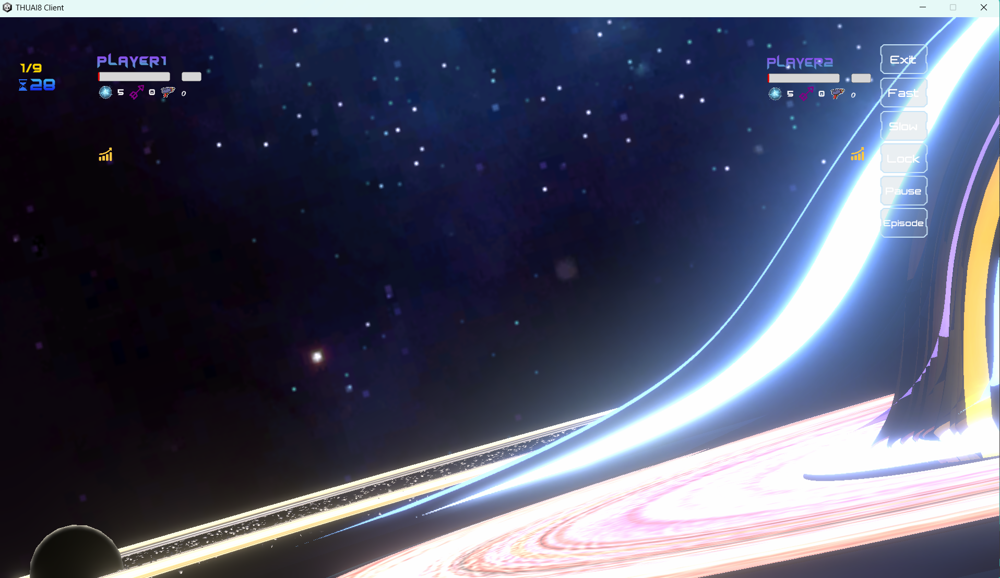
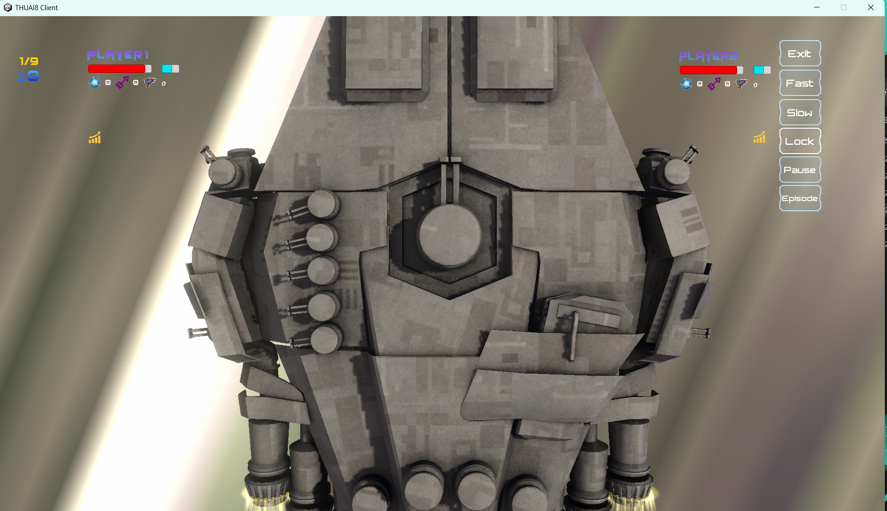
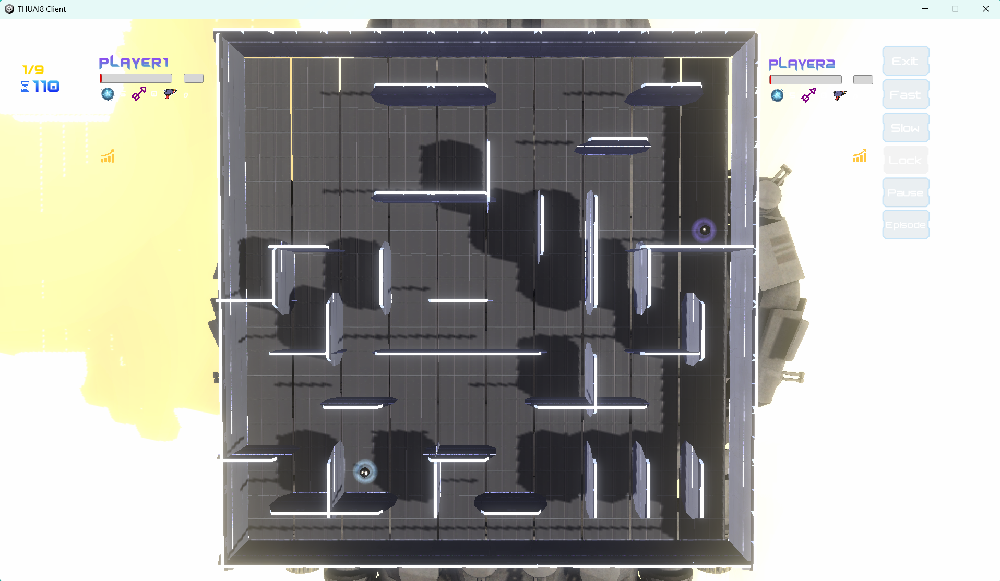

# 前端使用指南

欢迎使用我们的前端回放工具，以下是详细的使用步骤和说明，帮助您更好地理解和操作。请在我们的 [Release](https://github.com/thuasta/thuai-8/releases) 中根据您的操作系统版本下载最新的前端。

## 文件选择与进入回放场景

解压好前端后，启动 `Standalone*.exe`，此时会显示 GAME RECORD 界面，点击 `ADD`，选择所要观看的回放文件，点击 `SELECT`，GAME RECORD 中会出现新添加的回放文件名，再点击即可播放。初始银河场景如下：

点击 `Lock`，可将视角锁定到银河战舰上方：

等待加载完成后，会自动出现比赛战场：

## 可选操作

在回放场景的右侧栏中提供了 6 个操作键：

- `Exit`：退出当前回放
- `Fast`：加速
- `Slow`：减速
- `Lock`：锁定视角到银河战舰上
- `Pause/Resume`：暂停和恢复播放
- `Episode`：选择比赛小局[1-9]

当解除 `Lock` 时，鼠标左键可选择观察对象，分别可切换为两位玩家视角和自由视角。自由视角下 `WASD`、`Shift` 和 `空格` 可移动方位，右键可控制视角方向。

## 场景元素与玩家信息

在回放场景中，您会看到一些[墙体](../rules/#墙体)。

在界面的左上角和右上角，您可以看到回合数、当前的 ticks 和角色的部分信息，包括其血条、护盾值、子弹数、所选择的奖励等。

