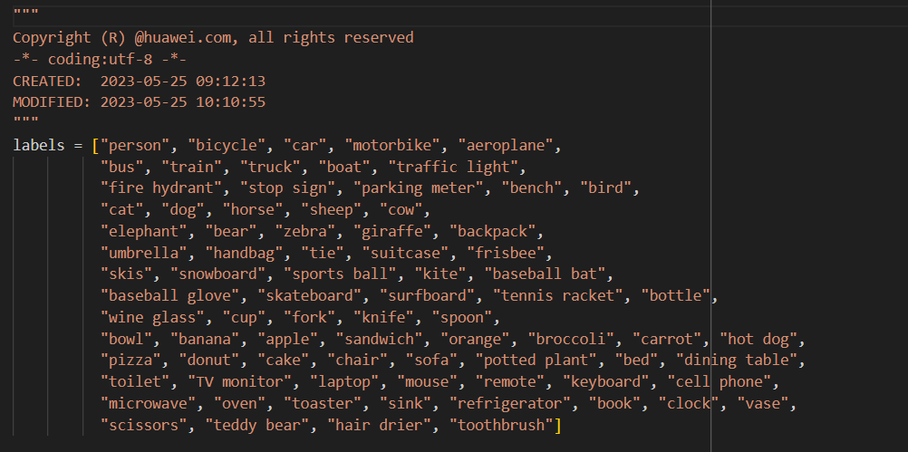
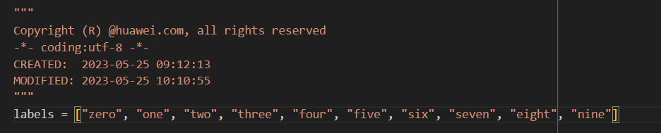

# 模型训练及部署

## 训练模型

### 系统配置

- 安装好 anaconda，配置虚拟环境。
- 使用 GPU 或 CPU 训练注意不同包的安装。

### 具体训练

详情参考网址：[YOLOV5 模型训练](https://blog.csdn.net/m0_62237233/article/details/127328106)

### 数据集获取

- 自己搜集图片并标注数据。
- 使用开源数据集（可在 [Kaggle](https://www.kaggle.com/) 查询）。

    例如：[SVHN 数据集](https://www.kaggle.com/datasets/stanfordu/street-view-house-numbers)

    :::info

    原数据集中 `.mat` 格式文件已转化为 `.txt` 格式文件，可从[**云盘下载**](https://cloud.tsinghua.edu.cn/d/bdc2a9d976ec45e58f2f/?p=%2F%E5%85%B7%E4%BD%93%E6%95%99%E7%A8%8B%2F%E6%A8%A1%E5%9E%8B%E8%AE%AD%E7%BB%83&mode=list)。

    :::

:::tip

若需要完成全部任务，推荐分别训练数字识别与物体模型。其中数字识别的数据集可选择 [SVHN 数据集](https://www.kaggle.com/datasets/stanfordu/street-view-house-numbers)，识别物体数据集可以个人拍照采集数据或前往 [Kaggle](https://www.kaggle.com/) 等开源平台查询。

:::

## 模型部署

将训练好的模型输出为 `.oonx` 等格式文件，类似尝试在 Orange Pi 上部署运行。模仿 YOLOV5USBCamera 中部署流程，推荐使用 YOLOV5s 模型进行训练。

:::warning

此处数据预处理与图像输入的接口可能会出现较多问题，因个人选择训练框架等区别上的不同，需要多加留意。

:::

### 模型转换（以 .onnx 为例）

- 将训练好的模型下载到对应的文件夹中；
- 将 `aipp.cfg`（或 `aipp_rgb.cfg`）文件放到同一文件夹中；
- 执行 atc 命令转换模型。

```bash
cd ../model
wget https://obs-9be7.obs.cn-east-2.myhuaweicloud.com/003_Atc_Models/yolov5s/aipp.cfg --no-check-certificate
atc --model=<yourmodelnms.onnx> --framework=5 --output=yourmodelnms --input_shape="images:1,3,640,640" --soc_version=Ascend310B4 --insert_op_conf=aipp.cfg
```

:::info

atc 命令中各参数的解释如下，详细约束说明请参见 [**ATC 命令说明**](https://gitee.com/link?target=https%3A%2F%2Fhiascend.com%2Fdocument%2Fredirect%2FCannCommunityAtc)。

- --model：yolov5 网络的模型文件的路径。
- --framework：原始框架类型。5 表示 ONNX。
- --output：yolov5s_nms.om 模型文件的路径。请注意，记录保存该 om 模型文件的路径，后续开发应用时需要使用。
- --input_shape：模型输入数据的 shape。
- --soc_version：昇腾 AI 处理器的版本。

:::

### 运行文件设置(模仿 YOLOv5s 运行文件)

- 修改 src 中 `label.py` 文件，将类别修改为自己的数据集中的类别。

    
    

- 修改 src 中 `YOLOV5Model.py` 文件，更改模型路径及输入输出接口。

  1. 修改模型路径：

        ```python
        model_path = os.path.join(current_dir, '..', '..', 'model', '<yourmodelnms>.om')
        ```

  2. 修改输入输出接口：

        使用不同模型框架及不同方式训练出的模型经过 atc 转换后，其输入输出接口可能不同，需要重新设计输入输出接口。

        以下是原模型的输入输出接口示例：

        ```python
        def infer(self):
            # infer frame
            image_info = np.array([640, 640, 640, 640], dtype=np.float32)
            self.result = self._model.execute([self.resized_image, image_info])

        def postprocess(self):

            box_num = self.result[1][0, 0]
            # get the number of detected objects
            box_info = self.result[0].flatten()
            # get the detailed information of detected objects

            height, width, _ = self.src_image.shape
            scale_x = width / self.model_width
            scale_y = height / self.model_height

            colors = [0, 0, 255]
            text = ""
            # draw the boxes in original image
            for n in range(int(box_num)):

                ids = int(box_info[5 * int(box_num) + n])
                score = box_info[4 * int(box_num) + n]
                label = labels[ids] + ":" + str("%.2f" % score)

                top_left_x = box_info[0 * int(box_num) + n] * scale_x
                top_left_y = box_info[1 * int(box_num) + n] * scale_y
                bottom_right_x = box_info[2 * int(box_num) + n] * scale_x
                bottom_right_y = box_info[3 * int(box_num) + n] * scale_y

                cv2.rectangle(self.src_image, (int(top_left_x), int(top_left_y)), (int(bottom_right_x), int(bottom_right_y)), colors)

                p3 = (max(int(top_left_x), 15), max(int(top_left_y), 15))

                position = [int(top_left_x), int(top_left_y), int(bottom_right_x), int(bottom_right_y)]

                cv2.putText(self.src_image, label, p3, cv2.FONT_ITALIC, 0.6, colors, 1)

                text += f'label:{label} {position} '

            log_info(text)
            # using imshow to show the result
            cv2.imshow('out', self.src_image)
        ```

        其中 `infer(self)` 与 `postprocess(self)` 方法是模型的推理与后处理函数，需要根据实际的模型框架及训练方式进行修改（可使用 [Netron](https://netron.app/) 在线检查模型结构）。
