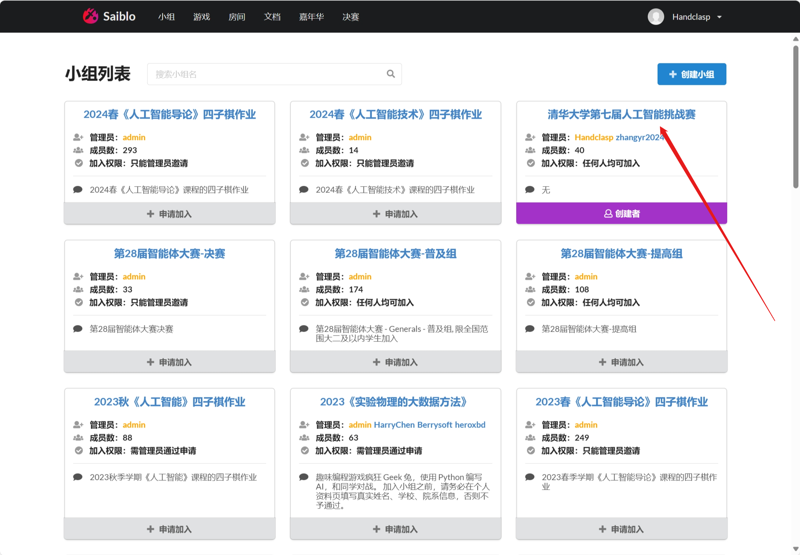

# 快速入门指南

这份指南旨在为您提供具体、清晰的指引，以确保您能够轻松开始编写比赛程序。

:::tip

您可以参考我们录制的完整的[**快速入门视频**](https://cloud.tsinghua.edu.cn/f/131ba3787c304ff280e2/)。

:::

## 下载前端、后端和 SDK

- **前端**：提供图形化界面，展示回放中的比赛情况。
- **后端**：作为服务器，控制比赛进行，并生成比赛回放。
- **SDK**：是若干不同编程语言的程序文件，提供编写比赛程序所需的接口。选手可以选用 C++ SDK 或 Python SDK 编写程序。

请从以下链接下载**最新版本**（Latest）的前端（client）和后端（server）：

[https://github.com/thuasta/thuai-7/releases](https://github.com/thuasta/thuai-7/releases) 或 [https://hub.nuaa.cf/thuasta/thuai-7/releases](https://hub.nuaa.cf/thuasta/thuai-7/releases)

下载完成后，解压文件至您的工作目录。

:::tip

- 务必根据您的操作系统版本选择适当的版本。例如，您的操作系统为 Windows 11，您应该下载 `thuai-7-client-StandaloneWindows64.zip` 和 `thuai-7-server-windows-arm64.zip`。
- github 中的 releases 会折叠一部分 Assets，若您没有找到对应的版本，请点击 `show all assets`。
- 若您在运行后端的可执行文件出现了闪退或报错等情况，可能是因为您没有安装 .NET Core 运行时环境。请根据您的操作系统版本下载并安装 .NET Core 运行时环境，版本至少为 8.0。可使用如下 Windows 下载地址：[.NET Core](https://dotnet.microsoft.com/zh-cn/download/dotnet/thank-you/runtime-8.0.4-windows-x64-installer?cid=getdotnetcore)

:::

此外，请克隆或下载我们的 SDK 仓库，以便开始编写比赛程序。

{/* ```mdx-code-block  */}
import Tabs from '@theme/Tabs';
import TabItem from '@theme/TabItem';

<Tabs>
  <TabItem value="cpp" label="C++" default>
    克隆 C++ SDK 仓库：

    ```bash
    git clone https://github.com/thuasta/thuai-7-agent-template-cpp.git
    ```

    若您没有开启代理或安装 git，也可以使用如下链接下载 [C++ SDK 源码压缩包](https://hub.nuaa.cf/thuasta/thuai-7-agent-template-cpp/archive/main.zip)。
  </TabItem>
  <TabItem value="python" label="Python">
    克隆 Python SDK 仓库：

    ```bash
    git clone https://github.com/thuasta/thuai-7-agent-template-python.git
    ```

    若您没有开启代理或安装 git，也可以使用如下链接下载 [Python SDK 源码压缩包](https://hub.nuaa.cf/thuasta/thuai-7-agent-template-python/archive/main.zip)。
  </TabItem>
</Tabs>
{/* ``` */}

## 编写比赛程序

配置好代码环境后，选手需要使用提供的 SDK 编写比赛程序，根据战场形势决定最优策略。选手的所有逻辑包括条件判断、动态的检测与决策等都必须在代码中完成，一旦开始对战就无法通过任何形式（如命令行）改变逻辑或手动输入命令。选手最终提交一个或多个 `*.cpp` 或 `*.py` 文件，其中必须包括所有的代码。

选手的基本操作包括：选择出生地；移动 / 停止；拾取 / 丢弃资源；攻击；使用药品；使用手榴弹；获取战场信息。环境配置和详细接口信息请参考 [C++ SDK 文档](../cpp_sdk) 或 [Python SDK 文档](../python_sdk)。

## 启动后端和 SDK 程序

编写完成后，请先后启动后端的 `GameServer` 可执行文件以及 SDK 的可执行文件 `.exe`，开始比赛。后端默认需要 2 个玩家，因此在启动后端后，您需要同时启动两个 SDK 程序。注意，两个 SDK 程序的 `token` 必须不同，您可以在命令行中指定 `token`，也可以在代码中指定。

在比赛的任何阶段，您都可以在后端输入 `stop` 结束比赛。只有在选手输入 `stop` 后，才会在后端根目录下生成一个 `*.dat` 回放文件。

## 使用前端查看回放文件

将生成的回放文件夹**复制到**前端的 `Records` 文件夹中，然后打开前端即可查看回放。具体操作请参考[前端使用指南](../viewer)。您也可以用解压软件将 `*.dat` 文件解压，然后查看其中的 JSON 文件，以了解比赛的详细信息。

## 提交代码

请将您的代码提交到我们的比赛服务器，以便与其他选手进行对战。可在服务器上查看天梯比赛结果。

在线评测平台已经上线，各位调试者可以访问 [https://www.saiblo.net/game/36](https://www.saiblo.net/game/36) 评测自己精心编写的代码。同时，请各位调试者在顶栏“小组”中加入小组“清华大学第七届人工智能挑战赛”。





