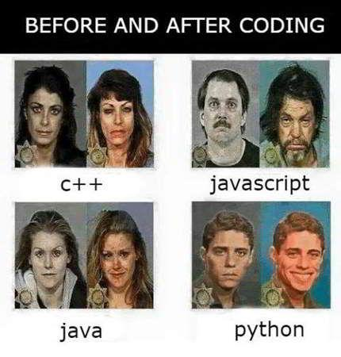
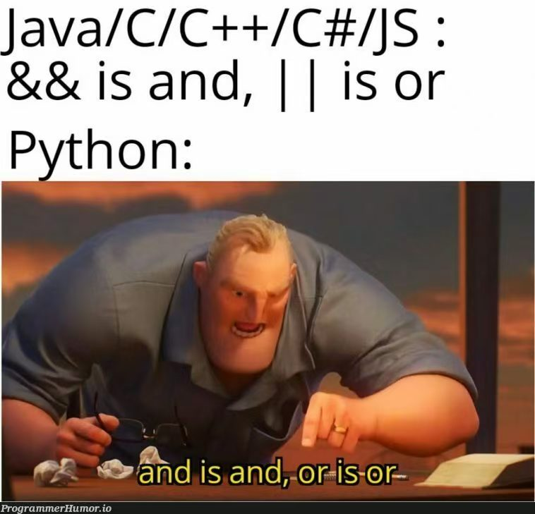

# Python

## Why Python?

Python 是由荷兰人 Guido van Rossum 创造的编程语言，经过[漫长的发展](https://docs.python.org/3/license.html)，现在已经变成了世界上十分流行的编程语言。由于其相对简单易写的特性和良好的生态，其经常被用于网络开发，数据科学，机器学习等诸多方面。目前已经有不少大学（如 [UC Berkeley](https://cs61a.org/), [MIT](https://ocw.mit.edu/courses/6-100l-introduction-to-cs-and-programming-using-python-fall-2022/pages/material-by-lecture/) 等）开始用 Python 为学生入门编程学习的第一个语言，而不是 C 语言。再次强调，它真的很简单！



这里假定阅读本文的人都已经通过程设课程对 C 和 C++ 有初步的了解，*最主要的是能够熟练地摆弄指针*。但 Python 有几个和 C 与 C++ 不同之处：
- 解释型语言：编程语言可分为解释型和编译型两种；对于后者，如 C，源代码需要经过编译器处理成可运行的二进制文件 (如果是 Windows 下，通常会有 `.exe` 扩展名)；前者不需要编译，而是将源代码交给另一个程序去运行，这一程序被称为解释器。
- 动态类型语言：Python 同样存在数据类型，但和 C 等静态类型语言不同的是，Python的变量在运行前并不与类型绑定，即你只有在运行时才能知道变量的具体类型，而在运行之前解释器不会为你做任何的静态检查。*这一点通常误被叫做强类型/弱类型，但静态类型/动态类型才是对这一特征的更贴切的描述*。例如
```python
import random

num_or_str = 100
if random.random() < 0.5: # 50% Chance
    num_or_str = "Now I am a string!"
print(type(num_or_str)) # What is the type of num_or_str?
```
- 不需要显式操作指针：之后详细说明。

学习 Python ~~不仅可以让你学会和蟒蛇打交道，还~~可以使得日常用编程处理小问题方便很多，其良好的生态可以让你不必重复造轮子，相对更高阶的语法和丰富的语法糖更让精力可以放在有必要的地方。Let's start Python! 


## Hello, World!

Python 在 Ubuntu 版本中已经预先安装好，本教程会在 Ubuntu 24.04，Python版本3.12.3 版本进行讲解。对于较为基本的语法，Python 在版本中间较少变动，除非你用的是 Python 2。快切换到 Python 3! 你可以用下列方法验证 python 的版本(注意这里 python3 可以用 python 替代，这里只是个人习惯原因)

```
$ python3 -V
Python 3.12.3
```

在你通常管理项目的路径创建文件夹，创建文件 `main.py`，编辑 `main.py` 的内容为

```python
print("Hello World!")
```

之后运行：

```
$ python3 main.py
Hello World!
```

对于这一程序的解说十分简单—— 在 Python 中，任何用 `"`或`'`符号包围的语句都是字符串，`print` 函数可以将其接收的内容打印到 `stdout` 中，并贴心地为你附上一个换行。因此整段代码的作用便是将字符串字面值 `"Hello World!"` 打印到控制台中，并换行。如果你不想创建文件，也可以直接运行 Python 解释器:

```
$ python3
Python 3.12.3 (main, Jun 18 2025, 17:59:45) [GCC 13.3.0] on linux
Type "help", "copyright", "credits" or "license" for more information.
>>> print("Hello World!")
Hello World!
>>> exit()
```

刚才的程序麻雀虽小，五脏俱全，我们至少可以从刚才的代码知道两条信息：
- Python 有 [Built-in Functions](https://docs.python.org/3/library/functions.html)，它们是不需要导入任何外部模块就可以直接使用的函数；`print()` 在其列。
- Python 不存在显式的程序入口，它简单地将你给它的代码从头运行到尾；我们也可以人为地加上一个程序入口标记:
```python
if __name__ == "__main__":
    print("Hello World!")
```
此处的 `if __name__ == "__main__":`便充当了代码入口的作用；虽然 Python 作为一个解释器并没有那么聪明能够直接认出这一句然后直接开始执行，但是这句话本质上是一个`if`条件句，在我们的`main.py`程序中`__name__ == "__main__"`是为 `True`的（Accept it，暂且不要想[为什么](https://docs.python.org/3/library/__main__.html)），所以后面的语句将会被执行。

哦对了，Python 的语句分割靠换行，代码块分割靠缩进！不要滥用分号和大括号。


## 既然你学过 C，下面内容的想必可以速通吧

### 变量声明

变量声明时不需要额外关键字，也不需要指定类型，只需要直接赋值，如：
```python
a = 3 # int type
PI = 3.1415926
hello_world = "Hello World!" # str type
colleges = [ # list
    "Dushi College", "Rixin College", 
    "Zhishan College", "Wuqiong College"
]
grades = { # dictionary
    "Calculus A(1)": 4.0,
    "Linear Algebra": 3.6
}
a = "3" # Reassign the symbol `a` with a new type and value
```

### 数字和其运算

Python 的数字类型有 `int`, `float` 和 `complex`; `int` 类型并没有一个上限或下限，你可以随意地使用 `int` 而不用担心溢出；`float` 的表现则和 C 语言中的 `double` 完全相同；`complex` 是复数类型。下面是数字和其常见的运算，注意`abs`是一个 Built-in function.

```
$ python3
Python 3.12.3 (main, Jun 18 2025, 17:59:45) [GCC 13.3.0] on linux
Type "help", "copyright", "credits" or "license" for more information.
>>> 1 + 2
3
>>> 5 / 2
2.5
>>> 5 // 2
2
>>> 2 ** 10
1024
>>> (1+2j)*(1-3j)
(7-1j)
>>> abs(3+4j)
5.0
>>> 0.1 + 0.2
0.30000000000000004
>>> 1 << 31
2147483648
>>> -2147483648 >> 31
-1
>>> exit()
```

我们都很熟悉加，减和乘，左移和右移(是[算术右移](https://en.wikipedia.org/wiki/Arithmetic_shift))，按位与(`&`)和按位或(`|`)，按位异或(`^`)；而对于其他运算符，解说如下：
- `/` 是除法运算符，其结果**一定是一个 `float` 类型**；`//` 是整除运算符，如果是 `int` 相整除，其结果仍为 `int`，采用**向下取整**；如果两个操作数有一个为`float`，则结果为 `float` 类型，但其值是一个整数，仍然是向下取整。整除不支持 `complex`。
- `**` 为乘方运算符。支持`int`, `float`之间任何合法的指数操作，`complex` 可以为底数，但不能为指数。

Built-in Function中, `abs()` 用于为`int`, `float`, `complex` 取模长；`pow()`是指数运算，且支持 `complex`作为指数:

```
>>> pow(2.718281828459045, 3.141592653589793j)
(-1+1.2246467991473532e-16j)
```

### 布尔值和条件语句

布尔值的类型为 `bool`，值为 `True` 或者 `False`。为什么是大写？Python 的规范决定了特殊的常量值为首字母大写的，这包括 `True`，`False` 和 `None`。如果你不幸保留了 C 的习惯用小写，那么你会得到来自 Python 的"温馨说明"：

```
>>> if true:
...     pass
... 
Traceback (most recent call last):
  File "<stdin>", line 1, in <module>
NameError: name 'true' is not defined. Did you mean: 'True'?
```

当你的程序出现错误时，Python 会像这样将错误类型和错误信息展示出来。回到布尔值：bool 之间支持逻辑与或非，它们的运算符是…… `and`，`or` 和 `not`！在一众编程语言中真是独特又优雅！

```python
>>> [
...     True and True, True and False,
...     True or False, False or False,
...     not True, not False
... ]
[True, False, True, False, False, True]
```



而能够产生 bool 值的运算符，包括 `>`, `>=`, `<`, `<=`, `==`, `is`, `in`等，前六者适用于数值之间的比较, 以及任何自定义算数比较运算符的类型。`==`主要用于比较值是否相等，`is` 用于比较二者是否是同一对象，i.e., 二者的“本体”所占据的是否是同一块内存空间。如：
```python
a = [3, 4]
b = [3, 4]
print(a == b, a is b)
```
输出为
```
True False
```
需要注意的是：对于`True`, `False`, `None`三者，它们在你的整个程序里都是唯一的，因此可以使用`is`来比较。实际操作中，只使用 `is` 来比较这三个值；其他的判等都用`==`。
```python
a = (3 > 2)
print(a is True)
```
输出
```
True
```
`if` 语句大家都很熟悉，在 Python 中，`if` 后直接跟条件，不刚需括号，写完后尾随一个冒号 `:` 表示`if`的开始，缩进表示 `if` 的范围，如：

```python
x = input("Please give me a integer:") # input() is a built-in,
                                       # and returns a str
x = int(x) # cast str into an int... will be covered later
if x == 42:
    print("The Answer!!!")
elif x < 0: # Use elif instead of else if
    print("Oh it's a negative number")
elif x > 0:
    print("Hooray! It's a positive number.")
else:
    print("What a special result! It's a zero!")
```

### 字符串，可迭代对象和循环

单行字符串可以由 `'` 或 `"` 引起，其内部如果需要包含引号则需要转义，但是如果用单引号引起，双引号则不用转义，反之亦然，如：
```python
comment = "Using L'Hospital's rule, this problem can be easily solved."
advice = 'I think "Wuqiong College" is a good choice for AI learners.'
```

三个双引号用于引起多行字符串，也用于文档注释中(在[软件工程](5-se.mdx)中提到)，例子:
```python
# -*- coding: utf-8 -*-
# ^ Specify the encoding of the source file, since the string contains
#   non-ascii characters
tao_hua_yuan_ji = """晋太元中，武陵人捕鱼为业。缘溪行，忘路之远近。忽逢桃花林，夹岸数百步，中无杂树，芳草鲜美，落英缤纷。渔人甚异之。复前行，欲穷其林。 
林尽水源，便得一山，山有小口，髣髴若有光。便舍船，从口入。初极狭，才通人。复行数十步，豁然开朗。土地平旷，屋舍俨然。有良田美池桑竹之属。阡陌交通，鸡犬相闻。其中往来种作，男女衣著，悉如外人。黄发垂髫，并怡然自乐。 
见渔人，乃大惊，问所从来。具答之。便要还家，设酒杀鸡作食。村中闻有此人，咸来问讯。自云先世避秦时乱，率妻子邑人来此绝境，不复出焉，遂与外人间隔。问今是何世，乃不知有汉，无论魏晋。此人一一为具言所闻，皆叹惋。馀人各复延至其家，皆出酒食。停数日，辞去。此中人语云：“不足为外人道也。” 
既出，得其船，便扶向路，处处志之。及郡下，诣太守，说如此。太守即遣人随其往，寻向所志，遂迷，不复得路。 
南阳刘子骥，高尚士也，闻之，欣然规往。未果，寻病终。后遂无问津者。"""
```

你可以把字符串当作一个类，访问其内置的方法，如
```python
s = "oh no all my words are in the lowercase"
print(s.title())
words = s.split(' ')
print(words)
```
输出
```
Oh No All My Words Are In The Lowercase
['oh', 'no', 'all', 'my', 'words', 'are', 'in', 'the', 'lowercase']
```

而至于`s.split()`的返回类型，则是我们的列表 `list`。列表类似数组，可以存放多个元素，但是元素并不需要有一致的类型；列表的长度也是可变的

```python
primes = [2, 3, 5, 7, 11, 13, 17, 18]
print("The first prime is " + str(primes[0]) + ".") # '+' between strings means
                                                    # string concatenation
primes.pop() # Oops, 18 is not a prime! Remove it
primes.append(19) # Add a new element to it
print(prime)
print("The middle 4 primes are", primes[2:6]) # [5, 7, 11, 13], it's list slicing
                                              # list[a: b] means elements from
                                              # list[a] to list[b-1], i.e. [a,b)
print("Largest known prime is", primes[-1])  # Access the last element
```

和 `str` 一样, `list` 也有很多方法，如`pop`, `append` 等。这些方法会使得 `list` 改变其自身的值，因此 `list` 是**可变(Mutable)类型**。可变类型是学习Python, C#, TypeScript, 或者 Java 等语言所必须掌握的概念，并且 C/C++ 并不存在与之对应的概念，而是以指针和引用的显式操作替代，这一点之后会提及。

元组类似列表，但是是**不可变(Immutable)类型**，其由由逗号分割的多个值组成，由可选的小括号包围。元组也可以用下标访问，如
```python
position = 3, 4
print(position[0])
# Oh I need to move! But:
position[x] += 1 # TypeError: 'tuple' object does not support item assignment
# But I DO want to move! Achieve it by doing so...
position = 4, 4 # Now the position is *reassigned*. But the (3, 4) tuple was
                # still the (3, 4) tuple. It doesn't change!
# tuple has two method...
position5d = (5, 3, -1, -1, 2)
print(position5d.count(-1)) # 2, the time for which -1 has appeared in tuple
print(position5d.index(5)) # 0, the index that 5 has first appeared
```

上面我们可以很清楚地看到**类型的重新赋值**和**可变类型的改变**之间的区别。值是 Immutable 的不妨碍拥有其的变量失去对其的所有权，而拥有其他值；但 Immutable 变量本身的值不会改变；对于 Mutable 的变量，即使持有所有权的我不去改变它，其外部也可能存在其他引用去改变值，如：

```python
lst = [1, 2, 3, 4]
lst_reference = lst # create a reference
a_function(lst_reference) # where lst_reference.append(5) happens
print(lst) # [1, 2, 3, 4, 5]
```

字符串也是 Immutable 的, btw. 另外一个可迭代对象是字典 (Dictionary)，由大括号包围，其内部是一系列键值对，可以理解为另类的列表，只不过下标不再局限于整数。键值对中的 键(key) 是用于查找的令牌，而值就是实际存放的值；键只能是 Immutable 类型，因为 dict 内部采用哈希表实现，而对键可以求哈希的前提就是键是 Immutable 的。
```python
encyclopedia = {
    (3, 4): 5, # Tuple can be a key
    "Tsinghua": "University", # str is ok too
    3.1415: 9265, # or even any kind of number
    42: "Answer",
    3 + 4j: "oops, i am a complex number" ,
}
print("Tsinghua is a " + encyclopedia["Tsinghua"] + ".") # Access the dict
encyclopedia["Peking"] = "University, too!" # Add a key-value pair
# Try mutable keys:
encyclopedia[[]] = "empty list"
# ^ TypeError: unhashable type: 'list'
```

对于 `list`, `tuple`, `dict`这三个可迭代类型，其基本上都是容器；`in` 运算符可以判断容器是否包含某值
```python
my_favorite_number = [42, 52]
if 32 in my_favorite_number:
    print("This line won't be printed.")
if 42 in my_favorite_number:
    print("This line will be printed.")
if 3 + 4j in encyclopedia: # when iterating through dict, we are actually iterating through its keys
    print("Oh, we received a message from our number friend:")
    print("    " + encyclopedia[3 + 4j])
```

Python 中的循环分为 `while` 循环和 `for` 循环；前者和 C 一样是一个加强版的 `if`，后者则只支持范围 `for`，用于遍历可迭代对象，如：
```python
import random # Import a module. random is a built-in module so you don't
              # have to install it

classmates = ["Alice", "Bob", "Carol", "Dave"]
for classmate in classmates:
    print("Hello, " + classmate + "!")

try_time = 0 # Note: `try` is a keyword
while random.random() < 5 / 6: # 1 / 6 Chance
    print("It's not 6! I'll try again!")
    try_time += 1
print("You have tried for", try_time, "times!")
```

`enumerate()` 是一个对于范围 `for` 很实用的 Built-in Function，它接收一个可迭代对象，并返回一个可迭代对象，迭代得来的每一个值都是 下标, 元素 构成的元组。

另一个在 Python 中很有用的机制是元组或列表的解包 (Unpacking)，可以将一个元组或列表拆分成多个值，如 `i, j = (3, 4)` 声明两个变量，且有 `i == 3 and j == 4`，将它和 `enumerate()` 结合起来，便有了带下标的范围 `for`。

```python
contents = [
    "Git, GitHub", "Linux", "Python", "Software Engineering"
]
print("In these day's lectures, we will learn:")
for i, content in enumerate(contents):
    print(str(i + 1) +  ".", content)

# Another useful unpacking: Swapping!
x = 3
y = 4
x, y = y, x # In one line! No temp variable!
print(x, y) # 4, 3
```

### 函数

Python 中的函数由 `def` 关键字引起，如

```python
def plus_one(lst):
    for i in range(len(lst)):
        lst[i] += 1

if __name__ == "__main__":
    lst = [1, 2, 3+4j, 5.5]
    plus_one(lst) # pass by *reference*
    print(lst) # [2, 3 (4+4j), 6.5]
```
```python
def multiply(a, b):
    a *= b

if __name__ == "__main__":
    x, y = 3, 4
    multiply(x, y) # primitive types are passed by copy
    print(x) # 3
    lst = [1]
    multiply(lst, 4)
    print(lst) # [1, 1, 1, 1]. Yes, you can multiply a list by an integer
```
函数也可以存在返回值
```python
def square_root(num):
    return pow(num, 0.5)
```

对于 Python，函数是广义的变量，其也可以进行赋值，传参等操作；lambda 表达式可以进行单行匿名函数的定义，如

```python
def execute(func, var): # func here should be a Callable
    return func(var)

print(execute(lambda x: x + 2), 5) # 7
```

## 一些稍微高阶的 Python，至少这下不能速通了

### 类和对象

`class` 关键字用于定义类，类内可以存在成员函数，构造函数具有特殊的名字——`__init__()`

```python
# Assume that points are (float, float) tuple
def euclid_distance(point1, point2):
    return pow(
        (point1[0] - point2[0]) ** 2 +
        (point1[1] - point2[1]) ** 2,
        0.5
    )
class Triangle():
    def __init__(self, point1, point2, point3):
        self.point1 = point1
        self.point2 = point2
        self.point3 = point3
    
    def length(self):
        return [
            euclid_distance(self.point1, self.point2),
            euclid_distance(self.point2, self.point3),
            euclid_distance(self.point3, self.point1),
        ]

    def area(self):
        a, b, c = self.length()
        p = (a + b + c) / 2
        return (p * (p - a) * (p - b) * (p - c)) ** 0.5

if __name__ == "__main__":
    triangle = Triangle(
        (0, 0),
        (0, 2),
        (2, 0)
    )
    print(triangle.area()) # 1.9999999999999993
```

这一例子定义了一个 `Triangle` 类，并根据三个顶点坐标使用 [Heron 公式](https://en.wikipedia.org/wiki/Heron%27s_formula)计算面积。

问题 1: 什么是 `__init__`?

在 Python 中前后都加双下划线的方法称作 Dunder Method (Double-Underscore Method)，~~为了防止大家看不下去外国人的取名风格~~我们不妨叫做内置方法，之前我们已经使用过`__name__`这一值。前后双下划线的某些名字已经内置，因此我们不要使用这种模式来命名变量、函数和模块。`__init__` 会在一个对象被创建时调用，负责初始化整个类。

问题 2: 什么是 `self`?

注意到这些方法的第一个参数都是 `self`，Python 会将方法的第一个参数作为指向自身的引用，因此任何`self.`都是在访问自身的属性；最好使用 `self`，但是如果习惯了 C++ 想使用 `this`，Python并不会拦着你，但是还是最好使用 `self`！！！

```python
class Six():
    def __init__(this): # It's fine, but don't do that!
        this.num = 6

    def get_num(this):
        return this.num
```

问题 3: 成员变量如何定义的？

成员变量一般在 `__init__` 中进行定义，但如果你对编程有足够敏锐的直觉可能会想到一个邪恶的方面—— Python 定义成员变量用的就是普通的变量赋值语句，如果 Python 没有动态检查要求成员变量一定要在 `__init__` 中定义，那么...

```python
import random

class EvilMembers():
    def __init__(self):
        pass # pass means doing nothing!

    def new_member(self):
        self.member = 10

    def access_member(self):
        return self.member
    
evil = EvilMembers()
if random.random() < 0.5:
    evil.new_member()
print(evil.access_member())
# ^ Result:
# 50%: print 10
# 50%: AttributeError: 'EvilMembers' object has no attribute 'member'
```

真是好邪恶的写法！实际工程中所有的变量都要在`__init__`中被定义！

### 双下划线方法和内置函数

我们到现在为止已经和不少 Built-in 打过交道，如 `print`, `pow`, `enumerate` 等。

`len()` 函数用于获取*各种*可迭代对象的长度，如

```python
lst = [1, 2, 3]
point3d = (4, 5, 6)
grades = {
    "A-": 4.0,
    "B+": 3.6,
    "B": 3.3,
}
ran = range(0, 100, 9)
print(len(lst), len(point3d), len(grades), len(ran)) # 3 3 3 12
```

`len()` 如何做到对于*任何*可迭代对象都获取长度的？对于我们的自定义类型，如何让它支持`len()`？内置的方法当然需要内置的去解决，答案就是双下划线方法：

```python
class LengthIsAnswer():
    def __len__(self):
        return 42

ans = LengthIsAnswer()
print(len(ans)) # 42
```

有很多 Built-in 都是通过调用双下划线方法来实现的，如`len(), int(), str(), bool()`，是的这些看起来像是强制类型转换的函数实际上是 Built-in，并且它们通过调用同名双下划线方法来实现，如

```python
class Rational():
    def __init__(self, numerator, denominator):
        if denominator == 0: # ErrorHandling...
            raise ZeroDivisionError("zero cannot be denominators")
        self._num = numerator # Members begin with "_" is protected members
        self._deno = denominator # Though, they can still be accessed, with a warning
        
    def __str__(self):
        return f"{self._num / self._deno}"

    def __float__(self):
        return self._num / self._deno
    
approximately_pi = Rational(22, 7)
print(approximately_pi) # 22 / 7
print(float(approximately_pi) * 7) # 22
```

双下划线方法也有运算符重载、上下文管理、析构函数等等用途，它们对于简化代码设计、为类实现特殊功能有着重要用途。这些双下划线方法用法可以在[这里](https://docs.python.org/3/reference/datamodel.html#special-method-names)找到。

### 变量作用域

Python 变量的作用域有四种，由短到长分别是：
- 局部变量/函数域变量：由定义之时其，至**函数终结**时结束；注意此类变量的作用域不会被缩进定义的代码块所限制。
- 闭包变量 (Enclosing)：在函数内部可以定义函数，且内层函数可以方位外层的函数域变量，这一变量对于内层函数来说是闭包变量；这类似于其他语言 lambda 表达式的捕获现象。
- 全局变量：在函数之外定义的变量；在程序的任何地方都可以访问，但是函数内部访问时需要用 `global` 关键字声明。不要使用全局变量，全局常量是可以的。
- 内置变量 (Built-in)：Python 的内置变量，显然生命周期是最长的。

至此 Python 大厦的根基已经建立，之后的内容都是为 Python 锦上添花，但也十分重要。

## Python 的其他内容

TODO

### 包管理和虚拟环境

### 生成器和自定义可迭代对象

### 列表推导式

### 上下文管理器

### 常用 Built-in