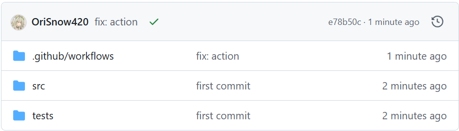

# 软件工程

软件工程的目标在于写出高质量的代码。在学习完程设课程后，给定一个问题，你大概率可以写出一个*能跑*的代码，例如下面是一个子串匹配的函数

```c
int match(const char* str1, const char* str2){
    int x=strlen(str1)-strlen(str2);
    int i,j;
    for(i=0;i<x;i++){
        int y=1;
        for(j=0;j<strlen(str2);j++){
            if(str1[i+j]!=str2[j]) y=0;
        }
        if(y=1){
            return i;
        }
    }
    return -1;
}
```

这种代码或许足够应付程设作业，但却很难完成真实的开发需求。其中一点原因是，你写的代码的生命周期并不止于一次作业，它可能被不同的人（与你合作的开发者、或者未来的你）使用。想象如果你在与他人合作时看到一个`match`函数，看到其函数签名为两个极为相似的`const char*`，返回值是不知所以的`int`，这个函数到底是什么意思？究竟`str1`是子串还是`str2`是子串？而当你想要追究到底，细看函数实现时，噩梦才刚刚开始——不明所以的变量命名，挤在一起的字母和运算符，if内的赋值号——要不还是重写吧！

因此，软件工程意在避免这些。MIT开设的软件工程课程[MIT 6.102](https://web.mit.edu/6.102/www/sp25/classes/01-static-checking/#the_goals_of_6102)中，写出好的代码有三个特征:
- Safe from bugs.
- Easy to understand.
- Ready for change.

做到这三点并不容易，我们需要一些办法来辅助我们完成。

## 维持好的代码规范和代码风格

代码并不只是给机器看的，它也是程序员之间沟通的语言。上述的代码中，`x`, `y` 显然不是好的变量命名策略，像 `tmp`, `data` 之类的名字也不是很好——所有的变量都是临时的，而所有内存中的二进制数的组合都可以表达数据，这两个名字的信息量为0！一个变量名应该足够长（除循环变量外应大于3个字符），由有意义的单词构成，并且应该清楚地表达其含义，比如

```python
# Good Names:
DAYS_IN_A_MONTH = [
    31, 28, 31, 30, # ...
]
length_difference: int = len(str2) - len(str1)

def match_string(pattern: str, text: str) -> int:
    # ...

# Bad Names:
pi = 3.141592653589793 # constant should be CAPITAL
def iAmAFunction(): # functions, variables in python should follow snake_case
    pass
```

代码规范并不仅仅体现在变量命名，大到文件如何排布，小到空格该不该加，代码规范可能对这些方面都有着规定。没有一种代码规范是标准答案，但在同一项目中代码规范应该保持统一，而不应让整个开发组为某个开发者的个人习惯而让步。需要注意的是，不同语言可能有不同的代码规范习惯，比如在Python中，函数一般使用下划线式(snake_case)，而在TypeScript中，习惯使用小驼峰式(camelCase)。

此外，为了实现同一功能，在两种完全等效的写法之间，可能亦有优劣。如下面一段代码:

```cpp
bool CoffeeMaker::makeCoffee(CoffeeType type, int coffee_number) {
    for (int i = 0; i < coffee_number; ++i) {
        if (this->water > 0) {
            if (this->cup > 0) {
                if (this->coffee_beans > 0) {
                    if (this->supportCoffeeType(type)) {
                        if (this->hasElectricity()) {
                            // Finally, we are making coffee...
                        } else {
                            throw CoffeeMakerNoPowerException();
                        }
                    } else {
                        throw CoffeeTypeNotSupportedException();
                    }
                } else {
                    throw RunOutOfCoffeeBeansException();
                }
            } else {
                throw RunOutOfCupException();
            }
        } else {
            throw RunOutOfWaterException();
        }
    }
    return true;
}
```

这种代码的嵌套层数过高，最深处甚至有7层，最要命的是，这一段代码的核心逻辑恰好藏在嵌套最深处，我们不仅要顶着电脑屏幕不够长的风险，又要在编写核心逻辑时心中牢记前六层循环和条件语句带来的额外条件——这咖啡还是不用做了！~~这段代码的改进方式留作课后习题。~~

另一个风格不良代码的例子:
```c
printf("1*1=1");
printf("1*2=2 2*2=4");
printf("1*3=3 2*3=6 3*3=9");
printf("1*4=4 2*4=8 3*4=12 4*4=16");
printf("1*5=5 2*5=10 3*5=15 4*5=20 5*5=25");
printf("1*6=6 2*6=12 3*6=18 4*6=24 5*6=30 6*6=36");
printf("1*7=7 2*7=14 3*7=21 4*7=28 5*7=35 6*7=42 7*7=49");
printf("1*8=8 2*8=16 3*8=24 4*8=32 5*8=40 6*8=48 7*8=56 8*8=64");
printf("1*9=9 2*9=18 3*9=27 4*9=36 5*9=45 6*9=54 7*9=63 8*9=72 9*9=81");
```

写出这段代码不可不谓耐心可嘉，但研发出计算机的初衷似乎是为了减轻人的负担，而不是让写程序的人也陷入机械性劳动中。DRY(Don't Repeat Yourself)是优化程序的一条准则，其可以让程序更加Safe from bugs, 并且Ready for change。上述程序中，单个乘法算式被重复了45次，也就是说如果要改程序则需要同时变动这45个乘法算式——如果少变动一个都会导致结果错误。如果重复代码分散在程序中，如果只对其中一个更改而不更改另一个，那么整个代码将有很大概率出错。如果代码重复在同一处，则用循环解决；代码重复是分散的，则打包成函数。

## 详细且有用的注释

回到上面的代码，观察其函数签名：
```c
int match(const char* str1, const char* str2);
```

这一函数签名包含的信息很少，例如以下信息是并未体现在函数签名中的
- 作为参数的 `const char*` 类型，代表的是字符指针？字符数组？还是C风格字符串？（i.e. 对`str1`, `str2`的假设并不清楚）
- 返回值为 `int`，其代表什么意思？下标从 0 开始还是从 1 开始？如果不匹配，返回多少？处理错误的方式是返回特殊值还是直接 `throw`？

显然这些问题对于使用这一函数来说至关重要，而函数的*文档注释*可以帮助程序员在避免深入内部实现的前提下了解函数的功能，如
```cpp
/** 
 * @brief Find the first index that the substring `pattern` appears in `text`.
 * 
 * KMP Algorithm is used to match the substring. For more details about KMP,
 * see https://en.wikipedia.org/wiki/Knuth-Morris-Pratt_algorithm
 *
 * @param pattern the pattern substring, should be a C-style string.
 * @param text the text string, should be a C-style string.
 *
 * @return the first index that `pattern` first appear in `text`, begin with `0`.
 * if not found, will return -1.
 */
int match(const char* pattern, const char* text);
```

不同的语言可能有不同的文档注释格式。如下方的C#代码和Python代码

```c#
/// <summary>
/// Returns the square root of `num`
/// </summary>
/// <exception cref="Exception">Thrown if num is negative.</exception>
public double square_root(double num)
{
    // ...
}
```

```python
# Example from 
# https://github.com/thuasta/saiblo-worker/blob/main/saiblo_worker/base_match_judger.py
@abstractmethod
async def judge(
    self, match_id: str, game_host_image: str, agent_images: List[Optional[str]]
) -> MatchResult:
    """Judges a match.

    The match will not be judged again if the match has been judged before. So it is OK to get
    the result by calling this method.

    Args:
        match_id: The ID of the match to judge
        game_host_image: The host image
        agent_images: A list of agent images

    Returns:
        The result of the match
    """
```

## 人是易错的……让编译器帮你纠错——静态检查

~~Python哪来的编译器！~~

先看下面的测试题：

请在3秒内判断出运行下面Python的代码可能发生：

1. 正常运行并输出
2. 在运行前你的代码编辑器会发现错误
3. 运行时错误(Runtime Error)
```python
# Assume that utils is a module in this project.
# What is a priority queue? See https://en.wikipedia.org/wiki/Priority_queue
from utils import PriorityQueue

class State():
    def __init__(self, content=None):
        if content is None:
            self._content = []
        else:
            self._content = content

    def get_content(self):
        return self._content

    def __str__(self):
        return f"State: {self._content}"

class Node():
    def __init__(self, state, cost):
        self._state = state
        self._cost = cost
    
    def __lt__(self, other):
        return self._cost < other._cost

    def get_state(self):
        return self._state
    
if __name__ == "__main__":
    state_list = [
        State([1, 2, 3]), State([4, 5, 6]), State([7, 8, 9])
    ]
    node_pq = PriorityQueue()
    for state in state_list:
        cost = 0
        for element in state.get_content():
            cost += element
        node_pq.push(Node(state, cost))
    state_with_lowest_cost = node_pq.pop().get_state()
    print(f"The state with lowest cost: {state_with_lowest_cost}")
    print(f"It's cost is {state_with_lowest_cost._cost}")
```

答案是3, 因为最后的 `state_with_lowest_cost` 的类型为 `State` , 并不存在 `_cost` 属性。这一例子相对简单，所以单靠 Code Review 并非不可能迅速发现 bug。但是当代码规模扩大以后，对 `Node` 和 `State` 的使用可能贯穿整个程序，而对程序员脑容量的负担也随着代码行数上涨而指数上升。混用 `Node` 和 `State` 的错误我在人工智能原理课的 Project 中犯过，也因为此 bug 近乎精神崩溃，~~虽然最后靠着代码调试技巧在五分钟后发现并修掉了~~。但如果将类型检查的任务交给其他工具，则这五分钟的浪费~~和不必要的情绪波动~~是可以避免的。

```python
from typing import List
from utils import PriorityQueue

# State and Node definition...
    
if __name__ == "__main__":
    state_list: List[State] = [
        State([1, 2, 3]), State([4, 5, 6]), State([7, 8, 9])
    ]
    node_pq: PriorityQueue[Node] = PriorityQueue()
    for state in state_list: # state here is automatically inferred to be a State
        cost = 0
        for element in state.get_content():
            cost += element
        node_pq.push(Node(state, cost))
    state_with_lowest_cost: State = node_pq.pop().get_state()
    print(f"The state with lowest cost: {state_with_lowest_cost}")
    print(f"It's cost is {state_with_lowest_cost._cost}") # Warning Here:
    # 无法访问类“State”的属性“cost”
    # 属性“cost”未知 Pylance (reportAttributeAccessIssue)
```

这种将问题在编译时/运行前暴露出来的检查叫做静态检查；将问题在运行时以RE的形式暴露出来为动态检查；如果一段代码既没有静态检查，也没有动态检查，那么它在面对预料之外的输入（或者代码写出bug）时很可能会出现 Wrong Answer。我们希望问题暴露地越早越好——因此静态检查>动态检查>运行时WA。

下面是静态检查和动态检查的另一个例子：
```cpp
// Version 1: Dynamic Checking
int daysInAMonth(std::string_view month, int year) {
    if (month == "January") {
        return 31;
    } else if (month == "February") {
        return isLeapYear(year) ? 29 : 28;
    } else if ( /* ... */ ) {
        // ...
    } else {
        throw Exception("Invalid Month!");
    }
}

daysInAMonth("Feburary", 2025); // Misspelled word, will throw at runtime!

// Version 2: Static Checking
enum class Month {
    January, February, // ...
};
int daysInAMonth(Month month, int year) {
    if (month == Month::January) {
        return 31;
    } else //...
    // Unreachable
    return -1;
}

daysInAMonth(Month::Feburary, 2025); // Misspelled word, compilation error!
```

## 测试先行

### 单元测试

如果你的程设课使用过OJ，那么你应该对测试并不陌生——给你的代码一些输入，看输出是否符合预期：如果结果正确，这个测试点标记为 Accepted，如果结果错误，则各种错误有各种错误的姿势—— Wrong Answer, Runtime Error, Representation Error...

测试的基本思想是将你的代码输入进一堆*精心设计*的测试点，观察是否符合预期输出；如果出现错误，那么这份代码*一定存在* bug，若全部成功，则这份代码*可能正确*。一个简陋的测试框架可能是这样的:

```cpp
#include "your_code.h"

void assert(bool condition, std::string error_message) {
    if (!condition) {
        throw AssertionError(error_message);
    }
}

template<class T>
void assert_eq(const T& real, const T& expect) {
    string_stream ss;
    ss << "Wrong Result! Expected " << expect << ", Got " << real << "!\n";
    assert(real == expect, ss.string());
}

void test_your_function() {
    int input = 0; // Assign

    int real_output = your_function(input); // Act

    assert_eq(real_output, 2 /* Expected, correct output*/); // Assert
}

void test_runner() {
    int success = 0;
    int fail = 0;
    int total = 0;
    try {
        // Run the tests
        total += 1;
        test_your_function();
        success += 1;
    } catch (AssertionError& e) {
        std::cout << "Test failed at test_your_function():\n";
        std::cout << e.what() << "\n";
        fail += 1;
    }
    // Show final result
    std::cout << "Total " << total << " | Success " << success << " | Failed " << fail << "\n";
}
```

当然这份代码并不要求你自己去写，前人可能已经写好了充足的测试框架。因此我们的目光主要放在编写测例上面。例如下面是待测试的代码和一些单元测例

```python
import unittest

def factorial(n: int) -> int:
    """Calculate the factorial of a integer

    Args:
        n: a integer number, the factorial of which will be calculated,
           and should be non-negative.
    
    Returns:
        the factorial of `n`, i.e. n!
    """
    # Skipped! Treat the function as a black box!

class TestFactorial(unittest.TestCase):
    def test_zero_factorial_should_be_one(self):
        self.assertEqual(factorial(0), 1)

    def test_a_default_number_factorial(self):
        number = 6 # 6! = 24         # Assign
        result = factorial(number)   # Act
        self.assertEqual(result, 720) # Assert

    def test_negative_factorial(self):
        number = -1
        result = factorial(number)
        self.assertEqual(result, ???)
```

此处编写了一个阶乘函数，并写了三个测例来测试这个函数。对于任意正整数 $n$ 的阶乘 $n!$ ，有定义 $n! = \displaystyle\prod_{i=1}^n i$，此外还规定 $0!=1$。从定义就可以看出来，这一函数的输入分为两类：零和整数，因此为这两类输入分别设计测例是合理的。

**将输入空间进行划分**是设计测例的基本方法，为划分而来的每一类和各类的边界情况单独设计测例是十分有效且合理的；划分的同一类中应当具有相似性，只有这样才能说，如果此模块对某一类中的一个测例有效，那么我们有理由相信它有更大概率对这一类中的所有输入有效。

这里的第三个测例是对于负数的测试，它并不在输入空间内，文档注释已经对 `n` 的取值范围有着详细的规定。我们不应该测试有效的输入空间以外的输入，这里的第三个测例实际上不应该存在。

请注意我们在实际看到 `factorial` 的实现之前就已经可以着手编写测试了，这种测试显然不涉及内部实现的细节，称作黑盒测试。与之相对的白盒测试是在了解内部实现细节的基础上，针对可能出现 bug 的地方编写测试。实际开发中，我们在编写新模块的具体实现之前，先为其编写测试，开发的目标便由 "实现一个功能" 变为了 "通过所有的测试"。这种编写代码的方式为测试先行。

用于评估测试集的完全程度的指标称作覆盖率 (coverage)，有三种覆盖率 (自翻，并非准确名词)：
- 语句覆盖率：代表所有测试集是否执行了模块中的每一行代码
- 分支覆盖率：对于每一个分支语句 (`if`/各种loop/`break`/`continue`), 测试集是否走遍了每一个分支。
- 路径覆盖率：代码从调用到返回，经过每一个分支语句的一个方式称作路径；此覆盖率描述是否走遍了所有的路径。

显然语句完全覆盖弱于分支完全覆盖，而分支完全覆盖又弱于路径完全覆盖。分支完全覆盖是我们的目标，但实际上连语句覆盖率也很难达到 $100\%$——因为存在不可到达的代码（如上面月份判断的Version 2）。路径完全覆盖几乎不可能，因为路径数回随着分支语句的增加呈现指数增长，这几乎不可能做到完全覆盖。

### 集成测试

上面记载的测试称作单元测试，用于测试程序的某一个部分是否正常运作。与之相对的是**集成测试**：确认程序整体是否运作完好；集成测试可以测试出来各个模块之间的沟通是否良好，例如各个模块之间交流的数据格式是否一致，各个模块是否符合事先设计的协议，等等。

## 工欲善其事，必先利其器

:::warning
本章节假设你使用 VSCode 作为代码编辑器。对于其他代码编辑器，如果存在插件市场，则应该可以下载类似功能的插件。
:::

### 拼写检查

在过去一年的在科协的集体开发经历中，所经历的最多的错误便是typo——打错字！不仅有注释拼错单词，变量名写错，最严重的一个错误是由于 Client 大范围存在拼写错误，已经到了积重难返的地步，以至于 Server 必须使用同样错误拼写后的单词来与 Client 保持一致。

部分功能齐全的IDE，如 JetBrains 开发的 IntelliJ IDEA 或者 PyCharm 是自带拼写检查的，它们甚至会帮你纠正注释中的英语语法。对于 VSCode，一个叫做 Code Spell Checker 的绿色插件是我一直在用的，它包含最基本的拼写检查，可以对不存在的或拼写错误的单词提出警告。

### 代码风格检查

对于 Python 代码风格的检查可以使用 Pylint，而对于类型的检查可以使用 Pylance。具体的配置方法不再赘述，但这二者确实会在我写 Python 代码的时候检查出很多不显眼的代码规范问题，~~也让我在看别人发过来的 Python 文件时爆出一堆警告。~~

另一个很好用的 Python 代码规范工具是 [black](https://github.com/psf/black)，它对于什么时候换行，空格加在哪，该不该加括号有着很好的把握，~~我知道这个插件的缘由在于写 saiblo_worker 时不用 black 格式化则过不了CI~~。

对于 C++ 的代码规范可以参考我为 [THUAI8编写的指南](../../../contests/07-THUAI8/3-sdk/index.md#c-sdk)。

## CI/CD

软件工程的最后一个主题是 CI/CD, 全称为 Continuous Integration / Continuous Delivery，即持续集成/持续部署。这一名称乍看很抽象，其中内涵也需解释—— CI 代表将修改的代码持续地且频繁地放入共享代码库中（并进行测试），而 CD 代表将测试通过的代码自动部署至生产环境，并且便于开发者在时机成熟时快速发布可靠的软件。

还是很抽象，不如先上手看看 CI/CD 到底如何实现的。假设我们有如下 git 仓库
```
├── .github
│   └── workflows
|       └── test.yml
├── src
|   ├── utils.py
|   └── main.py
└── tests
    └── test.py
```

其中 `src` 存放了我们写的代码，`tests`存放了我们写的测试。 CI的目标是当我们向远程仓库提交 push / Pull Request 时新代码能够自动运行 `tests` 中的测试，并向开发者反应测试结果。

我们使用的CI/CD服务基于GitHub Actions，而上述的过程被记载在 `.github/workflows/test.yml` 中。对于 `.github/workflows` 中的任何一个文件，其都代表了一个工作流 (workflow)。每一个工作流都可以被事件 (event) 触发，包含一个或多个可顺序运行或并行运行的任务 (job)，而每一个 job 都有若干步骤 (step)，每一个步骤都可以执行一个命令或运行可复用的行动 (action)。每一个 job 都运行在一个 runner 上。

说了这么多术语，不如让我们解说一下 `test.yml`:

```yml
name: Test Python Files # The name of the workflow

on: [push] # A push is an event. The workflow will be triggered automatically
           # when there is a push on the repository.

jobs:      # Defining the jobs of the workflow
  build:   # The name of the job is "build"
    runs-on: ubuntu-latest # Specify the runner of the job

    steps: # In yaml files, a dash means the start of a new item.
    - uses: actions/checkout@v4 # This step uses an action, cloning the code
                                # in the repository to the runner
    - name: Set up Python       # This is another step
        uses: actions/setup-python@v5 # And uses another action to setup python
        with:
          python-version: 3.12  # This action accepts input, specified with
                                # the word "with".
    - name: Running tests
        run: python -m unittest   # Another step, runs command. Done!
```

此 workflow 规定了这样一个流程：当有人在任意分支 push 代码时，触发工作流，运行名字为 build 的 job：将代码复制到 runner 上，配置好 Python 环境，运行测试。如果测试成功，你可以在 GitHub上看到一个绿色的小对勾，如下图：

注意到我们使用了两个别人写的 action, 包括 `actions/checkout@v4` 和 `actions/setup-python@v5`. 以后者为例，这一 `action` 实际上[存放在 GitHub 中](https://github.com/actions/setup-python/tree/v5/)，其根目录下的 `action.yml` 是该 action 的内容。可以看到其存在 `inputs` 字段，我们用到了其中的 `python-version`，并用 `with` 字段进行了指定。

再看一个更复杂的 workflow，用于科协网站的部署：
```yml
# https://github.com/thuasta/thuasta.org/blob/main/.github/workflows/build.yml
on:
  pull_request:
  push:
  workflow_dispatch: # Used to run workflow manually

jobs:
  build:
    needs: typecheck # build is After typecheck
    runs-on: ubuntu-latest
    steps:
      - uses: actions/checkout@v4

      - uses: actions/setup-node@v4
        with:
          node-version: 22.x

      - run: |
          npm install --omit=dev
          npm run build

      - uses: actions/upload-pages-artifact@v3
        with:
          path: build/

  deploy:
    if: github.ref == 'refs/heads/main' && github.event_name == 'push'
    environment:
      name: github-pages
      url: ${{ steps.deployment.outputs.page_url }} # access the output of
                                                    # an action
    needs: build # After build, then deploy
    permissions:
      id-token: write
      pages: write
    runs-on: ubuntu-latest
    steps:
      - uses: actions/deploy-pages@v4
        id: deployment

  typecheck: # This is actually the first job
    runs-on: ubuntu-latest
    steps:
      - uses: actions/checkout@v4

      - uses: actions/setup-node@v4
        with:
          node-version: 22.x

      - run: |
          npm install
          npm run typecheck

```

这是一个含有三个 jobs 的 workflow。其中 `build` 和 `deploy` 都用 `needs` 来指定 job 运行的先后顺序，如果不指定这三个将并行运行，显然不是我们所希望的。`deploy` 语句还指定了条件——只在被 `push` 的时候运行，防止 PR 时出现了意外的重置网站。