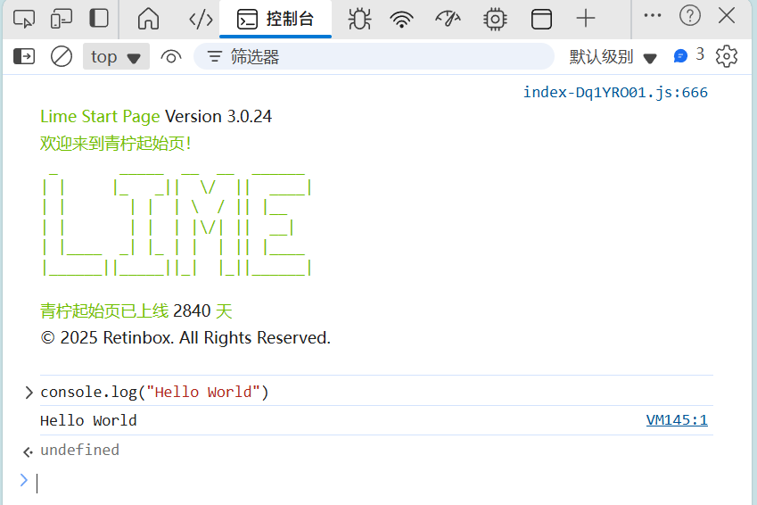

# TypeScript

## 从 JS 到 TS

JavaScript 被广泛应用于 [Web 开发](10-web/2-js_ts.mdx)等领域，其有两个特性和 Python 相似:
- 解释型语言
- 动态类型

此外 JavaScript 也属于 C 家族，其各种基本语法，如 `if-else`, `switch-case`,`while`, `do-while`, `for` 等关键字的用法与 C **完全一致**，需要与 C 区别的地方在于变量类型和变量的定义。

JavaScript 没有静态类型检查，而 TypeScript 弥补了这一部分。TypeScript 是 JavaScript 的超集，任何 TypeScript 代码都可以经过静态类型检查后转化为 JavaScript 去运行。TypeScript 并不需要单独的运行时，因为其本质上就是 JavaScript。

现在你可能迫不及待想要配环境写 `Hello World!` 了，但是别急，其实 JS 的运行时远在天边近在眼前，就在你用来浏览本教程的浏览器中。以 Edge 为例，按下 F12 （~~对不起，手机端用户~~），点进控制台，我们得到了一个现成了 JavaScript 解释器。向其中打出

```js
console.log("Hello World!");
```

回车，我们就看到了心心念念的 `Hello World!`。当然如果你追求使用 PowerShell 或 bash 来运行 JS 代码，可以安装一个 [Node.js](https://nodejs.org/en) (Preferred!)。~~忽略[青柠起始页](https://intro.limestart.cn/)的内容。~~



安装 Node.js 后它就可以作为 JavaScript 的运行时了，创建名为 `script.js` 的文件写上 `console.log("Hello World!");`, 命令行运行 `node script.js`, 我们就得到了 `Hello World!`.

## JS 基础

欲学 TS, 必先学 JS. 鉴于 Web 部分已经有比较详尽的介绍，这里只介绍 JS 最基本的想法：

### 怎么哪里都是 undefined？

JS 没有很详细的动态检查，而是将大部分由于各种错误而无法得到的值留为 `undefined`，例如下面被 `console.log` 出来的值都是 `undefined`

```js
let a;
console.log(a);
```

```js
var x = 3;
{
    console.log(x); // !?
    var x;
}
```

```js
let arr = [1, 2, 3,]; // Last comma will be ignored
console.log(arr[3]);
```

```js
function print_third(a, b, c) {
    console.log(c);
}

print_third(1, 2);
```

### 函数和闭包

函数不仅可以像一般情况被定义，还可以像一个变量一样去到处赋值，传参，返回，如

```js
function name_getter_getter(name) {
    return function () {
        return name;
    }
}

let bar = name_getter_getter("Foo");
console.log(bar()); // Foo
```

注意当一个函数作为返回值被返回时，其所捕获的 `name` 变量也被带了出来，即使捕获后变量的生命周期会超出不捕获情况的生命周期。

还有一个很有意思的写法：

```js
let result = function () {
    let sum = 0;
    for (let i = 0; i < 100; ++i) {
        sum += i;
    }
    return sum;
}();
console.log(result); // 4950
```

这种方法下我们把一个代码块放到一个临时函数中，紧接着直接调用这个临时函数，得到了其返回值，此时这一个大代码块的类型就变成了 `number`，可以任由我们操纵。熟悉 Rust 的读者可能很快联想到下面的写法

```rust
fn main() {
    let result: i32 = {
        let mut sum = 0;
        for i in 0..100 {
            sum += i;
        }
        sum
    };
    println!("{:?}", result);
}
```

这二者的核心思想都是用一个大代码块的值来代替其本身，用于构成其他代码的一部分。

### 对象 Object

对象本质上就是拥有一系列属性（成员变量，成员函数）的集合体，并且这些属性是高度动态的，和 Python 如出一辙（但显然比 Python 没有底线得多）。

```js
let name = "Tsinghua University";
let university = {
    name, // equivalent to `name: name,`
    location: "Haidian District, Beijing",
    [() => "departments"]: ["DA", "CST", /* etc. */ ],
    welcome_student(student) {
        console.log(`Welcome to ${this.name}, ${student}!`);
    },
}

// Add new...
university.buildings = ["3rd Teaching Building", "6th Teaching Building"];
```

## TypeScript 的类型标注

