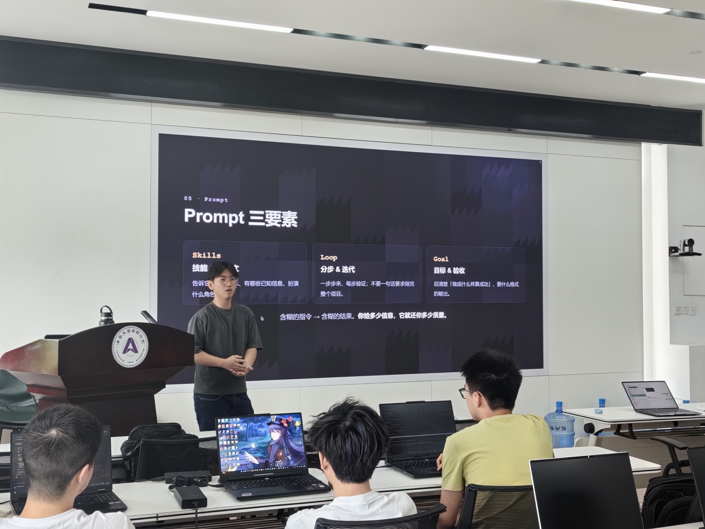
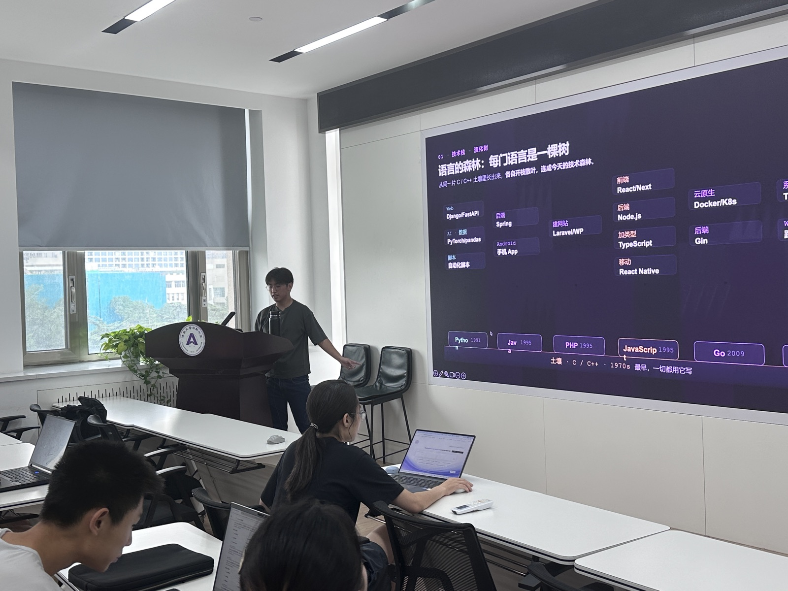

# Vibe Coding

- 讲师：林钲凯
- 时间：2026 年 7 月 4 日
- 培训录像：[腾讯会议回放](https://meeting.tencent.com/crm/l77RQ3EVb0)（录制于 2026-07-04）

## 这门课讲什么

用自然语言描述需求，让 AI 先写代码，人来判断方向和验收结果。不是说不用懂代码，而是把精力从逐字敲代码挪到判断和引导上。把 AI 当成一个会写代码的实习生来带，要求讲得越清楚，它做得越好。

整个工作流是一个循环：想法，拆需求，写提示词，AI 生成，验收，调试，然后回到拆需求再来一圈。关键是每一圈都让项目能跑起来，小步快跑，别让 AI 一次写一大坨。

## 课程大纲

### Part A：打基础

1. **认识技术栈**。JavaScript 这条线怎么长出 TypeScript、Node.js、React、Next.js、Vite；各门语言分别管什么。选型建议很简单，选最主流的，AI 见得最多，出错最少。新手起手式是 React + Vite + Tailwind CSS，部署用 Vercel。
2. **选对工具**。三类工具挑两三个就够。想真正学会写代码，用 AI 编辑器（Cursor、Windsurf、GitHub Copilot）；习惯终端、要做仓库级改动，用终端 Agent（Claude Code、Codex CLI）；不碰代码快速出原型，用网页端的 App Builder（Lovable、Bolt.new）。
3. **搭好环境**。Node 和 npm 的基本操作；API key 放进 `.env` 并写进 `.gitignore`，泄露一次就得作废重来；Git 管版本，GitHub 管协作，main 分支开保护，改动走 PR 加 review。

### Part B：跑流程

4. **拆需求**。一句话想法太含糊，AI 会乱猜。拆成"谁用、做什么、功能清单、先做哪个"，永远先做最小可用版本。用 GitHub Projects 管进度，一个功能一张卡片。
5. **写提示词**。四样都得有：角色、上下文、任务、约束。分步迭代，每步验证，别一句话要求做完整个项目。你给多少信息，它就还你多少质量。
6. **判断与调试**。AI 只保证跑通正常那条路，不保证正确、健壮、安全。接受代码前先问三个问题：能不能一句话讲清它在干嘛？有没有想到意外情况？有没有混进你没让它做的东西？答不上来就让它解释或重做。常见的坏味道包括幻觉依赖、死代码、留一堆 TODO 假装完成、写死密钥、一次改一大片、只顾正常路径。涉及付款、删数据、账号权限、对外上线的代码，看不懂就不要上线。调试四步：复现，读报错，缩小范围，把报错原文带上下文贴给 AI。
7. **动手实战**。写一句话需求，`npm create vite` 建项目，逐个功能写提示词让 AI 实现，验收调试，最后 git push 部署上线。

## 资源清单

- 先装好：VS Code 或 Cursor、Node.js (LTS)、Git 和 GitHub 账号、一个 AI 助手
- 查文档：React 官方文档、Vite 官方文档、MDN；遇到报错先搜索，再问 AI
- 练手建议：今晚做一个待办小页，明天加一个功能，部署完发群里

学这个最快的办法就是现在打开电脑做一个。
