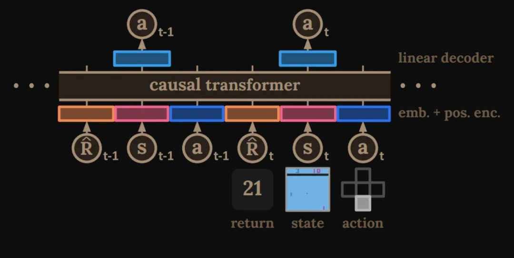
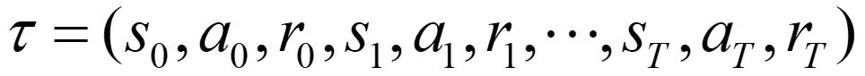
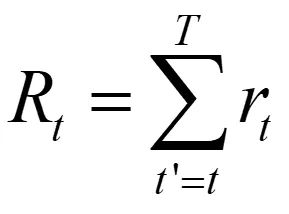
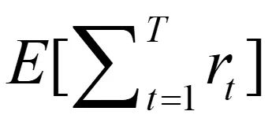
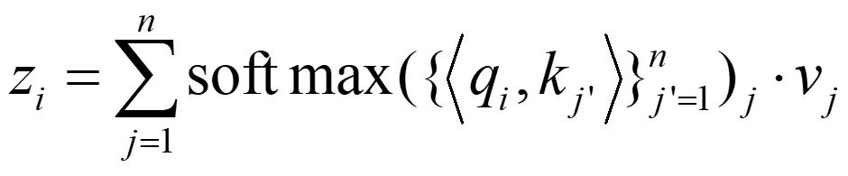
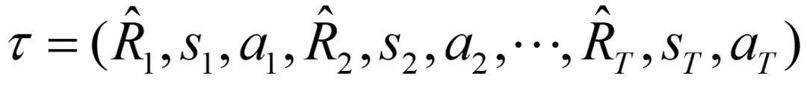
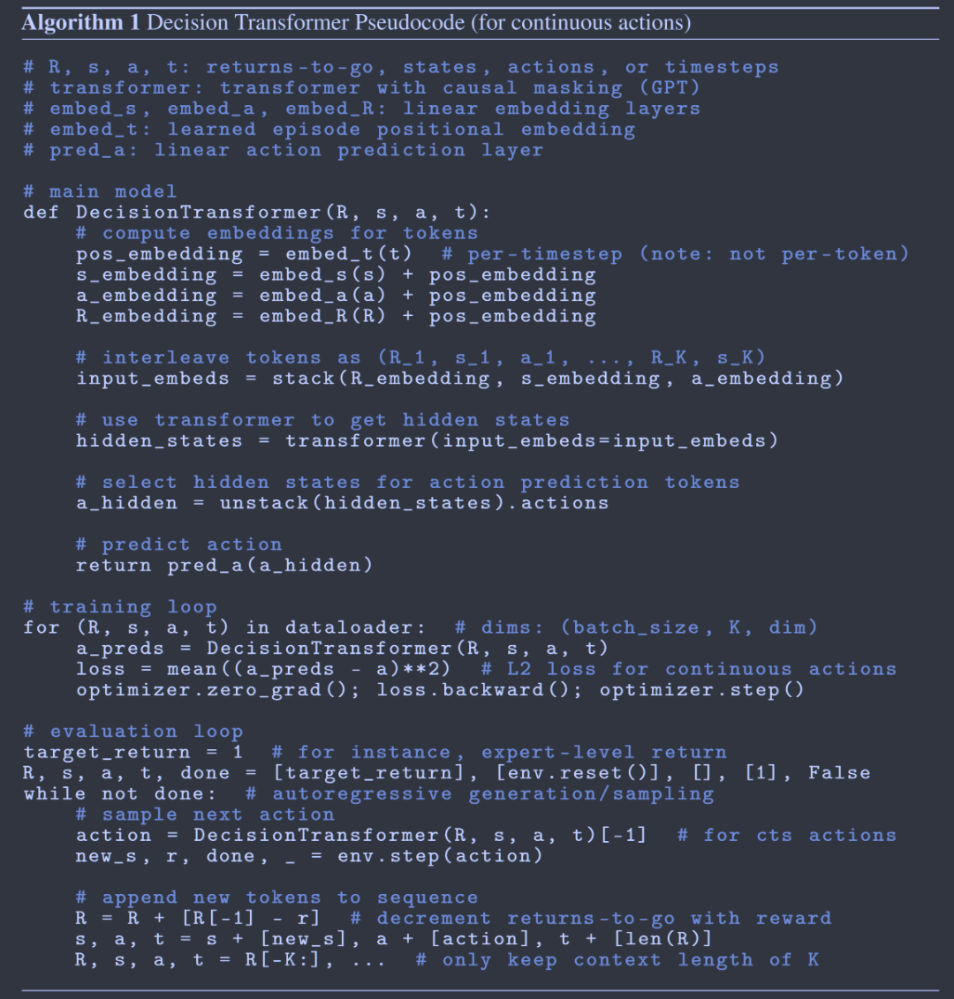
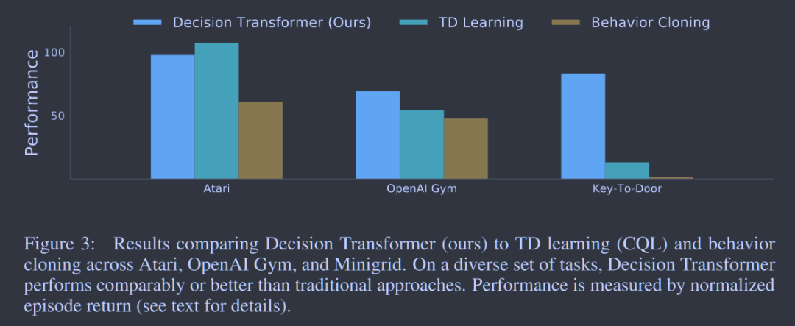
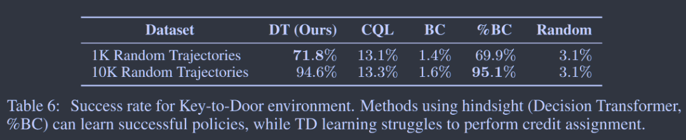
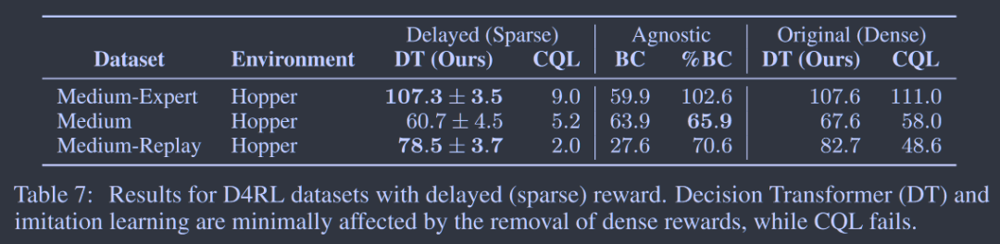

# 文献解读：Decision Transformer

:::note

[阅读原文](https://mp.weixin.qq.com/s/Rzz3y7e56gWNqAcq_v7Ksw)

:::

:::info[论文链接]

[**https://arxiv.org/pdf/2106.01345**](https://arxiv.org/pdf/2106.01345)

:::

## 背景

强化学习（Reinforcement Learning, RL）近年来在游戏、机器人控制和自动驾驶等领域取得了显著进展。然而，传统的强化学习方法通常依赖于价值函数估计或策略梯度优化，这些方法在高维环境、长期规划和稀疏奖励问题上存在一定的局限性。此外，在许多实际场景中，智能体无法与环境进行交互，而是需要利用离线数据进行学习，这进一步增加了挑战。

Decision Transformer 提出了一种全新的思路，即将强化学习任务转化为序列建模问题，并利用 Transformer 架构强大的建模能力来预测最优策略。这一方法在离线强化学习、复杂任务规划以及非马尔科夫决策问题中表现优异，特别适用于需要长期决策的应用，如机器人导航、自动驾驶策略优化和大规模决策系统等。

## 主要贡献

1. **提出了一个将强化学习（RL）抽象为序列建模问题的框架**
   - 传统 RL 方法：
     - 拟合价值函数
     - 计算策略梯度
   - 新方法将 RL 问题转化为条件序列建模，通过对状态、动作和奖励序列的联合分布建模来替代传统的 RL 算法。

2. **通过利用因果掩码 Transformer**，基于期望回报（奖励）、过去的状态和动作进行条件设置，Decision Transformer 模型可以生成实现期望回报的未来动作。

## 预备知识

### 离线 RL

在 MDP 中定义，轨迹由状态、动作和奖励序列组成：

在时间步 t 的轨迹回报：

RL 的目标是学习一个使期望回报最大化的策略：

在离线 RL 中，智能体只能使用任意策略的轨迹数据集而不能与环境交互，这比原始 RL 设置更具挑战性。

### Transformer

设计用于建模长序列数据（如文本或图像），由带残差连接的堆叠自注意力层组成（包括编码器和解码器）。

对于每个注意力块：输入 token x 经过线性变换得到 q, k, v 和输出 token

这使得 transformer 模型能够捕捉强化学习问题中状态和回报的关联。

在本工作中，我们使用 GPT 架构，它使用因果屏蔽。我们只对前面的 token 求和，而不是对 n 个 token 求和。

**优势**：

1. 可以建模具有丰富语义信息的高维数据（长序列）；
2. 零样本和分布外泛化能力；
3. 稀疏奖励（注意力机制）。

## 方法

### 轨迹表示

$\widehat{R}_T$ 表示未来回报，即预期未来奖励的总和。未来回报将作为模型的指令，基于预期回报和当前状态来预测动作。

为什么不使用即时奖励？  
我们只需要给出初始未来回报作为输入，因为后续的未来回报可以根据上一个未来回报和即时奖励计算得出。这样初始化更加方便，并且更加具有指导意义。

### 架构

**原始架构**

1. x → q, k, v（K 个 token）
2. 位置编码

**我们的架构**

1. 状态→状态嵌入，动作→动作嵌入，未来回报→未来回报嵌入（线性层）（3K 个 token）
2. 时间步嵌入（按时间步而不是按 token）

### 轨迹表示

给定离线轨迹，从数据集中采样长度为 K 的轨迹批次，预测动作并最小化损失。

## 评估

Decision Transformer 表现有效且出色，特别是在长期奖励归因方面。

对于小数据集，Decision Transformer 比 Behavior Cloning 表现更好。

相比于需要密集奖励才能表现良好的方法（如 TD 和 CQL），Decision Transformer 具有很大优势。

## 总结

总的来说，Decision Transformer 将一种新的序列建模的方式引入了强化学习的问题当中，在长期规划、非 MDP 问题、稀疏奖励问题上表现的比传统的强化学习算法更加出色，并且离线的学习方式也让收集大量数据进行训练成为了可能。未来我们在解决类似强化学习的问题，或者更为困难的问题时，Decision Transformer 可能可以作为一个不错的基准模型，供我们进行改进与提高，使其更加适应我们的问题解决。
