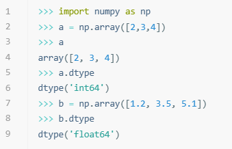
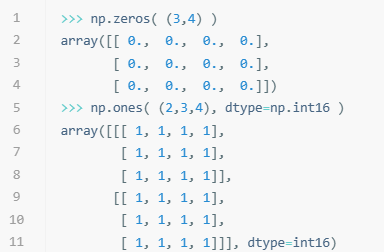
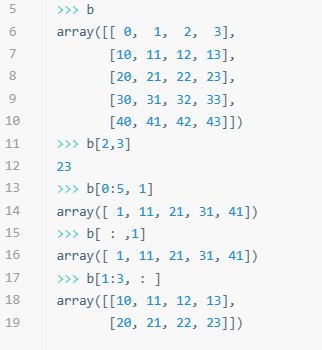
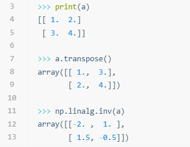

# NumPy

:::note

[阅读原文](https://mp.weixin.qq.com/s/yMiJzZQNsgVy1IQIZ-Pc9Q)

:::

Python 是一种高级脚本语言，具有简洁、优雅、易读的语法，让编程变得更加轻松愉快。Python 还拥有强大的动态类型系统和自动内存管理，让开发者不必担心变量声明和内存分配等繁琐的细节。此外，Python 支持多种编程范式，如面向对象、函数式、过程式等，开发者可以根据不同的需求选择合适的风格。

自诞生以来，Python 被广泛用于科学计算和数据分析领域。它拥有大量优秀的第三方库和框架，如 NumPy、SciPy、Pandas、Matplotlib、Scikit-learn 等。这些库和框架提供了丰富的功能和方法，如数组操作、线性代数、统计分析、可视化、机器学习等。它们不仅功能强大，而且易用性高，让开发者可以快速进行数据处理和分析。在 AI 时代，Python 成为了开发人工智能的主流语言，TensorFlow、Pytorch 等框架帮助开发者快速搭建智能体并进行训练。本期我们为大家带来数据处理的利器——**NumPy**。

## What's NumPy

NumPy 是 Python 中科学计算的基础包。它是一个 Python 库，提供多维数组对象，各种派生对象（如掩码数组和矩阵），以及用于数组快速操作的各种 API，包括数学、逻辑、形状操作、排序、选择、输入输出、离散傅立叶变换、基本线性代数、基本统计运算和随机模拟等。

越来越多的基于 Python 的科学和数学软件包使用 NumPy 数组。虽然这些工具通常支持 Python 的原生数组作为参数，但它们在处理之前会将输入的数组转换为 NumPy 数组，并且通常输出为 NumPy 数组。换句话说，为了高效地使用当今基于 Python 的科学/数学工具（大部分的科学计算工具），你只知道如何使用 Python 的原生数组类型是不够的 - 还需要知道如何使用 **NumPy 数组**。

## 快速入门 NumPy

### 创建数组





### 索引



### 矩阵运算



:::info

进一步学习可以参考：

- [NumPy 官方文档](https://numpy.org/doc/stable/)
- [NumPy 菜鸟教程](https://www.runoob.com/numpy/numpy-tutorial.html)

:::

## 扫雷游戏

《扫雷》是一款大众类的益智小游戏，游戏目标是在最短的时间内根据点击格子出现的数字找出所有非雷格子，同时避免踩雷。我们已经为大家搭建好游戏框架，并在代码中提供了充分引导。使用 NumPy 的相关方法补全函数，实现属于你自己的扫雷游戏吧！

:::tip

- 运行游戏需要安装 NumPy 和 Pygame：

  ```bash
  pip install numpy pygame
  ```

- 代码可以通过[**链接**](https://cloud.tsinghua.edu.cn/d/71e62493db9748809840/)下载。

:::

<center>

</center>
