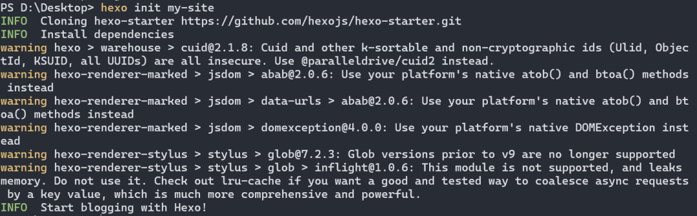
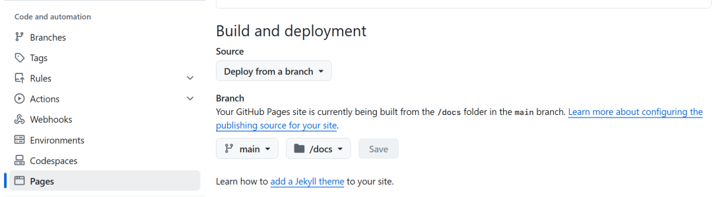

# 如何搭建并部署自己的个人网站

:::note

阅读原文：[[上]](https://mp.weixin.qq.com/s/PgFrr2HFhqd6uQiK_V0Y5w) / [[下]](https://mp.weixin.qq.com/s/_Uknye1cVQxUcNvL2b2KDA)

:::

随着互联网的发展，个人博客成为了许多人分享知识、记录生活的重要平台。也许你想要一个记录自己生活的地方，又或者在申请季需要一个学术主页，那么搭建一个自己的个人网站是不错的选择。对于想要建立一个高效、美观的个人网站的技术爱好者来说，直接写网页三件套无异于用与非门手撸计算机，在灵活性和可拓展性上毫无优势。因此一些静态网站生成器应运而生，**Hugo** 和 **Hexo** 就是其中两个非常受欢迎的选择，它们会按照模板文件，把 [Markdown](../../../learning_resources/markdown.md) 文件渲染成相应的网页。本文将深入浅出地介绍如何使用这两个工具搭建静态网站，并将其部署到 GitHub Pages 上，让你零成本拥有属于自己的个人网站。


## 预备工作

### 必需软件安装

- **[Git](../../../learning_resources/vcs/git.md)**：用于版本控制和与 GitHub 进行交互。
- **Node.js（仅 Hexo 需要）**：JavaScript 运行环境，用于安装和运行 Hexo。
- **Go（仅 Hugo 需要）**：编程语言，Hugo 是由 Go 编写的。
- **[VS Code](../../../learning_resources/vscode.md)（强烈推荐）**：代码编辑器，用于编辑 Markdown 文件和其他源代码，当然使用其他代码编辑器也可以（当然不用代码编辑器也可以，只是应该不会真的有人在记事本里写代码吧）。

你可以通过命令行输入 `git --version`、`node -v`（或 `npm -v`）和 `go version` 来检查是否已正确安装这些软件。如果未安装，可以从官方网站下载并安装适合你操作系统的版本，如果遇到问题可以尝试自行搜索解决，网络上的教程浩如烟海，一定可以解决你的困难。

### [GitHub](../../../learning_resources/repo/github.md) 账户

如果你还没有 GitHub 账号，现在就去注册一个吧！GitHub 是一个面向开源及私有软件项目的托管平台，它允许我们免费创建公共仓库来存放项目代码。最重要的是，GitHub 还提供的静态网站托管服务 GitHub Pages，可以让你免费部署个人网站。

:::info[为什么需要部署？不部署不行吗？]

小学二年级就学过的计网知识告诉我们，在访问一个网站时，浏览器会先向 DNS 服务器查询域名对应的 IP 地址，然后再向该 IP 地址发送请求。服务器收到请求后，会返回网页内容给浏览器，并完成之后的渲染等工作。

换句话说，只有将网站部署到开放公网 IP 的服务器上，才能让其他人通过互联网访问到你的网站。否则即使你的网站已经搭建好了，也只有你自己能在本地访问到（本地部署 + 内网穿透？也不是不行，但你不会想自己的网站在熄灯后便挂掉吧：）。

因此部署就是指将网站从本地环境发布到互联网上，或者更具体地讲，发布到某个提供网站访问服务的服务器上，使全世界都能访问到你的网站。

<details>
<summary>从输入网址到看见网页的大致过程</summary>

从你在浏览器的地址栏中输入一个网址并按下回车键开始，到最终看到网页内容，整个过程中会发生一系列复杂的操作。这些操作可以大致分为以下几个步骤：

1. **DNS 解析（Domain Name System）**

   - **请求**：首先，你的浏览器会尝试将你输入的域名（例如 `example.com`）转换成 IP 地址，因为计算机在网络上是通过 IP 地址来识别和通信的。
   - **查询**：如果这个域名的信息不在本地缓存中，浏览器会向 DNS 服务器发送查询请求。这个过程可能涉及多个 DNS 服务器，包括根 DNS 服务器、顶级域（TLD）DNS 服务器以及权威 DNS 服务器。
   - **响应**：一旦找到匹配的 IP 地址，DNS 服务器会将结果返回给你的浏览器。

2. **建立 TCP 连接**

   - **三次握手**：使用获得的 IP 地址，浏览器会尝试与目标服务器建立 TCP（Transmission Control Protocol）连接。这涉及到所谓的“三次握手”过程：客户端发送 SYN 包，服务器回应 ACK + SYN 包，然后客户端再次回应 ACK 包确认连接。
   - **端口**：默认情况下，HTTP 使用 80 端口，HTTPS 则使用 443 端口。如果你访问的是一个安全网站（HTTPS），还会在此阶段进行 SSL/TLS 加密握手，确保数据传输的安全性。

3. **发送 [HTTP](../../../learning_resources/networking/http.md)/HTTPS 请求**

   - **GET 请求**：当 TCP 连接成功建立后，浏览器会通过 HTTP 或 HTTPS 协议向服务器发送一个 GET 请求，请求特定资源（如网页的 HTML 文档）。这个请求包含了用户代理信息、接受的内容类型等元数据。
   - **Host 头**：特别地，在 HTTP/1.1 及更高版本中，请求中还包括了一个 `Host` 头部，指明了具体的主机名，这对于共享同一个 IP 地址但托管多个域名的服务器来说非常重要。

4. **服务器处理请求**

   - **接收请求**：Web 服务器接收到请求后，会根据 URL 路径查找相应的文件或调用应用程序逻辑生成动态内容。
   - **执行脚本**：如果是动态网站，服务器可能会运行服务器端脚本语言（如 PHP、Python、Node.js 等）来生成响应内容。
   - **数据库查询**：某些情况下，服务器还需要从数据库中检索数据以完成页面的构建。

5. **返回响应**

   - **状态码**：服务器会根据处理结果返回一个 HTTP 状态码（如 200 表示成功，404 表示未找到页面等）。
   - **内容**：除了状态码外，服务器还会返回实际的网页内容，通常是以 HTML 格式为主，也可能包含 CSS 样式表、JavaScript 脚本等。

6. **浏览器渲染页面**

   - **解析 HTML**：浏览器接收到服务器返回的数据后，开始解析 HTML 文档，构建 DOM 树（Document Object Model）。
   - **加载外部资源**：HTML 文档中可能引用了外部资源，如 CSS 文件、JS 文件、图像等。浏览器会发起额外的 HTTP 请求去获取这些资源，并按照文档中的顺序依次加载。
   - **应用样式和脚本**：当所有必要的资源都被下载下来后，浏览器会应用 CSS 样式规则，并执行 JavaScript 代码，以实现交互性和视觉效果。
   - **呈现页面**：最后，浏览器将完成的页面呈现在屏幕上供用户查看。

7. **用户交互**

   - **事件监听**：此时，页面已经完全加载完毕，用户可以开始与之互动，比如点击链接、填写表单、滚动页面等。任何用户动作都可能触发 JavaScript 事件，导致页面更新或发起新的网络请求。

8. **断开连接**
   - **保持连接**：对于现代浏览器，默认情况下会保持与服务器的连接一段时间（称为持久连接或 Keep-Alive），以便后续请求能够更快地得到响应。
   - **关闭连接**：当不再需要保持连接时，双方可以协商断开 TCP 连接，释放网络资源。

随着技术的发展，诸如 HTTP/2、HTTP/3 等新协议的应用也在不断优化这一过程，使之更加高效、安全。

</details>

:::

## 选择框架

对于静态网站生成器，有 Hugo、Hexo、Jekyll、Docusaurus、mkdocs 等多种选择。在本文中，我们将重点介绍 Hugo 和 Hexo 这两款流行的框架，它们都有着自己的特点和优势，只需根据个人喜好和需求任选其一即可。

### Hugo

- **特点**：速度非常快，支持多种输出格式，内置大量短代码，易于扩展。
- **适用人群**：追求速度和性能优化的用户，或者希望快速生成内容的开发者。
- **生成原理**：Hugo 采用 Go 模板引擎，通过解析 Markdown 文件和其他资源文件生成 HTML 页面。

### Hexo

- **特点**：轻量级，丰富的插件库，活跃的社区支持。
- **适用人群**：喜欢简洁配置和多样化主题选择的用户。
- **生成原理**：Hexo 基于 Node.js，利用 EJS 模板引擎处理 Markdown 文件等源文件，最终生成静态网页。

## 安装和初始化

### 安装 Hugo/Hexo

根据你选择的框架，分别执行如下命令安装：

- **Hugo**：请前往官方下载页面找到对应版本下载并安装（强烈推荐安装 extended 版本且尽量不要安装最新的版本以避免适配问题，通常来说从最新版本往前倒推 5~8 个版本相对比较稳定）。对于各个平台，Hugo 都提供了预编译的二进制文件，安装非常简单。但是要记住把 Hugo 的安装路径添加到系统环境变量中，这样你就可以在任何地方使用 `hugo` 命令了。

- **Hexo**：打开命令提示符或终端，输入 `npm install -g hexo-cli` 即可安装。

### 初始化项目

- **Hugo**：创建一个新的目录作为你的站点根目录，然后在该目录下运行 `hugo new site .` 命令。这里的 `.` 表示当前目录，Hugo 会在当前目录下生成配置文件和其他必要文件，可以通过 `--format` 参数指定配置文件格式，可以为 yml 或者 toml 或者 json。当然也可以在选定的父目录下运行 `hugo new site <folder>`，其中 `<folder>` 是你想要创建的文件夹名称。

  

- **Hexo**：直接在目标位置执行 `hexo init <folder>`，其中 `<folder>` 是你想要创建的文件夹名称。

  

<details>
<summary>这一串命令应该在哪里执行？</summary>

- **Windows**：打开[命令提示符（cmd）或 PowerShell（终端）](../../../learning_resources/os/terminal.md)，通过 `cd` 命令切换到你的站点根目录之后运行。
- **macOS/Linux**：打开终端，同样通过 `cd` 命令切换到站点根目录之后运行。

最方便的还是直接在 VS Code 中打开站点根目录，然后在集成终端中执行这些命令。

</details>

<details>
<summary>这个尖括号是什么意思？</summary>

尖括号 `< >` 表示其中的内容是需要替换的，实际输入时不需要带上尖括号。比如 `hugo new site my-site` 中的 `my-site` 可以替换为你想要的文件夹名称，但是尽量不要使用中文、空格或特殊字符，以免出现问题。**本文中所有的尖括号都是这个意思。**

</details>

## 选择并应用主题

两个框架都有丰富的主题库供你挑选。你可以访问 [Hugo Themes](https://themes.gohugo.io/) 或 [Hexo Themes](https://hexo.io/themes/) 寻找心仪的样式。下载所选主题后，按照文档说明将其集成到你的项目中。有时可能需要安装额外的插件或依赖，具体操作请参考主题的文档。

- **Hugo 主题**：通常可以将存放主题文件的仓库下载到站点根目录下的 `themes` 文件夹中，下载后的目录结构应该类似于下面这样：

  ```plaintext
  my-site/
  ├── archetypes/
  ├── content/
  ├── ...
  ├── themes/
  │   └── my-theme/
  │       ├── layouts/
  │       ├── static/
  │       ├── ...
  ├── ...
  ```

:::warning

对于 Hugo 框架的模板，这里请尽量在 release 页面下载压缩包再解压到 `themes` 文件夹中，而不是直接 `git clone` 或 `git submodule add`，因为有些主题的 master 分支可能是开发中的版本，有可能存在一些问题。另外通过 `git submodule` 或 `go module` 添加主题的方式常常由于网络问题导致下载失败，所以如果你对自己的网络环境没有充分信心，请尽量避免使用这两种方式。如果你选择的模板有较多的依赖，那么请自行搜索如何配置 `go module` 的代理，以加快下载速度。

:::

- **Hexo 主题**：同样将主题文件夹解压后直接放在站点根目录下的 `themes` 文件夹中即可，绝大多数主题提供通过 `npm` 安装的方式，跟随主题的文档操作即可。主题文件夹的目录结构应该和上面的 Hugo 主题类似。

## 配置网站

大多数主题会提供一个开箱即用的示例网站文件夹，包括示例内容和示例配置等，存放在主题文件夹的 `exampleSite` 目录下。你可以将这个文件夹中的内容复制到站点根目录下，然后根据需要进行修改。这样可以快速搭建一个符合主题要求的网站，省去了从零开始配置的烦恼。

每个框架都有自己的配置文件，通常位于站点根目录下的 `config.toml/config.yml`（Hugo）或 `_config.yml`（Hexo）。在这里你可以设置网站的基本信息如标题、副标题、作者名、语言、时区等，还可以指定主题和其他参数。通常主题的模板文件或 `exampleSite` 中会提供这个主题的配置文件，将其复制到项目的根目录中，并根据自己的需求进行修改。

:::info[一些必须配置/替换的参数]

- **Hugo**

  - **baseURL**：网站的基础 URL，通常是你的 GitHub Pages 地址。
  - **theme**：指定使用的主题名称。注意要和主题文件夹的名称保持完全一致。
  - **publishDir**：指定生成的静态文件存放的目录，默认为 `public`，需要改为 `docs`。

  最终配置文件中应该包含类似如下的内容：

  ```toml
  baseURL = "https://<username>.github.io/"
  theme = "my-theme"
  publishDir = "docs"
  ```

- **Hexo**

  - **url**：网站的 URL 地址，通常是你的 GitHub Pages 地址。
  - **theme**：指定使用的主题名称。注意要和主题文件夹的名称保持完全一致。
  - **deploy**：指定部署方式，通常是 `git`。

  最终配置文件中应该包含类似如下的内容：

  ```yaml
  url: https://<username>.github.io/
  theme: my-theme
  deploy:
    type: git
    repo: https://github.com/<username>/<username>.github.io.git
    branch: main # 或者 gh-pages
  ```

:::

做完这些，网站的基本结构就已经齐全了，请确保你的项目结构类似于下面这样：

```plaintext
my-hugo-site/
├── archetypes/
│   └── default.md
├── content/
│   ├── posts/
│   │   ├── my-first-post.md
│   │   └── ...
│   └── ...
├── assets/
├── layouts/
├── static/
├── themes/
│   └── my-theme/
│       ├── layouts/
│       │   ├── _default/
│       │   │   ├── list.html
│       │   │   ├── single.html
│       │   │   └── ...
│       │   ├── partials/
│       │   │   ├── footer.html
│       │   │   ├── header.html
│       │   │   └── ...
│       │   └── shortcodes/
│       ├── assets/
│       ├── static/
│       └── ...
├── config.toml  # 也可能是 config.yaml 或 config.json 或 config 文件夹
└── ...
```

## 本地预览

完成上述步骤后，可以通过 `hugo server`（Hugo）或 `hexo s`（Hexo）启动本地服务器，在浏览器中查看效果。这有助于你在发布前发现潜在的问题并及时调整。如果能够成功启动本地预览服务器，那么恭喜你，网站的基本框架已经搭建完成了！可以开始添加内容和优化页面了。但如果很不幸终端中出现了一些错误，那么请仔细阅读报错信息，并检查之前的步骤，看看是不是哪里出了问题。

:::tip

由于网络问题，一些诸如 Twitter Card、Youtube 之类引用外部资源的短代码可能无法正常加载，这会导致预览构建失败。如果你在构建时遇到了类似的问题，仔细查看报错的位置，可以尝试将这些资源注释掉，或者直接将引用了这些资源的页面（通常为 `rich-content` 这类文章）删除，以确保构建成功。

:::

## 添加内容

无论是 Hugo 还是 Hexo，都主要使用 Markdown 编写文章。你可以通过各自的命令行工具轻松创建新文章，例如 `hugo new posts/my-first-post.md` 或 `hexo new "My First Post"`。通过命令行创建的新文章会自动使用 **archetypes** 中的模板填充 Front Matter 中的相关信息，当然你也可以直接在 **content**（Hugo）或 **source**（Hexo）文件夹中新建 md 文件/文件夹，但此时需要记得手动添加 Front Matter。正文自然就是使用 Markdown 格式编写，并且可以在刚刚打开的预览页面实时查看效果。编辑完后，记得保存文章才能应用修改并查看效果。

<details>
<summary>什么是 Front Matter？</summary>

Front Matter 是位于 Markdown 文件开头的一段元数据，通常用于指定文章的标题、日期、标签、分类等信息。它以三个短横线 `---` 开始和结束，中间是一系列键值对，如下所示：

```yaml
---
title: 'Hello World'
date: 2024-12-10T16:50:49+08:00
lastmod: 2024-12-10T19:36:29+08:00
tags: ['Hugo', 'Hexo', 'GitHub Pages']
categories: ['posts', 'tutorials']
description: 'This is a sample post.'
summary: 'A brief introduction to Front Matter.'
draft: true
comments: true
hideMeta: false
searchHidden: false
ShowBreadCrumbs: true
ShowReadingTime: false
---
```

Front Matter 中的内容会被静态网站生成器解析并应用到生成的网页中，因此它对于文章的元信息和展示效果非常重要。对于不同的框架和主题，Front Matter 的字段可能会有所不同，具体可以参考主题的文档或示例文章。

</details>

## 部署到 GitHub Pages

为了让你的网站能够被全世界看到，我们需要将其推送到 GitHub Pages。以下是具体步骤：

1. **创建 GitHub 仓库**  
   在 GitHub 上新建一个公共仓库，命名为 `<username>.github.io`，其中替换为你的 GitHub 用户名。例如我的 GitHub 用户名为 `SunnyCloudYang`，那么我的仓库就应该叫 `SunnyCloudYang.github.io`。如果使用的是 Hugo 框架，需要在这个仓库的 Pages 设置中将 **Source** 分支设置为 `master`（或 `main`），将 **Folder** 设置为 `/docs`；如果是 Hexo 框架且 config 中 deploy 的 branch 配置为了 `gh-pages` 的话，则需要将 **Source** 分支设置为 `gh-pages`，否则设置为 `master` 或 `main`，**Folder** 设置为 `/(root)`。

   - 部署分支为 `main` 且生成文件在 `docs` 文件夹中时：  
      
   - 部署分支为 `gh-pages` 时：  
      

2. **部署操作**  
   根据所用框架，部署操作稍有不同：

   - **Hugo**：结束本地预览后，运行 `hugo` 命令生成静态文件，此时你会发现 `docs` 文件夹底下多出了许多文件，它们就是生成的正式网页。接着将根目录中的所有文件（包括 `docs` 文件夹）推送到上述 GitHub 仓库中。这里需要注意的是，如果你的配置文件中 `publishDir` 已经设置为了 `docs`，那么直接推送整个项目文件夹即可；如果没有设置，则需要将 `public` 文件夹单独推送到上述 GitHub 仓库中，并将仓库 Pages 设置中的 **Folder** 设置为 `/(root)`。

   - **Hexo**：结束本地预览后，检查 `_config.yaml` 中 deploy 的设置无误，依次运行 `hexo g`、`hexo d` 即可部署。

3. **访问网站**  
   稍等片刻后访问 `https://<username>.github.io/` 即可看到上线后的网站。

**Success!** 至此，你已经成功搭建并部署了自己的个人网站！

---

## 后期维护

对于 Hugo 和 Hexo，后期维护主要涉及内容更新、主题更换和插件安装。内容更新只需在 `content` 或 `source` 目录下添加新的 Markdown 文件即可。主题和插件的更换通常在配置文件中指定或通过包管理器安装。

:::tip

如果你想要进一步优化网站，那么可以先从以下几个方面开始：

1. 首先是全面阅读主题文档，了解主题的各种配置选项和功能，根据自己的需求进行调整。
2. 探索各种插件和短代码，如评论系统、社交分享、代码高亮等，为网站增加更多功能。
3. 优化网站性能，考虑使用 CDN 加速图片加载、压缩 CSS/JS 文件以减少页面加载时间、启用缓存等，提升用户体验。
4. 定期更新内容（需编辑 Markdown 文件后重新生成并部署），保持网站的活跃度，吸引更多访客。

:::

:::warning

虽然静态网站相对安全，但仍需注意保护个人信息，避免泄露敏感资料。

:::

在维护中很重要的一点就是 **READ and SEARCH before you ask!**，即在遇到问题时先仔细阅读报错信息，查阅文档和搜索引擎，尝试自己解决问题。如果实在无法解决，再向社区或论坛寻求帮助。这样不仅可以提高自己的解决问题能力，也能更好地融入开源社区，获得更多的帮助和支持。

## 进阶用法

日久天长，随着你和你的网站慢慢熟悉，除了基本的内容更新，总有一天你会想要尝试一些更高级的功能。以下是一些进阶用法，可以帮助你更好地定制和优化网站：

- **自定义域名**：可以购买一个个性化的域名，并将其绑定到 GitHub Pages 上。
- **SEO 优化**：通过添加适当的元标签、结构化数据等方式提高搜索引擎排名。
- **数据分析**：通过 Google Analytics 等工具了解访问者行为，优化网站内容和布局。
- **自动化部署**：使用 GitHub Actions 等工具实现自动化构建和部署，减少手动操作。
- **模板定制**：根据自己的需求修改主题模板，实现更个性化的网站设计。

限于篇幅，这里只是简单提及了一些进阶用法，详细的教程和指南可以在官方文档或搜索引擎中找到。希望你能在实践中不断探索，发现更多有趣的功能和技巧。

## 常见问题解答

**Q：网站无法正常显示？**  
A: 检查主题设置是否和主题文件夹名称一致、路径是否正确以及是否缺少必要的依赖项。

**Q：如何加快构建速度？**  
A: 尝试清理缓存、禁用不必要的插件或减少资源文件的数量。

**Q：为什么网站中的图片显示不出来？**  
A: 检查图片路径是否正确，图片属于网站静态资源，应该放在 `static`（Hugo）或 `source`（Hexo）文件夹中。在文章中或模板中引用图片时，路径应该是相对于这两个文件夹的。以 Hugo 框架为例，在 `static/images` 文件夹中有一张图片 `example.jpg`，那么在文章中引用就应该写成 ``，配置文件中引用同理。

**Q：如何添加评论系统？**  
A: 可以使用第三方评论插件，如 Disqus、Giscus、Gitalk 等，根据插件提供的文档进行配置。

**Q：网站中可以添加 PDF 吗？**  
A: 可以，将 PDF 文件放在 `static`（Hugo）或 `source`（Hexo）文件夹中，然后在文章中添加链接即可。但是点击链接之后的具体行为（直接打开、下载等）取决于访问者浏览器的设置。如果想在页面中嵌入 PDF（类似教参平台的效果），则需要使用额外的插件或工具。

**Q：其他注意事项**  
A: 避免使用中文、空格或特殊字符作为文件名、文件夹名或 URL，以免出现编码问题。对于 Hugo，由于其本身仍在快速迭代，有些主题可能不兼容最新版本，需要等待主题更新或手动回退 Hugo 版本。对于 Hexo，请记得不要把 `node_modules` 文件夹推送到 GitHub 仓库中。

---

通过以上步骤，你应该已经成功搭建了一个属于自己的静态个人网站。无论你是选择了 Hugo 还是 Hexo，都可以享受到它们带来的便捷性和灵活性。随着经验的积累，相信你会越来越熟练地掌握这些技能，并且能够根据自己的需求不断改进和完善网站。祝你在创作的道路上越走越远！
