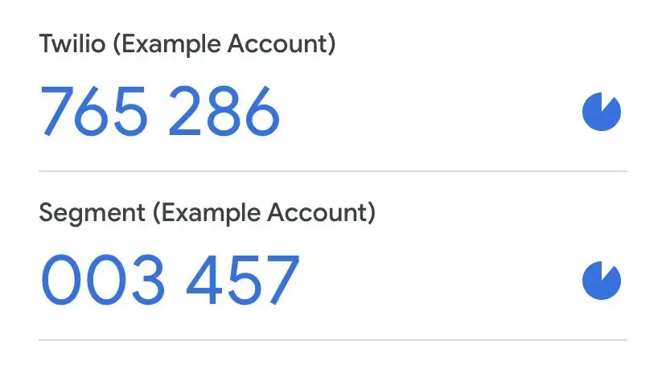
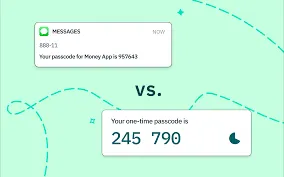
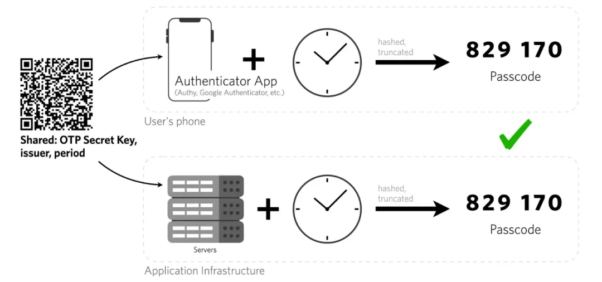

# TOTP，让你的账户更安全

:::note

[阅读原文](https://mp.weixin.qq.com/s/dfH0o6gzTtj-dIezl9T1KA)

:::

小北是华清大学的一名大三学生，专业是计算机科学。他的生活离不开各种在线服务：校园邮箱、在线课程系统、科研文献数据库、社团管理网站，还有他的个人博客。一天，他在图书馆自习时，手机收到了一封来自“华清大学邮件系统”的提醒：“您的账户在新设备上登录，如非本人操作，请尽快修改密码。”

小北顿时警觉，他并没有在其他设备上登录邮箱。难道是密码泄露了？他立刻回想：上次改密码是在半年之前，虽然他用的是“超级安全”的组合——带符号、大小写混合、十二位数以上——但互联网是个危险的地方，总有意想不到的手段让黑客窃取信息。

在华清大学的技术支持论坛草台上，小北发帖求助。一位匿名台友回复到：“快开 **TOTP**！”

## 什么是 TOTP？

TOTP，全称基于时间的一次性密码（Time-based One-Time Password），是一种双因素身份验证（2FA）技术。简单来说，它让用户除了输入静态密码（如“超级安全”的密码）外，还必须输入一个随时间变化的动态验证码，通常是 30 秒内有效的 6 位数。它已被互联网工程任务组接纳为 RFC 6238 标准，成为主动开放认证（OATH）的基石，并被用于众多多重要素验证系统当中。


<details>
<summary>它和短信验证码不同</summary>

小北疑惑：“不是有短信验证码吗？为什么还要搞个 TOTP？”

短信验证码（SMS OTP）确实也是一种双因素验证方式，但它存在几个问题：

- **不可靠**：短信可能因信号问题延迟，甚至收不到。
- **可拦截**：黑客可以通过“SIM 交换攻击”劫持用户的手机号码，直接收到验证码。
- **依赖运营商**：出国时，手机可能无法收到短信，而 TOTP 依赖本地 App，可离线使用。

TOTP 生成的验证码完全基于设备本地计算，无需依赖外部网络，因此更安全、更快捷。



</details>

## TOTP 的工作原理

好奇心强的小北决定深入研究 TOTP 的运作方式。

当用户启用 TOTP 时，服务端会生成一个**密钥（Secret Key）**，通常是一个 32 位的 Base32 编码字符串，并提供一个二维码。用户可以用 TOTP 认证 App（如 Google Authenticator、2FAS、Microsoft Authenticator，~~其余广告位招租~~）扫描这个二维码，App 会把密钥安全地存入本地。

之后，每当用户需要登录时，App 会使用当前时间和存储的密钥进行 HMAC-SHA1 计算，生成一个 **6 位动态验证码**。这个验证码只有短暂的有效期，例如 30 秒，而服务器也会用相同的算法计算当前的正确验证码进行匹配。



小北惊讶地发现，这意味着只要客户端和服务器的时间同步，TOTP 就能保证“你必须持有正确的密钥，并且在正确的时间生成正确的验证码”，极大增强了安全性。

在了解了原理之后，小北迅速打开了编辑器，仅用了不到 20 行代码，就完成了一个简单的 TOTP 生成器：

```python
import time
import hmac
import hashlib
import base64
import struct

def generate_totp(secret: str, time_step: int = 30, digits: int = 6) -> str:
    """
    生成基于时间的一次性密码 (TOTP)
    :param secret: Base32 编码的密钥
    :param time_step: 时间步长（秒），默认 30 秒
    :param digits: 生成的 TOTP 长度，默认 6 位
    :return: 生成的 TOTP 代码
    """
    # 解码 Base32 密钥
    key = base64.b32decode(secret, casefold=True)
    # 获取当前时间步
    counter = int(time.time() // time_step)
    # 将时间步转换为 8 字节的二进制格式
    msg = struct.pack(">Q", counter)
    # 计算 HMAC-SHA1 哈希值
    hmac_digest = hmac.new(key, msg, hashlib.sha1).digest()
    # 取 HMAC 结果的最后一个字节的低 4 位作为偏移量
    offset = hmac_digest[-1] & 0x0F
    # 提取 4 字节整数，并与 0x7FFFFFFF 进行位与操作，确保是正整数
    code = struct.unpack(">I", hmac_digest[offset:offset+4])[0] & 0x7FFFFFFF
    # 取后 `digits` 位作为 TOTP
    otp = str(code % (10 ** digits)).zfill(digits)
    return otp

# 示例密钥（实际应用请使用随机生成的安全密钥）
secret_key = "JBSWY3DPEHPK3PXP"  # Base32 编码的密钥
# 生成 TOTP
totp_code = generate_totp(secret_key)
print("当前 TOTP 代码:", totp_code)
```

## TOTP 还能防止哪些攻击？

1. **防止密码泄露攻击**：如果黑客窃取了小北的静态密码，但没有他的手机，他们仍然无法登录。
2. **防止中间人攻击**：就算小北在公共 Wi-Fi 下登录，黑客截获了密码，也无法复用验证码，因为它短时间内就过期了。
3. **防止撞库攻击**：TOTP 让密码泄露的影响大大降低，黑客不能轻易利用泄露的静态密码进行大规模尝试。

## 设备依赖与 TOTP 的不足

但 TOTP 也有一些挑战：

- **设备丢失**：如果小北的手机丢了，TOTP 应用里的所有密钥也会随之消失。这就是为什么许多服务会提供“恢复码”，让用户可以在设备丢失时恢复账户。
- **时间同步问题**：如果手机和服务器的时间偏差过大，验证码可能无法匹配。不过大多数系统允许一定的时间窗口（通常是前后 1 分钟）来减少这个问题。
- **不支持多个设备**：TOTP 的密钥通常只存储在一个设备上，不能像短信验证码一样随意更换设备。
- 不限制登录尝试的 TOTP 实现容易被暴力破解，因此尝试次数限制必须非常少。
- **窃取到预共享密钥**的攻击者可以随意生成新的非法的 TOTP 代号。如果攻击者攻破大型的认证数据库，这就会是个问题。
- 所有基于一次性密码的认证方案（包括 TOTP、HOTP 和其他方案）都会暴露于**会话劫持**当中，比如可以在登录后强征用户的会话。

<center></center>

## TOTP 和应用专用密码、扫码登录的区别

小北想到，某些服务（比如 GitHub）提供“应用专用密码”，而有些（比如微信）提供“扫码登录”，它们和 TOTP 又是什么关系呢？

- **应用专用密码**：这是一种针对特定 App 生成的独立密码，主要用于不支持 2FA 的旧系统。比如 GitHub 在命令行登录时无法输入 TOTP，就允许用户生成一个“专用密码”作为替代。
- **扫码登录**：像微信的二维码登录，本质上是一种基于会话授权的方式，不需要手动输入密码。虽然比传统密码登录更安全，但仍然需要额外验证手段（比如 TOTP）来提高安全性。

    

## 结局

得知这些信息后，小北立刻为自己的校园邮箱、GitHub 账号、网盘等重要服务开启了 TOTP，并用密码管理器妥善保存了恢复码。

几天后，他在食堂排队时，看到同学小张焦急地发帖：“校园邮箱被盗了！谁能帮帮我？”

小北笑了笑，评论区打下几个字：“TOTP。”

从此以后，小北再也不用担心自己的账号被盗了。他不仅自己用上了 TOTP，还向朋友们安利这个方法——毕竟，安全无小事，危险处处有！

:::info[参考资料]

- [RFC 6238 - TOTP: Time-Based One-Time Password Algorithm](https://tools.ietf.org/html/rfc6238)
- [OATH - The Initiative for Open Authentication](https://openauthentication.org/)
- [TOTP: Time-Based One-Time Password Algorithm](https://en.wikipedia.org/wiki/Time-based_One-time_Password_Algorithm)

:::
