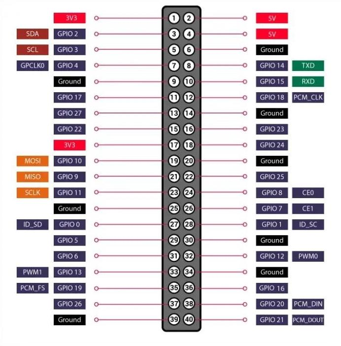
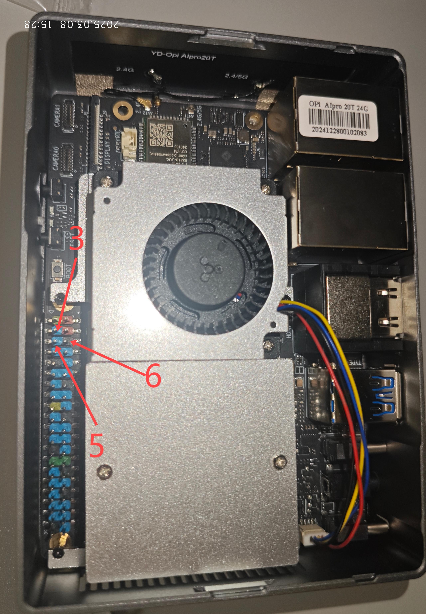

# 颜色识别与机械臂运动

## 硬件连接

### 连接拓展板和 PWM 舵机

舵机的连接方法如下所示：


:::tip

舵机的深色（黑色或棕色）线是负极。

:::

### 连接香橙派与拓展板

首先展示一下香橙派的端口：



香橙派与拓展版的通讯采用的是 i2c 协议。需要连接三根线：SDA、SCL 和 GND，即 3、5、6 引脚。
  
拓展板的 3、5、6 引脚如下图所示：


香橙派的 3、5、6 引脚如下图所示：


:::tip

将二者对应的 3、5、6 顺序连接，注意不要插错。

:::

## 克隆仓库

首先，打开终端或命令提示符，并使用 `git clone` 命令克隆[具身智能大赛仓库](https://github.com/thuasta/thuei-1)：

```bash
git clone https://github.com/thuasta/thuei-1.git
```

:::tip

- 如果在使用 git 克隆仓库的过程中出现问题，可以参考以下链接解决：[如何从 GitHub 上克隆一个仓库？](https://blog.csdn.net/qq_58995858/article/details/132425990)
- 推荐在使用 root 用户的情况下克隆仓库，能省去很多目录调整以及权限设置的工作。

  <details>
  <summary>使用 root 用户的登陆方法</summary>

  在 SSH 连接输入 ip 地址时，将原来的 `HwHiAiUser@...` 更改为 `root@...` 即可，密码和 HwHiAiUser 是一样的。登录成功后再进行克隆仓库操作。

  </details>

:::

## 颜色识别代码

颜色识别代码的存储路径如下所示：

```bash
thuei-1\sdk-python\Functions\ColorDetect.py
```

在 `Function` 目录下运行以下命令行：

```bash
python ColorDetect.py
```

<details>
<summary>可能的问题及解决方案</summary>

- 摄像头没有显示
  - 驱动问题，解决方案参考[摄像头调试文档](../camera/#常见问题排查)。
  - 硬件连接问题，摄像头不支持热插拔，连接好以后重启香橙派。
- 程序无法运行
  - 库缺失，使用 `pip install` 安装相应的库。
  - 显示窗口无法打开，这个程序需要在 VNC 上或者使用 HDMI 线接入显示屏后运行，SSH 连接时会出现窗口错误。

</details>

## 机械臂运动代码

该部分代码的存储路径如下所示：

```bash
thuei-1\sdk-python\HiwonderSDK\Servo_test.py
thuei-1\sdk-python\HiwonderSDK\PWMServoControlDemo.py
```

在 `HiwonderSDK` 目录下运行以下命令行：

```bash
python ColorDetect.py
```

`PWMServoControlDemo.py` 文件中展示了舵机设定角度和延时的基本方法。

<details>
<summary>可能的问题及解决方案</summary>

- 程序报错
  - 安装所需的库，命令为 `pip install ...`，其中 `...` 为所需的库名。
- 路径问题
  - 找到相应位置的文件地址，检查地址是否正确，比如 `yaml_handle.py` 文件中第 2，3 行的文件地址出现错误。
- 权限错误
  - 使用 [root 用户登录](#克隆仓库)，再进行上面的操作。

</details>
