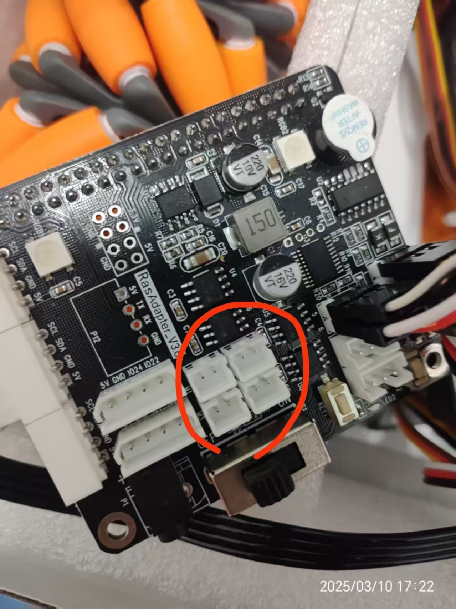

# 小车巡线避障

## 克隆仓库

打开终端或命令提示符，并使用 `git clone` 命令克隆[具身智能大赛仓库](https://github.com/thuasta/thuei-1)：

```bash
git clone https://github.com/thuasta/thuei-1.git
```

详情可见[克隆仓库文档](../servo/#克隆仓库)，推荐使用在 root 用户中进行克隆。

:::warning

仓库代码中的 `Functions` 部分的函数（e.g. `ColorDetect.py`）只有在 root 权限下才能检测到文件夹 `../` 下的模块 `ArmIK` 和 `yaml_handle` 等。选手调试时可以进行如下操作：

1. 在 `HwHiAiUser` 中输入 `su` 命令进入管理员界面。
2. 将所需的模块从 `thuei-1` 文件夹复制到 `thuei-1/Functions/`，例如：

    ```bash
    cp -r ./ArmIK ./Functions/ArmIK
    ```

:::

## 电机驱动板的接线

小车套件中有一个扩展板，将其接到香橙派开发板的 PIN40 接口上，小车的硬连接指导详见[安装文档](https://cloud.tsinghua.edu.cn/d/bdc2a9d976ec45e58f2f/?p=%2FMasterPi%E6%99%BA%E8%83%BD%E8%A7%86%E8%A7%89%E5%B0%8F%E8%BD%A6%2F1%20%E6%95%99%E7%A8%8B%E8%B5%84%E6%96%99%2F1.%E5%85%A5%E9%97%A8%E8%AF%BE%E7%A8%8B%2F1.%E5%AD%A6%E5%89%8D%E5%85%88%E7%9C%8B%2F%E7%AC%AC3%E8%AF%BE%20%E5%8A%A8%E6%89%8B%E7%BB%84%E8%A3%85&mode=list)。

如下图所示，扩展板上有四个小型的电机驱动接口与电机线对应，选手需要将电机与驱动口相连接，注意插口不要接反；四个电机所连接的驱动口顺序不作要求，稍后将通过软件调试进行配置。




:::warning

因为香橙派板子较大，电机线长度不够，小车左侧（远端）电机可能需要公母延长线与驱动口相连，切勿强行连接，以免损坏线缆。


:::

## 运行样例

小车前行 `demo` 代码的存储路径如下所示：

```bash
thuei-1\sdk-python\MecanumControl\Car_Forward_Demo.py
```

在 `MecanumControl` 目录下运行以下命令行：

```bash
python Car_Forward_Demo.py
```

可以看到麦克纳姆轮开始转动，小车前行。

## 调试电机序号

在 `Car_Forward_Demo.py` 中，四个麦克纳姆轮全部向前转动，故小车可以正常前行；但实际中小车各轮的电机通过电缆连接到驱动板上接口的顺序是不确定的，故在进行左右转和左右平移时可能会出错，需要进行修正，确定驱动口和车轮的映射关系。

编辑文件 `Car_Forward_Demo.py` 进行电机序列的调控，看到如下代码

```python
chassis = mecanum.MecanumChassis(wheel_init_dir=[1, 1, 1, 1], wheel_init_map=[2, 4, 1, 3])
# 1 - 3
# 2 - 1
# 3 - 4
# 4 - 2
```

这段代码将电机物理上的序号映射到数组中的顺序，因此需要对 `wheel_init_dir=[1, 1, 1, 1]` 部分进行多次调试，`1` 表示电机正转、`-1` 表示电机反转，可以进行四次修改，找到数组中各位置对应的物理实际上的编号，然后对 `wheel_init_map=[2, 4, 1, 3]` 进行修改。

例如第一次修改为 `wheel_init_dir=[1, -1, 1, 1]`（注意第二位为 -1），运行该文件后发现实际上 3 号电机反转，即 `wheel_init_map` 中的 3 号电机对应的是 `init_dir` 中的 2 号驱动口，于是应将 `wheel_init_map=[2, 4, 1, 3]` 中第三位改为 2（对应之前的第二位）。

## 避障

可以使用仓库中自带的智能避障功能，有兴趣的同学可以自己实现避障函数。

小车智能避障代码的存储路径如下所示：

```bash
thuei-1\sdk-python\Functions\Avoidance.py
```

在 `Functions` 目录下运行以下命令行：

```bash
python Avoidance.py
```

可以发现在小车前行时将物体放在超声波口前大约 **25cm** 左右时小车将改变状态为**左转**，选手根据自己的需要修改代码以实现自定义避障功能。

:::tip

超声波口位于机械臂下方，为双通道，外观为两个一端开口由铁丝网保护的小圆筒。

:::
